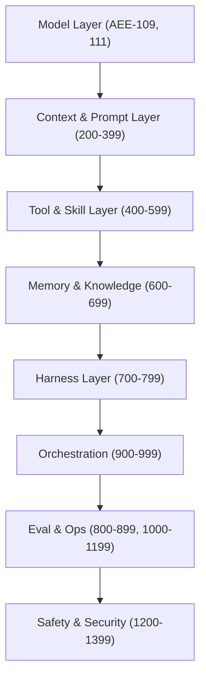

# [AEE-2] The Agentic AI Landscape

## Context

Agentic AI moved from research prototype to production deployment between 2023 and 2026. The shift was enabled by three converging developments: frontier models crossed the threshold where they can reliably call external tools, context windows expanded to 128K–1M+ tokens enabling long task sessions, and Reinforcement Learning with Verifiable Rewards (RLVR) gave training pipelines a scalable signal for autonomous code and math tasks. The measurable result is striking: as of early 2026, leading agents resolve over 80% of real GitHub issues on SWE-bench Verified, and METR's time-horizon benchmark shows AI agents can reliably complete tasks that take human engineers approximately one hour — a capability that did not exist at any useful success rate three years ago. Engineers entering this field are not working with experimental demos; they are working with a rapidly stratifying industrial landscape that requires deliberate architectural choices.

## Design Think

The agentic AI landscape is stratified by capability tier, domain suitability, and ecosystem maturity. Engineers MUST understand this stratification before committing to an architecture.

### 1. Frontier Model Capability Milestones

Benchmarks now confirm that coding-domain tasks are reliably automatable at meaningful quality thresholds. On SWE-bench Verified — a 500-instance benchmark of real GitHub issues resolved by automated test suite — Claude Opus 4.5 reaches 80.9%, the first model to break 80%, with GPT-5.2 and Gemini 3.1 Pro clustered near 80% as of early 2026. These numbers represent the curated, well-scoped end of the capability range. SWE-bench Pro, a harder 1,865-task benchmark using professional repositories designed to resist data contamination, shows top models at only 23.3% (GPT-5) and 23.1% (Claude Opus 4.1) — illustrating that the gap between controlled benchmark performance and open-ended real-world difficulty remains large. Engineers MUST treat benchmark scores as upper-bound estimates for their specific task type, not general capability endorsements.

METR's time-horizon benchmark adds a complementary dimension: it measures the maximum task duration at which an agent succeeds 50% of the time. As of the TH1.1 evaluation suite (January 2026, 228 tasks), frontier agents reliably complete tasks requiring approximately one hour of human effort. METR's data shows this capability has been doubling roughly every 7 months over the past six years, and recently accelerated to roughly every 4 months between 2024 and 2025. Claude 3.7 Sonnet, evaluated in April 2025, was the first model to demonstrate a ~1-hour time horizon at a reliable success rate.

### 2. Domain Asymmetry

Not all domains have benefited equally from this progress. Technical domains with verifiable correctness signals — software engineering, mathematics, data transformation — have advanced fastest because RLVR provides an unambiguous training signal: tests either pass or they do not. Soft domains — strategic writing, nuanced advice, interpersonal communication — lack an equivalent programmatic ground truth and have improved more slowly relative to their difficulty.

Engineers MUST calibrate expectations to their specific domain, not to aggregate benchmark headlines. A team building a legal document review agent SHOULD NOT assume that 80% SWE-bench Verified scores apply to their task. The reliability-to-domain mapping is a first-order architectural concern. Domains closer to "executable specification" (code, SQL, structured data) are where the highest autonomy is currently achievable; domains closer to "open-ended judgment" require more human-in-the-loop design.

### 3. Ecosystem Fragmentation

The agentic AI ecosystem is fragmented across four distinct layers that do not yet have stable, dominant standards:

- **Model providers** — Anthropic, OpenAI, Google DeepMind, Meta, Mistral, and others each expose distinct API surfaces, capability tiers, pricing models, and rate limits. No single provider dominates across all task types.
- **Orchestration frameworks** — LangChain, LangGraph, AutoGen, CrewAI, Smolagents, and dozens of others offer competing abstractions for agent loops, multi-agent coordination, and tool registration. These frameworks change rapidly; major breaking releases are common.
- **Eval harnesses** — SWE-bench, METR, MMLU, HumanEval, and custom internal benchmarks measure different capability slices. No universal eval standard exists for production agentic systems.
- **Deployment platforms** — Azure AI Agent Service, AWS Bedrock Agents, Google Vertex AI Agent Builder, and self-hosted options each impose different constraints on memory, tool access, and observability.

Engineers SHOULD build model-agnostic and framework-agnostic abstractions to avoid lock-in as this landscape consolidates. The domain logic of an agent — what it knows, what decisions it makes, what tools it invokes — SHOULD be isolated from the provider API layer and the orchestration framework layer. Consolidation will happen; the winning standards are not yet determined.

## Deep Dive

### What SWE-bench Actually Measures

SWE-bench Verified is a benchmark of 500 real GitHub issues drawn from popular open-source Python repositories. Each instance provides the repository codebase, a natural-language issue description, and a test suite. A resolved instance means the agent produced a code patch that causes the provided tests to pass — no human evaluation is involved. This makes SWE-bench a high-quality benchmark for code-writing and debugging tasks, but it has structural limitations: the tasks are self-contained within a repository, they have existing test coverage that defines success, and the repositories are publicly available (raising the possibility of training contamination). SWE-bench Pro addresses contamination by sourcing tasks from professional internal codebases that were not publicly available during model training, explaining the dramatic performance drop from ~80% to ~23%.

### What METR's Time-Horizon Benchmark Measures

METR's time-horizon benchmark asks a different question: not "what percentage of tasks can the agent complete?" but "how long can tasks be before the agent's success rate drops below 50%?" The suite covers ML engineering, cybersecurity, and software engineering tasks estimated to require between 1 minute and 8+ hours of human effort. The TH1.1 suite (January 2026) expanded to 228 tasks and added 73 tasks from HCAST, with 31 tasks in the 8+ hour human-effort range. This benchmark is methodologically important because it captures long-horizon autonomy — the ability to maintain context, recover from errors, and complete compound tasks without human intervention — which standard benchmarks obscure by averaging across easy and hard instances.

### Framework Categories

The 2025 agentic framework landscape organizes into six categories, each suited to different use cases:

1. **Autonomous Agents** (AutoGPT, BabyAGI, AgentGPT) — single-agent loops that self-prompt toward a goal with minimal human input. Suited for open-ended task exploration; less suited for production reliability.

2. **Multi-Agent Collaboration** (AutoGen, CrewAI, MetaGPT, OpenAI Swarm) — frameworks for coordinating specialist agents toward a shared objective. Suited for tasks that decompose into parallel or sequential sub-roles.

3. **RAG-Based** (LangChain, LlamaIndex, Haystack) — frameworks centered on retrieval-augmented generation, connecting agents to external knowledge stores. Suited for knowledge-intensive tasks where grounding in a document corpus is the primary requirement.

4. **Reasoning-Optimized** (LangGraph, Smolagents, n8n) — frameworks that expose explicit reasoning graph structures or lightweight agent wrappers. LangGraph emphasizes stateful cyclic graphs; Smolagents emphasizes minimal overhead for code-writing agents.

5. **Domain-Specific** (Azure AI Agent Service, AWS Bedrock Agents, Google Vertex AI Agent Builder) — managed cloud platforms that abstract infrastructure concerns in exchange for tighter vendor coupling. Suited for teams prioritizing operational simplicity over portability.

6. **Low-Code / No-Code** (Flowise, Dify, Relevance AI) — visual composition tools for building agent workflows without writing framework code. Suited for rapid prototyping and non-engineering teams; typically sacrifice customizability for speed.

Understanding which category a framework belongs to is a prerequisite for evaluating fit — an orchestration choice that is correct for a single-agent RAG pipeline is likely wrong for a multi-agent code review system.

## Best Practices

1. Audit which capabilities your use case actually requires before selecting a model tier. A task that needs 1-turn classification does not need a frontier reasoning model — and frontier models carry higher latency, cost, and rate-limit exposure.
2. Track benchmark progress specific to your task domain. General benchmarks (e.g., MMLU) have limited predictive value for production agent performance. SWE-bench scores predict coding-task reliability; they say little about document summarization or strategic planning tasks.
3. Build model-agnostic abstractions: model provider APIs and framework APIs change faster than your domain logic. Isolate the integration points so that a provider swap or framework upgrade does not require rewriting business logic.

## Visual

## Related AEEs

- [AEE-0](0) -- AEE Overview
- [AEE-1](1) -- Glossary
- [AEE-101](../Foundations and Mental Models/101) -- The Agentic Capability Gap

## References

- [Agentic AI: A Comprehensive Survey of Architectures, Applications, and Future Directions (arXiv 2510.25445)](https://arxiv.org/abs/2510.25445) — PRISMA-based review of 90 studies (2018–2025); foundational source for the dual-paradigm framework and post-2022 landscape shift.
- [SWE-bench Leaderboard](https://www.swebench.com/) — Live leaderboard tracking coding-agent performance on 500 real GitHub issues; primary source for Verified scores.
- [SWE-bench Pro Leaderboard (Scale Labs)](https://labs.scale.com/leaderboard/swe_bench_pro_public) — Harder 1,865-task benchmark on professional repositories; primary source for Pro scores showing the real-world difficulty gap.
- [Measuring AI Ability to Complete Long Tasks — METR (March 2025)](https://metr.org/blog/2025-03-19-measuring-ai-ability-to-complete-long-tasks/) — Original time-horizon methodology paper; defines the 50%-success time-horizon metric and documents the ~7-month doubling trend.
- [Time Horizon 1.1 — METR (January 2026)](https://metr.org/blog/2026-1-29-time-horizon-1-1/) — Updated evaluation suite with 228 tasks; most recent METR data point used in this article.
- [Top Agentic AI Frameworks in 2025 (Data Science Collective)](https://medium.com/data-science-collective/top-agentic-ai-frameworks-in-2025-which-one-fits-your-needs-0eb95dcd7c58) — Secondary source for the six-category framework taxonomy.

## Changelog

- 2026-04-13 -- Initial draft
