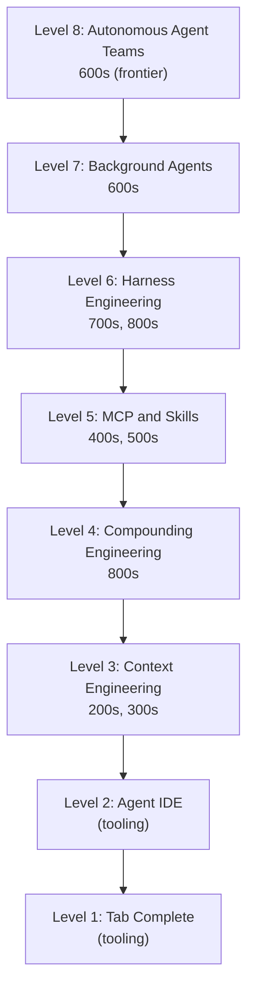

# [AEE-3] Agentic Engineering Levels

## Context

There is a gap between "using AI" and "engineering with AI" — and it is not closed by better prompting alone. Practitioners who have built reliable agentic systems describe a similar progression: from tab completion to autonomous teams. That progression is less about which model you have access to and more about the infrastructure, workflows, and discipline you built around the model.

Bassim Eledath's eight-level framework, drawn from direct production experience, names this progression precisely. It is useful not as a ranking but as a map: it helps you locate where your current practice sits, which foundations you may have skipped, and which AEE layers are most relevant to where you want to go next.

## Design Think

Agentic engineering maturity is not about model capability — it is about the infrastructure and discipline the engineer builds around the model. Each level closes a gap between what the model can do and what the engineer has built to let it do it reliably.

### The Progression

The eight levels form a practitioner maturity model. Three principles govern how to read them:

1. **Each level is defined by what the engineer has built, not what the model can do.** A Level 6 engineer and a Level 3 engineer may use the same frontier model; they differ in what they have built around it.
2. **The levels are layers, not milestones.** A Level 6 practitioner still depends on their Level 3–5 foundations. Skipping levels does not advance you — it leaves gaps that compound into reliability failures at higher levels.
3. **The progression is a navigation map, not a linear checklist.** Most practitioners operate across multiple levels simultaneously. The table below is for orientation, not for grading.

## Deep Dive

### Level-to-AEE Mapping

| Level | Name | What the engineer builds | AEE layers |
|-------|------|--------------------------|------------|
| 1 | Tab complete | Nothing beyond IDE setup | (tooling, not covered by AEE) |
| 2 | Agent IDE | Multi-file chat, plan mode | (tooling, not covered by AEE) |
| 3 | Context engineering | System prompts, rules files, token-efficient history | 200–299, 300–399 |
| 4 | Compounding engineering | Codified rules, session documentation | 800–899 |
| 5 | MCP and skills | Tool servers, skill packages, shared registries | 400–499, 500–599 |
| 6 | Harness engineering | Agent loop, lifecycle hooks, automated feedback | 700–799, 800–899 |
| 7 | Background agents | Async orchestration, parallel workers | 600–699 |
| 8 | Autonomous agent teams | Multi-agent coordination, frontier | 600–699 (frontier) |

### Levels 1–2: Where Tooling Ends, Engineering Begins

Levels 1 and 2 are about IDE tooling — autocomplete and multi-file chat with plan mode. They represent real productivity gains, but they are not yet engineering in the AEE sense. The engineer has not built anything durable: no system prompts, no rules files, no codified context, no harness. Each session starts from scratch.

AEE starts at Level 3. The engineering discipline begins where IDE tooling ends: at the moment the engineer takes deliberate responsibility for what goes into the model's context, and why.

### Level 3: Context Engineering

At Level 3, the engineer begins deliberately managing what the model sees. This means curating system prompts, writing rules files (`.cursorrules`, `CLAUDE.md`), designing conversation history that is token-efficient rather than exhaustive, and deciding which tools to expose per turn.

The foundational insight here, as Eledath puts it: "every token needs to fight for its place in the prompt." MCPs and image inputs consume tokens rapidly; dozens of tools overwhelm models through schema overhead. CLI tools increasingly replace MCPs in practice because agents run targeted commands and only relevant output enters context, versus MCPs injecting full schemas every turn.

AEE 200–299 covers prompt and context design. AEE 300–399 covers rules, memory, and context management.

### Level 4: Compounding Engineering

Level 4 introduces the compounding insight: each session can make the next one more capable. After the agent completes work, the engineer evaluates the output and codifies useful patterns back into rules files, documentation, and structured context — so the agent discovers them automatically in future sessions.

LLMs are stateless. Without explicit encoding of learned patterns, they repeat the same mistakes. The codification loop — plan, delegate, assess, codify — is what transforms a single productive session into a durable capability.

This is why Level 4 appears in the table alongside Level 6 (harness engineering): the codification discipline lives in AEE 800–899, the lifecycle layer that covers how engineering decisions get captured and reinforced across sessions. Investment here compounds across all higher levels.

### Level 5: MCP and Skills

At Level 5, the engineer extends the model's reach by building tool servers and packaging repeated workflows as shareable skills. This includes MCP servers that grant agents access to databases, APIs, CI pipelines, design systems, and notification channels — and skill packages that encapsulate domain knowledge and multi-step workflows reusable across sessions and teams.

A mature Level 5 practice includes a shared skills registry with version control, so that a PR review skill that fans out into specialized subagents (checking database safety, complexity, prompt standards, linting) can be maintained and improved by the team rather than reimplemented each time.

### Level 6: Harness Engineering

Level 6 is where the agent loop becomes an engineered system rather than an ad-hoc script. The engineer wires observability tooling, type systems, tests, linters, and pre-commit hooks into the agent runtime — so models can detect and correct mistakes autonomously, without requiring human intervention for each error class.

Two design principles characterize mature harness engineering: "design for throughput, not perfection" (tolerate small non-blocking errors; do final quality passes before release), and "constraints outperform step-by-step instructions" (define boundaries rather than checklists — the harness enforces them).

### Levels 7–8: The Frontier

Level 7 moves the model out of the interactive loop. Agents run asynchronously in isolated contexts, orchestrated by a dispatcher. Multiple model instances take different roles — implementer, reviewer, researcher — and the separation between implementer and reviewer is deliberate: different model instances should not grade their own work.

Plan mode fades at Level 7. Models reliably plan without human sign-off; planning becomes exploration — probing codebases, prototyping in worktrees, mapping the solution space.

Level 8 removes the hub-and-spoke bottleneck by enabling agents to coordinate directly: claim tasks, share findings, flag dependencies, resolve conflicts — without routing through a central orchestrator. This is the current frontier. Eledath's assessment: Claude Code's experimental Agent Teams feature and Anthropic's own 16-agent C compiler experiment reveal the seams — risk-aversion without hierarchy, regressions without CI enforcement, multi-agent coordination remains genuinely hard. Models lack sufficient speed and token efficiency for economical deployment outside moonshot projects. Level 7 offers greater leverage for typical engineering work.

## Best Practices

1. Use this table to locate your current practice, not as a linear checklist. Most practitioners operate across multiple levels simultaneously. The value of the map is orientation — understanding which foundations you are relying on and which gaps you have left open.
2. Prioritize depth over level advancement. Solid Level 5 practice — well-designed skills with clear interfaces, version-controlled registries, tested tool integrations — outperforms shallow Level 7 practice where parallel agents run without skill discipline and produce unreliable, non-reproducible results.
3. The codification discipline at Level 4 compounds across all higher levels. A team that skips Level 4 and advances directly to Level 6 or 7 will find that the agent's errors are inconsistent, the harness has nothing to enforce against, and the skills have no institutional memory. Invest in codification before advancing.

## Visual

## Related AEEs

- [AEE-0](0) -- AEE Overview
- [AEE-104](../Foundations and Mental Models/104) -- Capability Tiers
- [AEE-106](../Foundations and Mental Models/106) -- Autonomy Spectrum
- [AEE-204](../Context Engineering/204) -- System Prompt Engineering
- [AEE-501](../Skills/501) -- What Is an Agent Skill
- [AEE-601](../Multi-Agent Orchestration/601) -- Agent Roles and Topologies
- [AEE-700](../Harness Engineering/700) -- What Is a Harness?
- [AEE-801](../Lifecycle and Ops/801) -- The AI-Driven Development Lifecycle

## References

- [The 8 Levels of Agentic Engineering — Bassim Eledath](https://www.bassimeledath.com/blog/levels-of-agentic-engineering) — Primary source for the eight-level practitioner maturity framework used throughout this article.

## Changelog

- 2026-04-15 -- Initial draft
