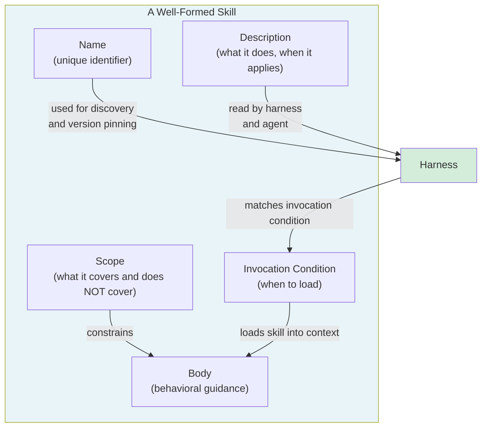

# [AEE-501] What Is an Agent Skill

## Context

AEE-500 established the distinction between tools and skills: tools are executable capabilities; skills are packaged behavioral guidance. This article goes one level deeper, into the internal structure of a skill. What are its parts? How does the harness know when to load it? What kinds of skills exist? And when does a skill's lifecycle end?

These questions matter because skills, unlike tools, have no enforced schema. A tool definition must conform to a JSON Schema; a skill is prose. Without a shared vocabulary for skill structure, teams build skills inconsistently, harnesses cannot process them reliably, and skill libraries accumulate artifacts that no one can inventory.

## Design Think

The core claim: a skill is a packaged behavioral contract. It has a name, an invocation condition, a defined scope, and an expected effect on agent reasoning. Engineers who treat skills as ad-hoc instructions accumulate brittle one-offs; engineers who design skills as contracts build reusable systems.

**Skill anatomy — five components:**

1. **Name**: a unique identifier for the skill within its distribution scope. Names should be action-oriented: `debugging`, `write-commit-message`, `review-pull-request`. The name is the primary handle for invocation, discovery, and version pinning.

2. **Description**: a one-to-two sentence summary of what the skill does and when it applies. The harness and the agent both read this. The harness may use it to match user requests to skills; the agent reads it to understand what it has been given.

3. **Invocation condition**: the explicit trigger for when this skill should be loaded. This is the most important and most commonly missing component. Without an invocation condition, the harness cannot automatically select the skill. Invocation conditions may be event-based ("when the user runs `/commit`"), intent-based ("when the user asks for a code review"), or context-based ("when working in a repository with failing tests").

4. **Body**: the behavioral guidance itself. This is the instructions, constraints, and patterns that shape the agent's approach when this skill is active.

5. **Scope**: what the skill covers and, critically, what it does not cover. A skill without a defined scope expands to fill whatever the agent is doing. Scope boundaries prevent god-skills and enable composition (AEE-504).

**Context injection vs. function call:**

A skill is loaded into the agent's context before the agent processes the request — it shapes reasoning from the start. This differs from tools, which are called at runtime when the agent emits a `tool_use` block. The harness decides when to inject a skill; injection mechanisms include prepending to the system prompt, loading as a prior user turn, or using a structured message type. The agent sees the skill as part of its instruction set, not as something it "calls."

**Skill types:**

- **Process skills**: guide how the agent approaches a class of tasks. Examples: how to debug, how to write a commit message, how to conduct a code review. The most common type.
- **Domain skills**: encode knowledge and conventions for a specific domain. Examples: conventions for a specific codebase, API style guide for a company. Answer "what do we do here" rather than "how do we do it."
- **Tool-guidance skills**: specify how to use a particular tool or toolset. Examples: which Bash commands to prefer, how to format git commits, which test patterns to follow.

A skill may combine types but should have one primary type that determines its scope.

**The skill lifecycle:**

1. **Author**: write and test locally. Define the invocation condition. Specify "when not to use."
2. **Publish**: distribute to a scope (personal, team, org, or public). Assign a version.
3. **Invoke**: the harness loads the skill when the invocation condition matches.
4. **Retire**: deprecate, then sunset, then remove. Notify consumers of the replacement.

Skills that skip retirement accumulate in libraries and become maintenance debt (AEE-506).

- Skills MUST define an invocation condition. A skill with no invocation condition cannot be automatically selected and cannot be tested for correct application.
- Skills MUST define a scope: what the skill does and does not cover.
- Skills SHOULD specify when NOT to invoke them. Negative invocation conditions are as important as positive ones.

## Deep Dive

### Anatomy in Practice

A minimal well-formed skill:

```yaml
---
name: write-commit-message
description: Write a well-formed git commit message following conventional commits format. Use when the user asks for a commit message or runs /commit.
invocation: when the user says /commit or asks for a commit message
scope: "commit message authoring only — does not cover staging, pushing, or PR creation"
---

Write a commit message following the Conventional Commits specification.

Format: `<type>(<scope>): <description>`

Types: feat, fix, docs, style, refactor, perf, test, chore

Rules:
- Subject line: imperative mood, no period, max 72 characters
- Body (if needed): explain WHY, not what. Wrap at 72 characters.
- Breaking changes: add `BREAKING CHANGE:` in footer

Do NOT include the `git commit` command — only the message text.
Do NOT use this skill when the user is asking about git history, branching, or merging.
```

This skill has all five components: name, description, invocation condition (two triggers), body, and scope (commit messages only, with explicit exclusions).

### What Makes a Skill a God-Skill

A god-skill has no effective scope boundary. Signs:
- Description says "help with engineering tasks"
- Invocation condition is "when the user has a coding question"
- Body contains instructions for debugging, code review, documentation, testing, and architecture
- Has grown over time as new instructions were appended

God-skills conflict with specialized skills, are applied to requests they were not designed for, and are impossible to test comprehensively. When a skill exceeds 500 lines of guidance, it is almost certainly a god-skill. Decompose it (AEE-503).

## Visual



## Best Practices

1. **Write the invocation condition before the body.** Defining when a skill applies forces clarity about its purpose before you write any guidance. A skill whose invocation condition you cannot write in one sentence is not well-scoped.

2. **Name skills by what they make the agent do, not by what they are.** `debugging` is a category; `diagnose-root-cause` is a skill. Verb-noun names (`write-commit-message`, `review-pull-request`) are more invocable than noun names.

3. **The scope field is not optional.** Omitting scope is equivalent to saying "this skill applies to everything." Scope boundaries enable composition, discovery, and testing.

## Related AEEs

- [AEE-500](500) — Skills vs. Tools (the conceptual distinction this article builds on)
- [AEE-503](503) — Skill Design (how to author skills with the right scope boundaries)
- [AEE-504](504) — Skill Composition (how well-formed skills coexist and chain)
- [AEE-506](506) — Skill Governance (lifecycle enforcement and retirement)
- [AEE-700](../Harness Engineering/700) — What Is a Harness? (the harness role in skill injection)

## References

- [Conventional Commits Specification](https://www.conventionalcommits.org/en/v1.0.0/)

## Changelog

- 2026-04-14 -- Initial draft
