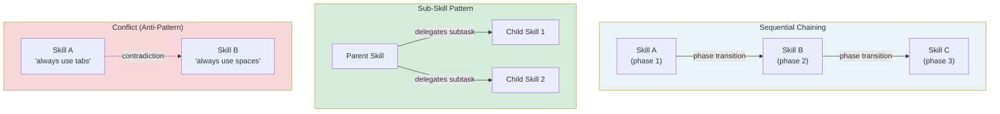

# [AEE-504] Skill Composition

## Context

A practitioner who designs well-bounded skills (AEE-503) soon discovers that real tasks require more than one skill. Debugging requires diagnosis, then fix, then test. A development workflow requires brainstorming, then planning, then implementation. The question is how skills combine to cover multi-step tasks without recreating the god-skill problem.

The answer is composition: explicit patterns for how skills chain, delegate, and coexist. Understanding these patterns is the difference between a skill library that stays useful at scale and one that collapses into overlapping guidance.

## Design Think

The core claim: skills compose through context. Unlike tools, skills do not call each other at runtime. They are loaded into the same context and the agent navigates between them. Composition happens at design time (which skills coexist) and at invocation time (which skill the harness selects). Designing for composition means designing for coexistence.

**Why context, not function calls:**

When a tool calls another tool, it is a runtime event: one process invokes another and receives a result. When a skill "calls" another skill, the harness loads the called skill's guidance into context alongside the calling skill. The agent has both instruction sets and must navigate between them. Skill composition is fundamentally about context management: what guidance is present, in what order, and whether it is compatible.

**Four composition patterns:**

1. **Sequential chaining**: the harness invokes skills in a defined order. Each skill is active during its phase; the next skill loads when the previous phase ends. One skill active at a time — no conflict risk.

2. **Sub-skills**: a parent skill's body explicitly instructs the agent to invoke a named child skill for a specific subtask. The harness resolves the reference and loads the child skill. The parent retains overall direction; the child handles a specialized sub-problem.

3. **Parallel coexistence**: multiple skills are active simultaneously, each covering a non-overlapping domain. Works only when scope boundaries are strict (AEE-503). Overlapping skills produce conflicts.

4. **Conflict (anti-pattern)**: two skills are loaded simultaneously with contradictory guidance for the same situation. The agent's choice is unpredictable. This is a failure mode to diagnose, not a pattern to use.

- Skills that invoke sub-skills MUST name the sub-skill explicitly by its registered name. Describing the sub-skill's behavior without naming it creates an implicit dependency that breaks when the sub-skill is renamed.
- Harnesses that support multiple simultaneous skills SHOULD detect and surface conflicts rather than silently resolving them. A conflict is a design problem; hiding it makes the design problem permanent.

## Deep Dive

### Sequential Chaining in Practice

The superpowers development workflow is the canonical example:

1. **brainstorming** skill — active during the design phase. Guides the agent through understanding the problem, proposing approaches, and writing a spec.
2. **writing-plans** skill — active during the planning phase. Guides the agent through writing a detailed implementation plan from the approved spec.
3. **subagent-driven-development** skill — active during execution. Guides the agent through dispatching subagents per task and reviewing their work.

Each skill is purpose-built for its phase. The harness loads the appropriate skill at each phase transition. Handoff data (e.g., the spec document produced by brainstorming) flows from phase to phase as file artifacts, not as skill-to-skill communication.

Sequential chaining requires:
- Clear phase transitions: the harness must know when to advance to the next skill
- Handoff data: what does phase N produce that phase N+1 needs?
- No overlap: two skills in the chain must never be active simultaneously

### Sub-Skills in Practice

A parent skill delegates a specific subtask to a named child skill:

```markdown
---
name: incident-response
description: Guide the agent through a structured incident response process.
---

Follow this incident response workflow:

**Step 1: Triage**
Identify the scope and severity. Classify as P1/P2/P3.

**Step 2: Diagnosis**
REQUIRED SUB-SKILL: Use the `diagnose-root-cause` skill to identify the root cause before proceeding.

**Step 3: Mitigation**
Propose and implement a mitigation. Prefer reversible mitigations during an active incident.

**Step 4: Post-mortem**
REQUIRED SUB-SKILL: Use the `write-post-mortem` skill after the incident is resolved.
```

The parent orchestrates the workflow. The child skills handle specialized phases. The parent does not duplicate the child's guidance. It only references the child by registered name.

### Conflict Detection

Two skills conflict when they provide contradictory guidance for the same situation. Common causes: a god-skill that overlaps with a specialized skill; two specialized skills with overlapping scope boundaries; an org skill and a personal skill covering the same domain with different standards.

Detection: when designing a skill, check for overlap with all skills it will coexist with. Ask: "If both are active simultaneously, is there any situation where they give the agent contradictory instructions?" If yes, narrow one skill's scope.

### The Skill-as-Harness Pattern

Some skills are primarily orchestration. They define a workflow by specifying which skills to invoke in sequence, not by encoding behavioral guidance for a specific domain. The skill body is mostly "use skill X for phase Y"; behavioral guidance lives in the sub-skills.

This pattern is appropriate when:
- A workflow is too complex for a single skill body
- The workflow reuses existing well-tested skills
- The workflow needs to evolve independently of its component skills

## Visual



## Best Practices

1. **Prefer sequential chaining over parallel coexistence.** Sequential chaining keeps one skill active at a time, eliminating conflict risk. Parallel coexistence is only safe when scope boundaries are strict and verifiably non-overlapping.

2. **In sub-skill references, always use the registered skill name.** `REQUIRED SUB-SKILL: Use the diagnose-root-cause skill` is correct. "Use a debugging skill to find the root cause" is incorrect. The harness cannot resolve "a debugging skill."

3. **Before composing skills, audit their scope boundaries.** List every skill that will be active in the composition and check each pair for overlap. A 5-minute audit prevents hours of debugging unpredictable agent behavior.

## Related AEEs

- [AEE-501](501) — What Is an Agent Skill (the anatomy of each skill in the composition)
- [AEE-503](503) — Skill Design (scope boundaries that make composition safe)
- [AEE-505](505) — Skill Management (how composed skill sets are managed across scopes)

## References

- [Conventional Commits](https://www.conventionalcommits.org/en/v1.0.0/)

## Changelog

- 2026-04-14 -- Initial draft
