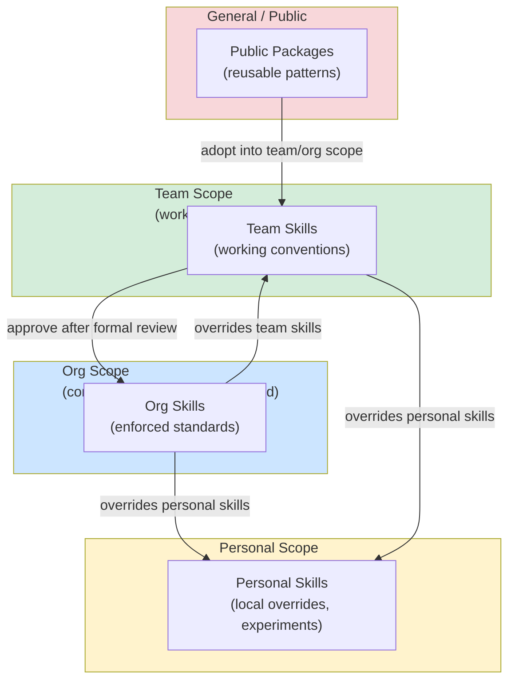

# [AEE-505] Skill Management

## Context

A practitioner using one or two skills has a skill library. A team sharing ten skills has a coordination problem. An organization standardizing on fifty skills has a management problem. The transition from library to management problem happens faster than most teams expect — skills accumulate because adding a skill is easy, and removing or updating skills requires coordination.

The scope model — personal, team, org, and general/public — is the foundational framework for skill management. It answers: where does a skill live, who maintains it, who can use it, and what happens when skills from different scopes conflict?

## Design Think

The core claim: an unmanaged skill library is a liability. Skills accumulate — personal experiments, team conventions, org standards, public packages — and without a scope model, it is impossible to know which skill applies where, who maintains what, or how skills from different scopes interact. The personal → team → org → general scope ladder is not just a storage model; it is a trust and maintenance model.

**The four scopes:**

| Scope | Who maintains | Who uses | Review required | Trust level |
|-------|--------------|----------|-----------------|-------------|
| Personal | Individual | Individual only | None | Low (experimental) |
| Team | Team members | Team | Informal (peer) | Medium |
| Org | Designated owners | Entire org | Formal (approval) | High |
| General/public | Community / maintainers | Anyone | Varies | Depends on publisher |

**Personal scope:** Individual practitioners maintain personal skills in a local directory (e.g., `~/.claude/skills/`). These are experiments, local overrides, and one-offs. Not reviewed; not assumed to be correct or up-to-date. Personal skills may override team or org skills for individual sessions.

**Team scope:** Skills shared within a working group, stored in a project repository or team-level package. Informally reviewed (a teammate looks at it before merging). Team skills encode the team's working conventions — naming standards, review checklists, workflow preferences. Should be versioned via git tags or package versions.

**Org scope:** Skills approved and maintained at the organizational level. Org skills represent standards, not suggestions. They have named owners, go through a formal review before publication, and are versioned with a supported lifecycle. Every engineer in the org is expected to use org skills when applicable; they override team and personal skills.

**General/public scope:** Skills published to public registries (npm, GitHub). Maintained by the publisher; trust level reflects the publisher's reputation. General skills are the source of reusable patterns not specific to any organization.

**Scope inheritance and override:**

Higher-trust scopes take precedence over lower-trust scopes for the same domain:
- Org skills override team skills when both cover the same domain
- Team skills override personal skills
- Personal skills can explicitly pin to a specific version of a team or org skill, overriding the default (latest)

Override applies when two skills have overlapping invocation conditions for the same request.

- Org-level skills MUST have a named owner. An org skill without an owner will not be maintained, updated, or deprecated — it will rot.
- Skills published to team or org scope MUST include a version. Consumers need to know what version they are on and what changed between versions.
- Personal skills SHOULD NOT be silently promoted to team scope without review. A personal experiment that becomes a team standard should go through the team's informal review process.

## Deep Dive

### What a Skill Registry Looks Like

At org scale, skill discovery requires a catalog. A minimal org skill registry:

| Skill Name | Scope | Owner | Version | Invocation Condition | Status |
|------------|-------|-------|---------|----------------------|--------|
| `diagnose-root-cause` | org | @platform-team | 2.1.0 | user reports unexpected behavior | active |
| `review-pull-request` | org | @engineering-leads | 1.4.2 | user shares code for review | active |
| `write-commit-message` | org | @dx-team | 3.0.1 | user asks for commit message | active |
| `backend:api-design` | team (backend) | @backend-lead | 1.0.0 | user designing a new API | active |
| `frontend:component-review` | team (frontend) | @frontend-lead | 0.9.0 | user reviewing a React component | beta |
| `legacy-migration` | org | @platform-team | 1.2.0 | user migrating from v1 to v2 | deprecated — use `v2-migration` |

The registry answers: "Is there a skill for this?" It also surfaces management problems: deprecated skills without replacements, beta skills that have been in beta for six months, skills with no owner.

### Skill Discovery

**Personal**: file listing. `ls ~/.claude/skills/` shows what's available.

**Team**: the team's skill repository README lists available skills, their invocation conditions, and which version to pin. New team members read this during onboarding.

**Org**: a formal registry (table above), potentially integrated into the IDE. Search by domain, invocation trigger, or owner.

**General/public**: package registries (npm search, GitHub topics). No single authoritative catalog; practitioners rely on recommendations and search.

### Version Pinning

Version pinning locks to a specific skill version instead of following latest:

```yaml
# Project skill configuration
skills:
  - name: review-pull-request
    version: "1.4.2"   # pinned
  - name: write-commit-message
    version: "latest"  # follow latest (default)
```

**When to pin:** the latest version changed behavior that breaks the team's workflow; the team is mid-project and cannot absorb behavioral changes.

**When to unpin:** after testing the new version in personal scope first; at the start of a new project cycle; when the org skill owner issues a correctness fix.

### Management Debt

Skills rot when no one owns them. Signs:
- Skills in the org registry with no named owner
- Skills marked "active" that have not been updated in over a year
- Skills with invocation conditions that overlap with three other skills
- Skills that practitioners routinely override with personal variants

The correct response is not to delete everything — it is to assign ownership: confirm each skill is still relevant, deprecate what isn't, update what is outdated.

## Visual



## Best Practices

1. **Assign owners before you have a problem.** Every skill published beyond personal scope should have a named owner at the time of publication, not after the skill becomes a maintenance burden.

2. **Treat the skill registry as a living document, not a historical record.** A registry that includes deprecated skills, unowned skills, and skills from teams that no longer exist is an archive, not a registry. Quarterly reviews that prune inactive skills keep the catalog useful.

3. **Run a skills audit when onboarding new team members.** If a new engineer cannot find the right skill for a common task within 5 minutes, the registry's discoverability is broken. New-member onboarding is the best feedback mechanism for discovery problems.

## Related AEEs

- [AEE-503](503) — Skill Design (quality of individual skills that populate the management system)
- [AEE-506](506) — Skill Governance (the operational layer that enforces the management model)
- [AEE-501](501) — What Is an Agent Skill (the anatomy of each managed skill)

## References

- [npm packages and modules](https://docs.npmjs.com/about-packages-and-modules)
- [Semantic Versioning](https://semver.org/)

## Changelog

- 2026-04-14 -- Initial draft
