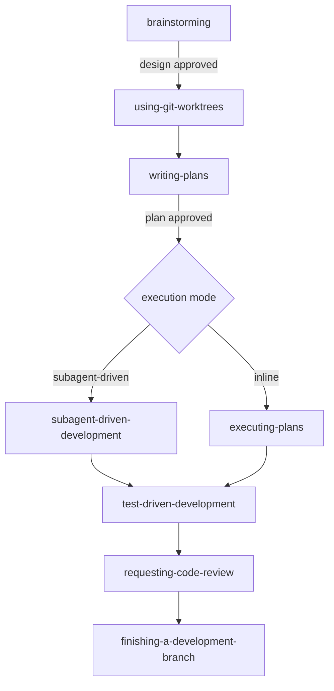

# [AEE-507] Superpowers: A Skills-System Case Study

## Context

The 500s articles describe the skills ecosystem abstractly. [AEE-500](500) draws the skill-vs-tool line, [AEE-501](501) describes skill anatomy, [AEE-502](502) the surrounding ecosystem, [AEE-503](503) through [AEE-506](506) the design, composition, management, and governance concerns. What the series does not provide is a single concrete mature skill system to study. Readers building their own skill libraries benefit from seeing the abstract concepts realized in one specific place.

This article uses [Superpowers](https://github.com/obra/superpowers) as that case study. It is open-source, multi-platform, actively maintained, publicly documented, and one that the author has direct operational experience with.

Disclosure: this article is written by someone using Superpowers. Every skill referenced here has been invoked in the session that produced the article. A disclosed case study by a user is a different thing than a neutral survey, and the distinction matters for how to read what follows.

Pointer: [AEE-807](../Agentic%20Development%20Workflows/807) already covers Superpowers at framework-survey depth alongside OpenSpec, BMAD, Kiro, and others. This article goes narrower and deeper, using Superpowers to make the 500s concepts concrete.

## Design Think

Three properties make Superpowers a useful study object for the 500s. First, its skill library is small and composed with sharp rules — fourteen skills, each focused, explicitly chained through `REQUIRED SUB-SKILL` pointers. Second, its skills are engineered. The library treats skill content as behavioral code tuned against pressure tests, using patterns like `EXTREMELY-IMPORTANT` tags, Red Flags tables, `HARD-GATE` markers, and `SUBAGENT-STOP` tags that do not appear in plain-markdown skill documentation elsewhere. Third, the framework closes the meta loop: `writing-skills` is itself a skill that treats skill creation as TDD, and a `tests/` directory holds scenario evals across platforms.

The right way to read this case study is as one valid realization of the space the 500s describe. Teams building their own skill libraries should take the patterns that address problems they actually have. A small skill library without rationalization pressure does not need Red Flags tables; a library without irreversible transitions does not need hard gates.

Treating the case study honestly imposes a few constraints on the reader:

- Readers MUST treat Superpowers as one illustrative example, not as a reference implementation to copy mechanically.
- Teams building skill systems SHOULD take from this case study the patterns that address problems they actually have.
- Engineers MUST NOT assume every behavior-shaping pattern shown here is necessary for every skill library. Superpowers deliberately adopts them because its skills are rigid and process-critical.
- Readers interested in a neutral survey of skill-distributing systems SHOULD read [AEE-502](502) for the ecosystem view and [AEE-807](../Agentic%20Development%20Workflows/807) for framework-level comparisons.

## Deep Dive

### 1. Framework overview

Superpowers ships fourteen skills organized into four categories. Testing contains `test-driven-development`. Debugging contains `systematic-debugging` and `verification-before-completion`. Collaboration contains the largest group: `brainstorming`, `writing-plans`, `executing-plans`, `subagent-driven-development`, `dispatching-parallel-agents`, `requesting-code-review`, `receiving-code-review`, `using-git-worktrees`, and `finishing-a-development-branch`. Meta contains `writing-skills` and `using-superpowers`.

Distribution is multi-platform. The same plugin installs into Claude Code (via the official marketplace), Cursor (via its plugin marketplace), Codex, OpenCode, GitHub Copilot CLI, and Gemini CLI. Each target has its own initialization directory in the repo (`.claude-plugin/`, `.codex/`, `.cursor-plugin/`, `.opencode/`, plus `gemini-extension.json` and `GEMINI.md`). The skills themselves are shared; only the bootstrap per platform differs.

Interop with the broader AGENTS.md convention is a symlink: `AGENTS.md -> CLAUDE.md` at the repo root. This is the exact pattern documented in [AEE-808](../Agentic%20Development%20Workflows/808): one source of truth, zero duplication, each tool's expected filename points to the same content. Superpowers is the live example of the interop pattern, adopted inside its own repo.

Session hooks under `hooks/session-start` auto-load `using-superpowers` at every new session, which is why the entry-point skill appears to fire without explicit invocation by the user.

### 2. Skill anatomy

A Superpowers skill is a directory `skills/<skill-name>/` containing a `SKILL.md` entrypoint and optional supporting files. The `SKILL.md` has a two-field YAML frontmatter: `name` (letters, numbers, hyphens) and `description`. Total frontmatter is capped at 1024 characters.

The `description` field describes WHEN to use the skill, not WHAT it does. The convention is to phrase it as "Use when ..." so the field maps cleanly onto the harness's matching logic: when the harness evaluates whether to invoke a skill, it matches user intent against the description's triggering conditions, not against a capability catalog. This is the same principle Anthropic's own [Claude Code skill docs](https://code.claude.com/docs/en/skills) describe for `description`, but Superpowers treats it as a firm rule.

Concrete example — the entry-point skill's frontmatter:

```yaml
---
name: using-superpowers
description: Use when starting any conversation - establishes how to find and use skills, requiring Skill tool invocation before ANY response including clarifying questions
---
```

Supporting files live alongside `SKILL.md` when content is heavy or reusable: extended reference material over 100 lines, reusable prompt templates for specialized reviewer agents, example files, and scripts. Examples in the brainstorming skill include `visual-companion.md` and `spec-document-reviewer-prompt.md`. Keeping these separate from `SKILL.md` keeps the main document scannable.

Skills in Superpowers declare their own type. Rigid skills (TDD, systematic-debugging) must be followed exactly; adapting them defeats their purpose. Flexible skills (patterns, design advice) adapt their principles to context. The skill states its own type so the agent knows how to read it.

Superpowers' contributor guide explicitly notes the framework adopts conventions different from Anthropic's published skill-authoring guidance. The behavior-shaping patterns in the next subsection explain why.

### 3. Behavior-shaping patterns

Skills only help if the agent invokes them. Under time pressure, agents rationalize around skills. They decide the task is too simple, the concept is already known, or the skill is overkill for this specific case. Patterns in this subsection exist to defend against those rationalizations. They are engineered controls, not optional advice.

**`EXTREMELY-IMPORTANT` tags plus the "1% rule"** — The `using-superpowers` skill opens with the verbatim rule: "If you think there is even a 1% chance a skill might apply to what you are doing, you ABSOLUTELY MUST invoke the skill." The rule forces skill checking before any response, including clarifying questions. The threshold is deliberately asymmetric; the cost of unnecessary skill invocation is small, the cost of skipping an applicable skill is large.

**Red Flags tables** — An explicit enumeration of rationalizing thoughts paired with their counter. Example rows: "This is just a simple question" → "Questions are tasks. Check for skills." "I remember this skill" → "Skills evolve. Read current version." "The skill is overkill" → "Simple things become complex. Use it." The table is exhaustive, not representative. It enumerates failure modes observed in pressure tests and plugs each one.

**`HARD-GATE` tags** — Approval checkpoints that block forward progress. The `brainstorming` skill's hard gate reads: "Do NOT invoke any implementation skill, write any code, scaffold any project, or take any implementation action until you have presented a design and the user has approved it." The tag is a process marker; the agent reads it and treats the subsequent transition as blocked until the gate condition clears.

**`SUBAGENT-STOP` tags** — Tags that suppress a skill's activation when the runtime is a dispatched subagent rather than a top-level session. The `using-superpowers` skill carries: "If you were dispatched as a subagent to execute a specific task, skip this skill." A subagent receives context-appropriate instructions from its dispatcher, not the top-level entry-point behavior. The tag prevents the subagent from replaying the entry-point flow inside a scoped task.

**Graphviz `digraph` process flows** — Embedded dot-notation decision graphs inside `SKILL.md`. The flow becomes the canonical decision tree; readers and agents follow the same graph. The graph makes branching explicit in a way prose cannot.

**Deliberate phrasing** — "Your human partner" rather than "the user." Superpowers' contributor guide calls this out explicitly, noting the phrasing is not interchangeable with "the user." The choice frames the human as a collaborator rather than a requester, which shapes how the agent handles ambiguity — defer to the human partner, rather than satisfy the user.

These patterns are novel relative to the plain-markdown skill docs that the rest of the agent ecosystem tends to produce. They exist because Superpowers treats skills as behavioral code requiring engineering discipline.

### 4. Workflow composition

The seven-stage pipeline is the canonical happy path: `brainstorming` → `using-git-worktrees` → `writing-plans` → `subagent-driven-development` or `executing-plans` → `test-driven-development` → `requesting-code-review` → `finishing-a-development-branch`.

Each stage hard-gates before the next. Brainstorming does not transition to writing-plans until the design is approved. Writing-plans does not transition to execution until the plan is written and reviewed. Execution does not transition to review until the implementation is complete. The gates are process facts, not merely guidance — the skills are authored to refuse progression when the preceding stage has not produced its required artifact.

Skills reference each other by name through explicit `REQUIRED SUB-SKILL` headers in each skill's overview. The pipeline is encoded in the skills themselves, not in an external orchestrator. `brainstorming` names writing-plans as its successor; writing-plans names subagent-driven-development and executing-plans as its two execution alternatives; both execution skills name finishing-a-development-branch as the terminal step.

Terminal states in each skill's process flow point explicitly to the next skill. brainstorming's terminal is "Invoke writing-plans skill." Writing-plans' terminal is "Offer execution choice." The chain is visible in the documentation, which lets a reader understand the composition without running the framework.

Alternative paths exist for the execution stage: `executing-plans` runs the plan inline in the current session with batch checkpoints; `subagent-driven-development` dispatches a fresh subagent per task with two-stage review (spec compliance then code quality). Both are hard-gated on a complete, written plan.

### 5. Meta-skill and test harness

The `writing-skills` skill treats skill creation as TDD applied to documentation. The mapping: test case = pressure scenario with a subagent; production code = the `SKILL.md` document; RED = agent violates the intended rule without the skill present; GREEN = agent complies with the skill present; refactor = close rationalization loopholes while maintaining compliance.

The process prescribed by `writing-skills` is concrete. First, run the baseline pressure scenario before writing the skill. Document what the agent does wrong when left to its own devices. Second, write the skill addressing those specific violations, not a generic framing of the problem. Third, re-run the scenario to verify the agent now complies. Fourth, look for new rationalizations the skill did not anticipate, plug them, and re-verify.

The `tests/` directory holds the scenario evals. Subdirectories include `brainstorm-server`, `claude-code`, `explicit-skill-requests`, `opencode`, `skill-triggering`, and `subagent-driven-dev`. These are scenario-based behavioral evals across platforms, not unit tests of code. A PR that modifies skill content without eval evidence showing improvement is rejected; the contributor guide is explicit: "Skills are not prose — they are code that shapes agent behavior."

Superpowers has exactly one specialized subagent: `agents/code-reviewer.md`. Everything else uses generic subagents that load the relevant skill for the task. The specialized-subagent-per-task pattern common elsewhere is rejected; skills compose through general-purpose subagents loading relevant skills, which keeps the skill library as the primary unit of reuse and prevents a parallel agent library from drifting out of sync.

### 6. Opinionated philosophy

TDD is rigid. The `test-driven-development` skill is a rigid skill; adapting it away from RED-GREEN-REFACTOR defeats its purpose. The framework does not permit the adaptation.

Skills override default system prompt behavior. User instructions (project `CLAUDE.md`, `GEMINI.md`, `AGENTS.md`, direct requests) override skills. The precedence is explicit in `using-superpowers`: user instructions are always highest priority, skills are second, default system prompt is third. The framework asserts authority over the default prompt but defers to the human.

"Evidence over claims" is the explicit philosophy behind `verification-before-completion`. The skill requires running verification commands and confirming output before claiming work is complete. It pairs with `systematic-debugging`; neither is optional for the workflows they support.

Contributor discipline is the opinionated boundary. The project's contributor guide opens with the claim "This repo has a 94% PR rejection rate" and addresses AI agents attempting drive-by PRs directly. Domain-specific skills are rejected from core. Zero-dependency is a rule. "Compliance" reformatting without eval evidence is rejected. Bulk PRs opened by agents pointed at the issue list are rejected.

The library stays deliberately small and general. Fourteen skills, general-purpose, no dependencies. Domain-specific skills belong in separate plugins. The constraint is not incidental; it prevents the library from accumulating the maintenance debt that unchecked skill growth produces.

The contrast this case study offers: a skill library that grows unchecked without eval discipline or compositional constraints accumulates maintenance debt much faster than this one. Superpowers' opinionated philosophy is a design choice with known trade-offs, and the 500s reader choosing a skills-system design should understand what the framework is buying with each constraint.

## Best Practices

1. **Write skill descriptions that describe WHEN to use, not WHAT the skill does.** The description field is how the harness matches user intent to the skill. "Use when ..." phrasing focuses the description on triggering conditions rather than capability-catalog prose.

2. **Pressure-test skills against rationalization, not just happy-path usage.** A skill that works when the agent wants to invoke it and fails when the agent is under time pressure is a skill that will not fire when it matters most. Write the failure cases first, then the skill.

3. **Compose by reference, not by copy.** Skills that embed chunks of other skills rot in parallel. Skills that reference other skills through explicit `REQUIRED SUB-SKILL` pointers let each skill evolve independently.

4. **Treat the skill library as code requiring evals.** Any change to skill content risks behavior drift. A library without a scenario test suite cannot detect drift; it will eventually collect skills that work for the author but fail for everyone else.

5. **Keep the library small and general.** Domain-specific skills belong in separate plugins or in project-level `CLAUDE.md`. A core library that grows unchecked becomes a tax on every new skill authored.

6. **Hard-gate irreversible transitions.** The moment a skill's next step is a file mutation, a branch merge, or a user-visible message, insert an explicit approval gate. Hard gates are the mechanism that makes autonomous operation trustworthy.

## Visual

The seven-stage pipeline with the hard-gated transitions, followed by a reference table of the behavior-shaping patterns.



**Behavior-shaping pattern reference:**

| Pattern | What it solves | Example location |
|---|---|---|
| `EXTREMELY-IMPORTANT` + 1% rule | Skill skipped under time pressure | `skills/using-superpowers/SKILL.md` |
| Red Flags table | Rationalization around skill invocation | `skills/using-superpowers/SKILL.md` |
| `HARD-GATE` tag | Implementation started before design approved | `skills/brainstorming/SKILL.md` |
| `SUBAGENT-STOP` | Subagents replaying top-level entry-point behavior | `skills/using-superpowers/SKILL.md` |
| `digraph` process flow | Ambiguous decision branching | multiple skills |
| "Your human partner" phrasing | Interchangeability with "the user" softens agency | contributor `CLAUDE.md` |

## Related AEEs

- [AEE-500](500) — Skills vs. Tools — the foundational distinction this case study assumes
- [AEE-501](501) — What Is an Agent Skill — skill anatomy; Deep Dive section 2 makes it concrete
- [AEE-502](502) — The Agent Skill Ecosystem — framework overview illustrates the ecosystem
- [AEE-503](503) — Skill Design — behavior-shaping patterns in Deep Dive section 3 extend this
- [AEE-504](504) — Skill Composition — workflow composition in Deep Dive section 4 extends this
- [AEE-505](505) — Skill Management — meta-skill and test harness in Deep Dive section 5 extend this
- [AEE-506](506) — Skill Governance — contributor discipline in Deep Dive section 6 extends this
- [AEE-807](../Agentic%20Development%20Workflows/807) — Spec-Driven Development Frameworks in Practice — Superpowers' framework-level survey entry; this article is the narrower-and-deeper sibling
- [AEE-808](../Agentic%20Development%20Workflows/808) — AGENTS.md and Authoring Best Practices — Superpowers' `AGENTS.md -> CLAUDE.md` symlink is a live example of AEE-808's symlink interop pattern

## References

- [Superpowers — obra/superpowers](https://github.com/obra/superpowers) — canonical plugin repository.
- [Superpowers README](https://github.com/obra/superpowers/blob/main/README.md) — framework overview, seven-stage workflow, skill categories, multi-platform install instructions.
- [Superpowers contributor guide — CLAUDE.md](https://github.com/obra/superpowers/blob/main/CLAUDE.md) — opinionated contribution stance; "skills are not prose — they are code" philosophy; 94% PR rejection rate framing.
- [using-superpowers skill](https://github.com/obra/superpowers/blob/main/skills/using-superpowers/SKILL.md) — entry-point skill; 1% rule, Red Flags table, SUBAGENT-STOP tag.
- [writing-skills skill](https://github.com/obra/superpowers/blob/main/skills/writing-skills/SKILL.md) — meta-skill; TDD mapping for skill creation.
- [brainstorming skill](https://github.com/obra/superpowers/blob/main/skills/brainstorming/SKILL.md) — HARD-GATE pattern in action.
- [Superpowers for Claude Code — Jesse Vincent](https://blog.fsck.com/2025/10/09/superpowers/) — author's blog post introducing the framework.
- [Extend Claude with skills — Claude Code docs](https://code.claude.com/docs/en/skills) — Anthropic's canonical Claude Code skill-authoring documentation; Superpowers' contributor guide notes the framework adopts different conventions.

## Changelog

- 2026-04-19 — Initial draft
