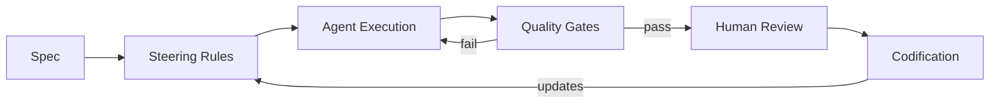

# [AEE-800] Agentic Development Workflows

## Context

Most agentic engineering failures are not model failures. They are workflow failures: vague instructions that agents cannot execute, no record of what worked, no oversight at the points where agents make consequential decisions, no feedback mechanism to prevent the same mistake in the next session.

The 100s through 700s cover the infrastructure layer -- models, context, prompting, tools, skills, multi-agent coordination, and harnesses. That infrastructure is necessary but not sufficient. An agent operating on an excellent harness with a well-configured context layer will still produce unreliable results if the practitioner gives it ambiguous work, reviews nothing, and changes nothing after a failure.

The 800s cover the methodology layer: the specs, rules, oversight structures, and feedback systems that let agents operate reliably across sessions, teams, and projects.

## Design Think

### The Methodology Gap

The infrastructure categories establish what agents can do. They do not address how work should be structured so agents can drive it reliably. That gap is the methodology layer.

A practitioner who improves their model access but does not improve their workflow discipline will hit a ceiling -- not of model capability, but of their own process. The ceiling manifests predictably: sessions that produce inconsistent outputs, agents that repeat mistakes across runs, review cycles that scale linearly with agent output, and no accumulated knowledge between sessions.

The 800s address this ceiling directly.

### The Three Workflow Concerns

Agentic workflow methodology organizes into three concerns:

**1. Input quality: specs and steering rules.** Agents execute what they are given. A vague prompt produces a plausible but often wrong interpretation. A well-formed spec with explicit success criteria, constraints, and interface definitions gives the agent a behavioral contract it can execute against. Steering rules extend this: they encode persistent behavioral constraints that apply across every session, preventing the agent from rediscovering the same boundaries every time.

**2. Process integrity: human oversight and quality gates.** Agents make decisions. Some of those decisions are consequential and irreversible. Without defined checkpoints, agents will cross those boundaries autonomously -- sometimes correctly, sometimes not, and always without a record of the decision. Human oversight patterns define where in the workflow human judgment is required, and in what form. Quality gates extend oversight into automation: tests, linters, and type systems that push back against agent output before it reaches a human reviewer.

**3. Improvement loop: codification.** A session that produces a lesson and does not record it is wasted knowledge. Codification is the practice of converting session learning into reusable rules -- updating steering files, refining spec templates, adding quality gate checks -- so that future sessions begin with what past sessions discovered. Without codification, every session starts from zero.

**RFC 2119:** Agentic workflows MUST include at least one human checkpoint for tasks with irreversible consequences. Steering rules SHOULD be versioned alongside code.

### Why Methodology Matters at Scale

In a solo project with one agent and one session, ad-hoc workflow is tolerable. The practitioner holds all context in their head, reviews all output directly, and suffers the cost of each mistake themselves.

At scale, these conditions no longer hold. Across a team, context is distributed -- agents operating with different steering rules produce inconsistent outputs that create integration failures nobody can explain. Across multiple sessions, lessons not codified are rediscovered expensively. With multiple agents operating in parallel, the surface area of consequential decisions expands faster than any one reviewer can cover.

Workflow discipline does not become valuable when scale arrives. It must be in place before scale arrives, because retrofitting methodology onto a running multi-agent workflow is significantly harder than building it in from the start.

## Deep Dive

AEE-801 through AEE-806 cover one methodology concern each. Together they constitute the full workflow methodology layer.

| Article | Topic | What it covers |
|---|---|---|
| AEE-801 | AI-Driven Development Lifecycle | Three-phase lifecycle (Inception/Construction/Operations), adaptive workflow, steering rules as implementation |
| AEE-802 | Spec-Driven Development | Writing specs agents can execute; success criteria; DESIGN.md pattern |
| AEE-803 | Steering Rules and Agent Instructions | Persistent behavioral constraints; implementations across platforms; scope and precedence |
| AEE-804 | Human Oversight Patterns | Pre-approval gates, post-review checkpoints, escalation triggers, oversight fatigue |
| AEE-805 | Workflow Codification | Turning session knowledge into reusable rules; the codification loop; rule rot |
| AEE-806 | Agentic Quality Gates | Automated feedback mechanisms; backpressure; gate feedback quality |

**How they connect.** AEE-802 and AEE-803 address input quality: what the agent receives at session start. AEE-804 addresses process integrity: where human judgment is inserted during execution. AEE-806 addresses automated process integrity: where machines push back before humans must. AEE-805 addresses the improvement loop: how lessons become inputs to the next session. AEE-801 frames all of this as a structured lifecycle -- the most comprehensive workflow integration in the category.

### Reading Order by Practitioner Level

Not every practitioner needs every article immediately. The suggested entry points by level:

- **Levels 3-4 (context engineering, codify):** AEE-802 → AEE-803 → AEE-805. Start with spec and rule discipline before adding oversight or automation.
- **Levels 5-6 (skills, harness + automated feedback):** AEE-800 → AEE-801 → AEE-806. Understand the lifecycle framework and where automation fits.
- **Levels 7-8 (background agents, autonomous teams):** AEE-800 → AEE-804 → full series. Oversight patterns become critical when agents operate without continuous human presence.

## Best Practices

1. **Start with spec discipline before adding orchestration complexity.** A team that cannot write an agent-executable spec will not benefit from adding more agents to the workflow. Agents multiply the throughput of clear instructions and the cost of vague ones. Fix the input before scaling the system.

2. **Version your steering rules alongside code.** A rule that changes without a commit is invisible to reviewers and cannot be rolled back. Steering rules are executable configuration -- they deserve the same version control discipline as any other configuration file in the codebase.

3. **Identify your irreversible actions and put human checkpoints there first.** Not all actions warrant oversight at the same density. Irreversible actions -- destructive writes, external API calls, deployments -- are the highest-value oversight points. Start there, and add coverage incrementally as the workflow matures.

## Visual

The diagram shows the workflow as a directed cycle. Specs and steering rules define agent inputs. Quality gates provide automated feedback before human review. Codification closes the loop: lessons from human review feed back into steering rules, improving the next run.

## Related AEEs

- [AEE-3](../AEE Overall/3) -- Agentic Engineering Levels -- Levels 4 and 6 map directly to the concerns this category addresses
- [AEE-500](../Agent Skills/500) -- Skills vs. Tools -- skills define how agents act; the 800s define how workflows are structured
- [AEE-700](../Harness Engineering/700) -- What Is a Harness? -- the harness executes the workflow; the 800s define the workflow
- [AEE-801](801) -- The AI-Driven Development Lifecycle -- the most comprehensive workflow framework in this category
- [AEE-806](806) -- Agentic Quality Gates -- the automation layer that makes workflow discipline scalable

## References

- [Building Effective Agents - Anthropic](https://www.anthropic.com/research/building-effective-agents)

## Changelog

- 2026-04-15 -- Initial draft
