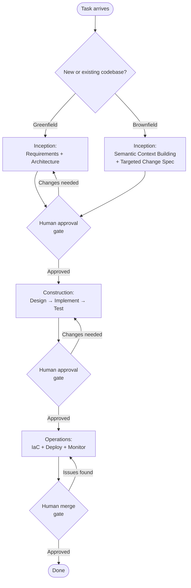

# [AEE-801] The AI-Driven Development Lifecycle

## Context

Most attempts to "use AI in development" treat it as an accelerator grafted onto an existing workflow: ask the AI to write code, paste it in, move on. The agent is a better autocomplete. The workflow stays the same.

The AI-Driven Development Lifecycle (AI-DLC) takes a different approach. It does not graft AI onto the existing SDLC. It restructures the SDLC itself so that each phase produces the structured inputs that agents need to drive the next phase. The result is a system where agents are not assistants improving human output, but drivers of a defined process that humans oversee.

AI-DLC originated at AWS and was open-sourced in 2025 as the `awslabs/aidlc-workflows` GitHub repository. It defines three phases -- Inception, Construction, and Operations -- each with explicit agent behaviors, human approval gates, and steering rule sets. Its primary implementation targets are Amazon's own Kiro IDE and Amazon Q Developer, but the framework is tool-agnostic: the steering rules are plain Markdown files that any agent can consume.

## Design Think

The core claim of AI-DLC is that agents work reliably when they receive structured phase inputs, not open-ended mandates. A phase produces a defined artifact. The next phase consumes it. Human approval gates separate every phase transition. The agent never advances unilaterally.

### The Three Phases

AI-DLC organizes development into three phases:

**Inception** transforms business intent into validated requirements and units of work. The mechanism is Mob Elaboration: the team -- humans and agents together -- co-elaborates requirements in real time. The agent proposes questions, user stories, and acceptance criteria; humans validate and correct. The agent cannot proceed until the team confirms understanding. The output is a detailed requirements set, user stories, acceptance criteria, and a semantic context model of the codebase.

**Construction** turns validated inception artifacts into working, tested code. The mechanism is Mob Construction: the agent proposes logical architecture, domain models, code, and tests; humans clarify technical decisions at each step. Every stage follows a plan-verify-generate cycle: the agent creates a plan, humans validate it, the agent executes, humans verify the output. The cycle repeats for design, implementation, and testing sub-phases.

**Operations** handles deployment, infrastructure as code (IaC), and monitoring using the accumulated context from prior phases. Specialized PR review agents -- covering code quality, FinOps, and security -- review pull requests before a human reviewer validates business intent and approves the merge.

### The Greenfield / Brownfield Fork

The Inception phase branches based on codebase state.

For **greenfield** projects, Inception runs the standard path: requirements elaboration flows directly into architecture design.

For **brownfield** projects, Inception runs a reverse-engineering step first: the agent builds a semantic context model of the existing codebase before producing a targeted change spec. This prevents the agent from making unconstrained changes to a codebase it does not understand. The model anchors the agent to what actually exists, not to what a developer remembers about the system.

### Adaptive Workflow

Not all tasks warrant the full lifecycle. AI-DLC's adaptive workflow mechanism detects workspace context and task complexity and selects which stages to include. A defect fix in a well-understood module skips most Inception stages and proceeds directly to a constrained construction scope. A new feature on an unfamiliar codebase runs the full brownfield reverse-engineering path. The framework adapts; the practitioner is not required to manually configure a reduced workflow for simple tasks.

### Steering Rules

Each phase is governed by a set of steering rules: Markdown files placed in tool-specific directories that are loaded as context before any agent execution begins. They are not runtime code. They are context injected at session start that constrains agent behavior for the duration of the phase.

| Tool | Directory | Format |
|------|-----------|--------|
| Kiro | `.kiro/steering/aws-aidlc-rules/` | Markdown |
| Amazon Q Developer | `.amazonq/rules/aws-aidlc-rules/` | YAML-based rules |
| Cursor | `.cursor/rules/ai-dlc-workflow.mdc` | MDC (Markdown + YAML frontmatter) |
| Cline / Claude Code | `.clinerules/` (Cline) or `CLAUDE.md` / `AGENTS.md` (Claude Code) | Markdown |

All platforms share the same underlying phase-specific rule directories under `aws-aidlc-rule-details/`, with subdirectories: `common/`, `inception/`, `construction/`, `operations/`, and `extensions/`. A `core-workflow.md` anchor file defines the top-level phase sequence and gate requirements that all phase-specific rules extend.

### Human Oversight

Explicit human approval is required at every phase transition. The agent cannot advance phases autonomously. Within the Construction phase, the plan-verify-generate cycle inserts additional verification points at every stage. Session notes from the re:Invent 2025 AI-DLC presentation report approximately 10 to 26 human verification points per bolt (a unit of work roughly equivalent to a sprint) (this figure comes from third-party re:Invent session notes, not AWS official documentation).

**RFC 2119:**

- Every AI-DLC phase transition MUST require explicit human approval before the next phase begins.
- Agents MUST surface ambiguities as clarification requests rather than resolving them unilaterally.
- Steering rules MUST be loaded before any phase execution begins -- agents operating without phase context produce undirected output.

## Deep Dive

### 1. Inception Phase

Inception is the phase most commonly skipped in ad-hoc agentic workflows, and the most expensive to skip. An agent that begins Construction without validated requirements will produce a correct implementation of the wrong requirements at the same speed as it would produce the right ones.

The Mob Elaboration process runs as a real-time collaborative session. The agent does not receive a fully formed spec and execute it. Instead, it participates in elaboration: proposing user stories, surfacing ambiguous requirements as clarification questions, and drafting acceptance criteria that the team reviews immediately. This requires human engagement -- the agent cannot complete Inception alone.

The Inception output is precise enough to be executable: user stories with explicit acceptance criteria, an architecture sketch, and a semantic context model. The semantic context model is the artifact that matters most for brownfield projects. It is a structured representation of the codebase's domain concepts, interfaces, and constraints that the agent will use to scope every subsequent decision.

### 2. Construction Phase

Construction is structured as three sub-phases -- design, implementation, and testing -- each governed by the plan-verify-generate cycle:

1. **Plan:** The agent proposes a plan (architecture decision, implementation approach, or test strategy) based on the Inception artifacts.
2. **Verify:** A human reviews and approves the plan. Changes are requested if the plan is incorrect.
3. **Generate:** The agent executes the approved plan.
4. **Verify:** A human reviews the output before the cycle advances.

Mob Construction does not mean passive human observation. Humans clarify technical decisions at each step -- particularly at the design sub-phase, where architectural decisions made incorrectly propagate into both implementation and tests. The approval gate between design and implementation is one of the highest-leverage review points in the entire lifecycle.

The output of Construction is working, tested code with an audit trail of every plan approval and verification decision.

### 3. Operations Phase

Operations consumes the full context accumulated across Inception and Construction. The agent applies this context to manage IaC configurations and deployment pipelines without requiring the practitioner to re-explain domain constraints that were already captured upstream.

PR review is handled by specialized agents covering distinct concerns: code quality, FinOps cost analysis, and security review. These agents operate in parallel and produce structured review comments. A human reviewer then evaluates the agent findings, validates business intent -- the one concern the specialized agents cannot assess -- and approves the merge. The human merge gate is the final approval point in the lifecycle.

### 4. Adaptive Workflow Mechanics

The adaptive workflow mechanism works in two dimensions:

**Stage selection** evaluates workspace context (existing files, recent changes, branch structure) and task complexity (defect fix vs. new feature vs. architectural change) to recommend which stages to include. A practitioner fixing a regression in a well-understood function does not run brownfield reverse-engineering for the whole codebase. The framework narrows scope to what the task requires.

**Brownfield reverse engineering** is the specific mechanism that makes AI-DLC safe for existing codebases. Before Construction begins, the agent analyzes the codebase and produces a semantic context model: domain concepts, public interfaces, dependency relationships, and constraint patterns. This model constrains every subsequent agent decision. Without it, an agent making changes to an existing codebase is navigating by description rather than by map.

### 5. Steering Rules Implementation

The `awslabs/aidlc-workflows` repository provides the full steering rule set as open-source files that any team can adopt. The repository is organized to support multiple agent tools from a single source of rules: each tool's rules reference the shared `aws-aidlc-rule-details/` phase directories rather than duplicating their content.

The `core-workflow.md` anchor file is the entry point. It defines the three-phase sequence, the gate requirements at each transition, and the behavioral constraints that apply across all phases. Phase-specific rule files in `inception/`, `construction/`, and `operations/` extend the anchor with stage-level detail.

Steering rules are Markdown (or YAML-based Markdown for Amazon Q). This matters: they are not compiled, not deployed, and not executed. They are read by the agent at session start, the same way a developer reads a brief before beginning work. Any agent that can read text can follow steering rules.

### 6. Relationship to Kiro

Kiro is Amazon's agentic IDE (kiro.dev). AI-DLC steering rules are natively implemented as Kiro Steering Files in `.kiro/steering/`. Kiro's primary workflow methodology is spec-driven development -- it uses `requirements.md`, `design.md`, and `tasks.md` as its core spec artifacts, which map directly to the Inception outputs that AI-DLC requires before Construction begins. The `awslabs/aidlc-workflows` repository lists Kiro and Amazon Q Developer as first-class implementation targets for AI-DLC steering rules.

## Best Practices

1. **Start every new task at Inception, even for small changes.** Agents that skip Inception and jump directly to Construction produce solutions to the wrong problem at the same speed as solutions to the right problem. The overhead of a focused Mob Elaboration session on a small task is measured in minutes. The cost of correcting a Construction phase that ran on wrong requirements is measured in hours.

2. **Use the brownfield reverse-engineering step even for codebases you know well.** The semantic context model it produces prevents the agent from making unconstrained changes -- it anchors the agent to what actually exists, not what you remember. Developer memory of a codebase degrades over time and is never complete. The model is objective.

3. **Treat the plan-verify-generate cycle as non-negotiable.** The most common failure mode in Construction is approving an AI-generated plan without reading it carefully. Errors at the plan stage propagate into implementation and test generation. A plan that takes two minutes to review carefully is worth far more than the time saved by skimming it.

## Visual

The diagram shows the full AI-DLC lifecycle. The greenfield/brownfield fork at Inception determines the path to the first approval gate. Human approval gates separate every phase transition. The plan-verify-generate cycle within Construction is not shown at this level but operates at every stage within the Construction phase.

## Related AEEs

- [AEE-800](800) -- Agentic Development Workflows -- category overview; AI-DLC is the most comprehensive workflow framework in the category
- [AEE-802](802) -- Spec-Driven Development -- Inception produces agent-executable specs; Kiro implements both AI-DLC and spec-driven development
- [AEE-803](803) -- Steering Rules and Agent Instructions -- steering rules are the implementation mechanism for AI-DLC phase constraints
- [AEE-804](804) -- Human Oversight Patterns -- AI-DLC's approval gates are the concrete reference implementation for oversight patterns
- [AEE-3](../AEE Overall/3) -- Agentic Engineering Levels -- AI-DLC spans Levels 4-6

## References

- [AI-Driven Development Life Cycle -- AWS DevOps Blog](https://aws.amazon.com/blogs/devops/ai-driven-development-life-cycle/)
- [Open-Sourcing Adaptive Workflows for AI-DLC -- AWS DevOps Blog](https://aws.amazon.com/blogs/devops/open-sourcing-adaptive-workflows-for-ai-driven-development-life-cycle-ai-dlc/)
- [awslabs/aidlc-workflows -- GitHub](https://github.com/awslabs/aidlc-workflows)

## Changelog

- 2026-04-17 -- Initial draft
