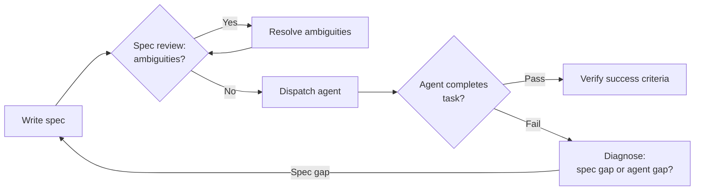

# [AEE-802] Spec-Driven Development

## Context

Agents execute what they are told, not what you meant. A developer reading a vague spec asks a clarifying question, applies judgment, and makes a reasonable choice. An agent reading the same spec may resolve the ambiguity arbitrarily, silently propagate an incorrect assumption through every downstream step, and produce a technically correct implementation of the wrong thing.

This is not a failure of the agent. It is a failure of the spec.

The question for practitioners is not "how do I get a better agent?" but "how do I write specs that agents can execute reliably?" Spec-driven development is the discipline of answering that question systematically.

## Design Think

A spec that a human can read is not necessarily a spec that an agent can execute. Human-readable specs rely on shared context, implicit conventions, and the reader's ability to fill gaps through judgment. A developer brings years of accumulated context to a spec; they recognize what "standard error handling" means in this codebase, what the team's convention for naming things is, and which parts of the system are off-limits. None of that context is in the document.

Agent-executable specs cannot rely on any of that. They must be self-contained, unambiguous, and structured so that every requirement maps to a verifiable action. The discipline of writing agent-executable specs is a distinct skill from writing human-readable design documents.

**The key distinction:** human-readable specs are narrative — they describe what to build and why. Agent-executable specs are behavioral contracts — they define input/output mappings, preconditions, postconditions, invariants, and constraints. Narrative communicates intent. Behavioral contracts enable verification.

**What agent-executable specs require:**

- **Self-contained:** no implicit context, no assumed conventions, no "you know what I mean" references
- **Testable requirements:** each requirement maps to an output that can be checked — if you cannot describe what "done" looks like, the requirement is not specified
- **Explicit scope:** what is in, what is out; agents do not infer boundaries
- **Resolved ambiguities:** ambiguities deferred to the agent become agent-invented interpretations

**The spec anatomy** — a complete agent-executable spec has five parts:

1. **Goal statement:** one sentence describing what the spec produces
2. **Architecture:** the approach, key technical decisions, and constraints the agent must respect
3. **File map:** exact paths for every file to be created or modified — "create the authentication module" is not a file map; `src/auth/login.ts` is
4. **Task decomposition:** each task with its input materials, output contract (what the output must contain or satisfy), and success criterion (how to verify the task is done)
5. **Success criteria:** how the overall spec is verified when complete — the test that closes the spec

**The DESIGN.md pattern:** a file placed in the repository root (or component directory) that specifies design system constraints: component names, spacing tokens, accessibility requirements, naming patterns. It is not a task spec — it is a steering document. An agent implementing UI loads DESIGN.md alongside other context and is constrained by it across every session. Its purpose is to prevent agents from inventing conventions that already exist. Individual feature specs reference DESIGN.md but do not repeat its content.

**When specs are worth writing:** multi-step tasks, tasks spanning multiple files, tasks that must be reproducible across sessions, and tasks where intermediate state needs to be tracked. Single-step tasks that can be verified immediately do not need a formal spec. The threshold question is: does this task require more than one agent turn to complete?

**RFC 2119:**

- Agent-executable specs MUST define success criteria for each task — a task without a success criterion cannot be completed or verified.
- Specs MUST resolve all ambiguities before an agent begins execution — ambiguities become agent-invented interpretations.
- Agents SHOULD NOT begin executing a spec that contains unresolved scope questions — surface them first.

## Deep Dive

### 1. The Spec Anatomy in Detail

The five-part structure is not bureaucracy. Each part prevents a specific failure mode.

**(a) Goal statement** — one sentence. "This spec produces a working login flow with session persistence" is a goal statement. "Implement authentication" is not. The goal statement is the anchor: when the agent reaches a decision point not covered by the spec, the goal statement is what it falls back on.

**(b) Architecture** — the approach and its constraints. What pattern is used (e.g., token-based auth with refresh rotation)? What libraries are allowed and which are not? What must not change (e.g., "do not modify the existing user model schema")? Architecture is the layer where "never" constraints live. An agent that lacks architecture context will make architectural decisions — and they will not be the ones you would have made.

**(c) File map** — every file to be created or modified, with its path. Not categories, not modules — paths. `src/auth/login.ts`, `src/auth/types.ts`, `src/auth/__tests__/login.test.ts`. A file map makes scope explicit in both directions: files on the list are in scope; files not on the list are out of scope. This is the primary mechanism for preventing agents from making unconstrained changes.

**(d) Task decomposition** — the spec broken into discrete, sequential tasks. Each task has:
- **Input materials:** which files, schemas, or prior task outputs it reads
- **Output contract:** what the output must contain or satisfy (interfaces, types, return shapes, behaviors)
- **Success criterion:** the test that confirms this specific task is done

Tasks should be small enough that their success criterion is a single verifiable check. A task whose success criterion is "the whole thing works" is not a task — it is the spec restated.

**(e) Success criteria** — the overall spec verification. Typically: the test suite passes, the defined interfaces are satisfied, the file map is complete, and no out-of-scope files were modified.

### 2. The Agent-Executable Checklist

From Addy Osmani's analysis of 2,500+ agent configuration files, six elements characterize specs that agents execute reliably:

| Element | What it means | Example |
|---|---|---|
| Commands | Full executable commands with flags, not descriptions | `npm test -- --coverage` not "run the tests" |
| Testing | Framework name, file locations, coverage expectations | "Jest, tests in `src/**/__tests__/`, 80% branch coverage" |
| Project structure | Explicit paths for each concern | "`src/` for application code, `tests/` for unit tests" |
| Code style | One real code snippet beats paragraphs of prose | Include the interface definition, not a description of it |
| Git workflow | Branch naming, commit format, PR requirements | "Branch: `feat/<ticket>`, commits: Conventional Commits" |
| Boundaries | Three-tier graduated constraints | Always do / Ask first / Never do |

The boundary tier is the most consistently absent and the most consequential. "Never commit secrets" was the single most common useful constraint in Osmani's research — not because it is sophisticated, but because without it, agents do not know it is a constraint at all.

### 3. When to Write a Spec

The threshold test:

- Does the task require more than one agent turn to complete?
- Does it span multiple files or require tracking intermediate state?
- Does it need to be reproducible (same inputs → predictable outputs)?

If any answer is yes, write a spec.

The common anti-pattern is treating a "small" change as too minor for a spec, discovering it is actually six interconnected sub-tasks, and spending more time correcting divergent agent behavior than the spec would have taken to write.

Single-step tasks — "rename this variable", "add a null check here" — do not need a spec. Verify the output immediately and move on. The overhead of a formal spec only makes sense when the task has enough complexity that tracking state and verifying intermediate outputs becomes non-trivial.

### 4. Kiro's Three-Artifact Implementation

Kiro (Amazon's agentic IDE) implements spec-driven development natively. Every Kiro spec produces three artifacts stored under `.kiro/specs/`:

**`requirements.md`** — user stories in "As a..." format with GIVEN/WHEN/THEN acceptance criteria. This is the requirements layer: what the feature does from the user's perspective, with explicit scenarios that define acceptable behavior.

**`design.md`** — system architecture, component design, sequence diagrams, data flow, error handling strategy, and testing strategy. This is the design layer: how the feature is built, with enough detail that an agent can make consistent implementation decisions.

**`tasks.md`** — discrete, trackable implementation tasks with real-time status updates. This is the agent-execution layer: the artifact the agent actually reads and updates as it works.

`tasks.md` is the key artifact for agent execution. It is the only artifact in the three that the agent directly operates on — reading task definitions, executing them, and updating status. `requirements.md` and `design.md` provide context; `tasks.md` drives action.

Two entry points exist: Requirements-First (define user stories, then design to satisfy them) and Design-First (start with architecture, then derive requirements from it). Complex features with clear user impact favor Requirements-First. Technical infrastructure work where the architecture determines the behavior favors Design-First.

From the Fowler/Böckeler analysis of Kiro: the three-artifact workflow proved oversized for small problems — generating excessive documentation for minor bug fixes. Reserve the full spec workflow for appropriately complex features.

### 5. The DESIGN.md Pattern

DESIGN.md is a steering document — not a task specification, not a requirements document, not an architecture document. Its purpose is narrow and important: prevent agents implementing UI or following design conventions from inventing rules that already exist.

**Content:** component names (the canonical names used in this codebase), spacing tokens (the design system values, not ad-hoc pixel values), accessibility requirements (the baseline the team has committed to), naming patterns (how files, components, and variables are named).

**Placement:** repository root for project-wide conventions; component directory for component-specific conventions.

**Scope:** loaded alongside other steering rules (CLAUDE.md, AGENTS.md, .cursorrules) as session context. Governs the component/UI layer. Not task-specific — it applies to every session that touches UI.

**Relationship to feature specs:** individual feature specs reference DESIGN.md implicitly by being executed in a session where DESIGN.md is loaded. They do not repeat its content. DESIGN.md persists as a long-lived constraint document; individual specs are transient.

### 6. Failure Modes

Seven patterns from Osmani's research and the Fowler/Böckeler SDD analysis, with the spec property that prevents each:

| Failure | What it looks like | Prevention |
|---|---|---|
| Misinterpretation | Agent creates duplicate implementations of existing code | Explicit scope boundary: "do not modify existing X" |
| Instruction non-compliance | Agent ignores requirements despite long context | Shorter, modular specs; one requirement per task |
| Over-eagerness | Agent violates architectural constraints not in spec | Constraints section with explicit "never" tier |
| Non-determinism | Same spec produces different outputs across runs | Tighter output contracts; schema validation |
| Separation challenge | Functional vs. technical boundaries blur | Two separate spec artifacts: requirements + design |
| Context overload | Performance drops as spec grows | Split into sub-specs; sequential task files |
| Missing specificity | "React project" produces wrong stack | Explicit technology versions, paths, frameworks |

The most preventable failure is missing specificity. "React project" and "React 18 with TypeScript, Vite, and Tailwind CSS targeting ES2022" are two different specs. The agent that receives the first will make four decisions you did not make. The agent that receives the second executes a contract.

## Best Practices

1. **Write the success criterion before writing the task description.** If you cannot state how you will know the task is complete, the task is not specified. Work backwards: define what "done" looks like, then write the task that produces that state.

2. **Prefer concrete file paths over category descriptions.** "Create the authentication module" is not a spec instruction. "Create `src/auth/login.ts` with the interface defined in `src/auth/types.ts`" is. File paths make scope explicit in both directions: what is in, and by implication, what is out.

3. **Do a spec review before dispatching the agent.** Read the spec as if you are the agent — you have no context beyond what is written. Identify every place where you would need to make a judgment call. Those are the ambiguities to resolve before dispatch, not after.

## Visual

The spec review gate is the highest-leverage intervention point. An ambiguity caught before dispatch costs a few minutes. The same ambiguity resolved by the agent during execution can propagate silently through every downstream step.

## Related AEEs

- [AEE-800](800) -- Agentic Development Workflows -- category overview
- [AEE-801](801) -- AI-Driven Development Lifecycle -- Kiro implements spec-driven development as its native workflow; AI-DLC Inception produces the spec artifacts that Construction consumes
- [AEE-803](803) -- Steering Rules and Agent Instructions -- DESIGN.md is a steering document; the "never" tier of spec boundaries maps to hard stops in steering rules
- [AEE-603](../Task%20Decomposition%20and%20Delegation/603) -- Task Decomposition and Delegation -- spec task decomposition applies the same discipline as orchestrator task decomposition
- [AEE-606](../Multi-Agent%20Failure%20Modes/606) -- Multi-Agent Failure Modes -- the failure modes table maps spec gaps to concrete failure patterns

## References

- [Kiro Spec Documentation](https://kiro.dev/docs/specs/) -- Kiro's three-artifact spec workflow (requirements.md, design.md, tasks.md)
- [Addy Osmani, "Good Spec"](https://addyosmani.com/blog/good-spec/) -- Analysis of 2,500+ agent configuration files; source of the six-element agent-executable checklist
- [Fowler/Böckeler, SDD Tool Analysis](https://martinfowler.com/articles/exploring-gen-ai/sdd-3-tools.html) -- Comparative analysis of spec-driven development tools including Kiro

## Changelog

- 2026-04-17 -- Initial draft
