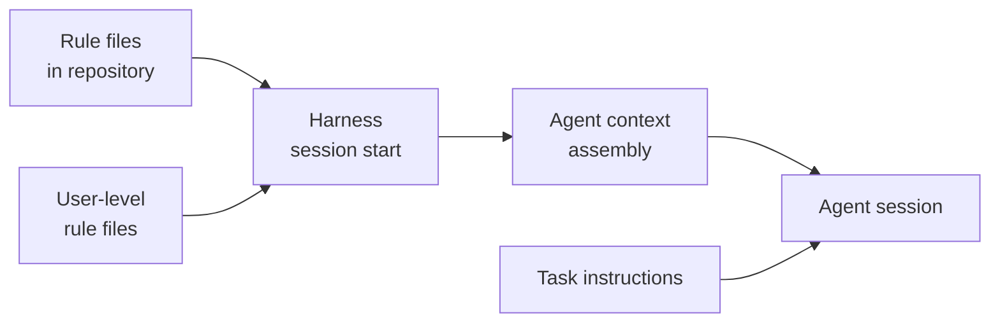

# [AEE-803] Steering Rules and Agent Instructions

## Context

Every agent session starts with the same problem: the agent knows nothing about your project's conventions, your team's standards, or the mistakes that have already been made. A system prompt addresses this for a single session — it configures the agent before it starts work. But a system prompt does not persist. The next session starts from scratch.

Steering rules address this permanently. They are instructions that live in files, version-controlled alongside the code they govern, loaded into the agent's context at session start. They do not require the developer to remember to include them. They do not expire when the session ends. They travel with the project.

The distinction matters in practice: a system prompt is something a developer writes; a steering rule file is something the project maintains.

## Design Think

Steering rules are persistent behavioral constraints. Unlike a system prompt constructed fresh each turn, steering rules live in files that persist in the repository or configuration. They codify what the agent should always do, what it should never do, and how it should approach a class of tasks — independent of any specific task instruction.

This makes them structurally different from both system prompts and task instructions:

- **Task instructions** — per-task. What to do right now.
- **System prompts** — per-session configuration. How the agent is initialized for this session.
- **Steering rules** — persistent. How the agent behaves in this project, across every session.

**What steering rules contain:** the conventions that apply universally. Not "build a login form" — that is a task. Not "be thorough and careful" — that is too vague to act on. A steering rule answers the question: what would an agent need to know to behave consistently with our team's standards, without anyone telling it each time?

**Three real-world implementations** illustrate how this concept is realized across different platforms:

*AWS AI-DLC (AI-Driven Development Lifecycle)* places steering rules in platform-specific directories as markdown files. The core workflow is anchored in `core-workflow.md`, with phase-specific rules in subdirectories (`inception/`, `construction/`, `operations/`). Each tool that participates in the workflow — Kiro, Amazon Q Developer, Cursor, Claude Code — loads the appropriate directory at session start. The same rules apply regardless of which tool is doing the work.

*Cursor rules* use `.mdc` files (markdown with YAML frontmatter) in the `.cursor/rules/` directory. Four rule types control when a rule is applied: Always (every prompt), Auto Attached (when files matching a glob pattern are referenced), Agent Requested (the AI decides to include based on user intent; the description drives this decision), and Manual (only when explicitly attached). Nested rules — rules in subdirectories — auto-attach when files in that directory are referenced. This allows fine-grained scope: a rule in `.cursor/rules/src/api/` applies only when working in `src/api/`.

*Claude Code CLAUDE.md* files are loaded as a user message at session start. They are context — Claude reads and follows them, but compliance depends on specificity and conciseness. A scope hierarchy governs which files apply: managed policy (org-wide, cannot be excluded) → user (personal preferences across all projects) → project (team-shared via source control) → local (gitignored, personal preferences for this project). All discovered files are concatenated; no file fully overrides another. Subdirectory CLAUDE.md files load on demand (lazy loading) when files in that directory are accessed.

**DESIGN.md as a steering document:** a file placed at the repository root (or component directory) that specifies design system constraints — component names, spacing tokens, accessibility requirements, naming patterns. It is not a spec for a feature; it is the immutable layer that all feature specs must comply with. An agent implementing UI loads DESIGN.md as session context and is constrained by it across every session. No established formal specification for this pattern exists beyond its use in Kiro and spec-kit, but the function is clear: persistent design system state that an agent cannot invent from scratch each time.

**Scope and precedence:** when multiple rule files apply, most implementations concatenate all matching rules rather than override. Cursor loads all matching rules together; Claude Code concatenates all discovered CLAUDE.md files. Managed or org-level rules take precedence by convention — they cannot be excluded. This means conflicting instructions from two rule files are both visible to the agent, making it important to avoid contradictions across scopes.

**Authoring principles:** a rule must be specific enough for an agent to apply without judgment. The test is binary: can the agent apply this without making a judgment call about what the instruction means?

- "Use good naming" — not a rule. The agent must decide what "good" means.
- "Use camelCase for variables and PascalCase for types" — a rule.
- "Be thoughtful about logging" — not a rule.
- "Never add `console.log` statements to production files" — a rule.

Vague guidance belongs in documentation or system prompts, where human judgment interprets it. Steering rules are for instructions that require no interpretation.

**Versioning:** rule files must be version-controlled alongside the code they govern. A rule that no longer reflects the codebase is not neutral — it actively misleads agents. When conventions change, the rule file changes with them.

- Steering rule files MUST be version-controlled alongside the code they govern.
- Rules MUST be specific enough for an agent to apply without judgment — vague guidance SHOULD be moved to a system prompt, not left in a rule file.
- Rule files SHOULD be kept short (under 200 lines per file); longer rule files degrade agent adherence.

## Deep Dive

### 1. Platform Comparison

| Platform | File format | Scope model | Precedence | Notable feature |
|---|---|---|---|---|
| Kiro | Markdown (`.kiro/steering/`) | All files loaded per session | Concatenation | Default project files: `product.md`, `structure.md`, `tech.md` |
| Amazon Q Developer | YAML rules (`.amazonq/rules/`) | AI-DLC phase-specific subdirs | Concatenation | Phase-aligned rule organization |
| Cursor | MDC with YAML frontmatter (`.cursor/rules/`) | Always / Auto-Attached / Agent Requested / Manual | Concatenation | Glob-based auto-attachment by file pattern |
| Cline / Claude Code | Markdown (`CLAUDE.md`, `.clinerules/`) | Org → User → Project → Local → Subdir | Concatenation (all files) | Lazy loading of subdirectory files on demand |

The AWS AI-DLC rules are designed to be platform-agnostic: the same markdown rules load across Kiro, Amazon Q Developer, Cursor, and Claude Code, with minor path differences per tool. `core-workflow.md` serves as an anchor that every platform loads; the phase-specific subdirectories activate as work progresses through the AI-DLC phases.

Cursor's four rule types (Always, Auto Attached, Agent Requested, Manual) are documented by multiple independent sources, though the official docs page has redirected and cannot be directly verified. The glob-based auto-attachment model is the distinctive feature: a rule for TypeScript interfaces auto-attaches whenever `.ts` files are referenced, without requiring any explicit activation.

Amazon Q Developer's YAML rule format (`.amazonq/rules/`) is inferred from inspection of the AI-DLC GitHub repository structure; this format has not been independently corroborated from official Amazon Q Developer documentation.

The Claude Code scope hierarchy is the most granular. Each scope serves a different purpose: managed policy covers compliance requirements that apply to all users in the organization; user-level covers personal preferences that apply across all projects; project-level covers team-shared conventions; local covers personal overrides for a specific project that should not be committed.

### 2. Authoring Good Rules

The distinction between a rule and guidance:

| Is it a rule? | Example |
|---|---|
| Rule | `never add console.log statements to production files` |
| Guidance | `be thoughtful about logging` |
| Rule | `always run pnpm test before committing` |
| Guidance | `make sure tests pass` |
| Rule | `use kebab-case for CSS class names` |
| Guidance | `follow consistent naming` |
| Rule | `imports must be grouped: external dependencies first, internal modules second, separated by a blank line` |
| Guidance | `organize imports clearly` |

The test: can an agent apply this without making a judgment call about what the instruction means? If the answer requires the agent to interpret what "good," "thoughtful," "consistent," or "clear" means in this specific context, it is not a rule.

Rules are imperatives. They describe a specific action or constraint in a specific situation. When writing a candidate rule, ask: if I gave this instruction to an agent with no other context, would it produce the same behavior every time? If not, rewrite it until it would.

Rules at the boundary tier deserve special attention: "never" constraints are the most consistently absent and the most consequential. An agent that does not know something is a hard stop will treat it as a choice. "Never commit to main directly," "never delete files outside the specified scope," "never add dependencies without approval" — these are the instructions that prevent the highest-impact mistakes, and they are the ones developers most often forget to write because they seem obvious.

### 3. DESIGN.md as a Steering Document

A DESIGN.md at the repository root is a design system specification loaded alongside other steering rules. It is distinct from a feature spec or architecture document: it does not describe what to build, but rather the constraints that everything built must comply with.

Content template for a DESIGN.md:

- **Component naming conventions** — the canonical names used in this codebase (e.g., `Button`, not `Btn`; `NavigationBar`, not `NavBar`)
- **Color and spacing token references** — the design system values, not ad-hoc pixel or hex values (e.g., `$spacing-md`, not `16px`)
- **Accessibility requirements** — the WCAG level the team has committed to; aria standards in use; required attributes for interactive elements
- **Typography rules** — the font scale, line height rules, responsive behavior
- **Pattern for adding new components** — directory structure, required files (story, test, types), naming conventions
- **Anti-patterns to avoid** — known incorrect approaches and why they are wrong

This is not a spec for a feature; it is the immutable layer that all feature specs must comply with. An agent implementing a new UI component loads DESIGN.md and applies its constraints without being told to. The value accumulates over time: every convention captured in DESIGN.md is a convention the agent cannot invent incorrectly.

### 4. Scope and Loading Mechanics

**Claude Code scope hierarchy** — each file loaded and concatenated in order:

| Scope | Location | Shared with |
|---|---|---|
| Managed policy | `/Library/Application Support/ClaudeCode/CLAUDE.md` (macOS) | All org users; cannot be excluded |
| User | `~/.claude/CLAUDE.md` | Just you, across all projects |
| Project | `./CLAUDE.md` or `./.claude/CLAUDE.md` | Team via source control |
| Local | `./CLAUDE.local.md` (gitignored) | Just you, current project only |

The import syntax (`@path/to/file`) allows CLAUDE.md files to reference other files — up to five hops deep. Path-scoped rules via `.claude/rules/*.md` with a `paths` YAML frontmatter field allow rules to apply only to specific file patterns (e.g., `paths: ["src/**/*.ts"]`).

**Cursor concatenation:** all rules whose trigger conditions match are loaded together. There is no explicit precedence where one rule overrides another. A rule that contradicts another will present both instructions to the model simultaneously.

**AI-DLC anchor approach:** `core-workflow.md` establishes the baseline that applies across all phases. Phase-specific subdirectories (`inception/`, `construction/`, `operations/`) extend it with rules that apply only when working in that phase. This creates a layered system without requiring any file to enumerate all rules explicitly.

### 5. Rule Maintenance

Rule files accumulate technical debt just as code does. Three maintenance triggers indicate when a rule audit is needed:

**(a) Agent makes the same mistake twice** — if an agent repeats an error across sessions that a rule should have prevented, either the rule is missing or is not specific enough to prevent that interpretation. Add or sharpen the rule.

**(b) Codebase undergoes a major architectural change** — rules that reference paths, patterns, or conventions from the old architecture will actively mislead agents. When architecture changes, the rule audit should be part of the same work.

**(c) Team onboarding** — when a new team member joins, review rule files with them. If a human needs to ask about a convention that should be in a rule file, it should be in a rule file. If a convention in the rule file no longer reflects how the team works, update it.

Rule rot is a real failure mode: a rule that no longer applies does not sit quietly — it confuses agents by asserting false constraints. Periodic rule audits (at minimum: when onboarding, after major refactors, and when a class of agent mistakes recurs) are required to maintain rule file fidelity.

## Best Practices

1. **Organize rules by scope: project conventions in the project-level file, personal preferences in the user-level file.** Never mix them into a single file. Conventions that the whole team should follow belong in the project-level rule file, committed to source control. Preferences that only apply to your workflow (editor settings, personal shortcuts, style preferences the team has not adopted) belong in the user-level or local rule file. Mixing them produces a rule file that cannot be shared without also sharing personal preferences — or cannot be personalized without also overriding team conventions.

2. **Write rules as imperatives, not principles.** "Use kebab-case for CSS class names" is a rule. "Follow consistent naming" is not. Principles require judgment the agent does not have. When you find yourself writing a principle, ask what specific behavior it requires, and write that instead.

3. **Review rule files when onboarding new team members.** If a human needs to ask about a convention that should be in a rule file, it should be in a rule file. If a new team member asks "should I use single quotes or double quotes?" and the answer is "we always use single quotes," that is a missing rule. Use onboarding as a systematic audit: every question about conventions that should already be documented is a gap.

## Visual

Rule files load before the task instruction arrives. By the time the agent reads the task, the persistent behavioral constraints are already in context. The task instruction does not need to repeat them; the rule files carry them across every session automatically.

**Claude Code scope hierarchy:**

| Scope | Location | Shared with |
|---|---|---|
| Managed policy | System-level path (macOS: `/Library/Application Support/ClaudeCode/CLAUDE.md`) | All org users; cannot be excluded |
| User | `~/.claude/CLAUDE.md` | Just you, across all projects |
| Project | `./CLAUDE.md` or `./.claude/CLAUDE.md` | Team via source control |
| Local | `./CLAUDE.local.md` (gitignored) | Just you, current project only |

All scopes concatenate. More specific locations appear later in the concatenated context; for conflicting instructions, later-appearing instructions may take precedence.

## Related AEEs

- [AEE-800](800) -- Agentic Development Workflows -- category overview
- [AEE-801](801) -- AI-Driven Development Lifecycle -- steering rules are the implementation mechanism for AI-DLC workflow enforcement across tools
- [AEE-802](802) -- Spec-Driven Development -- DESIGN.md is both a steering document and a spec pattern; the "never" tier of spec boundaries maps to hard stops in steering rules
- [AEE-805](805) -- Workflow Codification -- rule files are the primary codification artifact; steering rules codify conventions that workflow codification operationalizes
- [AEE-204](../System%20Prompt%20Engineering/204) -- System Prompt Engineering -- system prompts configure the agent per-session; steering rules persist across sessions; the distinction determines what belongs in each

## References

- [awslabs/aidlc-workflows](https://github.com/awslabs/aidlc-workflows) -- AWS AI-DLC steering rules repository; platform-specific directories and core workflow file
- [Claude Code Memory Documentation](https://code.claude.com/docs/en/memory) -- CLAUDE.md scope hierarchy, loading behavior, path-scoped rules, and import syntax
- [Kiro Specs Documentation](https://kiro.dev/docs/specs/) -- Kiro's steering directory and default project context files

## Changelog

- 2026-04-17 -- Initial draft
