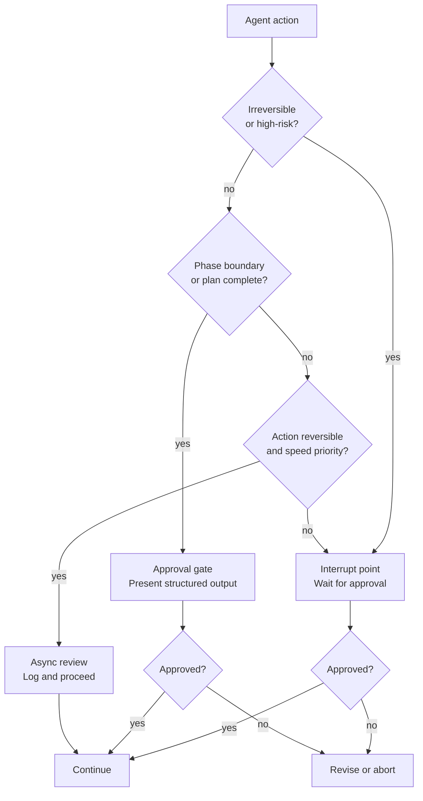

# [AEE-804] Human Oversight Patterns

## Context

The naive view of oversight is "make the agent ask before acting." The problem is that this creates the worst of both worlds: you get all the latency and interruption of human review, but the agent still runs without the engineer understanding when and why it should stop. An agent that interrupts at random points is not overseen — it is just slow.

The real tension is between two failure modes. Too much oversight kills the productivity benefit of agentic workflows: if a human must approve every step, the agent is a slow autocomplete. Too little oversight means errors compound silently until they are expensive to fix. A code agent that proceeds through a refactor with no checkpoints can deliver five hundred lines of output that systematically misapplied a wrong pattern — and the cost of unwinding that is higher than the cost of the review would have been.

The design question is not "how much oversight?" It is: where in the workflow does human judgment add value the agent cannot provide, and how do you route to it efficiently? Oversight patterns answer this as an engineering decision, not a philosophical stance. Each pattern has a cost, a trigger, and a set of conditions under which it is the right choice.

## Design Think

Three oversight pattern categories map to different positions in a workflow and different risk profiles.

**Interrupt points** are explicit pauses where the agent stops and waits for human input before continuing. The agent has reached an action it cannot proceed with on its own — because the action is irreversible, because it exceeds a scope threshold, or because the agent's own confidence is below a defined level. The interrupt is synchronous: the workflow halts until the human responds.

**Approval gates** are structured checkpoints where the agent presents a plan or completed phase output for human review before executing the next phase. The distinction from interrupt points is significant: the agent has already done work — completed research, generated a plan, written a draft — and is presenting it for sign-off. The gate is between phases, not inside an action. The agent is not asking for guidance; it is presenting work for evaluation.

**Async review** is the pattern where the agent proceeds and logs its actions; a human reviews the log after the fact. No synchronous pause. The agent completes its work, and oversight happens post-execution. This is the lowest-friction pattern but requires that errors be recoverable and that the log format be structured enough for a reviewer to evaluate efficiently.

The three patterns are not mutually exclusive. A single workflow can use interrupt points for irreversible actions, approval gates at major phase boundaries, and async review for the iterative work inside each phase.

**RFC 2119:**

- Irreversible actions (file deletion, schema migration, external API calls with side effects) MUST have an interrupt point before execution, not after.
- Approval gate outputs MUST be structured (not natural language summaries) so reviewers can make decisions without re-reading the agent's full context.
- Async review logs MUST capture both the action taken and the reasoning, not just the action.

## Deep Dive

### 1. Interrupt Point Design

An interrupt point activates when the agent reaches an action it cannot assess as safely reversible. Three classes of trigger determine when to interrupt:

**Action type triggers:** file deletion, database writes, external service calls, credentials access, any action that modifies state outside the local workspace. These trigger an interrupt regardless of the agent's confidence.

**Scope triggers:** the action affects more than N files, records, or entities, where N is a team-defined threshold. A refactor touching 3 files is different from one touching 300. The threshold is a policy decision, not a technical one, and it belongs in the workflow configuration.

**Confidence triggers:** the agent's own expressed uncertainty exceeds a threshold. When an agent hedges ("I think X is correct, but I'm not sure whether to use Y or Z"), that hedge is data. Treating it as an interrupt trigger routes uncertain decisions to humans rather than letting the agent guess.

What the interrupt must include:
- The specific action the agent wants to take — concrete, not a summary of its thinking.
- What happens if the human approves versus declines — including any downstream steps that depend on this decision.
- The minimum context the human needs to decide — not the agent's full context dump.

The anti-pattern is an interrupt that presents the agent's entire reasoning and asks "should I proceed?" This is not a useful interrupt. Humans cannot process an agent's full context efficiently. An interrupt that requires the reviewer to read five hundred words before approving is an interrupt that will be approved without reading. The interrupt output is a decision packet, not a context handoff.

### 2. Approval Gate Design

Approval gates sit between phases of a multi-phase workflow. A gate is triggered when the agent completes a discrete phase of work and is ready to start the next:

- Completes research → presents findings before writing
- Completes a plan → presents the plan before executing
- Completes a draft → presents the draft before publishing

The structured output requirement is what makes a gate functional. A 500-word prose summary of what the agent found is a document. A bulleted list of key findings with explicit "proceed / revise / reject" options is a gate output. The distinction is whether the human can evaluate it quickly without reconstructing the agent's reasoning from scratch.

A gate output must also capture the human's decision and, where the decision is "revise" or "reject," the reason. Without the reason, the agent cannot adjust in the next iteration — it can only repeat. A gate that returns only yes/no produces a loop where rejections give no signal.

The format of a gate output:

```json
{
  "phase_completed": "research",
  "summary": ["finding 1", "finding 2", "finding 3"],
  "proposed_next_phase": "drafting",
  "proposed_approach": "...",
  "decision": null,
  "revision_notes": null
}
```

The agent writes this structure. The human fills in `decision` and `revision_notes`. The harness reads the decision and routes accordingly.

### 3. Async Review Design

Async review is appropriate when three conditions hold: the action is reversible, speed matters more than real-time oversight, and the team has defined what good output looks like and can evaluate logs efficiently.

The log format is the critical dependency. Async review without structured logs is not oversight — it is hoping someone catches something in a wall of text. Every action entry must include:

- **Timestamp** — when the action occurred
- **Action** — machine-readable description of what was done (not prose)
- **Input** — what triggered the action
- **Reasoning** — why the agent chose this action over alternatives
- **Output** — what the action produced or changed

The reasoning field is what makes the log useful for calibration, not just auditing. An action log without reasoning tells you what the agent did. An action log with reasoning tells you whether the agent's decision process is sound, which is the input needed to improve the prompt, the steering rules, or the workflow design.

Async review creates a feedback loop only if someone reads the logs. Teams that adopt async review without a defined review cadence (who reviews, how often, what they look for) are not doing async review — they are logging and hoping.

### 4. Confidence Thresholds as Oversight Triggers

When an agent expresses uncertainty, the engineer has a choice: ignore the hedge, or treat it as an oversight trigger. Ignoring it lets the agent guess. Treating it as a trigger routes uncertain decisions to the right pattern.

The practical implementation requires three components:

**Structured confidence reporting.** The agent reports confidence as part of its output in a consistent, machine-readable format:

```json
{
  "action": "...",
  "confidence": 0.72,
  "uncertainty_reason": "two equally valid approaches; unable to determine which matches team convention"
}
```

**Harness routing.** The workflow harness reads the confidence field and routes based on defined thresholds. Confidence above 0.9: proceed. Confidence 0.7–0.9: async review. Confidence below 0.7: interrupt point.

**Defined thresholds.** Thresholds are team-specific and domain-specific. In a domain where errors are cheap (draft copy, exploratory analysis), a lower threshold is appropriate. In a domain where errors are expensive (infrastructure configuration, database schema), the threshold should be higher and the default should favor interruption.

Confidence thresholds do not replace action-type triggers. An agent that is 0.95 confident about a database schema migration should still pause — the cost of error is the determining factor, not the probability.

### 5. Choosing the Right Pattern

| Scenario | Recommended pattern | Why |
|---|---|---|
| Irreversible action (file delete, DB write) | Interrupt point | Cannot undo; human must approve before, not after |
| Multi-phase workflow with a major phase boundary | Approval gate | Validates direction before committing to the next phase |
| Iterative content generation (drafts, summaries) | Async review | Reversible; speed matters; structured log sufficient |
| Agent confidence below threshold | Interrupt point | Agent itself signals it needs guidance |
| High-volume, low-risk, repetitive tasks | No gate (monitor only) | Overhead exceeds risk; review aggregate patterns, not individual actions |

The "no gate" row is not an oversight failure — it is a calibrated decision. Not every action needs a gate. Monitoring aggregate patterns (error rates, output distributions, anomalies) over a batch of actions provides oversight without per-action friction.

## Best Practices

1. **Design interrupt points around action type, not agent confidence alone.** Confidence thresholds are useful triggers, but irreversible actions need an interrupt regardless of how confident the agent is. An agent that is 95% confident about a database schema migration should still pause. The cost of error is the determining factor, not the probability of error. Confidence and reversibility are orthogonal axes; treat them separately.

2. **Structure gate outputs as decision packets, not summaries.** A gate output is a data structure: what was done, what the next step is, what the human is approving. If the reviewer needs to understand the agent's full context to make the decision, the gate output is not structured enough. Compress the output to the minimum information required for the decision — then compress further.

3. **Log reasoning alongside actions, not just actions.** Action logs without reasoning are useful for auditing after the fact. Action logs with reasoning are useful for calibrating the agent — you can tell whether the agent's decision process is sound, not just whether the output was correct. Calibration is more valuable than auditing; design the log format with calibration in mind.

## Visual



## Related AEEs

- [AEE-800](800) -- Agentic Development Workflows -- category overview
- [AEE-801](801) -- AI-Driven Development Lifecycle -- oversight patterns map to AI-DLC construction phase gates
- [AEE-802](802) -- Spec-Driven Development -- approval gate inputs are spec artifacts
- [AEE-803](803) -- Steering Rules and Agent Instructions -- steering rules can encode when to trigger interrupt points
- [AEE-805](805) -- Workflow Codification -- oversight patterns that work are candidates for codification
- [AEE-606](../Multi-Agent%20Systems/606) -- Multi-Agent Failure Modes -- oversight patterns are a mitigation for cascading failure

## References

- [Building Effective Agents - Anthropic](https://www.anthropic.com/research/building-effective-agents)
- [Tool use and agentic behaviors - Claude Code](https://docs.anthropic.com/en/docs/agents-and-tools/tool-use-and-agentic-behaviors)

## Changelog

- 2026-04-17 -- Initial draft
