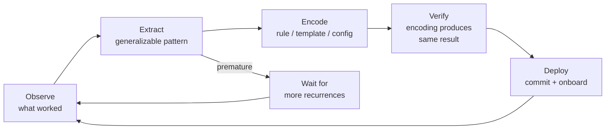

# [AEE-805] Workflow Codification

## Context

The first time a team gets good output from an agent, it is usually because someone crafted the right prompt, had the right conversation, or assembled the right context by hand. That knowledge lives in the engineer's head, not in the system. The next time the same task comes up, someone has to repeat the manual setup — or the team gets inconsistent results.

Workflow codification is the practice of moving tacit knowledge into the system. It is not about automation for its own sake. It is about ensuring that what worked once works reliably — that the conditions for good output are reproducible without requiring the same engineer to be present.

The codification loop: observe what works → extract the generalizable pattern → encode it as a rule, template, or harness config → verify the encoding produces the same result → deploy. The loop is ongoing. What was codified for one version of a model or task may need revision when the model changes or the task scope expands. Codification is not a one-time setup; it is a maintenance commitment.

## Design Think

Three mechanisms carry the weight of codification work:

**Steering rules** — behavioral constraints encoded in rule files (CLAUDE.md, `.cursor/rules/`, `.kiro/steering/`) that persist across sessions. They encode what the agent must and must not do regardless of the task prompt. Covered in AEE-803; referenced here because they are the most frequently codified artifact.

**Spec templates** — reusable spec structures that encode the format and level of detail an agent needs to produce consistent output for a class of tasks. Not every task requires a custom spec written from scratch. A template is a codified answer to the question: what does this kind of task always need in order for the agent to succeed?

**Harness configuration** — the invariants of the execution environment: which tools the agent has access to, what context is always injected, how errors are handled, what the output format is. Harness config codification makes the default runtime state explicit — rather than allowing each run to accumulate undocumented deviations.

The codification antipattern: codifying too early. If the pattern has not stabilized — if the team is still discovering what "good" looks like — encoding it locks in a partial or incorrect understanding. The signal that a pattern is ready to codify: the team has run it at least three times, gotten consistent results, and can describe what makes it work. The "three times" figure is a heuristic, not a rule. The underlying test is whether the pattern is stable enough to describe reliably.

**RFC 2119:**

- Patterns MUST be validated through repeated execution before codification; codifying a pattern after a single success locks in unvalidated assumptions.
- Codified patterns SHOULD be version-controlled alongside the code they govern; a rule or template that diverges from the codebase it was written for actively misleads agents.
- When a codified pattern consistently produces wrong output after a model update, it MUST be audited and revised before redeployment; continuing to apply a broken pattern is not neutral.

## Deep Dive

### 1. What Qualifies for Codification

Not everything that worked once deserves codification. The decision is a cost-benefit calculation: the cost is the effort to extract, encode, test, and maintain the pattern; the benefit is reduced variability on future runs.

Codification is worth the cost when:

- The task recurs with the same structure or a predictable variation
- The setup cost per run is high — long prompts, manual context assembly, tool configuration that must be repeated
- Variability in setup produces variability in output quality
- The team has accumulated enough experience with the pattern to describe what makes it work

Signals that codification is premature:

- The task has run only once or twice
- The right prompt or context changes significantly each run
- The task is exploratory — scope is still being defined
- The model or tooling is changing rapidly enough that any encoding will need immediate revision

The cost of premature codification is not zero. A codified pattern that encodes the wrong understanding of a task creates false confidence: the team believes the pattern handles the case, but the encoded pattern is wrong. Correcting a codified misunderstanding is more expensive than not having codified it.

### 2. Steering Rule Codification

The codification lifecycle for a steering rule follows a clear sequence:

1. An agent makes the same mistake twice, or produces inconsistent output on a convention
2. An engineer writes a rule to prevent or constrain the pattern
3. The rule is tested: run the scenario that triggered the mistake; verify the rule prevents it
4. The rule is committed alongside the code it governs
5. The rule is included in onboarding: new agents and new team members both encounter it

The mistake to avoid: writing a rule after a single incident. Rules written after one occurrence tend to over-fit to the specific case rather than the general pattern. Two or more recurrences are the signal that the rule addresses a real, repeatable failure mode — not a one-time anomaly.

Rules also age. A rule written for a specific model version may not apply when the model changes. Rules that reference deprecated APIs or outdated conventions create noise that degrades the overall steering rule signal. The same audit cadence that applies to other codified artifacts — on model upgrades, major refactors, onboarding — applies to steering rules.

### 3. Spec Template Codification

A spec template encodes the structure and level of detail that an agent needs to produce consistent output for a class of tasks. It is not a fill-in-the-blank form. It is a scaffold that ensures the agent receives:

- The right context — what background information it needs to interpret the task correctly
- The correct constraints — what it cannot do; hard stops that apply regardless of the specific task instance
- The expected output contract — format, fields, success conditions

Template components:

- **Context block** — what the agent needs to know about the task environment
- **Constraints block** — what the agent must not do; the hard stops
- **Output contract block** — format, fields, success conditions
- **Examples block** — one or two examples of acceptable output (optional but high-value for complex tasks where the output format is non-obvious)

The template becomes a codified pattern when the team has used the same structure three or more times and found that filling it in produces consistent agent output. At that point, the template is the default; custom specs written from scratch are the exception and require justification.

### 4. Harness Configuration Codification

The harness is the runtime environment: tool access, context injection, error handling, output format. Harness configuration codification means making the default harness state explicit — what is always true when an agent runs a task in this workflow.

Key harness invariants to codify:

- **Tool allowlist** — which tools the agent can call, and which are explicitly unavailable. An implicit tool set (whatever the agent happens to have access to) is not a harness contract; it is an accident waiting to cause inconsistency.
- **Context injection order** — what context is injected first (design constraints, steering rules, spec), what is injected per-task. Order matters: context injected later can override or dilute earlier context.
- **Output format** — structured JSON vs. markdown vs. prose; field names; required fields. The output format is the output contract; it must be explicit.
- **Error budget** — how many retries before escalating to a human; what constitutes a retry-worthy failure vs. an abort.

Harness configuration drift is a failure mode. When engineers modify harness settings per-task without recording why, the harness state becomes implicit and the workflow becomes fragile. Codified harness config is the contract; per-task deviations are documented exceptions, not undocumented one-offs.

### 5. The Codification Loop

The codification loop is an ongoing improvement cycle. After each task cycle:

1. **Observe** — what worked, what required manual intervention, what produced surprising output
2. **Extract** — what is the generalizable pattern? Is this the third time this setup was needed?
3. **Encode** — write the rule, template, or harness config change
4. **Verify** — run the encoded pattern on a known-good case; confirm it produces equivalent output
5. **Deploy** — commit alongside code, update onboarding materials

The cycle does not stop at Deploy. Model updates, scope changes, and team convention shifts can invalidate any codified pattern. Regular audits are the maintenance mechanism. At minimum: trigger an audit on model upgrades, major refactors, and onboarding of new engineers. Waiting until an agent produces wrong output to audit a codified pattern is reactive; the pattern was already deployed incorrectly for some number of runs before the failure was detected.

The loop also has a branch: when the extraction step reveals that the pattern has not yet stabilized (this is the second time, not the third; the "right" setup still varies), the correct action is to wait — observe more, accumulate more data — not to encode prematurely.

## Best Practices

1. **Codify the third occurrence, not the first.** The first and second times a pattern appears, the team is still discovering what makes it work. Codifying after one success risks locking in the wrong understanding. By the third occurrence, the pattern has stabilized enough to describe reliably. The heuristic is not about counting; it is about stability. If the pattern is still changing, it is not ready.

2. **Treat codified patterns as code: version-control, test, and review them.** A steering rule or spec template that is not version-controlled will drift from the codebase it governs. Changes to codified patterns should go through the same review process as code changes — because they define the behavioral contract for every future agent run in that workflow. An unreviewed change to a steering rule is a silent change to how every subsequent agent in that workflow behaves.

3. **Schedule audits when the environment changes, not when things break.** Model updates, major refactors, and team composition changes are predictable moments when codified patterns may become stale. Waiting until an agent produces wrong output to audit patterns is reactive. Environment changes are the trigger; incorporate codification audit into the checklist for model upgrades and major refactors.

## Visual

## Related AEEs

- [AEE-800](800) -- Agentic Development Workflows -- category overview
- [AEE-803](803) -- Steering Rules and Agent Instructions -- steering rules are the primary codification artifact for behavioral constraints
- [AEE-804](804) -- Human Oversight Patterns -- oversight patterns that work consistently are candidates for codification
- [AEE-806](806) -- Agentic Quality Gates -- quality gates verify that codified patterns still produce correct output
- [AEE-3](../../Foundations%20and%20Mental%20Models/3) -- Agentic Engineering Levels -- Level 4 describes the codification loop: plan → delegate → assess → codify

## References

- [Building Effective Agents - Anthropic](https://www.anthropic.com/research/building-effective-agents)
- [Agentic Engineering Levels - Bassim Eledath](https://www.bassimeledath.com/blog/levels-of-agentic-engineering)

## Changelog

- 2026-04-17 -- Initial draft
