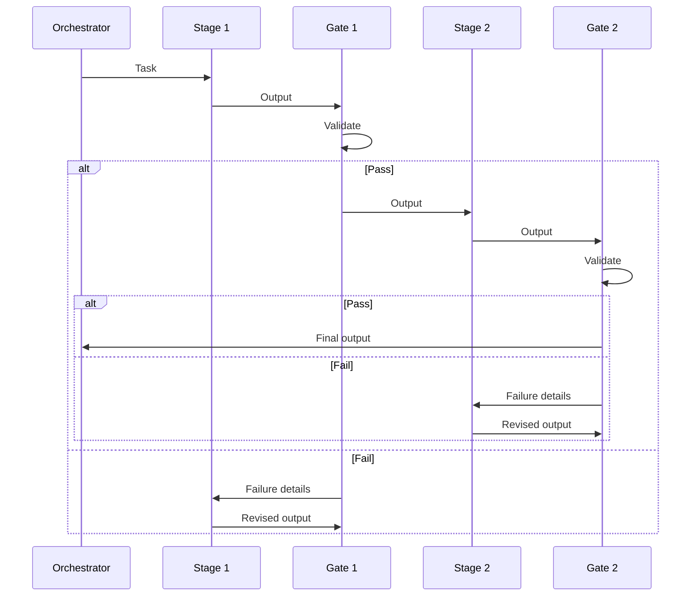

# [AEE-806] Agentic Quality Gates

## Context

The quality problem in agentic workflows is not that agents produce wrong output sometimes. It is that wrong output is often syntactically valid and plausible-looking — an agent that generates incorrect JSON still generates parseable JSON; an agent that hallucinates a method call produces code that compiles. The error passes the obvious check and only fails later, further downstream, or never at all.

Quality gates are the engineering answer to this: checkpoints in the execution pipeline that verify output against explicit criteria before the workflow continues. They are distinct from human approval gates (AEE-804) — quality gates are programmatic, execute automatically, and test specific, verifiable properties.

The cost of no quality gates is not just bad output — it is hard-to-diagnose bad output. When a downstream agent produces unexpected results, the question is which upstream stage produced the bad input. Quality gates create fixed points where provably-correct output was produced; this bounds the search space for failures.

## Design Think

Three gate types carry the verification work in an agentic pipeline:

**Schema validation gates** — verify the agent's output conforms to a declared schema (JSON schema, TypeScript type, OpenAPI spec). Test structural correctness, not semantic correctness.

**Semantic validation gates** — verify the agent's output satisfies content-level requirements (all required sections present, no placeholder text, word count in range, sentiment not negative). Cannot be fully automated but can be partially automated with structured checks.

**Execution gates** — run the output and verify the result. Applicable when the agent's output is code, commands, or queries: compile it, run it, check the exit code or output.

Gate placement principle: gates belong between pipeline stages, not inside them. A stage's output is either valid or invalid before passing to the next stage. The gate failure mode is reject and return to the producing stage with the validation failure, not skip the gate and proceed.

**RFC 2119:**

- Quality gates MUST be programmatic and produce a structured result (pass / fail + reason), not a natural language assessment.
- Each pipeline stage MUST have an output contract; quality gates verify the contract.
- A stage whose output fails a quality gate MUST NOT pass output to the next stage; the failure MUST be returned to the producing stage with the validation details.

## Deep Dive

### 1. Schema Validation

The minimum viable quality gate. Any agent producing structured output (JSON, YAML, structured markdown) should have a schema validation gate on its output. Schema validation tests:

- Required fields are present
- Field types match the declared schema
- Enum values are from the allowed set
- No extraneous fields (if the schema is strict)

Schema validation does not test semantic correctness — it tests structural correctness. An agent that produces valid JSON with all required fields but wrong values passes a schema gate. This is a feature, not a bug: schema gates are fast, deterministic, and cheap to run on every output.

Tool options: JSON Schema (ajv, jsonschema), TypeScript with Zod, Pydantic (Python), OpenAPI specification validation.

A common gap: agents that produce output with an unknown schema. If the agent output schema is "whatever the model returns," there is no gate to write. The gate is a forcing function to define the output contract.

### 2. Semantic Validation

Semantic validation tests content properties that schema validation cannot reach. Examples:

- All required sections are present (a document that validates structurally but is missing a "Summary" section)
- No placeholder text remains (`TODO`, `[PLACEHOLDER]`, `...`)
- Word count is within bounds (a summary that summarizes nothing vs. one that is longer than the source)
- Code examples match the declared language
- Internal references resolve (a document that references section 3 when there is no section 3)

Semantic gates can be LLM-assisted — an evaluator agent runs against the output and produces a structured pass/fail judgment. LLM-assisted gates introduce the oracle problem (who judges the judge?), which is mitigated by:

- Writing very narrow, verifiable evaluator criteria (not "is this good?" but "does the output contain a section titled 'Summary'?")
- Running the evaluator multiple times and requiring consensus (3-of-3 pass before proceeding)
- Keeping LLM-assisted gates separate from schema gates so failures are attributable

### 3. Execution Gates

When the agent's output is executable — code, shell commands, SQL, configuration — the strongest gate is running it and checking the result. An execution gate:

- Compiles the code and checks for errors (compile gate)
- Runs the code against a test suite and requires a pass rate threshold (test gate)
- Executes in a sandbox and checks the exit code or output (sandbox execution gate)

Execution gates are the highest-signal quality check available, but they require:

- A safe execution environment (sandbox, not production)
- A defined oracle for "pass" (exit code 0, test coverage ≥ N%, specific output present)
- A retry budget (how many times the agent can revise and resubmit before the task is escalated)

The execution gate output should include the full failure log, not just "failed" — the agent needs the failure details to revise effectively.

### 4. Gate Chains and Failure Routing

In a multi-stage pipeline, gates chain: each stage's output gate must pass before the next stage begins. The failure routing matters:

- **Schema gate failure**: return to producing stage with schema violation details. The agent can correct structural errors given the schema diff.
- **Semantic gate failure**: return to producing stage with the evaluator's specific failure criterion. "Section 'Summary' not found" is actionable; "output is incomplete" is not.
- **Execution gate failure**: return to producing stage with the full failure log. Stack traces, compiler errors, and test output are the agent's diagnostic input.

Retry limits are required: without a retry limit, a failing output can cycle the gate loop indefinitely. Define a maximum retry count per gate type; on exhaustion, escalate to a human approval gate (AEE-804).

### 5. The Oracle Problem for LLM-Assisted Gates

When the gate itself uses an LLM (for semantic validation), there is a judgment chain: producer LLM → evaluator LLM → gate decision. The evaluator can fail in ways the producer cannot: it may disagree with itself across runs (non-determinism), it may pass bad output that is framed confidently, or it may apply the evaluation criterion inconsistently.

Mitigations:

- Narrow the evaluator criteria to binary, verifiable questions where possible
- Run the evaluator multiple times (3 runs, require 3/3 pass for high-stakes gates)
- Use a different model for evaluation than for production (to avoid correlated failure modes)
- Log evaluator reasoning alongside its verdict for auditability

## Best Practices

1. **Define the output contract before writing the gate.** If you cannot state in one sentence what the agent output must satisfy, the gate cannot be written. The output contract is the specification; the gate is the test. Writing the gate first produces tests for undefined behavior.

2. **Prefer schema gates for structural properties and execution gates for behavioral properties.** LLM-assisted semantic gates are expensive and non-deterministic. Use them only for properties that cannot be verified any other way. Structural checks (schema validation, regex, AST analysis) are fast and deterministic — prefer them.

3. **Return failure details, not failure flags.** A gate that returns `false` gives the agent nothing to work with. A gate that returns the specific schema violation, the missing section name, or the compiler error gives the agent a clear revision target. The failure message is the agent's input for its next attempt.

## Visual

## Related AEEs

- [AEE-800](800) -- Agentic Development Workflows -- category overview
- [AEE-802](802) -- Spec-Driven Development -- output contracts are defined in specs; quality gates test the contracts
- [AEE-804](804) -- Human Oversight Patterns -- quality gates are programmatic; human gates are for cases quality gates cannot cover
- [AEE-805](805) -- Workflow Codification -- successful gate configurations are candidates for codification
- [AEE-605](../../Multi-Agent%20and%20Orchestration/605) -- Orchestration Patterns -- pipeline pattern with validation gates is covered in orchestration patterns
- [AEE-606](../../Multi-Agent%20and%20Orchestration/606) -- Multi-Agent Failure Modes -- quality gates are a mitigation for silent propagation of bad output

## References

- [Building Effective Agents - Anthropic](https://www.anthropic.com/research/building-effective-agents)
- [Tool use and agentic behaviors - Claude Docs](https://docs.anthropic.com/en/docs/agents-and-tools/tool-use-and-agentic-behaviors)

## Changelog

- 2026-04-17 -- Initial draft
