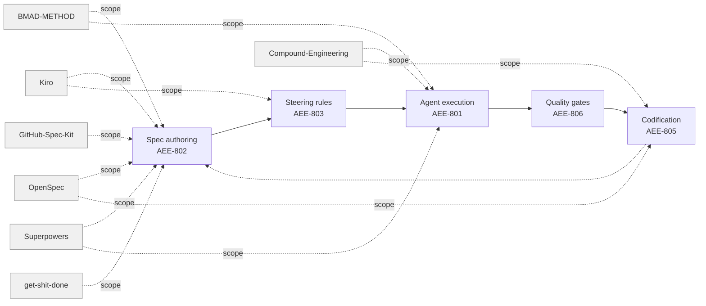

# [AEE-807] Spec-Driven Development Frameworks in Practice

## Context

AEE-802 defines the principles for agent-executable specs — behavioral contracts with success criteria, explicit scope, and resolved ambiguities. After reading it, practitioners have a natural follow-up question: which existing tools embody these principles, and how do they differ from each other? This article answers that question by mapping the current landscape of spec-driven agentic frameworks.

The market for spec-driven agentic tooling is fragmenting fast. Between 2024 and 2026, a wave of frameworks emerged from different starting points — IDE vendors, media companies, startup accelerators, open-source contributors — each encoding its own opinionated workflow into slash commands, YAML persona files, or version-controlled Markdown. The result is a proliferation of choices with overlapping claims and incompatible lifecycle assumptions.

This article surveys frameworks with observable spec and lifecycle structure. The criterion for inclusion: a framework must produce a named, versioned spec artifact that drives agent execution — not merely a set of style preferences or task prompts. Frameworks in scope include OpenSpec, BMAD-METHOD, Kiro's AI-DLC spec mode, GitHub Spec Kit, Superpowers, Compound Engineering, and get-shit-done. Out of scope: rule-only frameworks (Cursor rules, CLAUDE.md conventions, AGENTS.md patterns) that configure agent behavior without producing spec artifacts; tutorials and methodology guides without tooling; and frameworks covered in dedicated AEE articles.

The goal is not a recommendation — team context determines fit. The goal is a map: where do these frameworks agree, where do they diverge, and what questions should practitioners ask before adopting one?

## Design Think

Four dimensions predict framework fit better than any feature checklist.

**Spec granularity** — what unit of work does a spec describe? Frameworks vary from capability-level requirement deltas (OpenSpec) to full project cascades from PRD through story (BMAD-METHOD) to per-feature three-file artifacts (Kiro, GitHub Spec Kit). Granularity determines where the framework attaches to your development cycle: at the epic level, the story level, or the task level.

**Lifecycle integration** — does the framework manage one feature at a time or own the full development lifecycle? One-shot frameworks (Superpowers, GitHub Spec Kit) produce a spec and a plan for a single feature, then exit. Ongoing frameworks (OpenSpec, BMAD-METHOD, get-shit-done) persist across features, accumulating change history, project state, or institutional learnings that inform subsequent cycles. A team adopting a one-shot framework for a project that needs ongoing change management will find itself maintaining state manually.

**Human gate placement** — where does the framework require human review before proceeding? All surveyed frameworks place at least one explicit gate between "define what to build" and "start building." The frameworks differ in how many gates exist and how enforced they are: hard-coded WAIT instructions (Superpowers), explicit CLI commands that cannot be skipped (OpenSpec validate), or convention-based checkpoints that require discipline rather than enforcement (Compound Engineering). Gate placement determines how much risk accumulates between human interventions.

**Regeneration model** — when requirements change, what happens? Two philosophies emerge from the survey. Spec-as-source-of-truth frameworks (OpenSpec, GitHub Spec Kit, get-shit-done) treat the spec artifact as the durable truth and cascade changes downstream: update the spec, regenerate the plan, regenerate the tasks. Spec-as-input frameworks (BMAD-METHOD, Superpowers; Kiro is inferred) treat the spec as a one-time input to a generation cycle; changing requirements means re-entering the workflow from an earlier stage. The regeneration model determines how much rework a mid-course requirement change triggers.

- Practitioners SHOULD evaluate frameworks along these four dimensions, not by feature checklists.
- Frameworks SHOULD NOT be mixed at the spec layer — their lifecycle assumptions conflict.

## Deep Dive

### Tier 1 Frameworks

---

#### OpenSpec

OpenSpec is a spec-driven development CLI and workflow system designed to keep requirements version-controlled alongside code. Its core insight: requirements that live only in chat history are not requirements — they are lost context. OpenSpec solves this by committing every proposed change as a structured artifact in the repository before any implementation begins.

**What it is.** A structured change-management workflow that organizes agentic development through proposal, design, tasks, and spec-delta files committed to the repository. Each unit of change is a traceable proposal with a defined lifecycle.

**Format.** Changes live under `openspec/changes/<change-id>/` containing `proposal.md` (why, what, impact), an optional `design.md` (technical decisions), `tasks.md` (checkbox-format implementation checklist), and `specs/<capability>/spec.md` delta files. Delta files use section headers to mark additions, modifications, removals, and renames (`## ADDED Requirements`, `## MODIFIED Requirements`, etc.). Every requirement must include at least one `#### Scenario:` block with WHEN/THEN structure. Consolidated capability state lives under `openspec/specs/<capability>/spec.md` — the authoritative record of what is built.

**Lifecycle.** Three sequential stages: Creating Changes (scaffold proposal, spec deltas, tasks; run `openspec validate --strict`), Implementing Changes (read proposal → design → tasks; implement sequentially; mark tasks complete), Archiving Changes (post-deployment, move `changes/<id>/` to `changes/archive/YYYY-MM-DD-<id>/`; merge deltas back into `specs/`). Change IDs are kebab-case, verb-led (`add-`, `update-`, `remove-`, `refactor-`).

**Human gates.** An explicit approval gate sits before implementation: "Do not start implementation until the proposal is reviewed and approved." This is a hard stop enforced by convention, backed by `openspec validate --strict` which must pass before sharing. Task-level review during implementation and archival review after deployment complete the gate set.

**Regeneration model.** Spec-as-source-of-truth. `specs/` is "current truth — what IS built." Each approved change is one execution cycle; re-running requires a new change proposal. Archiving merges deltas back into the consolidated spec, keeping it authoritative across the cumulative history of changes.

**AEE fit.** Sits at the intersection of AEE-802 (agent-executable specs) and AEE-805 (workflow codification). The `openspec/` directory functions as a codification layer: every architectural decision, requirement delta, and implementation task is a durable artifact that outlives the session that produced it.

**When to choose.** Teams that need auditable, reviewable change proposals committed alongside code. Especially suited to brownfield projects where capability boundaries already exist, and to teams onboarding multiple engineers who need shared context beyond chat history.

---

#### BMAD-METHOD

BMAD-METHOD ("Breakthrough Method for Agile AI-Driven Development") is an agentic agile framework that maps named specialist AI personas to agile roles, guiding projects from initial idea through deployment.

**What it is.** "Breakthrough Method for Agile AI-Driven Development" — a multi-agent methodology that maps agile roles (Analyst, PM, Architect, Developer, QA) to named AI agent personas. Each persona drives a phase; the cascade produces PRD → architecture → epics → stories.

**Format.** Agent personas are defined in `.agent.yaml` files (BMAD v6), compiled to `.md` for IDE consumption. Project artifacts live under `_bmad-output/`: `planning-artifacts/PRD.md`, `planning-artifacts/architecture.md`, `planning-artifacts/epics/` (epic and story files), `implementation-artifacts/sprint-status.yaml`, and `project-context.md`. Named agents: Mary (Business Analyst), Preston (Product Manager), Winston (Architect), Sally (Product Owner), Simon (Scrum Master), Devon (Developer), Quinn (QA Engineer). The framework ships 34+ workflow templates and a "Party Mode" that allows multiple personas in a single session.

**Lifecycle.** Sequential agile phases, each owned by a named agent: Brainstorming/Idea Capture (Mary/Preston), PRD Creation (Preston), Architecture (Winston), Story Refinement (Sally), Sprint Planning (Simon), Development (Devon), QA/Testing (Quinn). Scale-Domain-Adaptive Intelligence adjusts planning depth automatically based on project size.

**Human gates.** Phase transitions require human steering. Explicit decision points at PRD approval, architecture approval, and story acceptance. The `bmad-help` skill can be queried at any point for guidance on next steps. Humans define scope direction; agents execute within scope.

**Regeneration model.** Spec-as-input with cascade. PRD drives architecture generation; architecture drives story creation; stories drive implementation. If PRD changes, downstream artifacts must be regenerated through the agent chain. Each regeneration step requires human-agent collaboration — the cascade is not fully automated.

**AEE fit.** Full project lifecycle coverage, mapping to AEE-801 (AI-DLC construction phase) through quality gates. The persona structure aligns with AEE-603 (task decomposition and delegation): each named agent is a specialized subagent with bounded responsibility.

**When to choose.** Teams that want role-structured agentic workflows with familiar agile artifacts. Best suited to greenfield projects needing end-to-end structure from idea to deployment, and to organizations already familiar with Scrum or Kanban ceremonies where the named-agent model maps cleanly onto existing roles.

---

#### Kiro AI-DLC Spec Mode

Kiro's spec mode is the per-feature planning layer built into the Kiro AI IDE. It transforms a high-level feature idea into three sequentially produced artifacts before any code is written. Distinct from the broader AWS AI-DLC methodology: spec mode is a feature-scoped planning workflow within the Kiro tool, not the full lifecycle orchestration covered in AEE-801.

**What it is.** The spec authoring and execution mode built into Kiro IDE, implementing AWS's AI-Driven Development Lifecycle. Each feature gets a three-file spec artifact under `.kiro/specs/<feature>/` that drives agent implementation.

**Format.** All artifacts stored under `.kiro/specs/<feature-name>/`: `requirements.md` (user stories in "As a..." format with GIVEN/WHEN/THEN acceptance criteria), `design.md` (technical architecture, sequence diagrams, implementation strategy, error handling, testing approach), and `tasks.md` (discrete, trackable implementation tasks with real-time progress tracking). A `bugfix.md` variant exists for the bug-fix track in place of `requirements.md`.

**Lifecycle.** Three gated sequential phases: Requirements/Analysis (produces `requirements.md` or `bugfix.md`), Design (produces `design.md`), Tasks (produces `tasks.md` with real-time status display). Each phase completes before the next begins. The framework supports two entry points: Requirements-First (define user stories, then design to satisfy them) and Design-First (start with architecture, derive requirements from it). Iteration is supported: requirements or design can be modified, with downstream phases regenerating accordingly.

**Human gates.** Phase boundary between Requirements and Design (human reviews requirements before design begins), phase boundary between Design and Tasks (human reviews design before task generation), and a human-controlled task execution mode (individually or all at once).

**Regeneration model.** Inferred as spec-as-input: agents implement from `tasks.md`; the spec is not regenerated from code after implementation. The research notes establish this as inferred from workflow documentation — it is not explicitly stated in public Kiro docs. The three-file structure supports downstream regeneration when upstream files are edited, but the automatic re-generation behavior is not confirmed.

**AEE fit.** Directly implements AEE-802 spec principles: the three-artifact structure maps to the goal statement (requirements), architecture (design.md), and task decomposition (tasks.md). The Kiro IDE's session-level steering rules enforce AI-DLC conventions — an example of the AEE-803 principle applied at the tooling layer.

**When to choose.** Teams using the Kiro IDE or AWS AI-DLC methodology. The IDE-native integration — real-time task status display, direct context loading — makes it the lowest-friction entry for Kiro users. The `bugfix.md` variant makes it specifically useful for teams with mixed feature and bug-fix workflows.

---

#### GitHub Spec Kit

GitHub Spec Kit is an open-source toolkit from GitHub that introduces spec-driven development via slash commands. It is framework-agnostic and tech-stack-agnostic, positioning itself as a planning layer that works in front of any agent runtime or IDE.

**What it is.** A set of slash commands for GitHub Copilot Workspace (and compatible tools) that drive structured spec → plan → tasks breakdown per feature. Framework-agnostic: works alongside other AI tooling without requiring repository restructuring.

**Format.** A one-time constitution document at `.specify/memory/constitution.md` establishes governing project principles. Per-feature artifacts live under `specs/<feature>/`: `spec.md` (functional requirements, user stories, acceptance criteria), `plan.md` (technical implementation approach), and `tasks.md` (ordered, dependency-tracked task list). Supporting artifacts may include data models, API contracts, and research documents. Seven primary commands drive the workflow: `/speckit.constitution` (project principles), `/speckit.specify` (requirements), `/speckit.clarify` (clarification before planning), `/speckit.plan` (implementation strategy), `/speckit.tasks` (dependency-ordered tasks), `/speckit.implement` (task execution), and `/speckit.analyze` (cross-artifact consistency). Optional utilities include `/speckit.taskstoissues` (convert to GitHub Issues) and `/speckit.checklist` (quality checklists).

**Lifecycle.** Five-stage structured progression: constitution (one-time), specify, clarify (recommended before planning to reduce downstream rework), plan, tasks, implement. The `/speckit.refine` command updates specs mid-implementation; plans regenerate downstream artifacts when modified.

**Human gates.** Clarification phase before planning, plan validation before task generation, explicit tech stack confirmation before implementation, and a review checklist requiring manual sign-off on acceptance criteria. Gates are convention-based: the commands do not enforce waiting, but the workflow assumes review between stages.

**Regeneration model.** Spec-as-source-of-truth with iterative refinement. `/speckit.refine` updates specs at any point; plans and tasks regenerate downstream when changed. Artifacts are living documents; re-running commands on modified specs produces updated outputs.

**AEE fit.** The most lightweight entry point into AEE-802 principles: no project infrastructure required, no IDE dependency, no prescribed directory structure beyond `specs/`. The constitution document maps to AEE-803 (steering rules) — project-level principles that persist across all feature specs.

**When to choose.** Teams already using GitHub Copilot who want a lightweight adoption path without repo restructuring. The GitHub Issues integration (`/speckit.taskstoissues`) makes it the natural choice for teams where task tracking lives in GitHub. The agent-agnostic positioning works for teams not committed to a specific IDE.

---

### Tier 2 Frameworks

---

#### Superpowers

Superpowers is the Claude Code built-in skill tree for spec-driven development, distributed as a plugin. It implements a brainstorming → spec writing → plan writing → execution pipeline with hard-gated approval at each stage.

**Format.** `docs/superpowers/specs/YYYY-MM-DD-<topic>-design.md` (design document from brainstorming) and `docs/superpowers/plans/YYYY-MM-DD-<feature-name>.md` (implementation plan from writing-plans). Plans use checkbox syntax for task tracking with a required header block (Goal, Architecture, Tech Stack). Tasks are scoped to 2-5 minutes each, TDD-first, with exact file paths and complete code at every step.

**Lifecycle.** Four skills in sequence: `brainstorming` (collaborative design dialogue; produces design doc; hard gate before any code), `writing-plans` (translates approved design into implementation plan with TDD tasks), `executing-plans` or `subagent-driven-development` (executes task-by-task with checkpoints), `verification-before-completion` (confirms work meets spec before claiming done).

**Human gates.** Three explicit approval points. Design approval: the `brainstorming` skill hard-codes a `<HARD-GATE>` — "Do NOT invoke any implementation skill until you have presented a design and the user has approved it." Spec review: agent waits for explicit user approval before writing-plans begins. Plan approval: human chooses execution mode (subagent vs. inline) and reviews each task checkpoint.

**Regeneration model.** Spec-as-input; one implementation cycle per approved spec. Design changes require manually re-running `brainstorming` or `writing-plans`.

**When to choose.** Claude Code users who want structured spec-to-implementation discipline with human-in-the-loop at each phase. The tight integration between brainstorming, planning, and execution in a single tool makes it the default choice for solo developers or small teams already in the Superpowers ecosystem.

---

#### Compound Engineering

Compound Engineering is a 42+ slash-command plugin originated at Every, Inc. (the "Chain of Thought" AI newsletter). Its defining thesis: each unit of engineering work should make subsequent units easier by automatically documenting and feeding lessons back into agent context. It is the most broadly adopted framework in this survey by adoption trajectory, with support for Claude Code, Cursor, OpenCode, Codex, Kiro, Windsurf, Gemini CLI, and others.

**Format.** Plans are authored in Markdown under `.claude/plan-<task>.md` by convention; no schema is enforced. Configuration artifacts: `.claude/launch.json` (dev server commands), `CLAUDE.md` (project standards), `AGENTS.md` (agent documentation). The spec-like structure emerges from `/ce:plan` output, not from a prescribed template.

**Lifecycle.** Six-stage loop: Ideate (`/ce:ideate`), Brainstorm (`/ce:brainstorm`), Plan (`/ce:plan`), Work (`/ce:work` — 100% agent execution), Review (`/ce:review` with tiered persona agents + optional `/ce:polish-beta` human polish), Compound (`/ce:compound` — document learnings for the institutional store, consulted by `learnings-researcher` at next planning cycle). The 80/20 framing places primary human investment in planning and review.

**Human gates.** Plan approval (implicit — engineer triggers `/ce:work` when satisfied with plan; no hard-coded wait), review gate (`/ce:review` → `/ce:polish-beta` explicit human-in-the-loop polish phase), compound gate (engineer decides what learnings to surface and persist), and a deployment checklist requiring human sign-off.

**Regeneration model.** Learning accumulator. Each cycle deposits learnings (`/ce:compound`) that are automatically consulted by the `learnings-researcher` agent at subsequent plan cycles. `/ce:compound-refresh` evaluates whether past learnings remain valid. This is not artifact-versioning regeneration — it is institutional knowledge compounding.

**When to choose.** Teams prioritizing velocity compounding over formal spec rigor, and teams targeting 100% code authorship delegation to agents while retaining orchestration and review. The multi-platform support makes it the choice for teams working across multiple AI coding tools on the same codebase.

---

#### get-shit-done

get-shit-done (GSD) is a meta-prompting and context engineering framework designed to solve context rot — quality degradation as a session accumulates conversation history. It externalizes project state into versioned Markdown files and distributes work across isolated, fresh subagent contexts per task.

**Format.** Project state lives under `.planning/`: `PROJECT.md` (vision), `REQUIREMENTS.md` (scoped features with phase mapping), `ROADMAP.md` (phased delivery), `STATE.md` (decisions, blockers, position across sessions), `research/`, and per-phase directories containing `{N}-CONTEXT.md`, `{N}-RESEARCH.md`, `{N}-{task}-PLAN.md` (XML-structured atomic task specs), and `{N}-SUMMARY.md` (execution results and git commits). Per-task plans use XML structure for machine-readable atomic specs.

**Lifecycle.** Seven-stage cycle: `/gsd-new-project` (interview → requirements → roadmap), `/gsd-discuss-phase` (human shapes implementation preferences), `/gsd-plan-phase` (research + atomic task planning), `/gsd-execute-phase` (parallel wave execution, fresh context per task), `/gsd-verify-work` (manual user acceptance testing), `/gsd-ship` (PR creation), `/gsd-complete-milestone` (archive and tag). Session pause/resume via `HANDOFF.json` enables cross-session continuity.

**Human gates.** `/gsd-discuss-phase` is a required human shaping step before any planning begins. `/gsd-verify-work` requires manual acceptance testing — the human confirms deliverables before shipping. Phase transitions require human confirmation before re-planning or re-executing.

**Regeneration model.** Modular per phase. "Preserve completed work, regenerate only what changed." Phases can be inserted, removed, or adjusted without rebuilding the full project. Failure recovery spawns debug agents and creates fix plans for re-execution.

**When to choose.** Teams where context rot across long sessions is the primary pain point. Brownfield projects (explicit `/gsd-map-codebase` support). Developers who want phase-gated, fresh-context execution without a full BMAD-style agent team.

---

### Honorable Mentions

**gstack** is Garry Tan's 23-skill framework built around named specialist roles (CEO review, engineer review, design review, QA, ship, retrospective). It functions as an execution-quality complement rather than a standalone spec-writing framework. Its role-cascade and compound-learning techniques are designed to layer on top of another spec-writing workflow — gstack can strengthen a team's review and QA practices regardless of whether they use OpenSpec or Kiro for spec authoring. Profiling it as a standalone SDD framework would misrepresent its scope.

**claude-task-master** (eyaltoledano/claude-task-master, 15k+ stars) ingests a PRD or spec and produces an AI-driven task decomposition with sequential, non-hallucination-prone task serving. It covers the task-breakdown phase of the workflow with precision — including TDD autopilot mode and 90% error reduction claims — but does not address spec authoring, lifecycle management, or change history. A dedicated survey of agentic task management frameworks is the right home for this tool; AEE-807's focus is on the spec and lifecycle layer, which claude-task-master explicitly does not own.

## Comparison Table

| Framework | Spec Granularity | Lifecycle Integration | Human Gate Placement | Regeneration Model |
|---|---|---|---|---|
| OpenSpec | Capability-level delta proposals | Ongoing change management | Before implementation (validate), during (task review), after (archival) | Spec-as-source-of-truth; archive accumulates |
| BMAD-METHOD | PRD → architecture → epics/stories cascade | Ongoing per epic | At each persona handoff | Spec-as-input; agent chain |
| Kiro AI-DLC spec mode | Multi-stage per feature (requirements → design → tasks) | Ongoing (spec updated after implementation) | Phase transitions | Spec-as-input (inferred) |
| GitHub Spec Kit | Multi-stage per feature (specify → plan → tasks) | One-shot per feature | Between slash commands | Spec-as-source-of-truth; iterative refinement |
| Superpowers | Multi-stage per project (brainstorm → spec → plan) | One-shot per approved spec | Design approval, spec review, plan approval | Spec-as-input |
| Compound Engineering | Convention-based plan per cycle | Ongoing (accumulates learnings) | Plan approval, polish review, compound curation | Learning accumulator |
| get-shit-done | Phase-scoped XML plans | Ongoing per phase | Before and after each phase | Modular per phase |

## Best Practices

1. **Pick by team workflow shape, not popularity.** A framework with strong audit trails (OpenSpec) adds overhead that is worthwhile for a team onboarding multiple engineers who need shared context, but is overkill for a solo project where chat history is sufficient. A one-shot framework (GitHub Spec Kit) gives a lightweight entry into AEE-802 principles but does not provide the change history a team needs when requirements evolve across multiple features. Match the framework's lifecycle model to the team's actual workflow before matching features.

2. **Do not mix two frameworks at the spec layer.** Their lifecycle assumptions conflict. A spec written for OpenSpec's delta model — with `## ADDED Requirements` headers, WHEN/THEN scenarios, and a change archive — does not behave correctly under Kiro's three-file structure. A BMAD-METHOD PRD cascade cannot be grafted onto get-shit-done's phase-level XML task plans. Pick one framework's conventions and codify them into steering rules. Mixing frameworks at the execution layer (e.g., OpenSpec for spec authoring, gstack for review quality) is viable; mixing at the spec layer is not.

3. **Codify your chosen framework into steering rules.** Once adopted, capture the framework's directory conventions, naming rules, required sections, and gate procedures in project-level steering rule files (see AEE-803) so agents apply them consistently across sessions. A new agent in a fresh session should not need to discover the framework's conventions from scratch — the steering rules should make them explicit. Document what you learn about the framework's edge cases in the codification loop (AEE-805).

4. **Plan for framework migration.** Frameworks evolve, get abandoned, or get acquired. All seven profiled frameworks postdate 2023; the landscape will look different in two years. Keep specs in plain Markdown with predictable directory structure. Avoid framework-specific binary formats, proprietary schemas, or tool-specific frontmatter fields that would require non-trivial conversion on migration. A spec that is readable as plain Markdown can be imported into any successor framework; a spec that requires the original CLI to parse cannot.

## Visual

Each framework's scope arrows show which parts of the AEE 800-series workflow it covers. OpenSpec and Compound Engineering both reach the Codification node — OpenSpec through its archive-and-merge mechanism, Compound Engineering through its learnings accumulator. BMAD-METHOD and Superpowers both reach Execution — they own not just spec authoring but the agent execution phase that consumes the spec. Kiro extends into Steering because its IDE-native steering rules enforce AI-DLC conventions at the session level.

## Related AEEs

- [AEE-801](801) — The AI-Driven Development Lifecycle
- [AEE-802](802) — Spec-Driven Development — principles that this article grounds in practice
- [AEE-803](803) — Steering Rules and Agent Instructions
- [AEE-805](805) — Workflow Codification
- [AEE-806](806) — Agentic Quality Gates

## References

**OpenSpec**
- [OpenSpec — Fission-AI/OpenSpec](https://github.com/Fission-AI/OpenSpec)

**BMAD-METHOD**
- [BMAD-METHOD — bmad-code-org/BMAD-METHOD](https://github.com/bmad-code-org/BMAD-METHOD)

**Kiro AI-DLC Spec Mode**
- [Kiro Spec Documentation](https://kiro.dev/docs/specs/)
- [AWS AI-Driven Development Life Cycle](https://aws.amazon.com/blogs/devops/ai-driven-development-life-cycle/)

**GitHub Spec Kit**
- [GitHub Spec Kit — github/spec-kit](https://github.com/github/spec-kit)

**Compound Engineering**
- [Compound Engineering Plugin — EveryInc/compound-engineering-plugin](https://github.com/EveryInc/compound-engineering-plugin)
- [Compound Engineering Methodology — Every](https://every.to/chain-of-thought/compound-engineering-how-every-codes-with-agents)

**get-shit-done**
- [get-shit-done — gsd-build/get-shit-done](https://github.com/gsd-build/get-shit-done)

**gstack**
- [gstack — garrytan/gstack](https://github.com/garrytan/gstack)

**claude-task-master**
- [claude-task-master — eyaltoledano/claude-task-master](https://github.com/eyaltoledano/claude-task-master)

## Changelog

- 2026-04-17 — Initial draft
