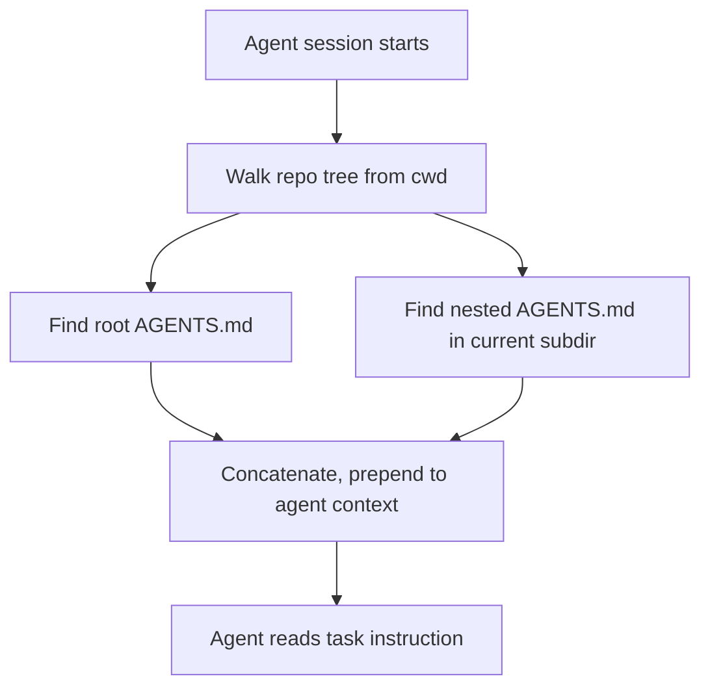

# [AEE-808] AGENTS.md and Authoring Best Practices

## Context

Every agent tool introduced its own instruction file. Anthropic Claude Code reads `CLAUDE.md`. Cursor reads `.cursor/rules/*.mdc`. Windsurf reads `.windsurfrules`. Gemini CLI reads `GEMINI.md`. GitHub Copilot has its own conventions. A multi-tool team ended up restating the same conventions across three to five files that drifted out of sync over time. The first time a new contention appeared — a renamed directory, a changed test command, a new "never do this" rule — someone updated the file for the tool they were using and forgot the others.

[AGENTS.md](https://agents.md/) is the proposed convergence convention. One markdown file at the repository root, read by any agent tool that agrees to look for it. The convention is stewarded by the Agentic AI Foundation under the Linux Foundation and has been adopted by OpenAI Codex, Google Jules, Cognition (Devin, Windsurf), Factory, JetBrains Junie, Cursor, Zed, Aider, GitHub Copilot, and others. Per the canonical site, over 60,000 open-source repositories already ship an AGENTS.md at the root.

AGENTS.md is not a formal RFC, not a mandated schema, and not enforced by a standards body. It is a convergence convention: tools agree on the filename and location, nothing more. That lightweight agreement is its power — any team can adopt it without waiting for a spec committee, and any tool can support it by adding a file reader.

This article focuses on AGENTS.md specifically. For the general concept of steering rules and per-tool rule-system comparisons, see [AEE-803](803).

## Design Think

AGENTS.md sits on two axes. First, it is a *discovery convention* — a contract between repo and any agent tool about where to find operating instructions. The contract is small (filename, location, markdown format) but the payoff is large: new tools integrate without requiring every repo in the world to add another file. Second, it is an *authoring contract* — what the repo promises about itself, expressed in a form agents can act on without human interpretation. The same file encodes both commitments, which is why its structure matters.

The file must serve two very different readers. A human reviewer needs brevity to stay current: a 600-line AGENTS.md that nobody has time to re-read is a file that silently goes out of date. An agent in a context-constrained session benefits from explicit rules when conventions are not otherwise discoverable from the code alone. These two pressures produce a live design debate among practitioners, often framed as "short AGENTS.md" versus "comprehensive AGENTS.md." Both positions have merit, and the choice between them shapes every other authoring decision. This article treats the debate as a spectrum to navigate, not a binary to resolve.

Working with AGENTS.md imposes a small set of hard constraints:

- AGENTS.md MUST live at the repository root. Subdirectory AGENTS.md files MAY supplement but not replace the root file.
- Machine-verifiable instructions (exact build/test commands, required env vars, hard boundaries) MUST be separated from style preferences within the file structure — typically as distinct sections — so a skimming agent can grab what it needs without parsing prose.
- Projects with an existing `CLAUDE.md`, `GEMINI.md`, or `.cursorrules` SHOULD migrate to AGENTS.md with an interop shim (symlink or `@import`) rather than maintaining parallel files that drift.
- A root AGENTS.md SHOULD be kept under 100 lines. Content beyond that SHOULD live in nested AGENTS.md files loaded on demand when the agent works in that directory.
- Sections that no longer reflect the codebase MUST be removed, not left to rot. A stale rule is not neutral — it actively misleads agents by asserting false constraints.

## Deep Dive

### 1. The AGENTS.md convention and adoption

The file is plain markdown. No mandated schema. No required frontmatter. The [agents.md site](https://agents.md/) describes AGENTS.md as "a simple, open format for guiding coding agents" that "complements README files" — the README is for humans, the AGENTS.md carries operational detail that would clutter a README or that a human collaborator simply does not need. AGENTS.md files live at the repository root. In monorepos, additional AGENTS.md files can be placed in subdirectories; the agents.md convention is that "the closest one takes precedence" when more than one applies.

The current adopter set spans every tier of the agentic tooling market. Tools with direct public documentation for AGENTS.md include [OpenAI Codex](https://developers.openai.com/codex/guides/agents-md), which formalized AGENTS.md as a first-class input with its own discovery chain; [Cursor](https://cursor.com/docs/rules), which supports AGENTS.md alongside `.cursor/rules/*.mdc` as a "plain markdown file without metadata or complex configurations"; and [Factory](https://docs.factory.ai/cli/configuration/agents-md), whose CLI walks from cwd to repo root looking for the nearest file. Tools that appear on the [canonical adopter list](https://agents.md/) but whose individual docs are less prominent include Google Jules, Cognition Devin and Windsurf, JetBrains Junie, UiPath, Amp, [Zed](https://zed.dev/docs/ai/agent-panel), RooCode, [Aider](https://aider.chat/docs/usage/conventions.html) (via `--conventions-file`), Gemini CLI, GitHub Copilot, goose, opencode, Warp, Kilo Code, Phoenix, Semgrep, Ona, and Augment Code.

Anthropic Claude Code does not read AGENTS.md natively at time of writing. Integration uses the interop patterns in the next subsection.

### 2. Interop with CLAUDE.md and tool-specific files

Teams with mixed toolchains need AGENTS.md to feed into tool-specific files without duplication. Two interop patterns handle this, and both are commonly used in practice.

**Pattern A — Symlink.** `CLAUDE.md -> AGENTS.md` (and similarly for other tool-specific filenames if needed). Zero duplication, always in sync. The downside is filesystem symlink support: Windows checkouts need developer-mode enabled, and some tools may not follow symlinks. Teams on macOS/Linux with no Claude Code-specific additions can usually adopt this pattern and forget it.

**Pattern B — `@import`.** [Claude Code documents](https://code.claude.com/docs/en/memory) the `@path/to/file` import syntax inside CLAUDE.md files. A minimal `CLAUDE.md` containing just `@AGENTS.md` delegates to the canonical file. Anthropic explicitly recommends this pattern: "If your repository already uses `AGENTS.md` for other coding agents, create a `CLAUDE.md` that imports it so both tools read the same instructions without duplicating them." The advantage over symlinks is portability: it works on Windows, and Claude Code-specific additions can layer on top of the shared AGENTS.md without affecting how other tools read the base file. The trade-off is that import syntax is Claude Code-specific; other tools do not execute `@AGENTS.md` as an import.

| Pattern | Best when | Watch out for |
|---|---|---|
| Symlink (`CLAUDE.md -> AGENTS.md`) | Content is 100% shared; team is on macOS/Linux | Windows checkouts without developer-mode; tools that do not follow symlinks |
| `@import` (`CLAUDE.md` contains `@AGENTS.md`) | Need Claude Code-specific additions on top of the shared content | Per-tool import support varies; currently only Claude Code supports this syntax |

What AGENTS.md does NOT replace: Claude Code's user-level `~/.claude/CLAUDE.md` (personal preferences across all projects) and local `CLAUDE.local.md` (gitignored, per-project personal) are orthogonal to AGENTS.md and stay as-is. AGENTS.md replaces only the project-level CLAUDE.md. For the full Claude Code scope hierarchy, see [AEE-803](803).

### 3. The short-vs-comprehensive spectrum

Practitioners disagree on how much belongs in an AGENTS.md. The debate is real and the positions have merit on both sides. The two poles are best understood as a spectrum, not a binary — and most working AGENTS.md files end up somewhere in between once a team has iterated on them for a few months.

**Short pole — "minimal AGENTS.md":**

- Typical size: 20–80 lines.
- Contains: build and test commands, non-obvious local setup steps, 3–5 hard "never" constraints (for example, never commit to main, never touch `infra/prod/`).
- Deliberately omits: style preferences (the agent can read existing code), widely-known conventions, and anything verifiable by tooling (linters, formatters, type checkers).
- Optimizes for: context cost, low staleness risk, fast human review.
- Fails when: the agent repeatedly violates conventions that are not visible from the code alone, or the codebase is too large for "read existing code" to be reliable within a single context window.

The `agentsmd/agents.md` repository itself [ships a short AGENTS.md](https://github.com/agentsmd/agents.md/blob/main/AGENTS.md) of roughly 65 lines. It covers dev-server vs. production-build discipline, dependency sync, a handful of coding conventions, and a command recap — and nothing else.

**Comprehensive pole — "exhaustive AGENTS.md":**

- Typical size: 200–1000+ lines, often split across nested AGENTS.md files.
- Contains: full conventions, architectural decisions, tribal knowledge, review etiquette, security constraints, domain terminology.
- Optimizes for: consistency across many agents and contributors, capturing institutional memory, reducing recurring mistakes.
- Fails when: files rot faster than they are maintained, context budget is squeezed, agents skim and miss key items because the signal-to-noise ratio drops.

The `openai/codex` repository [ships a comprehensive AGENTS.md](https://github.com/openai/codex/blob/main/AGENTS.md) of roughly 213 lines covering Rust crate organization, TUI conventions, styling rules, testing patterns, snapshot tests, integration tests, app-server request payloads, and the development workflow itself.

**Decision criteria:**

| Factor | Favors short | Favors comprehensive |
|---|---|---|
| Team size | Small (1–3) | Large (10+) |
| Codebase age | New, conventions still fluid | Mature, conventions hardened |
| Recurring agent mistake frequency | Low | High |
| Human review bandwidth on agent output | High (tight feedback loop) | Low (need pre-emptive rules) |
| Tooling coverage (linters, formatters, types) | High | Low |
| Context budget pressure | High (long-running agents, multi-file tasks) | Low |

**Hybrid pattern (the usual answer):**

A short root AGENTS.md (under 100 lines) carries project-wide essentials. Subdirectory AGENTS.md files load on demand when the agent works in that directory and carry depth where depth actually matters. This gives the short pole's virtues at the top level — fast human review, low context cost, low staleness — and the comprehensive pole's virtues in the places that earn them. The hybrid also aligns with how Claude Code treats CLAUDE.md files in subdirectories (lazy loading); for mechanics, see [AEE-803](803). OpenAI Codex, Cursor, and Factory all support nested AGENTS.md files with nearest-wins precedence, so the pattern works across toolchains.

This article does not declare one pole correct. Teams pick based on the criteria above. The Best Practices section below contains rules that apply regardless of where you land on the spectrum.

### 4. Section anatomy

Regardless of short-vs-comprehensive philosophy, most AGENTS.md files draw from the same catalog of sections. Knowing which sections earn their place is how the two poles stay disciplined — the short pole uses the catalog as a ceiling, the comprehensive pole uses it as a structure.

The [GitHub blog's analysis of 2,500+ AGENTS.md files](https://github.blog/ai-and-ml/github-copilot/how-to-write-a-great-agents-md-lessons-from-over-2500-repositories/) identifies six core areas that recur across the repositories studied:

- **Build and run commands** — exact commands, not descriptions. `pnpm dev` earns its place; "the project uses a build system" does not.
- **Test commands** — exact test invocation, any coverage thresholds, any test-writing conventions specific to this repo.
- **Project structure** — only non-obvious parts. Agents can walk the tree; the section should explain non-intuitive layouts, not re-document `src/` vs `tests/`.
- **Coding conventions** — only the ones not enforced by tooling. If a linter catches it, omit it.
- **Security and permission boundaries** — never-rules. "Never commit to main directly," "never modify files under `infra/prod/`," "never add dependencies without approval." These are the instructions that prevent the highest-impact mistakes.
- **PR and commit etiquette** — commit message format, PR description requirements, review expectations.

A seventh section worth calling out — **known pitfalls** — captures the traps that cost past contributors (human or agent) real time.

The "earns its place" test: does omitting this section cause a recurring agent (or human) mistake? If not, it does not belong in the file. This test applies regardless of pole. A comprehensive AGENTS.md is still bounded by it; the threshold is just lower because the team has decided more rules pay for themselves.

## Best Practices

1. **Keep machine-verifiable instructions separate from style preferences.** Commands, env vars, and hard boundaries go in one section; style and convention guidance goes in another. A skimming agent can grab what it needs without parsing prose, and a human reviewer can check the machine-verifiable section against reality in seconds.

2. **Write commands as copy-pasteable shell lines, not prose.** `pnpm test` beats "run the test suite." The agent does not need to interpret; it executes. Include flags and specific options where needed — `pytest -v --maxfail=1` beats `pytest`.

3. **Prefer nested AGENTS.md files over one mega-file.** A root AGENTS.md under 100 lines plus subdirectory files scales better than a 500-line root file, for both agents (context budget) and humans (review fatigue). Every supporting tool treats the nearest AGENTS.md as precedent, so nested files are a first-class mechanism, not a workaround.

4. **Start minimal; add detail when the agent makes mistakes.** The GitHub blog's analysis of 2,500 AGENTS.md files recommends iterative growth: begin with name, purpose, and a handful of commands; add a rule each time the agent repeats a mistake. This produces a file that earns its length instead of one written to anticipate every possible issue.

5. **Make the file dual-use for human onboarding.** An AGENTS.md a new team member can read in ten minutes and act on is usually one an agent can apply correctly. If a human needs to ask about a convention that should be in the file, the file is incomplete — treat onboarding conversations as a systematic audit.

6. **Audit on every major architectural change.** Rule files that reference removed paths, deprecated tools, or old conventions actively mislead agents. When architecture changes, the AGENTS.md change is part of the same work, not a follow-up task. Periodic audits (at minimum: at onboarding, after major refactors, and when a class of agent mistake recurs) are required to maintain fidelity.

7. **Migrate from tool-specific files using an interop shim, not duplication.** Symlink or `@import` — do not maintain parallel `CLAUDE.md`, `GEMINI.md`, and `.cursorrules` files. Parallel files drift; a single AGENTS.md with interop shims does not.

## Visual

Discovery flow and the short-vs-comprehensive decision at a glance.

The nearest AGENTS.md wins where multiple apply. Nested files load on demand when the agent works in that directory, which keeps the root file cheap at session start.

**Decision criteria (repeated from Deep Dive for at-a-glance reference):**

| Factor | Favors short | Favors comprehensive |
|---|---|---|
| Team size | Small (1–3) | Large (10+) |
| Codebase age | New, conventions still fluid | Mature, conventions hardened |
| Recurring agent mistake frequency | Low | High |
| Human review bandwidth on agent output | High (tight feedback loop) | Low (need pre-emptive rules) |
| Tooling coverage (linters, formatters, types) | High | Low |
| Context budget pressure | High (long-running agents, multi-file tasks) | Low |

## Related AEEs

- [AEE-800](800) — Agentic Development Workflows — category overview
- [AEE-803](803) — Steering Rules and Agent Instructions — general treatment of steering rules and cross-tool comparison; this article is its narrower sibling
- [AEE-204](../Model%20and%20Context%20Layer/204) — System Prompt Engineering — distinguishes AGENTS.md (persistent repo state) from system prompts (per-session configuration)
- [AEE-703](../Harness%20Engineering/703) — Context Assembly — how the harness loads and prepends AGENTS.md into the agent's context
- [AEE-805](805) — Workflow Codification — AGENTS.md as a primary codification artifact

## References

**The AGENTS.md convention**

- [AGENTS.md — agents.md canonical site](https://agents.md/) — the convention's spec site, stewarded by the Agentic AI Foundation under the Linux Foundation; lists adopters and documents the root-placement / nested / nearest-wins semantics.

**Direct adopter documentation**

- [Custom instructions with AGENTS.md — OpenAI Codex](https://developers.openai.com/codex/guides/agents-md) — Codex's three-level discovery chain (`~/.codex`, git root walk, nested subfolders) and `AGENTS.override.md` convention.
- [Rules — Cursor Docs](https://cursor.com/docs/rules) — Cursor's AGENTS.md support described as "plain markdown file without metadata or complex configurations"; root and subdirectory files supported with nearest-wins precedence.
- [AGENTS.md — Factory Documentation](https://docs.factory.ai/cli/configuration/agents-md) — Factory CLI hierarchical discovery with personal override at `~/.factory/AGENTS.md`.

**Interop with Claude Code**

- [How Claude remembers your project — Claude Code memory docs](https://code.claude.com/docs/en/memory) — CLAUDE.md scope hierarchy, `@import` syntax, and the explicit recommendation to use `@AGENTS.md` inside CLAUDE.md for interop with other agents.

**Authoring guidance**

- [How to write a great agents.md: Lessons from over 2,500 repositories — GitHub Blog](https://github.blog/ai-and-ml/github-copilot/how-to-write-a-great-agents-md-lessons-from-over-2500-repositories/) — patterns extracted from thousands of AGENTS.md files: iterative growth, six common sections, specificity over vagueness, anti-patterns.

**Reference examples**

- [Short AGENTS.md — agentsmd/agents.md](https://github.com/agentsmd/agents.md/blob/main/AGENTS.md) — roughly 65 lines; representative of the minimal pole.
- [Comprehensive AGENTS.md — openai/codex](https://github.com/openai/codex/blob/main/AGENTS.md) — roughly 213 lines; representative of the comprehensive pole.

**Adjacent adopter and tooling docs**

- [Agent Panel — Zed](https://zed.dev/docs/ai/agent-panel) — Zed's agent mode.
- [Specifying coding conventions — Aider](https://aider.chat/docs/usage/conventions.html) — Aider's `--conventions-file` mechanism; AGENTS.md is usable via this flag.
- [awslabs/aidlc-workflows](https://github.com/awslabs/aidlc-workflows) — AWS AI-DLC rules; mentions AGENTS.md as a fallback filename for coding-agent interop.

## Changelog

- 2026-04-18 — Initial draft
