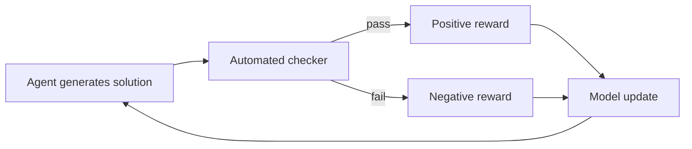

# [AEE-102] Why Technical Domains Excel: RL + Verifiable Rewards

## Context

Agentic AI systems have improved dramatically faster in programming, mathematics, and formal reasoning than in writing, advice, or general-purpose search. This is not accidental. It reflects a fundamental property of how these systems are trained and where companies invest their compute. Engineers who understand this asymmetry can make better decisions about where to trust agents and where to add guardrails.

## Design Think

Modern frontier models are trained with **reinforcement learning from verifiable rewards** (RLVR). The training signal is strongest when the reward is:

1. **Verifiable** -- there is an objective, automated way to check whether the agent succeeded (tests passed, proof is valid, answer matches ground truth)
2. **Scalable** -- verification can be applied to millions of training examples without human review

Programming satisfies both conditions exceptionally well. A unit test either passes or fails. A build either succeeds or not. This makes software engineering tasks an ideal training environment for RL: the model can attempt, observe the result, and update with a clean binary signal.

Contrast with writing: "is this essay good?" requires human judgment, which is expensive, slow, and inconsistent. The reward signal is noisy, limiting how fast the model can improve on writing tasks through RL.

The practical consequence: agents SHOULD be trusted most in domains with verifiable outcomes (code, formal logic, data transformations, structured queries). They SHOULD be treated more carefully in domains requiring subjective judgment (content quality, strategic advice, interpersonal communication).

## Deep Dive

### RLHF vs. RLVR

Reinforcement Learning from Human Feedback (RLHF) uses a reward model trained on human preference comparisons. It scales poorly to technical domains: human raters cannot reliably evaluate code correctness, proof validity, or complex data transformations. RLVR (Verifiable Rewards) bypasses the human bottleneck entirely by using automated checkers. This is why models trained on coding and math tasks have improved so dramatically compared to writing or advice tasks — the signal is cheaper, faster, and more consistent.

The RLHF comprehensive survey (Casper et al., arXiv 2307.15217) documents the fragility of learned reward models: reward hacking, distribution shift, and annotator disagreement degrade the signal. RLVR avoids all three by construction.

### The Training Loop

In RLVR:
1. The model generates a candidate solution
2. An automated checker evaluates it (test suite, proof verifier, numeric comparison, JSON schema validation)
3. The result (pass/fail or a scalar score) becomes the reward signal
4. The model updates its weights toward generating outputs that pass

This loop can run millions of times without human review. The speed advantage over RLHF is decisive for technical domains. DeepSeek-R1 and similar models have demonstrated that RLVR alone can produce state-of-the-art reasoning without any supervised fine-tuning on reasoning traces.

### Implications for Eval Design

The same property that makes RLVR powerful in training makes verifiable evaluation powerful at test time. If you can automate the correctness check, you can run high-quality agent evals at scale. This connects directly to AEE-800 range (Harness Evaluation): designing tasks with verifiable outcomes is the foundation of good agent evaluation.

### Domains on the Verifiability Spectrum

| Domain | Verifiability | RL Signal Quality |
|--------|--------------|-------------------|
| Code (unit tests) | High | Strong |
| Math (proof check) | High | Strong |
| Structured data transformation | High | Strong |
| Structured output (JSON schema) | Medium-High | Good |
| Information retrieval (exact match) | Medium | Acceptable |
| Summarization | Low | Weak |
| Creative writing | Very low | Poor |
| Strategic advice | Very low | Poor |

## Best Practices

1. **Design your agent tasks with verifiable success criteria before building the harness.** If you cannot define a programmatic check for success, your agent will be harder to evaluate, improve, and trust in production.
2. **Use the verifiability spectrum to scope automation boundaries.** High-verifiability tasks (code, data transformations) are candidates for unsupervised automation. Low-verifiability tasks require human review at the final decision point.
3. **When prompting or fine-tuning for a specific task, prefer tasks with automated ground truth.** This enables test-time evaluation that matches the training-time signal, producing more reliable calibration.

## Visual

## Related AEEs

- [AEE-101](101) -- The Agentic Capability Gap
- [AEE-1000](1000) -- Evaluation & Quality: Verifiable vs. Subjective Rewards

## References

- [Reinforcement Learning from Human Feedback - Anthropic](https://www.anthropic.com/research/learning-to-summarize)
- [DeepSeek-R1: Incentivizing Reasoning Capability via RL](https://arxiv.org/abs/2501.12948)
- [Let's Verify Step by Step - OpenAI](https://arxiv.org/abs/2305.20050)
- [A Survey of Reinforcement Learning from Human Feedback (arXiv 2312.14925)](https://arxiv.org/abs/2312.14925)
- [RLHF vs RLVR: Why AI Training Is Shifting to Verifiable Rewards (WhatHappenedInAI, 2026)](https://whathappenedinai.space/rise-of-rlvr-verifiable-rewards-ai-reasoning-2026/)

## Changelog

- 2026-04-13 -- Initial stub
- 2026-04-13 -- Upgraded: added Deep Dive (RLHF vs RLVR, training loop, eval implications, verifiability table), Best Practices, Visual (RLVR loop diagram)
