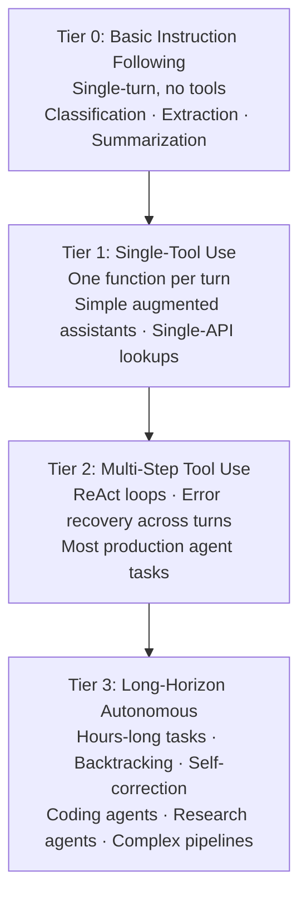

# [AEE-104] Capability Tiers

## Context

Model capability for agentic tasks is not monolithic. A single "AI model" label covers an enormous range of actual task performance, from single-turn text classification to long-horizon autonomous operation spanning hundreds of tool calls. Engineers who default to frontier models for every task waste cost and latency on work that a much cheaper model handles reliably. Engineers who use a weak model for complex agentic tasks produce systems that fail at multi-step reasoning and error recovery, producing unreliable outputs that damage trust and require human remediation. The tier framing gives engineers a practical vocabulary for right-sizing model selection to task requirements before committing to an architecture. Empirical data from the MIT AI Agent Index (2025) shows that most deployed chat agents operate at the lower tiers while browser agents and coding agents operate at the higher tiers — confirming that real production work spans the full spectrum.

## Design Think

The core claim: model capability for agentic tasks can be understood as tiers, and each tier has distinct architectural implications that determine what infrastructure the system needs.

### The Four Tiers

**Tier 0 — Basic Instruction Following.**
Single-turn text completion, classification, extraction, and transformation. No reliable tool use. No multi-step reasoning. The model receives a prompt and returns a response; the interaction is complete. Suited for: batch classification pipelines, structured data extraction, simple Q&A, summarization of bounded documents. The failure mode is a bad single-turn response, nothing worse.

**Tier 1 — Single-Tool Use.**
The model can call one function per turn reliably. Limited multi-step capability; each turn is largely independent. Suited for: simple augmented assistants, single-API lookups (fetch a record, run a search, convert a unit), narrow automation with a single integration point. The failure mode is a bad tool call on a single turn; recovery is straightforward.

**Tier 2 — Multi-Step Tool Use.**
Reliable ReAct-style loops with multiple tools, error recovery across turns, and state maintenance within a task. The model can plan a sequence of tool calls, observe intermediate results, adapt based on errors, and complete tasks that require 3–20 steps. Suited for: most production agent tasks — code generation with test execution, research synthesis with web retrieval, form-filling workflows, structured report generation. This is where agent infrastructure (harness, tool routing, state management) first becomes necessary.

**Tier 3 — Long-Horizon Autonomous Operation.**
Reliable multi-tool, multi-step execution over extended tasks with time horizons of hours and potentially hundreds of tool calls. The model handles significant ambiguity, backtracks when a strategy fails, self-corrects, and maintains coherent goal-directed behavior across long execution traces. Suited for: coding agents on complex repositories, research agents with broad web access, complex automation pipelines with branching decision trees. Anthropic's own empirical data on Claude Code sessions shows sessions growing from 25 to 45 minutes as users built trust — this is Tier 3 territory.

- Engineers MUST select model tier based on the task's actual requirements for tool use, multi-step reasoning, and error recovery — not on brand familiarity, default API keys, or cost minimization in isolation.
- Using Tier 3 capability for Tier 0 tasks wastes cost and latency without improving outcomes; using Tier 0 capability for Tier 2 tasks produces unreliable systems that fail in ways that are difficult to debug and costly to remediate.
- Engineers SHOULD test tier assumptions before committing to an architecture: run a representative sample of real tasks (not demos or synthetic inputs) against the candidate tier and the tier below.
- Engineers MUST design their harness to be tier-agnostic: swapping models between tiers SHOULD NOT require rewriting tool routing, lifecycle logic, or eval harness configuration.

The Knight First Amendment Institute's levels-of-autonomy framework notes that autonomy tier is a design decision that can be decoupled from raw capability — a Tier 2 model can be constrained to operate at a Tier 1 autonomy level by design. This gives teams the ability to introduce higher-capability models incrementally while maintaining conservative autonomy boundaries.

## Deep Dive

### Cost and Latency Implications

Tier correlates strongly with inference cost and latency. Tier 0 and Tier 1 tasks are often well-served by smaller, faster, cheaper models. The LLM routing literature documents that shifting even 50% of queries from frontier to mid-tier models produces significant cost savings on those segments. The production discipline is to profile your task distribution — what fraction of actual production requests are genuinely Tier 2 or Tier 3 — and route accordingly.

Most systems have a heterogeneous task distribution: a few complex tasks that require Tier 2-3 and a large volume of simple tasks that only require Tier 0-1. A flat architecture that sends everything to the same model overpays for the simple majority.

### Empirically Classifying Your Task's Tier Requirement

Tier classification is an empirical question, not a theoretical one. The process:

1. Select a representative sample of real tasks from your domain (minimum 20, ideally 50+). Do not use demos or cherry-picked examples.
2. Define a success criterion for each task that you can evaluate without asking the model to grade itself.
3. Run the sample against a Tier 1 model (or the tier below your assumption). If it succeeds reliably (>90% on your criterion), you do not need a higher tier.
4. If Tier 1 fails, identify the failure mode: is it tool call quality, multi-step reasoning, error recovery, or ambiguity handling? Each failure type maps to a tier requirement.

### The Tier Assumption Risk

Assuming your task is Tier 1 when it is actually Tier 2 is a common production failure mode. The symptom: the system demos well on clean inputs but fails on production edge cases that require error recovery or multi-step adaptation. The root cause is testing on synthetic or idealized inputs rather than real production samples. The mitigation is the empirical classification process above, run against real data before architectural commitment.

The converse risk — assuming Tier 3 when Tier 1 suffices — is less catastrophic but still costly: it selects an unnecessarily expensive model, increases latency, and creates a harness with more complexity than the task requires.

## Best Practices

1. **Define the minimum tier requirement for your task before selecting a model.** Work from task properties (tool use? multi-step? error recovery needed?) to tier requirement, then select a model that meets that requirement at the lowest cost and latency.
2. **Test tier assumptions with a representative sample of real tasks before committing to an architecture.** Synthetic inputs and demos are unreliable proxies for production edge cases. Run the tier below your assumption on real data; if it succeeds, use it.
3. **Design your harness to be tier-agnostic.** Swapping models between tiers should not require rewriting tool routing or lifecycle logic. This enables you to upgrade or downgrade the model tier as capability and cost curves evolve without rebuilding the system.

## Visual

## Related AEEs

- [AEE-101](101) -- The Agentic Capability Gap
- [AEE-111](111) -- Model Selection for Agentic Tasks

## References

- [Levels of Autonomy for AI Agents (Knight First Amendment Institute)](https://knightcolumbia.org/content/levels-of-autonomy-for-ai-agents-1)
- [Levels of Autonomy for AI Agents Working Paper (arXiv 2506.12469)](https://arxiv.org/abs/2506.12469)
- [Five Levels of AI Agents: From Reactive to Fully Autonomous (Kore.ai)](https://www.kore.ai/blog/five-levels-of-ai-agents)
- [The 2025 AI Agent Index (MIT)](https://aiagentindex.mit.edu/)
- [Measuring AI Agent Autonomy in Practice (Anthropic Research)](https://www.anthropic.com/research/measuring-agent-autonomy)

## Changelog

- 2026-04-13 -- Initial draft
