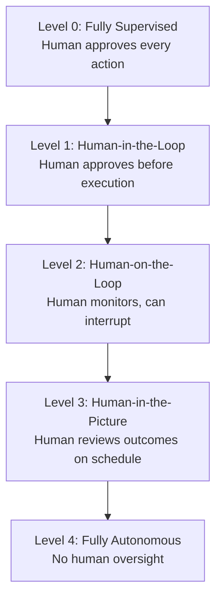

# [AEE-106] The Autonomy Spectrum

## Context

Autonomy in agentic systems is a dial, not a switch. A system can be designed to require explicit human approval for every action, or to operate for days without any human involvement — and every position in between is a legitimate engineering choice. Production systems rarely sit at the fully-autonomous end: most operate somewhere in the middle, where the right balance of human oversight, operational cost, and acceptable risk has been deliberately chosen. The autonomy level chosen determines the required infrastructure, oversight model, and error-handling design. It is an architectural decision made by engineers, not an emergent property of the model.

## Design Think

The core claim: position on the autonomy spectrum is a design choice with direct architectural consequences. Choosing a higher autonomy level is not an upgrade — it is a trade: less human oversight for faster throughput, in exchange for greater infrastructure requirements and greater consequence when the system errs.

The five levels of the autonomy spectrum:

- **Level 0 — Fully Supervised:** Every agent action requires explicit human approval before execution. The agent suggests; the human acts. Suitable for highly sensitive domains where human accountability must be preserved on every individual action.
- **Level 1 — Human-in-the-Loop:** The agent proposes a plan or action; a human reviews and approves before execution begins. The agent does the work; the human controls the gate. Suitable for high-stakes, irreversible actions where the cost of an error is high and approval latency is acceptable.
- **Level 2 — Human-on-the-Loop:** The agent executes autonomously; a human monitors in real time and retains the ability to interrupt. The agent runs; the human watches and can stop it. This is the recommended default for most production agents that have demonstrated baseline reliability.
- **Level 3 — Human-in-the-Picture:** The agent operates autonomously; a human reviews outcomes on a schedule — not in real time. Asynchronous review replaces synchronous monitoring. This level requires strong eval infrastructure and tamper-proof audit logs before deployment, because errors may compound before a human sees them.
- **Level 4 — Fully Autonomous:** The agent operates without human oversight. Appropriate only for low-stakes, reversible, well-evaluated tasks with automated success verification. Any error at this level goes undetected until the next scheduled review or an automated anomaly alert fires.

**RFC 2119:**

- Systems at Level 3 or above MUST have automated eval and monitoring infrastructure in place before deployment.
- Systems at Level 4 MUST be restricted to tasks with verifiable, automated success checks (see AEE-102).
- Engineers SHOULD default to Level 2 until the system has demonstrated sustained reliability on representative tasks.
- A system MUST NOT be deployed at a higher autonomy level than its eval coverage can support.

## Deep Dive

### Autonomy Level and Harness Design

Each level of the spectrum imposes distinct infrastructure requirements, not just oversight requirements.

**Level 1 needs approval workflows with low-latency UX.** If the approval interface is slow, poorly designed, or poorly integrated into the operator's existing workflow, the approval step becomes a bottleneck. Teams then face pressure to bypass it — and a Level 1 system that is routinely bypassed is a Level 4 system with the illusion of oversight. Approval UX is a first-class engineering concern, not a UI afterthought.

**Level 2 needs interrupt and pause mechanisms that a human can trigger mid-execution.** An agent running a 30-step workflow must be stoppable at any point, not just at natural checkpoints. The harness must support graceful mid-step interruption: stop issuing new tool calls, surface current state, and hand off cleanly. An agent that cannot be safely stopped is not safe to deploy at Level 2.

**Level 3 and 4 need eval harnesses, tamper-proof audit logs, and automated anomaly detection.** When human review is asynchronous or absent, the system's self-monitoring must compensate. Eval harnesses score agent behavior against ground truth on a continuous basis. Audit logs must be append-only and tamper-evident so that post-hoc review can reconstruct exactly what the agent did and why. Anomaly detection must fire alerts when behavior deviates from expected distributions — surfacing problems before the next scheduled human review.

### Autonomy Level and Error Recovery

Higher autonomy levels require more robust error recovery logic, not less. At Level 1, a bad action can be prevented before it occurs. At Level 4, a bad action may be compounded by subsequent steps before any human sees it. This means:

- **Retry logic** must be more conservative at higher autonomy levels. Retrying a failed API call three times before escalating is reasonable at Level 2 where a human is watching. Retrying indefinitely at Level 4 with no escalation path can cause runaway behavior.
- **Rollback capability** becomes critical at Level 3 and above. If the agent's actions are irreversible — writing records to a database, sending emails, making purchases — the absence of a rollback mechanism caps the maximum safe autonomy level for that task.
- **Escalation paths** must be designed explicitly. When the agent encounters a situation outside its training distribution at Level 3 or 4, it must have a defined path to surface the situation to a human — not silently proceed on a low-confidence interpretation.

### Earning Higher Autonomy

Higher autonomy is not granted; it is earned through demonstrated reliability at lower autonomy levels. The pathway is empirical:

1. Deploy at Level 2 with monitoring.
2. Accumulate measurement on representative tasks: success rate, error type distribution, edge case frequency.
3. When measurements demonstrate sustained reliability above a threshold, evaluate whether the Level 3 infrastructure (eval harness, audit log, anomaly detection) is operational.
4. Promote to Level 3 only when both reliability and infrastructure conditions are satisfied.
5. Level 4 is appropriate only when Level 3 operation has demonstrated that human review during the scheduled window consistently finds no issues — and only for tasks where all actions are reversible or have automated success verification.

## Best Practices

1. **Choose the lowest autonomy level that meets your latency and cost requirements.** Higher autonomy is not inherently better — it carries more risk and requires more supporting infrastructure. The objective is the right level for the task, not the highest level the system can technically sustain.
2. **Design approval and interrupt workflows as first-class UX, not afterthoughts.** A Level 1 system with a poor approval UX will be bypassed in practice; a Level 2 system with no interrupt mechanism cannot be safely stopped. The quality of the human-agent interface determines whether the claimed oversight level is real.
3. **Increase autonomy level incrementally, not all at once.** Earn Level 3 by demonstrating reliability at Level 2 on representative tasks with measurement. Earn Level 4 by demonstrating that Level 3 reviews find nothing to correct. Skipping levels skips the evidence that makes higher autonomy trustworthy.

## Visual

## Related AEEs

- [AEE-103](103) -- Agent vs. Chatbot
- [AEE-700](700) -- What Is a Harness?

## References

- [Human-in-the-Loop vs Human-on-the-Loop: Navigating the Future of AI (Serco)](https://www.serco.com/na/media-and-news/2025/human-in-the-loop-vs-human-on-the-loop-navigating-the-future-of-ai)
- [The Loop Paradox: HITL, Human-above-the-Loop, AI-in-the-Loop, Human-OUT of the Loop (Medium, 2026)](https://medium.com/@savneetsingh_1/the-loop-paradox-human-in-the-loop-human-above-the-loop-ai-in-the-loop-and-human-out-of-the-loop-03fee4d66798)
- [Human-in-the-Loop — Wikipedia](https://en.wikipedia.org/wiki/Human-in-the-loop)
- [From Human-in-the-Loop to Human-on-the-Loop: Evolving AI Agent Autonomy (ByteBridge, Medium)](https://bytebridge.medium.com/from-human-in-the-loop-to-human-on-the-loop-evolving-ai-agent-autonomy-c0ae62c3bf91)

## Changelog

- 2026-04-13 -- Initial draft
