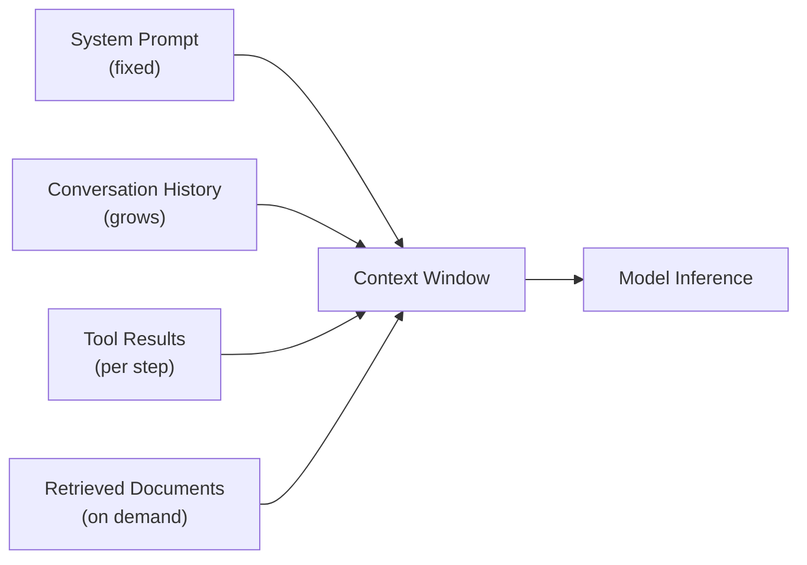

# [AEE-108] Context as a Resource

## Context

The context window is finite and consumed as the agent operates. Every tool call result, every retrieved document, every conversation turn, and every step of reasoning occupies tokens that cannot be reclaimed once used. Engineers who do not treat context as a managed resource build systems that degrade, hallucinate, or fail silently as the window fills — not because the model is broken, but because the information available to it has become an unmanaged accumulation rather than a deliberate composition. This article establishes the resource framing that informs the AEE-200 range (Model and Context Layer): context must be actively managed, not passively accumulated.

## Design Think

The core claim: context is a finite, consumable resource that MUST be actively managed — not a passive buffer that fills itself.

The context window holds everything the model can attend to at inference time: the system prompt, conversation history, tool results, retrieved documents, and the current task description. As agents execute multi-step tasks, the window fills. When it fills, three outcomes are possible:

1. **Explicit failure:** The harness throws a token limit error and the agent stops. The failure is visible and recoverable.
2. **Silent truncation:** Old content is silently dropped by the model API or the harness's context management layer. The agent continues executing, but the information it is reasoning over is no longer the information the engineer intended.
3. **Performance degradation:** The model's effective attention is diluted across a large, increasingly irrelevant context. Output quality degrades gradually without any error signal being generated.

Outcome 3 is the most dangerous. It produces no error — just subtly and progressively worse output. In a multi-step agentic task, performance degradation may not become apparent until the final step, long after the window began filling with noise. By then, the cost has already been paid: incorrect tool calls, poor intermediate reasoning, and compounded errors in downstream steps.

- Harnesses MUST track context usage and enforce budget limits before the window is exceeded.
- Agents operating over long tasks MUST use compression, summarization, or retrieval to manage context growth.
- System prompts SHOULD be as short as possible; every token in the system prompt is a token not available for task content.
- What is in context determines what the model can reason about. Engineers MUST treat context composition decisions as architectural decisions.

## Deep Dive

### Lost in the Middle

Context length alone does not equal usable context length — position matters.

Liu et al. (2023, "Lost in the Middle: How Language Models Use Long Contexts," arXiv 2307.03172, published in TACL 2024) demonstrated that LLMs exhibit a U-shaped performance curve across long contexts. Models perform best on information placed at the start or end of the context window, and worst on information buried in the middle. In multi-document question-answering experiments, GPT-3.5-Turbo accuracy dropped by more than 20 percentage points when the relevant document was placed in the middle of a 20-document context versus the beginning or end. This effect was observed across multiple model families.

The engineering implication: when composing context for a multi-step task, position is a design decision. Information the model must act on in the current step should be placed near the end of the context, not buried after 40KB of conversation history and tool results. If position cannot be controlled (e.g., because the context is assembled by a framework), then context length itself should be minimized to reduce the probability that relevant information ends up in the degraded middle region.

A related but distinct phenomenon is "context rot" (Morph, 2025): performance degradation as total input token count increases, independent of where specific information is positioned. Even with a nominally large context window, reasoning quality degrades as the window fills — not just because of position effects, but because attention is spread over more tokens with diminishing signal density. Context rot means the practical usable context is smaller than the technical limit.

### Context Budget Design

A context budget is an explicit allocation of the available token capacity across the categories of content that the agent will insert into the context window. A basic budget design for a production agent might look like:

- **System prompt:** fixed allocation, minimized aggressively — 500 to 1,500 tokens
- **Task description + current step:** the primary engineering content — 1,000 to 3,000 tokens
- **Conversation history:** rolling window of recent turns — 2,000 to 5,000 tokens
- **Tool results:** per-step allocation with truncation rules — 2,000 to 8,000 tokens
- **Retrieved documents:** on-demand injection with retrieval scope limits — 2,000 to 10,000 tokens
- **Reserve:** buffer before hard limit — 500 to 1,000 tokens

The specific allocations vary by task type, but the principle is constant: every category should have an explicit limit enforced by the harness, not an implicit default that fills to whatever space remains. Context budget design is an architectural decision that belongs in the harness, not in the model.

### Compression Strategies

When context grows beyond the budget, three strategies manage it:

1. **Rolling summarization:** Older conversation turns are summarized into a compact representation. The JetBrains Research study (2025) found empirically that keeping the 10 most recent full turns and summarizing earlier turns produces optimal performance — better than keeping all turns verbatim (context rot) and better than dropping old turns entirely (lost information).

2. **Semantic chunking with retrieval:** Instead of injecting a large document verbatim, chunk it into semantically coherent segments and retrieve only the segments relevant to the current step. This shifts the cost from context tokens (consumed per inference) to retrieval latency (paid once per lookup), which is usually the better trade-off for large knowledge bases.

3. **Lazy loading:** Inject content into context only when the current step needs it, rather than upfront. Tool documentation, reference materials, and background knowledge should be available to retrieve, not pre-loaded into every inference request. The ACON paper (arXiv 2510.00615, 2025) demonstrated that dynamic context compression — selectively retaining and compressing context based on task relevance — reduces peak token usage by 26-54% while maintaining task performance, and improves performance on small language model agents by 32-46% on standard benchmarks.

### Retrieval-Augmented Generation (RAG) as Context Management

RAG is fundamentally a context management strategy. Instead of injecting a large knowledge base into the context window at every step, RAG retrieves only the 2-5KB of content most relevant to the current query and injects that instead. The trade-off: retrieval adds latency (typically 50-200ms for a well-optimized vector search) and introduces retrieval accuracy as a failure mode (the wrong document may be retrieved). In exchange, context consumption is controlled and the knowledge base can scale to arbitrary size without affecting inference cost or context quality.

The decision to use RAG versus inline injection should be driven by the size of the knowledge relative to the context budget and the frequency with which different parts of the knowledge are accessed. For a 5-page reference document accessed on every step, inline injection is appropriate. For a 500-page corpus accessed selectively, RAG is the right architecture.

## Best Practices

1. **Instrument context usage on every agent invocation.** Log token counts at key checkpoints — before tool calls, after tool results, before final generation. Context usage data enables budget calibration, identifies steps that consume disproportionate tokens, and provides early warning when context growth is trending toward the limit.
2. **Design explicit context budgets: allocate tokens to system prompt, task description, history, and tool results as deliberate proportions, not defaults.** Treating context as a managed resource means knowing, before deployment, what each category will consume and what the harness will do when a category exceeds its allocation. Defaults produce accidental behavior; budgets produce intentional behavior.
3. **Prefer retrieval over injection for large knowledge bases.** Do not inject 100KB of documentation into the context when retrieval can deliver the relevant 2KB. Retrieval latency is a fixed, predictable cost per lookup; context consumption is a per-token cost that degrades output quality as it grows.

## Visual

## Related AEEs

- [AEE-109](109) -- How LLMs Work
- [AEE-1](../AEE Overall/1) -- Glossary (context window definition)

## References

- [Lost in the Middle: How Language Models Use Long Contexts (Liu et al., arXiv 2307.03172)](https://arxiv.org/abs/2307.03172)
- [Context Rot: Why LLMs Degrade as Context Grows (Morph)](https://www.morphllm.com/context-rot)
- [Cutting Through the Noise: Smarter Context Management for LLM-Powered Agents (JetBrains Research, 2025)](https://blog.jetbrains.com/research/2025/12/efficient-context-management/)
- [ACON: Optimizing Context Compression for Long-Horizon LLM Agents (arXiv 2510.00615)](https://arxiv.org/html/2510.00615v2)

## Changelog

- 2026-04-13 -- Initial draft
