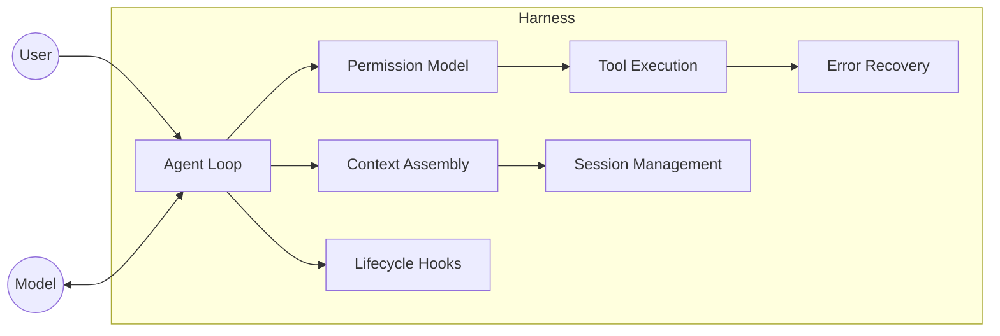

# [AEE-700] What Is a Harness?

## Context

"Harness" is one of the most important and least well-defined terms in agentic engineering. Some use it to mean any scaffolding around an LLM. Others use it specifically for evaluation infrastructure. In practice, the term covers the complete software infrastructure surrounding an agent that makes it operational -- everything except the model itself. Getting this definition right matters because it determines what you are responsible for engineering when you deploy an agent.

## Design Think

A **harness** is the complete software infrastructure surrounding an LLM that enables it to function as an autonomous agent. It encompasses every piece of code, configuration, and execution logic except the model itself -- including the agent loop, tool execution, memory systems, context management, state persistence, error recovery, and guardrails.

The harness is what makes the difference between "a model that can answer questions" and "a system that can autonomously accomplish work." Two products using the same LLM can deliver radically different user experiences depending entirely on harness quality.

Harness concerns split into two primary sub-disciplines:

1. **Execution harness** -- the runtime infrastructure for deploying agents in production. Responsible for the agent loop, tool dispatch, lifecycle hooks, session management, permission models, sandboxing, and error recovery. Examples: Claude Code's harness, Cursor.
2. **Evaluation harness** -- standardized testing infrastructure for measuring agent capabilities. Responsible for task specification, sandboxed execution, automated scoring, and reproducible benchmarks. Examples: Inspect AI, lm-evaluation-harness, SWE-bench.

Engineers MUST understand the distinction. Building a production agent without understanding execution harness design leads to systems that fail silently, leak credentials, or behave unpredictably at scale. Building an agent without understanding evaluation harness design leads to systems whose capabilities cannot be measured or compared.

## Deep Dive

### Harness Anatomy

A harness is not a single class or module. It is a set of cooperating components, each with a distinct responsibility:

| Component | Responsibility |
|---|---|
| Agent loop | Drives the Reason-Act-Observe cycle until a termination condition is met |
| Tool execution | Dispatches tool calls, validates inputs, captures results, handles errors |
| Context management | Assembles the full context document at each turn from all input sources |
| Memory | Stores and retrieves agent knowledge across turns and sessions |
| Session management | Maintains continuity of state across turns, restarts, and re-entries |
| Permission model | Enforces capability grants before any tool is dispatched |
| Error recovery | Maintains loop progress despite tool failures, overflows, and stalls |

These components interact in structured ways. Context management depends on session management (for conversation history) and memory (for retrieved knowledge). The permission model gates every call to tool execution. Error recovery wraps the agent loop's tool dispatch phase. Understanding these dependencies is required before you can reason about where a failure originates.

### Model Responsibility vs. Harness Responsibility

Engineers who misattribute responsibility to the model build fragile harnesses. The model can only reason and generate tokens -- it cannot execute tools, persist state, or enforce permissions. Every other operational responsibility belongs to the harness.

| Responsibility | Model | Harness |
|---|---|---|
| Decide what to do next | yes | |
| Execute a tool | | yes |
| Validate tool input | | yes |
| Maintain session history | | yes |
| Enforce permission grants | | yes |
| Recover from tool failures | | yes |
| Assemble context at each turn | | yes |
| Produce final text output | yes | |

When an agent misbehaves, the first diagnostic question is: which responsibility was violated, and does it belong to the model or the harness? This table answers that question unambiguously for the most common failure modes.

### Execution Harness vs. Evaluation Harness

The execution vs. evaluation distinction introduced in Design Think warrants a more precise comparison. These are not variants of the same infrastructure -- they have incompatible constraints.

> **Editorial note:** This distinction is an analytical framework for separating two types of infrastructure that are commonly conflated. It is not an official categorization from any LLM vendor.

| Dimension | Execution harness | Evaluation harness |
|---|---|---|
| Purpose | Deploy agents in production | Measure agent capability |
| Environment | Real tools, real data, real side-effects | Sandboxed tasks, controlled inputs |
| Termination | User goal achieved or error threshold | Task complete, scored against ground truth |
| Examples | Claude Code, Cursor, custom agent apps | Inspect AI, lm-evaluation-harness, SWE-bench |
| Success metric | Task completion, user satisfaction | Benchmark score, pass@k |

The critical incompatibility: an execution harness is designed to produce side-effects (write files, call APIs, send messages). An evaluation harness is designed to prevent them. Any shared codebase between the two will compromise one or the other.

## Visual

The diagram below shows the harness as a boundary surrounding the model. The model communicates with the agent loop only. Everything else -- tool dispatch, context assembly, permissions, error recovery -- is handled inside the harness before the model is ever invoked.

## Best Practices

1. **Name the harness components explicitly in your architecture.** Engineers who cannot name what the harness does cannot reason about why their agent fails. Before building, write down which component handles the agent loop, which handles permissions, and which handles error recovery. Ambiguous ownership means the component does not exist.

2. **Treat the execution harness and evaluation harness as separate codebases.** Sharing code between them produces compromises in both directions: evaluation code that leaks side-effects into production, and production code whose evaluation surface is untestable. Keep them separate from the start.

3. **Design the harness before designing the model interaction.** The model's behavior is constrained by what the harness makes possible. If you design the prompt first and the harness second, you will discover mismatches between what you told the model to do and what the harness can support.

## Related AEEs

- [AEE-701](701) -- The Agent Loop (ReAct)
- [AEE-703](703) -- Context Assembly
- [AEE-704](704) -- Session Management
- [AEE-406](../Tool Use and Execution/406) -- Sandboxing and Execution Safety
- [AEE-500](../Agent Skills/500) -- Skills vs. Tools

## References

- [Effective harnesses for long-running agents - Anthropic Engineering](https://www.anthropic.com/engineering/effective-harnesses-for-long-running-agents)
- [What is an agent harness in the context of large-language models? - Parallel AI](https://parallel.ai/articles/what-is-an-agent-harness)
- [12 Agentic Harness Patterns from Claude Code](https://generativeprogrammer.com/p/12-agentic-harness-patterns-from)

## Changelog

- 2026-04-14 -- Added Deep Dive, Visual, Best Practices, completed Related AEEs
- 2026-04-13 -- Initial stub
