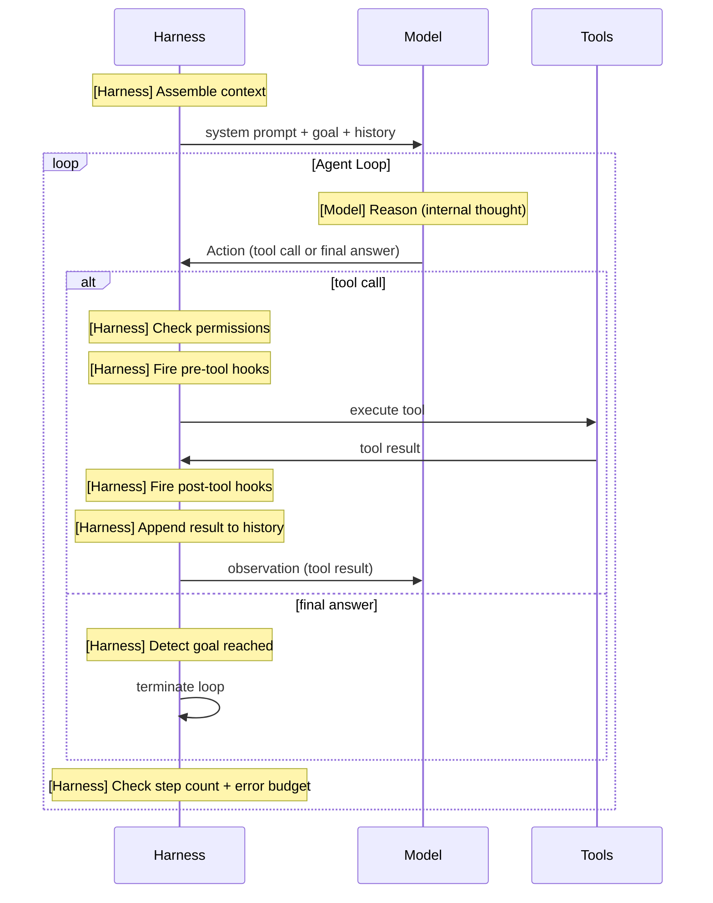

# [AEE-701] The Agent Loop (ReAct)

## Context

Every agent-based system is built around an execution loop. Understanding the structure of this loop -- and where it can fail -- is prerequisite knowledge for designing or debugging any agentic system. The ReAct pattern (Reason + Act) is the dominant paradigm for LLM-based agent loops and the foundation of most production harnesses.

## Design Think

The **ReAct loop** (Reasoning + Acting) structures agent execution as an iterative cycle:

```
while goal_not_achieved:
    observation = perceive(environment)
    thought = reason(observation, goal, history)
    action = decide(thought)
    result = execute(action)
    history.append(thought, action, result)
```

Each iteration has three phases:

1. **Reason** -- the model thinks about the current state, history, and goal. It produces a thought (internal reasoning) that is not sent as output.
2. **Act** -- the model selects a tool call or produces a final response.
3. **Observe** -- the tool result or environment feedback is appended to the context, and the loop continues.

The harness is responsible for:
- Maintaining the history across iterations
- Dispatching tool calls to the appropriate implementations
- Deciding when the loop terminates (goal achieved, max steps, error threshold)
- Handling tool failures without crashing the loop

**Loop termination** is one of the most important harness design decisions. An agent that never terminates wastes resources and can cause real-world damage. An agent that terminates too early fails to complete its task. The harness SHOULD implement both a maximum step count and a goal-detection mechanism.

The loop is not a `while` loop in isolation -- it is a contract between the harness and the model. The harness owns everything except the model's generation: it assembles context, dispatches tools, appends results, and decides when to stop. Every loop design decision (step limit, termination condition, history management) is a harness responsibility, not a model capability.

- The harness MUST implement a maximum step count. Without a hard ceiling, a loop that fails to reach a goal state will run indefinitely.
- The harness SHOULD implement goal detection in addition to the step ceiling. A loop that terminates only on max steps cannot distinguish success from failure.
- The harness MUST append tool results to history before the next model call. Dropping results breaks the observation phase and causes the model to repeat tool calls.

## Deep Dive

### Loop Termination Strategies

Three strategies, in order of preference:

| Strategy | How it works | When to use |
|---|---|---|
| Goal detection | Model signals completion (e.g., `stop_reason: end_turn` with no tool calls, or a structured `DONE` signal) | Primary termination -- the loop should end when the goal is met |
| Max steps | Hard ceiling on iterations | Safety net -- prevents infinite loops regardless of goal state |
| Error budget | N consecutive failures → escalate to human or terminate with diagnostic | Prevents infinite retry loops on unrecoverable errors |

Always implement all three. Goal detection catches the happy path. Max steps catches infinite loops. Error budget catches stuck agents.

### History Accumulation

At each turn, the harness appends to history. History grows monotonically within a loop. Four strategies for managing it:

| Strategy | Description | When to use |
|---|---|---|
| Append all | Every turn is appended verbatim | Short tasks with small context budgets |
| Sliding window | Keep the last N turns; drop oldest | Tasks with many turns where early turns are not needed |
| Summarization | Summarize old turns into a compressed form; keep recent turns verbatim | Long tasks where context is critical |
| Checkpoint and resume | Serialize state to disk, reset context, resume with checkpoint injected | Very long tasks or multi-session agents |

### Stall Detection

A loop can appear to make progress while actually repeating the same action. Stall detection catches this:

```python
def detect_stall(history, window=3):
    if len(history) < window:
        return False
    recent = history[-window:]
    actions = [turn["action"] for turn in recent]
    return len(set(str(a) for a in actions)) == 1  # all identical
```

If a stall is detected, inject a recovery prompt: "You appear to be repeating the same action. What is blocking you? Try a different approach." If no progress after M additional turns, escalate.

## Visual



## Best Practices

1. **Implement all three termination strategies.** A loop with only a max step count cannot tell whether it succeeded or failed. A loop with only goal detection will run forever if the model never signals completion. A loop with only an error budget will terminate on recoverable transient failures. You need all three.

2. **Log every turn, not just failures.** The agent loop is a black box if you only log errors. Log the full action, tool name, tool result, and turn number on every iteration. When a loop fails, you need the complete history to diagnose whether the failure was a model reasoning error, a tool failure, or a harness termination decision.

3. **Inject the goal into context at every turn, not just turn 0.** In long loops, the model's attention on the original goal fades as history grows. Repeating the goal (or a summary of it) in the system prompt or as the first user message at each turn keeps the model focused and reduces stalls.

## Related AEEs

- [AEE-700](700) -- What Is a Harness?
- [AEE-702](702) -- Lifecycle Hooks
- [AEE-703](703) -- Context Assembly
- [AEE-706](706) -- Error Recovery

## References

- [ReAct: Synergizing Reasoning and Acting in Language Models](https://arxiv.org/abs/2210.03629)
- [The Agent Loop - Oracle Developers](https://blogs.oracle.com/developers/what-is-the-ai-agent-loop-the-core-architecture-behind-autonomous-ai-systems)
- [Building Effective Agents - Anthropic](https://www.anthropic.com/research/building-effective-agents)

## Changelog

- 2026-04-14 -- Added Deep Dive, enhanced Visual with harness labels, Best Practices, completed Related AEEs
- 2026-04-13 -- Initial stub
