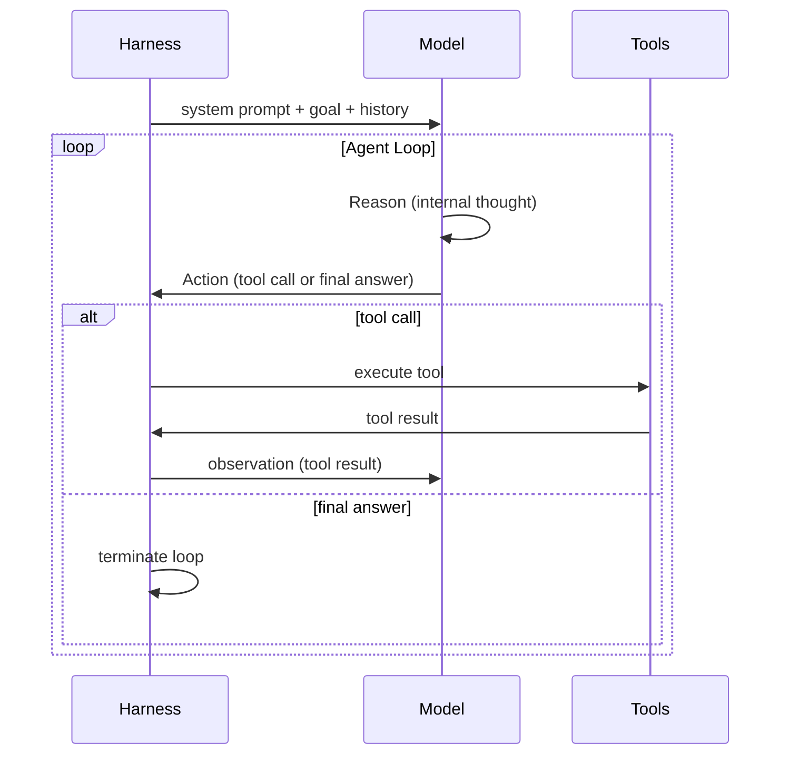

# [AEE-701] The Agent Loop (ReAct)

## Context

Every agent-based system is built around an execution loop. Understanding the structure of this loop -- and where it can fail -- is prerequisite knowledge for designing or debugging any agentic system. The ReAct pattern (Reason + Act) is the dominant paradigm for LLM-based agent loops and the foundation of most production harnesses.

## Design Think

The **ReAct loop** (Reasoning + Acting) structures agent execution as an iterative cycle:

```
while goal_not_achieved:
    observation = perceive(environment)
    thought = reason(observation, goal, history)
    action = decide(thought)
    result = execute(action)
    history.append(thought, action, result)
```

Each iteration has three phases:

1. **Reason** -- the model thinks about the current state, history, and goal. It produces a thought (internal reasoning) that is not sent as output.
2. **Act** -- the model selects a tool call or produces a final response.
3. **Observe** -- the tool result or environment feedback is appended to the context, and the loop continues.

The harness is responsible for:
- Maintaining the history across iterations
- Dispatching tool calls to the appropriate implementations
- Deciding when the loop terminates (goal achieved, max steps, error threshold)
- Handling tool failures without crashing the loop

**Loop termination** is one of the most important harness design decisions. An agent that never terminates wastes resources and can cause real-world damage. An agent that terminates too early fails to complete its task. The harness SHOULD implement both a maximum step count and a goal-detection mechanism.

## Visual



## Related AEEs

- [AEE-700](700) -- What Is a Harness?
- [AEE-702](702) -- Lifecycle Hooks

## References

- [ReAct: Synergizing Reasoning and Acting in Language Models](https://arxiv.org/abs/2210.03629)
- [The Agent Loop - Oracle Developers](https://blogs.oracle.com/developers/what-is-the-ai-agent-loop-the-core-architecture-behind-autonomous-ai-systems)
- [Building Effective Agents - Anthropic](https://www.anthropic.com/research/building-effective-agents)

## Changelog

- 2026-04-13 -- Initial stub
