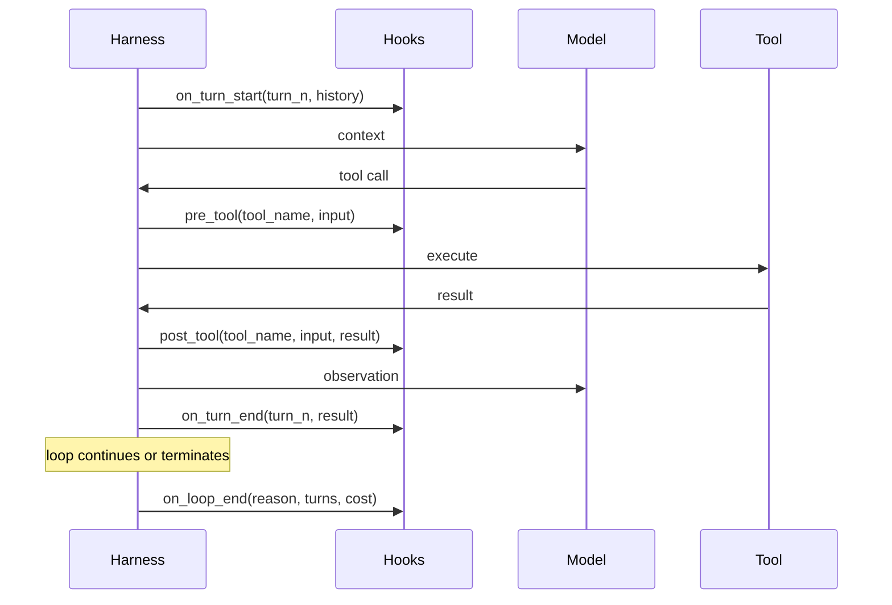

# [AEE-702] Lifecycle Hooks

## Context

A harness that executes an agent loop without observability is a black box. You cannot measure cost, validate inputs, audit decisions, or intercept failures without extension points in the loop. Lifecycle hooks are those extension points: programmatic callbacks that fire at defined moments in the agent loop, giving operators the ability to observe, modify, and control agent behavior without changing the loop's core logic.

Engineers who implement hooks from the start build systems they can operate. Engineers who skip hooks discover -- too late -- that they cannot answer basic questions about what their agent did, when, and at what cost.

## Design Think

A **lifecycle hook** is a callback registered with the harness that fires at a specific event in the agent loop. Hooks are the extension points that turn a closed loop into an observable, controllable system. Without hooks, the harness is a black box; with hooks, it becomes instrumented infrastructure.

Hooks differ from middleware. Middleware wraps every call uniformly; hooks fire at specific named events with event-specific data. A pre-tool hook receives the tool name and input; a post-tool hook receives the tool result; an on-error hook receives the error type and turn number. This specificity makes hooks composable and testable in ways that middleware is not.

- Pre-tool hooks MUST complete before tool execution begins. A pre-tool hook that fails MUST prevent tool dispatch, not be silently ignored.
- Hook failures SHOULD be surfaced as errors in the agent loop, not swallowed. A hook that fails silently makes the system appear healthy when it is not.
- Hooks MUST NOT modify the message history directly. Hooks observe and can return modified inputs, but direct history mutation creates state that the harness cannot track.

## Deep Dive

### Hook Taxonomy

Six hook types cover the full agent loop:

| Hook type | Fires when | Event data | Primary uses |
|---|---|---|---|
| `on_turn_start` | Beginning of each loop iteration | turn number, current history | Cost estimation, rate limiting, turn logging |
| `pre_tool` | Before a tool call is dispatched | tool name, tool input | Input validation, permission check, audit logging |
| `post_tool` | After a tool call returns | tool name, tool input, tool result, duration | Result transformation, audit logging, cost tracking |
| `on_error` | When a tool call or model call fails | error type, error message, turn number | Retry logic, circuit breaking, alerting |
| `on_turn_end` | End of each loop iteration | turn number, action taken, result | Cost tracking, checkpoint writing, summary logging |
| `on_loop_end` | When the loop terminates (any reason) | termination reason, total turns, total cost | Cleanup, session summary, final audit record |

### What Each Hook Enables

**`pre_tool`** is the most commonly needed hook. Use it to:
- Validate that tool inputs match expected formats before dispatch
- Check that the current session has permission to call this tool
- Log every tool call attempt to an audit trail
- Block tools that have been rate-limited

**`post_tool`** is the most commonly under-used hook. Use it to:
- Transform results before they are injected into context (e.g., truncate large API responses)
- Log the actual result, duration, and cost per tool call
- Increment error counters that feed the error budget

**`on_error`** handles the question: what do we do when something goes wrong? Use it to:
- Implement retry logic with backoff for transient failures
- Open circuit breakers for tools that are consistently failing
- Alert on-call when error budget thresholds are crossed

**`on_loop_end`** is where cleanup belongs. Use it to:
- Write a session summary to persistent storage
- Release resources (open file handles, database connections)
- Emit the final audit record with total cost and termination reason

### Hook Ordering and Composability

When multiple hooks are registered for the same event, they execute in registration order. If any hook in the chain raises an error, subsequent hooks in that chain do not execute (fail-fast semantics).

```python
# Problem: audit_log registers last — a permission failure prevents it from firing
harness.on("pre_tool", validate_inputs)      # fires first
harness.on("pre_tool", check_permissions)    # fires second
harness.on("pre_tool", audit_log)            # fires third — never fires if check_permissions raises
```

If `check_permissions` raises, `audit_log` does not fire. This means audit hooks should be registered first in any chain where security matters.

### Hooks vs. Middleware

| Property | Hooks | Middleware |
|---|---|---|
| Trigger | Named event with specific data | Every call, uniform signature |
| Data available | Event-specific (tool name, result, error) | Generic request/response |
| Composability | Register multiple per event; ordered chain | Wrap stack; order matters differently |
| Testability | Test with event-specific fixtures | Test with request/response mocks |
| Use case | Loop observability and control | HTTP-layer concerns (auth, logging) |

Use hooks for agent loop observability. Use middleware for HTTP-layer concerns.

### Claude Code Hook System

Claude Code exposes a hook system configured in `settings.json` (user-level: `~/.claude/settings.json`, project-level: `.claude/settings.json`). Hooks fire at named events. Handler types include `command` (shell command), `http` (HTTP endpoint), `prompt` (model prompt), and `agent` (subagent).

Selected events: `PreToolUse`, `PostToolUse`, `SessionStart`, `SessionEnd`, `UserPromptSubmit`, `Stop`, `PermissionRequest`. Exit code 2 from a `command` hook blocks the triggering action; any other non-zero exit is non-blocking.

Example configuration:
```json
{
  "hooks": {
    "PreToolUse": [
      {
        "matcher": "Bash",
        "hooks": [
          {
            "type": "command",
            "command": "echo \"$TOOL_INPUT\" >> ~/.claude/audit.log"
          }
        ]
      }
    ]
  }
}
```

Event names, handler types, and exit-code semantics verified against [Claude Code Hooks documentation](https://code.claude.com/docs/en/hooks).

## Visual



## Best Practices

1. **Register audit hooks before permission hooks, not after.** If you register the audit hook last, a permission failure will prevent the audit record from being written -- and you will have no evidence that the attempt occurred. Register `audit_log` before `check_permissions` in any pre-tool chain.

2. **Make hooks idempotent.** Hooks may be called more than once if the harness retries a turn. A hook that creates a database record on every invocation will create duplicate records on retry. Hooks should use upsert semantics or check for existing records before writing.

3. **Keep hooks fast.** A slow pre-tool hook delays every tool call. If a hook needs to do expensive work (remote API call, database write), make it asynchronous or fire-and-forget. Pre-tool hooks that add more than ~50ms to every call will measurably degrade loop throughput.

## Related AEEs

- [AEE-701](701) -- The Agent Loop (ReAct)
- [AEE-705](705) -- Permission Models
- [AEE-706](706) -- Error Recovery

## References

- [Claude Code Hooks documentation](https://code.claude.com/docs/en/hooks)
- [Building Effective Agents - Anthropic](https://www.anthropic.com/research/building-effective-agents)

## Changelog

- 2026-04-14 -- Initial draft
