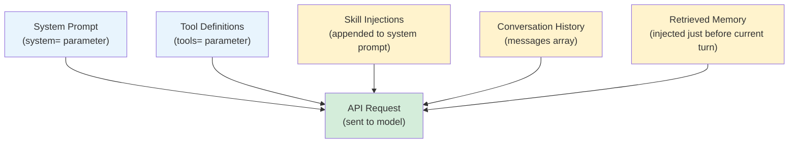

# [AEE-703] Context Assembly

## Context

The model does not receive a conversation. It receives a document. Every token in that document was placed there by a decision -- implicit or explicit -- made by the harness. Context assembly is the process of constructing that document at each turn, and it is one of the most consequential responsibilities the harness has. Get the assembly wrong and the model reasons from incomplete, incorrectly weighted, or contradictory information.

Engineers who treat context as "just the messages array" miss the full assembly pipeline. By the time the model sees the context, the harness has already composed a system prompt, injected tool definitions via the API's `tools` parameter, loaded any active skills, appended conversation history, and retrieved relevant memory. Each of these components is a harness decision.

## Design Think

The context the model receives at each turn is not a conversation -- it is a document the harness constructs. Every token in that document is a harness decision.

The assembly is ordered. The system prompt, which appears as the top-level `system` parameter in the API request, is processed first and carries the highest weight. The messages array follows. Within the messages array, content at the beginning and end receives more attention than content in the middle — a U-shaped retrieval pattern documented in studies of transformer attention. For assembly decisions, this means both the system prompt (first) and retrieved memory (injected last) benefit from primacy and recency effects. See AEE-202 for the full model.

**RFC 2119:**

- The harness MUST assemble context in a documented, reproducible order. An assembly process that varies between runs produces non-deterministic model behavior that cannot be debugged.
- Dynamic components (skill injections, retrieved memory) MUST NOT exceed their allocated token budget. A dynamic component that grows without bound will push other components out of the context window.
- The harness SHOULD expose the assembled context as an inspectable artifact during development. You cannot debug context problems you cannot see.

## Deep Dive

### The Context Assembly Components

At each turn, the harness assembles context from five sources. Two of these are separate top-level API parameters (`system=` and `tools=`). Skill injections are typically appended to the system prompt. Conversation history and retrieved memory go in the messages array.

| Component | API location | Type | Description |
|---|---|---|---|
| System prompt | `system=` parameter | Static or dynamic | Base behavioral instructions, persona, and constraints |
| Tool definitions | `tools=` parameter | Dynamic (from tool config) | JSON schemas for all tools the model may call |
| Skill injections | Appended to `system=` or injected as early messages | Dynamic (per-invocation) | Behavioral guidance loaded based on invocation conditions |
| Conversation history | Messages array | Dynamic (from session) | Prior turns in the current session; may be truncated |
| Retrieved memory | Messages array (injected just before current turn) | Dynamic (per-turn) | Knowledge retrieved from external stores relevant to current turn |

**A critical distinction:** Tool definitions do NOT go in the messages array. The Anthropic API exposes three top-level parameters relevant to context: `system` (string or array of content blocks), `messages` (array of conversation turns), and `tools` (array of tool schemas). Tool definitions belong in `tools=`, not embedded in a message turn.

**Why ordering matters:** The system prompt at `system=` is weighted most heavily. Within the messages array, earlier content receives more attention than later content. If your skill injection contains critical behavioral constraints, inject it early -- either appended to the system prompt or as an early turn in the messages array -- not appended to the end of history.

### Dynamic vs. Static Components

| Component | Changes between turns? | Changes between sessions? |
|---|---|---|
| System prompt | Sometimes (dynamic prompts) | Sometimes |
| Tool definitions | Rarely (tool config changes) | Rarely |
| Skill injections | Yes -- based on invocation conditions | Yes |
| Conversation history | Yes -- grows each turn | Yes -- new session, fresh history |
| Retrieved memory | Yes -- query is turn-specific | Yes |

Static components can be cached. Dynamic components must be recomputed at each turn. A harness that caches dynamic components will serve stale context.

### Context Budget Allocation

Given a model context window W tokens, the harness must allocate budget across components:

```python
def allocate_context_budget(window_size: int) -> dict:
    return {
        "system_prompt":        int(window_size * 0.10),  # 10% — controlled, should not grow
        "tool_definitions":     int(window_size * 0.10),  # 10% — controlled by tool count
        "skill_injections":     int(window_size * 0.10),  # 10% — controlled by active skills
        "conversation_history": int(window_size * 0.50),  # 50% — primary working space
        "retrieved_memory":     int(window_size * 0.10),  # 10% — just-in-time injection
        "model_output_reserve": int(window_size * 0.10),  # 10% — reserved for generation
    }
```

These percentages are starting points, not rules. A tool-heavy agent might allocate more to tool definitions. The key invariant: allocations must sum to 100% and dynamic components must have enforced ceilings.

### The Assembly Pipeline

The assembly pipeline is a pure function: given session state and tool config, it produces a deterministic API request. This means it can be unit-tested without running the model.

```python
def assemble_context(
    session: Session,
    tool_config: list[ToolDefinition],
    active_skills: list[Skill],
    retrieved_memory: list[MemoryChunk],
    budget: dict[str, int],
) -> dict:  # returns the API request body
    # System prompt — top-level system= parameter
    system = build_system_prompt(session.persona, session.constraints)
    # Append skill injections up to the aggregate skill budget
    skill_budget_remaining = budget["skill_injections"]
    for skill in active_skills:
        if skill_budget_remaining <= 0:
            break
        chunk = truncate(skill.body, skill_budget_remaining)
        system += "\n\n" + chunk
        skill_budget_remaining -= len(chunk.split())  # approximate token count

    # Messages array: history + retrieved memory
    messages = []
    history = truncate_history(session.history, budget["conversation_history"])
    messages.extend(history)

    if retrieved_memory:
        memory_text = format_memory(retrieved_memory)
        messages.append({
            "role": "user",
            "content": f"[Retrieved context]\n{truncate(memory_text, budget['retrieved_memory'])}"
        })

    return {
        "system": truncate(system, budget["system_prompt"] + budget["skill_injections"]),  # final ceiling
        "messages": messages,
        "tools": [t.to_api_schema() for t in tool_config],  # separate tools= parameter, NOT in messages
    }
```

## Visual



## Best Practices

1. **Make context assembly a testable, inspectable unit.** The assembly pipeline is a pure function: given session state and tool config, it produces an API request body. Write unit tests that verify the output for known inputs. Add a debug mode that logs the assembled context before every model call. You cannot debug context problems you cannot see.

2. **Enforce hard token ceilings on dynamic components.** A skill that grows over time, or a memory retrieval that returns large chunks, will push conversation history out of the context window. Set hard ceilings on dynamic components and enforce them before assembly. Truncate, do not ignore.

3. **Put the most important behavioral constraints in the system prompt, not in retrieved memory.** Retrieved memory is injected at the end of the messages array and receives the least attention. If your agent has a must-follow constraint ("never delete files without confirmation"), it belongs in the system prompt, not in a memory chunk injected at the end of history.

4. **Keep tool definitions lean.** Tool definitions in the `tools=` parameter consume tokens from your context budget. Verbose descriptions or deeply nested schemas add up quickly in tool-heavy agents. Write precise, minimal tool descriptions and prune unused tools from the active set when they are not needed for the current task.

## Related AEEs

- [AEE-701](701) -- The Agent Loop (ReAct)
- [AEE-704](704) -- Session Management
- [AEE-204](../Model and Context Layer/204) -- System Prompt Engineering

## References

- [Messages API Reference - Anthropic](https://docs.anthropic.com/en/api/messages)
- [System Prompts - Anthropic](https://docs.anthropic.com/en/docs/build-with-claude/prompt-engineering/system-prompts)
- [Building Effective Agents - Anthropic](https://www.anthropic.com/research/building-effective-agents)

## Changelog

- 2026-04-14 -- Initial draft
