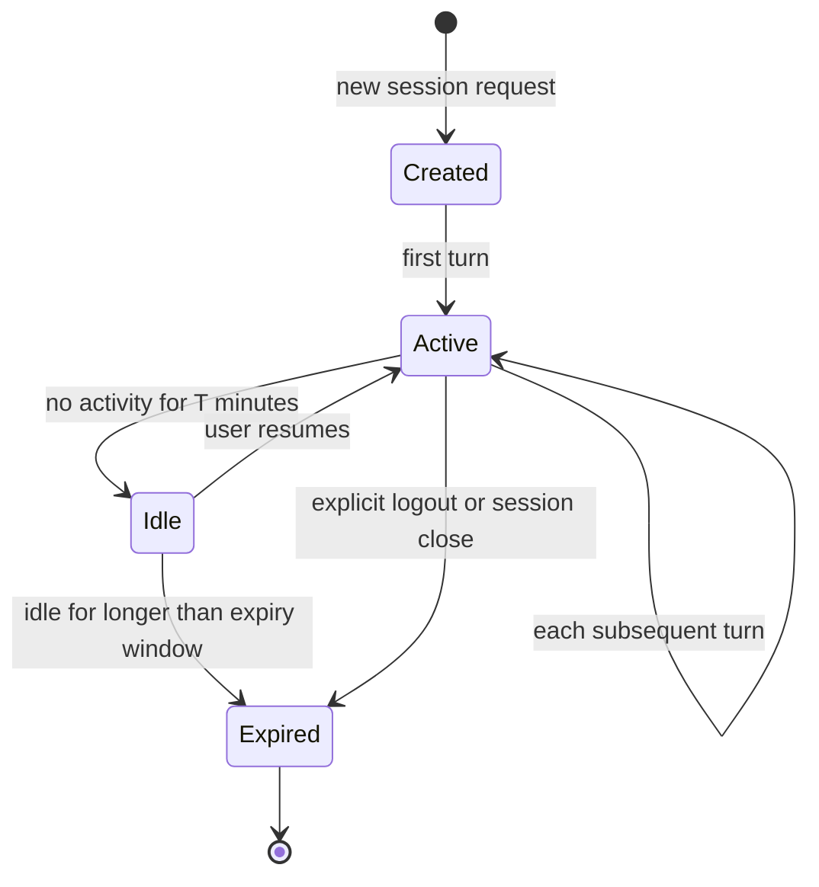

# [AEE-704] Session Management

## Context

An agent that starts from scratch on every invocation cannot work on tasks that span multiple turns. It cannot resume after a failure. It cannot remember decisions made earlier in a long task. Session management is the harness's solution to this problem: it defines what constitutes a unit of continuity, what state is preserved across turns, and how that state is stored and recovered.

Without explicit session management, every turn is a fresh start. With it, the agent can work across time, tabs, and restarts.

## Design Think

A **session** is the harness's unit of continuity. It is the container that holds everything the agent knows about a conversation-in-progress: the message history, the active tools, the active skills, the user identity, and the current permission grants. The session is what makes the agent "remember" across turns.

Sessions have a lifecycle. They are created, become active, may go idle, can be resumed, and eventually expire. The harness is responsible for managing this lifecycle -- creating sessions on demand, persisting state between turns, resuming sessions after restarts, and expiring sessions that have been idle too long.

- Sessions MUST be isolated per user. One user's session history MUST NOT be accessible to another user, directly or through the model's context.
- Session history MUST NOT be shared across user boundaries. Cross-user history leakage is a security failure, not a performance issue.
- Sessions SHOULD have a configurable expiry. A session that never expires will eventually consume unbounded storage and may serve stale context.

## Deep Dive

### Session Contents

A well-designed session record contains:

| Field | Type | Description |
|---|---|---|
| `session_id` | string (UUID) | Unique identifier; used for retrieval and audit |
| `user_id` | string | The user this session belongs to; enforces isolation |
| `created_at` | timestamp | When the session started |
| `last_active_at` | timestamp | Last turn timestamp; used for expiry calculation |
| `history` | array of messages | The full conversation history for this session |
| `active_tools` | array of tool names | Which tools are enabled in this session |
| `active_skills` | array of skill refs | Which skills are loaded for this session |
| `permissions` | permission grant object | What the agent is allowed to do in this session |
| `metadata` | key-value object | Application-specific data (task ID, project, etc.) |

### History Persistence Strategies

| Strategy | Durability | Query capability | Operational cost | When to use |
|---|---|---|---|---|
| In-memory | Lost on restart | Fast, in-process | Low | Development, short-lived sessions |
| File (JSON/JSONL) | Survives restart | Grep-based only | Low | Simple deployments, single-process agents |
| Database (SQL/NoSQL) | Durable, replicable | Full query support | Medium | Production, multi-user, multi-session |

For production deployments with multiple users, use a database. In-memory and file strategies cannot support concurrent sessions safely without additional locking.

### Session Boundaries and Resumable Sessions

A long-running task may span multiple sessions -- for example, a code refactoring task that runs across two separate work sessions. To support resumable sessions:

1. **Checkpoint state at turn end.** Write the full session state to persistent storage at the end of each turn, not just at session end.
2. **Generate a resume token.** The user gets a session ID or token they can pass to resume.
3. **Inject checkpoint context on resume.** When resuming, the harness loads the serialized session and injects a brief summary: "You were working on X. Last action: Y. Current state: Z."

### State: Session vs. External Memory

Not all state belongs in the session.

| State type | Belongs in | Reason |
|---|---|---|
| Current turn history | Session | Needed for every turn; must be in context |
| Active skills and tools | Session | Changes rarely; needed at context assembly |
| Working notes for current task | Session | Transient, task-scoped |
| Long-term user preferences | External memory | Persists across sessions; retrieved on demand |
| Domain knowledge | External memory | Too large for context; retrieved selectively |
| Project files and artifacts | File system / database | Not conversation state |

### Session Security

Session isolation is an engineering requirement the harness must implement. A production multi-user agent SHOULD enforce:

- **Cryptographically random session IDs.** Predictable session IDs (sequential integers, timestamps) allow session enumeration. Use UUID v4 minimum.
- **User ID validation on lookup.** Validate that the `user_id` in the session record matches the authenticated user before returning session data. Looking up by session_id alone allows any authenticated user to read any session.
- **Encryption at rest for sensitive sessions.** Sessions containing tool outputs, user inputs, or credentials SHOULD be encrypted at rest.
- **Secure session token handling.** Treat session tokens passed to clients as credentials -- transmitted over HTTPS only; for web deployments, use HttpOnly cookies; for other clients, use secure storage appropriate to the platform.

## Visual

## Best Practices

1. **Checkpoint after every turn, not only at session end.** A session that only persists state at the end of the conversation loses everything if the harness crashes mid-turn. Write the updated history and state to storage at the end of each turn. The cost of an extra write per turn is negligible compared to the cost of losing a 50-turn session.

2. **Expire idle sessions aggressively in development.** Short expiry windows in development (15--30 minutes) force you to implement and test the resume path early. Long expiry windows hide gaps in your session management code until they surface in production at inconvenient times.

3. **Log session lifecycle events to the audit trail.** Session created, session resumed, session expired -- these events answer the question "what was the agent doing and when?" when something goes wrong. Include user_id, session_id, and timestamp in every lifecycle event log entry.

## Related AEEs

- [AEE-700](700) -- What Is a Harness?
- [AEE-703](703) -- Context Assembly
- [AEE-705](705) -- Permission Models

## References

- [Building Effective Agents - Anthropic](https://www.anthropic.com/research/building-effective-agents)
- [Effective harnesses for long-running agents - Anthropic Engineering](https://www.anthropic.com/engineering/effective-harnesses-for-long-running-agents)

## Changelog

- 2026-04-14 -- Initial draft
