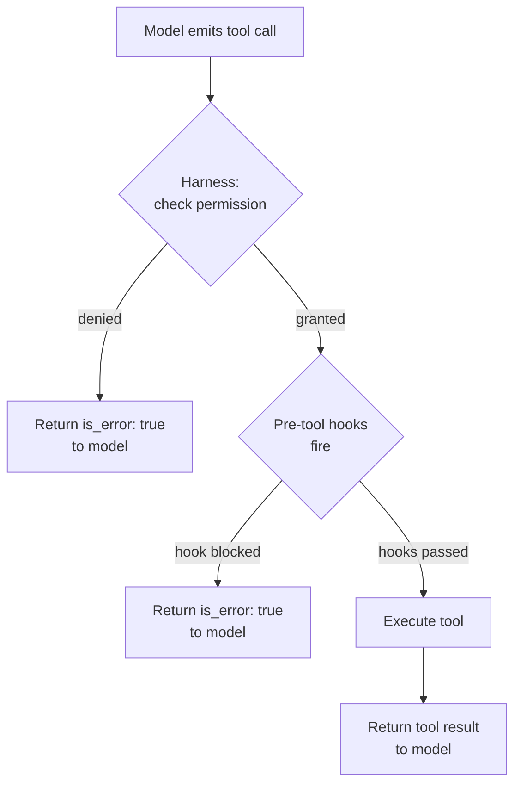

# [AEE-705] Permission Models

## Context

An agent that can call any tool it knows about is an agent that can cause unintended damage. The question is not whether the tool can do something -- it is whether the agent has been granted permission to do it in this context. Permission management is an architectural constraint that determines what the agent can do before it decides what to do.

Engineers who treat permissions as a safety feature added after building the harness end up with permission checks scattered through tool implementations. Engineers who treat permissions as an architectural constraint build them into the harness's dispatch layer, where they can be enforced consistently, audited centrally, and updated without changing tool code.

## Design Think

**Permissions** are not a safety feature -- they are an architectural constraint that determines what the agent can do before it decides what to do. The distinction between capability and permission matters: a tool that *can* delete files does not mean the agent *has permission* to delete files. Capability is what the tool implementation supports. Permission is what the harness grants.

Enforcement belongs in the harness, not in the tool. A tool that checks its own permissions before running is compensating for a harness that should have never dispatched the call.
The harness should enforce permissions before dispatch; tools should assume they are authorized.

**RFC 2119:**

- The harness MUST enforce permissions before dispatching tool calls. A tool call that reaches the tool implementation MUST have already been authorized.
- Tools MUST NOT implement their own permission checks as a substitute for harness enforcement. Tool-level permission checks compensate for harness failures and create unmaintainable permission logic scattered across the codebase.
- The permission model SHOULD follow the principle of least privilege: start with no capabilities, grant only what is needed for the task, revoke on completion.

## Deep Dive

### Capability vs. Permission

| Concept | Definition | Who controls it |
|---|---|---|
| Capability | What a tool implementation can do | Tool author |
| Permission | Whether the agent is granted use of that capability | Harness operator |

A `file_delete` tool has the *capability* to delete files. Whether the agent has *permission* to call `file_delete` in the current session depends on the permission grant configured for that session. These are independent concerns.

### Permission Grant Models

Three models, from simplest to most dynamic:

**1. Static configuration** — Permissions defined at deploy time in config files. All sessions share the same permission set.

```yaml
# harness.config.yaml
permissions:
  allow:
    - read_file
    - search_web
    - write_file
  deny:
    - execute_shell
    - delete_file
```

Simple, auditable, but inflexible. Deny takes precedence over allow.

**2. Dynamic per-request** — Permissions granted by the user at runtime. Claude Code uses this model: it prompts the user before taking actions that require elevated permissions.

```python
def request_permission(tool_name: str, user: User) -> bool:
    if tool_name in user.pre_granted:
        return True
    return prompt_user(f"Allow agent to use {tool_name}? [y/n]")
```

Flexible but adds friction to each novel tool call. Appropriate when the user must remain in control of capability grants.

**3. User-delegated** — The agent inherits the permissions of the authenticated user. Used when the agent acts on behalf of a specific user within an existing permission system (e.g., a corporate knowledge agent that respects the user's document access controls).

### Principle of Least Privilege

Applied to agents: start with no capabilities. Grant only what is needed for the current task. Revoke on completion.

Practical steps:
1. Define the minimum tool set for each task type.
2. Grant only that set when a session starts for that task type.
3. Do not expand grants mid-session unless the user explicitly consents.
4. At session end, log what was used vs. what was granted (unused grants are candidates for removal).

### Scope Narrowing at Runtime

Even within a session, the active tool set can be narrowed. If a task is in a "read-only" phase, disable write tools for that phase:

```python
session.restrict_tools(["read_file", "search_web"])  # restrict to read-only
result = run_agent_phase(session, phase="analysis")
session.restore_tools()  # restore full grant for next phase
```

### Permission Enforcement Flow

Enforcement happens in the harness before tool dispatch. The model never sees a rejection -- the harness intercepts unauthorized calls before they are dispatched.

```python
def dispatch_tool(tool_name: str, input: dict, session: Session) -> ToolResult:
    # 1. Check permission grant
    if tool_name not in session.permissions.allow:
        return ToolResult(
            is_error=True,
            content=f"Tool '{tool_name}' is not permitted in this session."
        )

    # 2. Fire pre-tool hooks (including audit logging)
    hook_result = hooks.fire("pre_tool", tool_name=tool_name, input=input, session=session)
    if hook_result.blocked:
        return ToolResult(is_error=True, content=hook_result.reason)

    # 3. Execute tool
    return tools[tool_name].execute(input)
```

### Claude Code Permission System

Claude Code implements a dynamic per-request model with a static configuration layer. Settings are defined in `settings.json` (user-level: `~/.claude/settings.json`, project-level: `.claude/settings.json`) under a `permissions` key with `allow`, `deny`, and `ask` arrays. Deny takes precedence over `ask`, which takes precedence over `allow`.

Rule syntax supports specifiers: `Bash(npm run test *)` allows only Bash commands matching that pattern; `Read(./.env)` allows reading that specific file.

```json
{
  "permissions": {
    "allow": ["Bash(npm run test *)", "Read(./.env)"],
    "deny": ["Bash(rm *)", "Write(**/.env)"],
    "ask": ["WebFetch"]
  }
}
```

**Enforcement scope note:** Permission deny rules apply to direct tool calls from the agent. They do not automatically prevent a permitted tool (such as `Bash`) from internally accessing resources that would otherwise be denied. Permission rules reduce the attack surface; they do not provide hermetic sandboxing. For hermetic isolation, see AEE-406.

## Visual



## Best Practices

1. **Define the default permission set as empty.** Start with no tools granted, then add only what the task requires. An agent that starts with "all tools allowed" will use tools in unexpected ways. An agent that starts with no tools and is granted a specific set stays within its mandate.

2. **Enforce permissions in one place.** If permission logic exists in the harness dispatch layer AND inside tool implementations, they will drift. When the harness is updated, the tool checks are forgotten. Pick the harness dispatch layer and enforce permissions only there.

3. **Log every permission denial.** Permission denials are security events. Log the tool name, the session ID, the user ID, and the timestamp of every denial. A series of denials may indicate a prompt injection attack or a misconfigured session.

## Related AEEs

- [AEE-700](700) -- What Is a Harness?
- [AEE-702](702) -- Lifecycle Hooks
- [AEE-406](../Tool Use and Execution/406) -- Sandboxing and Execution Safety

## References

- [Claude Code Permissions documentation](https://code.claude.com/docs/en/permissions)
- [Building Effective Agents - Anthropic](https://www.anthropic.com/research/building-effective-agents)
- [Principle of Least Privilege - NIST](https://csrc.nist.gov/glossary/term/least_privilege)

## Changelog

- 2026-04-14 -- Initial draft
