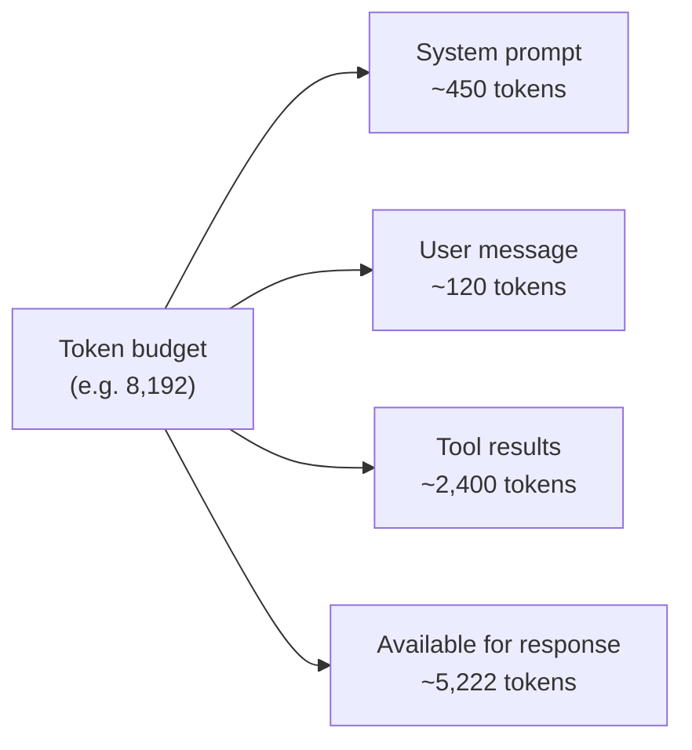

# [AEE-201] Tokenization in Practice

## Context

Engineers interact with LLMs through token counts — pricing is per token, rate limits are expressed in tokens, and context budgets are measured in tokens. But tokens are not words, and they are not characters. The gap between assuming "words ≈ tokens" and actually counting tokens is the difference between a context that fits and one that silently overflows. A system prompt that looks like 300 words may consume 400 tokens; a batch of user inputs that appears under budget may exceed it at runtime. Practitioners who rely on word-count estimates instead of tokenizer-accurate counts will encounter billing surprises, rate-limit errors, and hard-to-diagnose context truncations. Accurate token counting is not an optimization — it is a correctness requirement.

## Design Think

**Token boundaries are determined by the tokenizer, not by human language units.** Byte-Pair Encoding (BPE) encodes text as subword units derived from statistical frequency in the training corpus. Common English words that appear frequently as unbroken strings — "the," "is," "agent" — are typically single tokens. Compound words, technical terms, proper names, and uncommon vocabulary may split into two, three, or four subword tokens. The word "tokenization" itself may split differently across tokenizer families.

**The specific tokenizer vocabulary matters.** Different model families use different tokenizer encodings, and token counts for the same input text differ across them. OpenAI's `cl100k_base` encoding (used by GPT-3.5-turbo and GPT-4) has a vocabulary of 100,000 tokens. The `o200k_base` encoding (used by GPT-4o, o1, o3, o4-mini, and the GPT-5 series) has a 200,000-token vocabulary and provides more efficient tokenization for non-English languages and code. Anthropic's Claude models use their own SentencePiece-based tokenizer with its own vocabulary and boundaries. You MUST NOT assume that token counts are portable across model families.

- Agents that manage context budgets **MUST** use accurate token counting via the tokenizer API or `tiktoken`, not word-count or character-count estimates.
- Cost projections for token-heavy workloads **MUST** use tokenizer-accurate counts. Word counts are not a proxy for token counts.
- Systems that enforce per-request rate limits measured in tokens **MUST** count tokens before submission, not estimate them from text length.
- Cross-model cost comparisons **SHOULD** account for tokenizer differences; the same text may produce different token counts across providers.

Adopting accurate token counting early prevents a class of production incidents that are difficult to diagnose after the fact: silent context truncation, unexpected billing overages, and intermittent rate-limit failures that only appear at scale.

## Deep Dive

### BPE in Practice

Byte-Pair Encoding is the dominant tokenization algorithm for large language models. It starts from individual bytes or characters and iteratively merges the most frequent adjacent pairs to form a vocabulary of subword units. The result is a vocabulary where common strings are single tokens and rare strings are decomposed into smaller pieces.

The tiktoken README confirms that on average each token corresponds to approximately 4 bytes for English text. This means a typical English word of 4–6 characters is often one token, while a longer or less common word may become two or three. The key practical implication: a naive approximation of "1 word = 1 token" will systematically undercount, and the error grows with technical jargon, proper nouns, and non-English content.

### Tokenizer Families

| Encoding | Vocabulary size | Used by |
|---|---|---|
| `cl100k_base` | ~100,000 | GPT-3.5-turbo, GPT-4 |
| `o200k_base` | ~200,000 | GPT-4o, o1, o3, o4-mini, GPT-5 series |
| Anthropic tokenizer | (internal) | Claude model family |

The larger `o200k_base` vocabulary allows more of the character space — including multilingual scripts and common code patterns — to be represented as single tokens, reducing token counts for those inputs compared to `cl100k_base`. This means the same prompt submitted to GPT-4 and GPT-4o may produce different token counts and different costs.

You cannot use tiktoken to accurately count tokens for Anthropic models. Use the Anthropic token counting endpoint instead (described below).

### Non-English and Code

CJK characters (Chinese, Japanese, Korean) and source code typically require more tokens per unit of meaning than English prose. A Chinese sentence that English would express in 10 tokens may require significantly more, because CJK scripts are not as well-covered by BPE subword units trained primarily on English data. The `o200k_base` vocabulary improves this, but the gap does not disappear.

Source code presents its own tokenization patterns. Indentation whitespace (significant in Python), operator symbols, identifiers with underscores, and numeric literals all tokenize differently from natural language prose. Do not apply prose-based token estimates to code-heavy prompts.

### Edge Cases Practitioners Encounter

- **Multi-digit numbers**: BPE vocabularies do not represent all possible numeric strings. Large numbers may tokenize digit-by-digit or in small groups, inflating token counts relative to what the character length suggests.
- **URLs**: URLs split at punctuation characters — slashes, dots, hyphens, query-parameter separators. A URL like `https://api.example.com/v1/messages?model=claude-sonnet-4-6` may tokenize into 15–20 or more tokens despite being a single meaningful unit.
- **Whitespace in code**: Indentation and blank lines contribute tokens. A Python function with 4-space indentation is not the same token count as the same function with 2-space indentation.

These edge cases become production incidents when they appear in tool results, user-supplied inputs, or retrieved document chunks that were not part of prompt development testing.

### Using tiktoken for Accurate Counting

For OpenAI models, tiktoken provides accurate token counts without a network round-trip:

```python
import tiktoken

def count_tokens(text: str, model: str = "gpt-4o") -> int:
    enc = tiktoken.encoding_for_model(model)
    return len(enc.encode(text))
```

`tiktoken.encoding_for_model` resolves the correct encoding for the model name (e.g., `gpt-4o` → `o200k_base`). Use `tiktoken.get_encoding("cl100k_base")` if you want to specify the encoding directly.

For Anthropic models, use the `/v1/messages/count_tokens` endpoint. It accepts the same structured input as the Messages API (system prompt, messages array, tools, images, PDFs) and returns `{ "input_tokens": N }`. This endpoint is eligible for Zero Data Retention (ZDR) where applicable.

## Best Practices

1. **Always use the tokenizer for any system that manages context budgets, charges users per token, or enforces rate limits.** Integrate token counting at the boundary where inputs are assembled — before the API call, not after. For OpenAI models use tiktoken; for Anthropic models use the `/v1/messages/count_tokens` endpoint. Word counts are not a proxy.

2. **Test prompts with edge-case inputs before deploying.** Include multi-digit numbers, URLs, non-English text, and code snippets in your test suite, and measure actual token counts. The surprises you find in testing are the incidents you avoid in production.

3. **Factor tokenizer differences into cross-model cost and budget comparisons.** The same text may produce different token counts across model families. A migration from GPT-4 to GPT-4o changes the tokenizer from `cl100k_base` to `o200k_base`; run your actual prompts through both encodings before updating cost projections.

## Visual



## Related AEEs

- [AEE-108](../Foundations and Mental Models/108) — Context as a Resource (token budget management)
- [AEE-109](../Foundations and Mental Models/109) — How LLMs Work (introduced BPE)
- [AEE-202](202) — Context Window Architecture

## References

- tiktoken (OpenAI BPE tokenizer library): <https://github.com/openai/tiktoken>
- Anthropic token counting API: <https://docs.anthropic.com/en/docs/build-with-claude/token-counting>
- OpenAI tokenizer playground (browser only): <https://platform.openai.com/tokenizer>

## Changelog

- 2026-04-14 -- Initial draft
