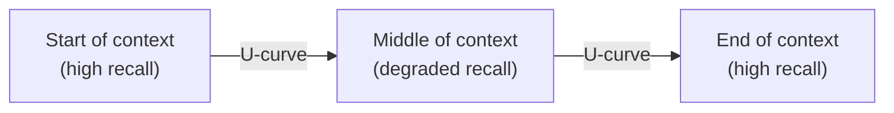

# [AEE-202] Context Window Architecture

## Context

AEE-108 established that context is a finite resource to be managed. This article explains why it is also a non-uniform resource: position within the context window affects how reliably the model attends to information. A 128K-token window does not provide 128K tokens of uniform attention. The transformer's attention mechanism is position-aware, and research shows that models retrieve information from the beginning and end of a context more reliably than from the middle. Understanding this technical substrate — how the transformer uses position — is a prerequisite to making good architectural decisions about what to put where.

## Design Think

**The transformer's attention mechanism is position-aware.** Where information appears in the context affects retrieval reliability. This is not a tunable parameter or a provider-specific quirk — it is a structural property of how transformers are trained and how attention gradients flow.

**The "Lost in the Middle" phenomenon.** Liu et al. (arXiv 2307.03172, published in TACL 2023) studied how language models use long contexts across multi-document question answering and key-value retrieval tasks. Their finding: performance is highest when relevant information occurs at the beginning or end of the input context, and models exhibit significant accuracy degradation when they must access relevant information buried in the middle of long contexts — even for models explicitly trained for long-context use. The result is a characteristic U-shaped performance curve across context position.

**Context rot.** Beyond position effects, reasoning quality degrades as total token count grows, independent of where information sits. As context length increases, the attention weight any single token receives dilutes proportionally — a token in a 100K-token context receives roughly one-tenth the attention it would in a 10K-token context. This attention dilution degrades signal-to-noise ratio and produces progressively noisier outputs as conversations accumulate. Morph (morphllm.com/context-rot) describes this as "context rot": the model is not broken, but the useful signal is increasingly buried under irrelevant tokens.

- Engineers **MUST NOT** assume uniform attention across a long context window. A 128K-token window is not 128K tokens of equivalent retrieval capacity.
- Position-critical information (current task, key constraints, most recent tool result) **SHOULD** be placed near the end of the context, not buried after a long conversation history.
- Engineers **MUST NOT** equate "fits in context window" with "will be reliably attended to." Presence in the window is a necessary condition, not a sufficient one.

## Deep Dive

### Positional Encoding

Transformers have no built-in notion of order. A sequence of tokens fed as a set would be treated symmetrically. Position signals are injected explicitly through positional encodings added to the token embeddings before attention is computed.

The original transformer (Vaswani et al., "Attention Is All You Need," 2017) used fixed sinusoidal absolute positional encodings: each position in the sequence is assigned a deterministic vector derived from sine and cosine functions of different frequencies. This works well within the training sequence length but does not extrapolate reliably to longer sequences, because the model has never seen the absolute position values that lie beyond its training maximum.

### RoPE (Rotary Position Embedding)

Su et al. (2021) introduced Rotary Position Embedding in "RoFormer: Enhanced Transformer with Rotary Position Embedding" (arXiv 2104.09864). Rather than adding a fixed position vector to each token embedding, RoPE encodes position as a rotation applied to the query and key vectors before attention is computed. The key insight is that relative position — the distance between two tokens — is preserved in the inner product of their rotated representations, giving the model a natural way to reason about proximity without relying on absolute position integers.

RoPE has three notable properties that make it well-suited for long-context models: it handles variable sequence lengths gracefully, inter-token dependency decays naturally with increasing relative distance (distant tokens attend to each other less strongly), and it can be combined with linear attention formulations. These properties have made RoPE the dominant positional encoding scheme in modern open-weight models, including LLaMA, Mistral, and Gemma.

### Sliding Window Attention (Longformer)

Standard self-attention is quadratic in sequence length: every token attends to every other token, so doubling the context quadruples the computation. Beltagy, Peters, and Cohan (2020) addressed this with the Longformer architecture (arXiv 2004.05150), which replaces global attention with a combination of local windowed attention and task-motivated global attention.

In sliding window attention, each token attends only to a fixed-size local neighborhood of adjacent tokens. This reduces attention complexity from O(n²) to O(n), making arbitrarily long sequences tractable. A small set of designated global tokens — typically task-specific tokens like `[CLS]` — still attend to all positions, allowing the model to aggregate information across the full document. The trade-off is that information from tokens outside a token's window can only reach it by propagating through multiple successive layers, rather than in a single attention operation. The Longformer achieved state-of-the-art results on several long-document benchmarks at the time of its publication.

### Why Middle Positions Suffer: A Mechanistic Account

In standard global attention, the U-shaped retrieval curve has a training-time explanation. During autoregressive training, every subsequent token attends back to all previous tokens, so early tokens in a sequence receive gradient signal from far more prediction steps than later tokens. This gives the model stronger training pressure to attend to positions near the start of the context (where tokens have been "seen" as context by many predictions) and near the end (where recency effects create strong direct retrieval signals for the next token). Tokens in the middle receive neither benefit: they are not attended to by the large majority of the sequence, and they are not recent enough to benefit from recency bias.

The result is that the model reliably learns to retrieve information at the endpoints of a context but has noisier retrieval for content that falls between them. This is not a failure of scale — Liu et al. found the phenomenon persists even in explicitly long-context models.

### Multi-Turn Conversation Structure

In a typical API call, the token sequence is ordered: system prompt → earlier turns → most recent user message. As a conversation grows, the earliest turns are pushed further toward the start and middle of the total token sequence. The most recent user message naturally sits at the end — the position of highest reliability.

The practical implication is that earlier turns in a long conversation drift into the middle-context degradation zone. Rolling summarization (AEE-108) is therefore not just token budget management — it is also position management. Compressing old turns into a summary and discarding the verbatim exchanges moves older information out of the growing "lost in the middle" zone and resets the recency gradient. An agent that relies on verbatim conversation history for critical facts will find those facts become less reliably attended to as the conversation grows, even if they fit within the context window.

## Best Practices

1. **Place the current task description and the most critical constraint near the end of the context** — as the final user message or immediately before it — not buried deep in conversation history. The end of the context is the highest-reliability position for retrieval.

2. **Do not assume a large context window eliminates retrieval problems.** A 128K window with relevant content at position 60K will underperform a 32K window with the same content at position 28K. Fits-in-context is not a proxy for will-be-attended-to.

3. **Treat context length as a quality risk, not just a cost risk.** Monitor output quality as conversations grow — degradation is gradual and produces no error signal. An agent operating in a long conversation may silently lose track of early constraints without any failure visible in the API response.

## Visual

## Related AEEs

- [AEE-108](../Foundations and Mental Models/108) — Context as a Resource
- [AEE-109](../Foundations and Mental Models/109) — How LLMs Work
- [AEE-201](201) — Tokenization in Practice

## References

- RoFormer: Enhanced Transformer with Rotary Position Embedding (Su et al., 2021): <https://arxiv.org/abs/2104.09864>
- Lost in the Middle: How Language Models Use Long Contexts (Liu et al., 2023): <https://arxiv.org/abs/2307.03172>
- Longformer: The Long-Document Transformer (Beltagy et al., 2020): <https://arxiv.org/abs/2004.05150>
- Context Rot: Why LLMs Degrade as Context Grows (Morph, 2025): <https://www.morphllm.com/context-rot>

## Changelog

- 2026-04-14 -- Initial draft
