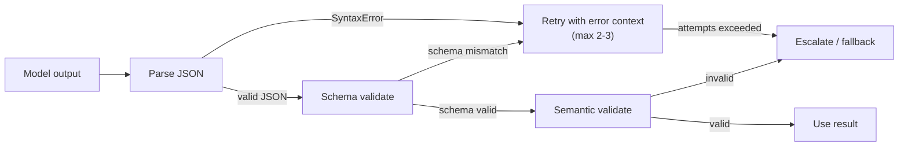

# [AEE-203] Structured Output Design

## Context

Agentic systems routinely need structured data from the model: extracted fields, decisions with metadata, action parameters, classification results. JSON mode and tool call schemas help, but they do not guarantee schema compliance. Engineers who assume the model conforms to the schema without validating build systems that fail silently when malformed data reaches downstream consumers.

## Design Think

**JSON mode guarantees valid JSON syntax — not schema conformance.** When you enable JSON mode, the model is constrained to produce output that is parseable as JSON. That is all. The model may produce valid JSON with wrong keys, wrong types, missing required fields, or extra fields your schema does not allow. A downstream consumer that attempts to read `result["action"]` from output that contains `result["actions"]` will receive a `KeyError`, not an informative error about a schema mismatch.

**Tool call schemas provide stronger constraints — but not guarantees.** Function calling (tool use) gives the model an explicit JSON Schema definition and training-time pressure to conform to it. This is more reliable than raw JSON mode across a wide range of inputs. However, it is not a formal proof of correctness: under distribution shift, adversarial inputs, or complex nested schemas, the model may still produce output that fails schema validation.

**Constrained decoding is the strongest form.** Grammar-based sampling constrains which tokens are valid continuations at each decoding step, enforcing the grammar at the token level rather than relying on the model's learned behavior. This is not universally available from hosted providers, but libraries such as Outlines (github.com/dottxt-ai/outlines) implement it for self-hosted models.

- Any structured output that will be programmatically consumed **MUST** be validated against the target schema before use.
- Applications **MUST NOT** assume model output conforms to the schema without validation.
- Systems that pass structured output to downstream processes **MUST** have a defined retry and escalation path for validation failures.

## Deep Dive

### Three Tiers of Structured Output

**Tier 1 — JSON mode (syntax only).** The model is constrained to produce syntactically valid JSON. The output will parse without a `SyntaxError`, but its structure is not guaranteed to match any specific schema. This is the weakest form of structured output. Use it only when you need valid JSON and the exact shape is flexible, or when your provider does not support schema-guided output.

**Tier 2 — Tool call / function call schemas (schema-guided).** The model receives an explicit JSON Schema as part of the request (the tool definition), and both the provider and model are trained to produce output that conforms to it. OpenAI function calling and Anthropic tool use both work this way. This is the recommended baseline for most production use cases. Schema conformance is significantly better than JSON mode, but validation is still required because no provider guarantees perfect schema adherence across all inputs.

**Tier 3 — Constrained decoding (token-level grammar constraint).** At each decoding step, the set of valid next tokens is restricted to only those that can form a valid continuation of the grammar being enforced. The model cannot produce an invalid output because the invalid tokens are masked out before sampling. This eliminates schema violations entirely, at the cost of requiring a compatible inference runtime. The Outlines library ([github.com/dottxt-ai/outlines](https://github.com/dottxt-ai/outlines)) provides grammar-based sampling for self-hosted models.

### OpenAI Structured Outputs with Strict Mode

OpenAI introduced a dedicated structured outputs feature that can be used via the `response_format` parameter:

```json
{
  "response_format": {
    "type": "json_schema",
    "json_schema": {
      "name": "ExtractedFields",
      "schema": { ... },
      "strict": true
    }
  }
}
```

When `strict: true` is set, OpenAI constrains the model to only produce output that matches the provided schema. This sits between Tier 2 and Tier 3 in reliability — the enforcement is stronger than ordinary function calling, though it applies to a subset of JSON Schema features. See the OpenAI structured outputs documentation for the full feature set and schema constraints.

### Schema Design for Reliability

The following are design heuristics, not empirical claims. A schema that is easy for a human to read tends to be easier for a model to conform to.

**Prefer flat structures over deeply nested ones.** A schema with three levels of nesting requires the model to track context across many tokens of generation. Errors compound: an incorrect field at level 2 will cause level 3 to be wrong too. When possible, flatten hierarchies into sibling fields at the top level.

**Use enums over free-text strings for bounded values.** If a field can only take one of five values, express that as an enum rather than a `string`. Free-text strings give the model latitude to invent variations (`"completed"` vs. `"complete"` vs. `"done"`). Enums constrain the output space and make downstream parsing predictable.

**Make nullability explicit.** Avoid relying on a field's absence to signal "not applicable." Instead, declare the field as nullable (`type: ["string", "null"]`) and require the model to return `null` explicitly. Implicit absence creates ambiguity: is the field missing because it is not applicable, or because the model forgot to include it?

**Avoid `additionalProperties: true`.** Permitting arbitrary extra fields invites the model to hallucinate keys that are not part of your schema. Unless you have a specific reason to allow them, set `additionalProperties: false` so that extra fields are flagged as schema violations.

### Validation Pipeline

Structured output validation should be a multi-stage pipeline, not a single check.

**Stage 1 — Parse JSON.** Attempt to parse the model's output string as JSON. A `SyntaxError` at this stage means the output is not valid JSON at all. This should be rare if JSON mode or tool call schemas are in use, but not impossible.

**Stage 2 — Schema validation.** Validate the parsed JSON against the target schema using a library such as Pydantic (Python), Zod (TypeScript), or a JSON Schema validator. This catches wrong keys, wrong types, missing required fields, and disallowed additional properties. Schema validation errors should be captured with enough detail to construct a useful error message for the retry prompt.

**Stage 3 — Semantic validation.** Apply business logic checks that the schema cannot express. Examples: a date field that contains a valid ISO 8601 string but represents a date in the past when a future date is required; a numeric field that is within the JSON Schema `minimum`/`maximum` range but violates a domain invariant. Semantic validation failures are harder to recover from via retry — they often indicate a prompt or schema design issue rather than a model generation error.

### Retry Strategy

When validation fails at Stage 1 or Stage 2, include the validation error message in the retry prompt alongside the original failed output. This gives the model information to correct the specific mistake rather than generating a new response from scratch.

A typical retry prompt:

```
Your previous response failed schema validation with the following error:
<error>
{validation_error_message}
</error>

Your previous output was:
<output>
{failed_output}
</output>

Please correct the output to conform to the required schema.
```

Limit retries to 2–3 attempts. Beyond that threshold, the failure is almost certainly a systemic issue: the schema is too complex for the model to conform to, the prompt is underspecified, or the input data does not support producing the required output. Escalate rather than retry indefinitely.

Log all validation failures. A high rate of Stage 1 failures suggests the JSON mode or tool call setup is misconfigured. A high rate of Stage 2 failures on specific fields suggests a schema design problem — those fields may be too ambiguous for the model to produce reliably. Failures are diagnostic signals.

## Best Practices

1. **Use tool call schemas instead of raw JSON mode wherever your provider supports them.** Tool call schemas give the model an explicit structure to conform to and produce more consistent output. Raw JSON mode produces valid syntax but no schema guarantee.

2. **Design schemas for reliability: flat over nested, enums over strings, explicit nullability.** A schema that is simple for a human to read is also simpler for a model to conform to. Remove `additionalProperties: true` unless you have a specific reason to allow extra fields.

3. **Always validate before consuming: parse, schema validate, semantic validate. Log every failure.** Validation failures are diagnostic signals, not just errors to swallow. A high failure rate on a specific field tells you that field's schema or prompt description needs revision.

## Visual



## Related AEEs

- [AEE-110](../Foundations and Mental Models/110) — LLM Limitations and Failure Modes (hallucination and reasoning limits)
- [AEE-204](204) — System Prompt Engineering (prompts can constrain output format)

## References

- OpenAI Structured Outputs: <https://platform.openai.com/docs/guides/structured-outputs>
- Anthropic Tool Use: <https://docs.anthropic.com/en/docs/build-with-claude/tool-use>
- Outlines — Structured Text Generation: <https://github.com/dottxt-ai/outlines>

## Changelog

- 2026-04-14 -- Initial draft
