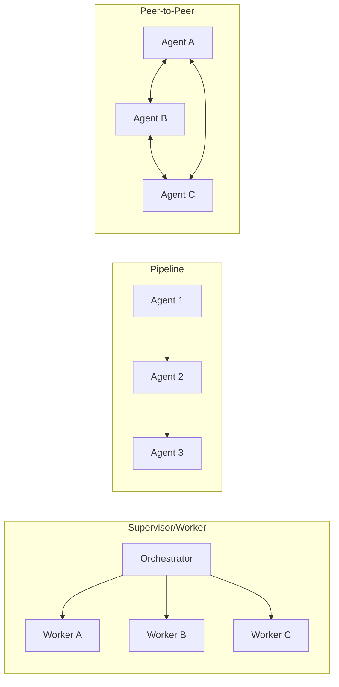

# [AEE-600] When to Coordinate Agents

## Context

Most agentic tasks that can be solved by a single agent should be solved by a single agent. Multi-agent architecture is not an upgrade — it is a different system with different failure modes. A single agent has one context window, one agent loop, one error surface. A multi-agent system multiplies each of those surfaces by the number of agents you deploy, then adds coordination logic on top.

Engineers reach for multi-agent systems when they hit a ceiling that single agents cannot break. This article defines that ceiling and introduces the engineering discipline for breaking it safely. The 600 series (AEE-601 through AEE-607) covers everything that follows once you have made the decision that multi-agent architecture is warranted.

## Design Think

A single agent hits a ceiling defined by its context window, its assigned tools, and its available time. Multi-agent systems exist to break that ceiling — but they introduce coordination costs that single-agent systems avoid. Engineers who reach for multi-agent architecture without understanding those costs build systems that are slower, more fragile, and harder to debug than a well-engineered single agent.

The rules for this category:

- Engineers **MUST NOT** use multi-agent architecture where a single agent can complete the task within its context window and time budget.
- Multi-agent systems **SHOULD** only be introduced when a specific ceiling (context, tools, time, or scale) is the demonstrated bottleneck.

## Deep Dive

### The Single-Agent Ceiling

A single agent runs out of capacity in three distinct dimensions:

**Context.** The task requires more tokens than fit in one context window. A codebase with hundreds of files, a document corpus spanning thousands of pages, or a research task requiring simultaneous awareness of many independent sources — these cannot fit in a single context window regardless of how carefully you manage the prompt. This is the most common legitimate reason to move to multi-agent architecture.

**Tools.** The task requires specialized capabilities that conflict within a single agent's tool set. An agent doing both code execution and web browsing faces a larger, more complex tool schema than either specialized agent alone. Worse, certain tool combinations create security or correctness risks when bundled — an agent with write access to production systems should not simultaneously have unrestricted network access. Separating these concerns into purpose-built agents with restricted tool sets is safer and more reliable.

**Time.** The task has a deadline that requires parallel execution to meet. Some tasks are structurally sequential; others decompose into independent subtasks that can proceed concurrently. When a single agent working sequentially cannot meet the time budget, parallelism across multiple agents is the appropriate tool.

### The Coordination Cost

Every agent-to-agent interaction is a potential failure point. This is not a theoretical concern — it is the dominant reason multi-agent systems fail in practice.

- **Context reconstruction.** Each handoff requires the orchestrator to construct a fresh context for the worker. The worker does not inherit the orchestrator's conversation history. Any information the worker needs must be explicitly included in its spawn prompt.
- **Result validation.** Every worker result must be validated before being used. A worker operating in a different context may produce output that is technically correct but inconsistent with assumptions the orchestrator made about the broader task.
- **State management.** Shared state requires explicit locking or sequencing. Two workers writing to the same file, database record, or shared data structure will produce conflicts that a single agent's sequential execution would never encounter.
- **Failure surface multiplication.** A 5-agent system has 4 handoff surfaces; each can fail independently. A single handoff failure that the orchestrator does not detect and recover from can silently corrupt the final result.

These costs are real and non-trivial. The decision to introduce multi-agent architecture must be driven by a demonstrated ceiling, not by the appeal of architectural complexity.

### Multi-Agent Design Checklist

Before building a multi-agent system, answer each of these questions. An unanswered question is an unresolved failure mode.

1. **What specific ceiling is being broken?** Name it: context, tools, time, or scale. If the answer is vague, the architecture is premature.
2. **What topology fits the coordination pattern?** A supervisor dispatching workers, a sequential pipeline, or a peer-to-peer mesh each makes sense for different task structures. (AEE-601)
3. **How will agents communicate and what are their output contracts?** Each agent boundary requires a defined input format and output schema. Undefined contracts produce undefined behavior. (AEE-602)
4. **How will the orchestrator decompose and delegate work?** Static decomposition (pre-defined subtasks) and dynamic decomposition (orchestrator determines subtasks at runtime) have different complexity and reliability profiles. (AEE-603)
5. **What tasks can run in parallel and how will results be merged?** Identify the independent subtasks, the merge logic, and the synchronization points. (AEE-604)
6. **What is the failure recovery plan?** For each handoff surface, define what happens when the worker fails, returns unexpected output, or does not return at all. (AEE-606)

## Best Practices

1. **Start with the simplest topology that solves the problem.** A supervisor dispatching workers is easier to debug than a peer-to-peer mesh. Start there. Only move to more complex topologies when the simpler one demonstrably cannot handle the coordination pattern your task requires.

2. **Make agent boundaries explicit before writing any code.** Each agent should have a single clear role and a defined output contract — a precise description of what it receives, what it produces, and what it is not responsible for. Agents with vague roles accumulate responsibilities over time and become the multi-agent equivalent of a monolith.

3. **Prefer stateless workers.** Workers that receive their full context from the orchestrator at spawn time are easier to retry, replace, and reason about than workers that maintain their own session state. Stateless workers can be restarted cleanly on failure. Workers with session state require the orchestrator to manage that state's continuity — adding coordination cost that scales with the number of workers.

## Visual

The three most common topology types for multi-agent systems, shown side by side:

**Supervisor/Worker** — an orchestrator breaks down the task and delegates to purpose-built workers. Workers report results back to the orchestrator only; they do not communicate with each other. Easiest to debug; recommended as the default starting topology.

**Pipeline** — each agent processes the output of the previous agent in a defined sequence. Best for tasks with a predictable, ordered structure where each stage has a clear transformation responsibility.

**Peer-to-Peer** — agents communicate directly with each other without a central coordinator. Most flexible; highest coordination cost. Appropriate for collaborative investigation tasks where agents need to debate findings and challenge each other's conclusions.

## Related AEEs

- [AEE-3](../Foundations and Mental Models/3) -- Agentic Engineering Levels
- [AEE-501](../Agent Skills/501) -- What Is an Agent Skill
- [AEE-700](../Harness Engineering/700) -- What Is a Harness?
- [AEE-701](../Harness Engineering/701) -- The Agent Loop
- [AEE-601](601) -- Agent Roles and Topologies
- [AEE-602](602) -- Agent Communication
- [AEE-603](603) -- Task Decomposition and Delegation
- [AEE-604](604) -- Parallelism and Synchronization
- [AEE-605](605) -- Orchestration Patterns
- [AEE-606](606) -- Multi-Agent Failure Modes
- [AEE-607](607) -- Agent Swarms -- decoding the "swarm" umbrella term and the conductor-vs-swarm architectural split
- [AEE-608](608) -- A2A: The Agent2Agent Protocol -- the canonical inter-agent wire protocol (Google, Linux Foundation)
- [AEE-609](609) -- ACP: The Agent Communication Protocol -- design lessons from the IBM/BeeAI protocol now absorbed into A2A
- [AEE-610](610) -- AG-UI: The Agent-User Interaction Protocol -- the agent-to-frontend axis (CopilotKit)

## References

- [Building effective agents - Anthropic Research](https://www.anthropic.com/research/building-effective-agents)
- [Sub-agents - Claude Code Documentation](https://code.claude.com/docs/en/sub-agents)
- [Agent teams (experimental) - Claude Code Documentation](https://code.claude.com/docs/en/agent-teams)

## Changelog

- 2026-04-15 -- Initial draft
