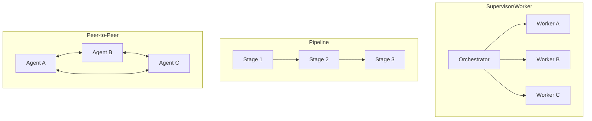

# [AEE-601] Agent Roles and Topologies

## Context

Multi-agent systems fail in topology-specific ways. A supervisor/worker system fails at the orchestrator — one component going down halts all dependent work. A pipeline fails at whichever stage produces bad output, and that failure propagates silently downstream until a later stage catches it or the final output is wrong. A peer-to-peer mesh fails everywhere at once, because every link is a potential coordination failure and there is no single authority to detect or recover from it.

The most dangerous topology is the accidental one. An engineer who starts building without a conscious topology choice ends up with a peer-to-peer mesh almost by default: agent A needs to talk to agent B, then B needs to ask C something, then C calls back to A. Each connection felt necessary at the time. The result is a system where every agent is coupled to every other agent, debugging requires tracing paths through an N-node graph, and any change to one agent's interface can ripple to all others.

Choosing a topology first constrains all subsequent design decisions to a smaller, manageable space. It determines the coordination cost (how much work goes into keeping agents aligned), the failure surface (which components can go wrong and how), and the debuggability of the system (how easily you can trace what went wrong and where).

## Design Think

Topology is the first architectural decision in a multi-agent system. Before deciding how agents communicate or how tasks are assigned, you must decide how agents relate to each other. The topology determines the coordination cost, the failure surface, and the debuggability of the system.

The three canonical topologies:

- **Supervisor/worker** — one orchestrator delegates to N independent workers and synthesizes their results.
- **Pipeline** — agents arranged in sequence, each transforming the output of the previous stage.
- **Peer-to-peer** — agents communicate directly with each other with no central authority.

**RFC 2119:**

- Each agent in a multi-agent system MUST have a single primary role defined before implementation begins.
- Topology MUST be chosen before implementation — retrofitting topology onto an existing system requires a near-complete rewrite.
- A topology change SHOULD be treated as an architectural change requiring its own review and migration plan.

## Deep Dive

### The Three Canonical Topologies

| Topology | Structure | Coordination cost | Failure surface | Best for |
|---|---|---|---|---|
| Supervisor/worker | One orchestrator, N workers | Low — one authority | Single orchestrator | Parallel independent tasks |
| Pipeline | Agents in sequence | Low — no shared state | Each stage in sequence | Multi-stage transformation |
| Peer-to-peer | Direct agent-to-agent | High — N² coordination | Every link | Collaborative problem-solving (rare) |

#### Supervisor/Worker

A single orchestrator agent coordinates the system. It receives the top-level task, decomposes it into subtasks, delegates each subtask to a worker agent, and synthesizes the workers' results into a final output. Workers do not communicate with each other — they receive a task from the orchestrator and return a result to the orchestrator.

**When to use:** The task can be decomposed into independent subtasks that do not require workers to coordinate with each other. The orchestrator can evaluate whether each worker's result is acceptable before synthesis.

**Key failure mode:** Single point of failure at the orchestrator. If the orchestrator loses track of which workers have completed, produces a poor decomposition, or fails mid-synthesis, the entire task fails. Worker failures are recoverable (the orchestrator can retry a worker); orchestrator failures are not.

**Example:** A code review agent (orchestrator) spawns three worker agents — one for security issues, one for performance, one for test coverage — and combines their findings into a single report.

#### Pipeline

Agents are arranged in a fixed sequence. Each agent receives the output of the previous agent, transforms it, and passes the result to the next agent. There is no shared state between stages; each agent's only input is what it receives from upstream.

**When to use:** The task has a natural sequential structure where each step must complete before the next can begin, and the output of one step is the complete input of the next. Multi-stage document transformation (fetch → parse → summarize → translate) is a canonical example.

**Key failure mode:** Silent propagation of bad output. If stage 2 produces subtly wrong output, stage 3 has no way to know — it only sees what it receives. Errors compound with each stage, and the final output may be wrong in ways that are hard to trace back to the originating stage. Programmatic gates between stages (validating output format or content before passing downstream) are the primary mitigation.

**Example:** A research pipeline where agent 1 retrieves documents, agent 2 extracts key facts, and agent 3 synthesizes the facts into a structured report.

#### Peer-to-Peer

Agents communicate directly with each other. There is no central authority; any agent can initiate communication with any other agent. Coordination emerges from the interactions between agents rather than from a single orchestrator.

**When to use:** The task requires agents to actively challenge each other's reasoning, iterate on shared hypotheses, or negotiate outcomes. Debugging scenarios where multiple agents investigate competing hypotheses and debate their findings is the strongest documented use case. Use this topology only when direct agent collaboration is a specific requirement — the coordination cost is high.

**Key failure mode:** N² coordination complexity. As agents are added, the number of potential communication paths grows quadratically. There is no single authority to detect when an agent is stuck, producing bad output, or in a coordination loop with another agent. Debugging requires tracing paths through the full agent graph.

**Example (experimental):** A root-cause analysis team where five agents each investigate a different hypothesis and actively challenge each other's findings to converge on the most defensible explanation.

### Hybrid Topologies

Two patterns extend the canonical three for larger or more complex systems.

**Hierarchical** topology places supervisors above other supervisors — a meta-orchestrator coordinates a set of sub-orchestrators, each of which manages its own pool of workers. Use this when the task is too large for a single orchestrator to manage effectively: the number of workers would exceed what a single orchestrator can track, or the task decomposes into large, independently manageable domains. The failure surface of a hierarchical system is at every orchestrator level; a sub-orchestrator failure takes down its worker pool but not the broader system.

**Review loop** is not a base topology — it is a quality-assurance pattern applied on top of supervisor/worker. A worker produces output, a separate reviewer agent evaluates it, and if the review fails, the output is returned to the worker for revision. The loop continues until the reviewer is satisfied or a retry limit is reached. The key principle, noted in Anthropic's level 7 analysis, is that the implementer and reviewer must be different agent instances — the same instance evaluating its own output introduces bias and the review fails to catch the original errors.

### Defining Agent Roles

A well-defined agent role has five components:

- **A name that describes what the agent does** (not what it is). "code-reviewer" describes behavior. "reviewer-agent" describes an identity. Names that describe behavior make output contracts self-documenting.
- **A primary responsibility** — one thing the agent does best. An agent with two primary responsibilities is two agents combined; it will be unpredictable on the second responsibility when the first has consumed its context.
- **An input contract** — what the agent receives to start work. Includes format, required fields, and any preconditions.
- **An output contract** — what the agent produces when done. Includes format, success conditions, and what the downstream agent or orchestrator needs to do with it.
- **An error contract** — what the agent returns when it cannot complete. An agent that returns an unstructured string on failure forces its caller to parse natural language to determine what went wrong.

The anti-pattern to avoid is the "do-everything" agent: an agent that has been assigned multiple unrelated roles over time and has become a generalist with inconsistent behavior. The do-everything agent arises when it is cheaper to add a capability to an existing agent than to define a new role. The cost appears later, during debugging: the agent's behavior depends on which role is activated by a given input, and the interaction between roles produces unpredictable outputs on edge cases.

### Specialization vs. Generalization

The choice between specialist and generalist agents is a tradeoff between output quality and coordination overhead.

**Specialist agents** produce more predictable output on their narrow task. A code reviewer that only does security review will be more consistent than one that does security, performance, and style simultaneously. The cost is coordination overhead: more agents means more handoffs, more interface contracts to maintain, and more opportunity for handoff errors.

**Generalist agents** have lower coordination overhead — fewer agents means fewer handoffs. The cost is less predictable output on specialized tasks and a larger blast radius when an agent fails (a failing generalist blocks more work than a failing specialist).

A practical rule of thumb: **specialize when output quality is more important than coordination cost; generalize when reliability and simplicity are more important.** A system that must produce high-quality specialized output (code review, legal document analysis, medical summarization) benefits from specialization. A system that needs to complete a task reliably with minimal infrastructure benefits from generalization.

## Best Practices

1. **Pick supervisor/worker first.** It is the easiest topology to debug and understand: one authority, clear responsibility, worker failures are isolated. Only move to pipeline if you have a clear sequential data flow where each step's output is the complete input of the next. Only move to peer-to-peer if you have a specific, documented requirement for direct agent collaboration that cannot be satisfied by a supervisor/worker decomposition.

2. **Name roles by what the agent does, not what it is.** "code-reviewer" is better than "reviewer-agent." "document-summarizer" is better than "summarizer." Names that describe the behavior make output contracts self-documenting — when you read the orchestrator's task delegation, you can tell what each worker will produce without reading the worker's system prompt.

3. **Write the output contract before writing the agent's system prompt.** If you cannot describe what the agent returns in one sentence, the role is not well-defined yet. The output contract is the specification; the system prompt is the implementation. Writing the implementation before the specification produces agents whose outputs are implicitly defined by whatever the model happens to return, which breaks as soon as the model's behavior changes.

## Visual

## Related AEEs

- [AEE-600](600) -- When to Coordinate Agents
- [AEE-602](602) -- Agent Communication
- [AEE-603](603) -- Task Decomposition and Delegation
- [AEE-605](605) -- Orchestration Patterns
- [AEE-606](606) -- Multi-Agent Failure Modes
- [AEE-700](../Harness Engineering/700) -- What Is a Harness?

## References

- [Building Effective Agents - Anthropic](https://www.anthropic.com/research/building-effective-agents)
- [Sub-agents - Claude Code](https://code.claude.com/docs/en/sub-agents)
- [Agent Teams (experimental) - Claude Code](https://code.claude.com/docs/en/agent-teams)

## Changelog

- 2026-04-15 -- Initial draft
