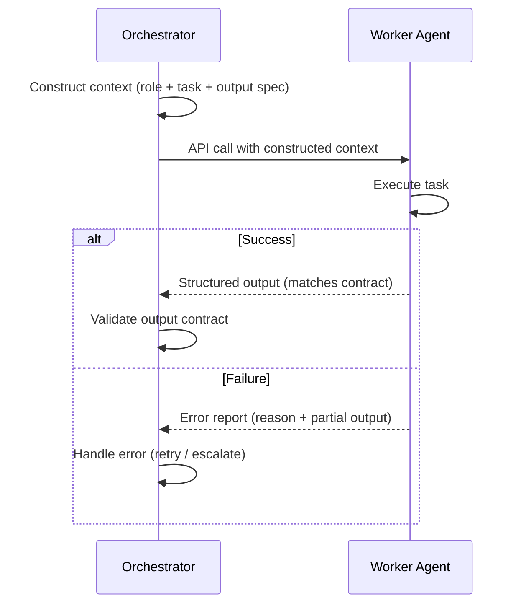

# [AEE-602] Agent Communication

## Context

In a single-agent system, every interaction happens inside one context window managed by one orchestrator. The agent sees everything: the user's request, prior turns, tool results, and intermediate reasoning. Coordination is implicit — it is just the flow of one context.

Multi-agent systems break this. Work must pass between agents, and agents cannot share a context window. The question is not "how do agents talk to each other?" — they don't, in the way that processes send messages over a socket. The question is: how does one agent's output become another agent's input in a form that enables reliable downstream execution?

The answer is context construction. Every handoff between agents is a context construction problem. The orchestrator assembles a context document for the receiving agent, dispatches a fresh API call, and the worker executes against that document alone. Engineers who treat agent communication as a messaging system misunderstand the mechanism — there are no persistent connections, no pub/sub channels, no shared memory. There is only the context window the orchestrator builds.

## Design Think

**How agents actually communicate**

When an orchestrator delegates to a worker, it does not "send a message" in any network sense. It constructs the worker's full context — system prompt, task description, relevant history, tool definitions, output format specification — and makes a new API call. The worker has no knowledge of the orchestrator, no memory of prior sessions, and no access to the broader system unless the orchestrator explicitly includes that information in the context it constructs.

There is no direct agent-to-agent connection. Every "message" is a context document assembled by the orchestrator.

**Message passing vs. shared state**

Two coordination models exist, and they make different tradeoffs:

*Message passing*: the orchestrator constructs a full context per agent call. All information the worker needs is included in the API call itself. The worker is stateless with respect to the broader system — it processes its context and returns a result. This model is simple, easy to retry, and produces isolated failures.

*Shared state*: agents read from and write to a common data store — a file, a database, a memory system. Instead of embedding the full content in the context, the orchestrator passes a reference ("the current draft is in `output/draft.md`"). Workers retrieve and update the shared artifact directly. This model enables richer coordination but introduces locking, conflict resolution, and failure modes that message passing avoids.

**Structured handoffs**

A well-formed handoff has three parts:

- *Input contract*: what the worker receives — the task description, all necessary inputs, the tools available to it
- *Output contract*: what the worker returns — the format, structure, and completeness requirements for a successful result
- *Error contract*: what the worker returns when it cannot complete — a structured error with reason and partial output, not silence

**Conversation history in multi-agent systems**

Workers typically do NOT receive full conversation history. They receive a curated context relevant to their task. History accumulation is an orchestrator responsibility, not a worker concern. The orchestrator decides what prior context is relevant to each worker call and includes only that.

**Avoiding context pollution**

Passing more context than the worker needs increases cost and latency, and can degrade output quality — a worker whose context is dominated by irrelevant history is more likely to produce unfocused results. For example, a worker that receives 50,000 tokens of orchestration history when it only needs 2,000 tokens of task context will spend more tokens on noise than on the actual task. The orchestrator's job is not to forward everything it knows — it is to curate what each worker needs to succeed.

**RFC 2119:**

- Workers SHOULD receive only the context required for their task — not the full orchestration history.
- Agent handoffs MUST include a defined output contract — what the receiving agent is expected to return.
- Orchestrators MUST NOT pass raw conversation history to workers without curation.

## Deep Dive

**Context construction in detail**

A well-constructed worker context contains five elements:

1. *Role description / system prompt*: who the worker is, what its specialty is, and what behavioral constraints apply. This shapes the worker's reasoning posture before it sees the task.
2. *Task description with all necessary inputs*: what the worker must do, expressed with enough specificity that the worker does not need to guess at intent. Ambiguous task descriptions produce ambiguous outputs.
3. *Output format specification*: the exact structure the orchestrator expects back — JSON schema, Markdown format, a specific set of fields. This is the output contract made explicit.
4. *Error reporting instructions*: what the worker should return if it cannot complete the task. Without this, workers fail silently or return malformed output that the orchestrator cannot distinguish from success.
5. *Relevant tools*: only the tools the worker needs for this task. Providing unnecessary tools increases the chance of misuse and expands the attack surface.

Everything outside these five elements is a candidate for exclusion.

**Message passing vs. shared state at the implementation level**

In message passing, the orchestrator embeds the full content of what the worker needs directly in the API call. If the worker needs the text of a document to summarize, the orchestrator includes that text in the context. The worker never touches any external system to retrieve its inputs.

In shared state, the orchestrator passes a reference. The context might say: "The current draft is in `output/draft.md`. Read it, apply the requested revisions, and write the result back to the same file." The worker is responsible for reading and writing the artifact. The orchestrator coordinates by managing who has access to the shared artifact and when.

**Why shared state introduces failure modes message passing avoids**

Message-passing workers are isolated. If two workers receive independent tasks via separate API calls, neither can interfere with the other's inputs or outputs. Failures are local.

Shared-state workers are coupled through the artifact. Two workers writing to the same file can produce conflicting content. A worker that reads the artifact before another worker has finished writing it will act on a stale intermediate state. The orchestrator must implement coordination discipline — write locks, sequencing, or merge logic — that message passing never requires.

Each shared-state dependency is a new failure surface. An external file that becomes unavailable, a database write that fails silently, a memory system that returns a stale value — these are failure modes that do not exist in pure message passing.

**When shared state is worth it**

Shared state earns its complexity in two situations:

- *Output too large for a context window*: a 10,000-line codebase cannot be passed to a worker in a single API call. The codebase lives on disk; workers receive file references and operate on the filesystem.
- *Incremental progress across workers*: some tasks require workers to see each other's partial results before completing their own. A shared artifact lets workers observe and build on each other's intermediate outputs without requiring the orchestrator to serialize and repass them.

When neither condition holds, message passing is the better default. Each shared-state dependency is a new coordination cost — weigh it against the ceiling that made message passing insufficient.

**The error contract**

The error contract specifies what a worker returns when it cannot complete its task. Three options exist, in descending order of usefulness:

1. *Structured error with reason and partial output*: the worker reports what it attempted, why it failed, and how far it got. The orchestrator can use this to retry intelligently, escalate to a human, or fall back to a different approach.
2. *Partial output with a failure flag*: the worker returns what it completed, marked as incomplete. The orchestrator can decide whether partial output is usable.
3. *Silence*: the worker returns nothing, or returns an empty result without explanation. This is the worst option — the orchestrator cannot distinguish failure from slow success, and has no information to act on.

Designing the error contract before writing the system prompt forces clarity about what failure looks like for each task.

## Best Practices

1. **Design the output contract before writing the system prompt.** The output contract is the most important part of the handoff. If the orchestrator does not know what format to expect, it cannot use the result. Define the output contract first, then write the system prompt that will produce it.

2. **Curate worker context aggressively.** A good heuristic: if you cannot explain why each element of the worker's context is needed for this specific task, remove it. Every token added to a worker's context is a decision — include it because the worker needs it, not because it was easy to forward.

3. **Use message passing as the default; introduce shared state only when message passing cannot work.** The conditions that justify shared state are specific: output too large for a context window, or incremental progress required across workers. Outside those conditions, message passing produces simpler, more reliable systems. Each shared-state dependency added is a new failure surface that must be managed.

## Visual

## Related AEEs

- [AEE-601](601) — Agent Roles and Topologies: topology determines who communicates with whom
- [AEE-603](603) — Task Decomposition and Delegation: decomposition determines what is in each handoff
- [AEE-604](604) — Parallelism and Synchronization: parallel dispatch and fan-in are specific communication patterns
- [AEE-606](606) — Multi-Agent Failure Modes: communication failures are the most common failure mode

## References

- Anthropic. "Building Effective Agents." Anthropic Research. https://www.anthropic.com/research/building-effective-agents

## Changelog

- 2026-04-15 — Initial draft
