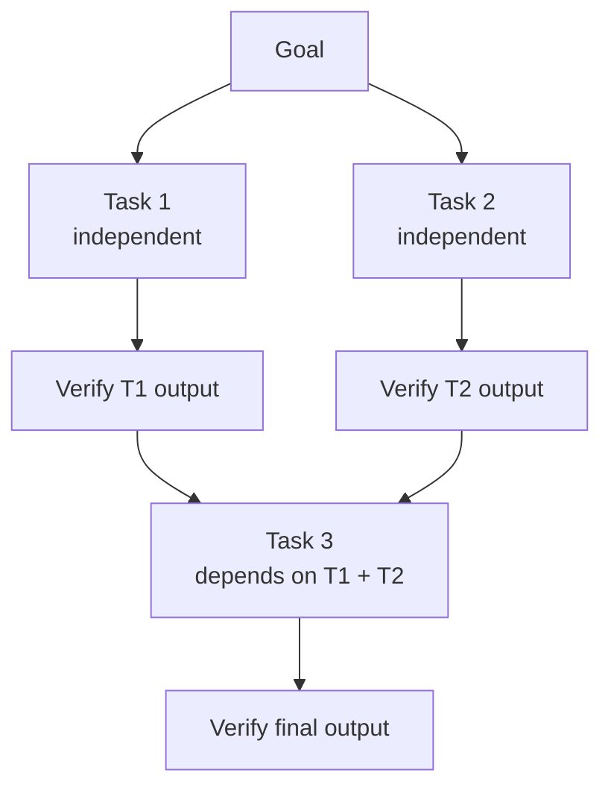

# [AEE-603] Task Decomposition and Delegation

## Context

Multi-agent architecture solves the single-agent ceiling — but only if the work is divided correctly. The act of breaking a goal into sub-tasks determines whether the architecture delivers its promised benefits. Decompose well and workers run in parallel with clean handoffs. Decompose poorly and workers block on each other, produce outputs that cannot be merged, or duplicate work.

Most multi-agent failures originate not in the agents themselves, but in how the work was divided before they started. The orchestrator's most consequential design decision — before writing any system prompt, before dispatching any worker — is how to decompose the goal. That decision sets the dependency structure, the parallelism potential, and the verification requirements for everything that follows.

## Design Think

**What makes a task decomposable**

A goal is decomposable into sub-tasks when each sub-task has three properties:

- *No hidden dependencies on sibling tasks*: the worker can complete its sub-task using only the inputs the orchestrator provides, without needing intermediate outputs from a concurrently running worker.
- *A completable output contract*: the sub-task has a well-defined endpoint. The worker knows when it is done. The orchestrator knows what to expect.
- *Combinable outputs*: the sub-task's output can be incorporated into the final result by the orchestrator without requiring expensive reconciliation.

When these properties do not hold, the decomposition is wrong — not the agents.

**Independence vs. sequencing**

Not all sub-tasks can be parallelized. Some depend on outputs that earlier tasks must produce first. Before dispatching any worker, the orchestrator should identify which tasks are independent (no incoming dependencies) and which are sequential (must wait for upstream outputs). Independent tasks can be dispatched in parallel. Sequential tasks must wait. Identifying this graph before dispatch prevents workers from being dispatched prematurely and producing invalid output based on inputs that do not yet exist.

**Granularity**

Too coarse a decomposition provides no benefit from multi-agent architecture — one worker still bears the full load of a complex task. Too fine a decomposition means coordination cost (context construction, verification, error handling) dominates the time and cost budget.

The right granularity is the smallest unit that is self-contained and verifiable: the worker can complete it without requesting additional context, the output contract can be stated clearly, and the orchestrator can verify the result without asking the worker to explain it.

**Delegation mechanics**

When a task is ready to delegate, the orchestrator constructs the worker's full context and dispatches an API call. The worker has no knowledge of the orchestrator, no memory of the broader system, and no access to other workers' outputs unless the orchestrator explicitly includes that information. If the decomposition is correct, the worker should be able to complete its task without asking clarifying questions — the context it receives contains everything it needs.

**The oracle problem**

After a worker returns its output, the orchestrator must decide whether that output is correct before using it as input to a subsequent task. Three strategies exist: automated verification (tests, lint, schema validation), review agent (a second agent evaluates the output against the output contract), and human checkpoint. Each offers a different tradeoff between speed, cost, and reliability. The orchestrator must choose a verification strategy before dispatch — not after receiving output.

**RFC 2119:**

- Each delegated task MUST have a defined output contract before delegation begins.
- Orchestrators MUST verify worker outputs before incorporating them into subsequent tasks.
- Sub-tasks SHOULD be designed so that workers can complete them without requesting additional context from the orchestrator.

## Deep Dive

**The dependency graph**

Before any worker is dispatched, the orchestrator should be able to draw the task dependency graph: which tasks depend on which outputs. Tasks with no incoming dependencies can be parallelized. Tasks with incoming dependencies must wait until their upstream outputs exist and have been verified.

A practical test for hidden dependencies: "If Task B's worker received Task A's output as garbage, would Task B fail or silently produce wrong output?" If the answer is "fail," the dependency is real and must be modeled. If the answer is "silently wrong," the output contract between Task A and Task B is underspecified — tighten it before dispatch.

Hidden dependencies are the most common source of decomposition errors. They appear when two tasks share an implicit assumption about system state (the same file, the same variable, the same configuration value) that the orchestrator did not recognize as a dependency.

**What to include in a delegation context**

A well-formed delegation context contains five elements:

1. *Role / system prompt*: the worker's identity and primary responsibility. This shapes the worker's reasoning posture before it sees the task.
2. *Task description*: precisely what the worker should produce, in what format, with enough specificity that ambiguity cannot occur.
3. *Input materials*: all context the worker needs to complete the task — no more, no less. Over-inclusion wastes tokens and can degrade output quality by burying task-relevant information in noise.
4. *Output contract*: the exact format and content the orchestrator expects to receive back. If the worker's output does not match this contract, the orchestrator can detect the failure immediately.
5. *Error contract*: what the worker should return if it cannot complete — a structured report with reason and partial output. Silence is never acceptable.

If any of these five elements is missing or underspecified, the delegation is not ready.

**Granularity heuristic**

A task is the right size for delegation when:

- The output contract can be stated in one paragraph.
- The worker can complete it in a single agent loop — no mid-task re-delegation to sub-sub-workers.
- Success or failure is unambiguous: the orchestrator can verify the output without asking the worker to explain it.

Tasks that fail any of these criteria are too large. Tasks whose output contract cannot be distinguished from the output contract of a neighboring task may be too small — consider merging them.

**Partial completion**

A worker completes part of its task and fails on the rest. The orchestrator receives partial output. What happens next depends on a strategy the orchestrator must define before dispatch:

- *Treat partial as failure*: discard the partial output and re-dispatch with more context or a narrower task definition. Safe but wasteful when partial output is high quality.
- *Use partial, delegate remainder*: extract the completed sub-sub-task from the partial output and delegate the remainder as a new task. Requires that the partial output is independently verifiable.
- *Flag for human review*: escalate when the partial output cannot be verified programmatically, particularly if it feeds a high-stakes subsequent task.

Leaving this strategy undefined before dispatch means the orchestrator must improvise at the worst moment — when a worker has already failed.

**The oracle problem in practice**

Three verification strategies, in ascending order of reliability:

1. *Automated verification* — tests, lint, schema validation. Fast and low cost. Catches structural and syntactic errors. Does not catch semantic errors: a JSON output that validates against a schema but contains factually wrong content will pass automated verification.

2. *Review agent* — a second agent evaluates the worker's output against the output contract. Catches semantic errors that automated checks miss. Adds latency and cost equal to roughly one additional agent turn. The review agent's own output contract must be specified: what does "acceptable" mean, and how does the review agent communicate a rejection?

3. *Human checkpoint* — slowest but highest reliability. Use for outputs that feed high-stakes subsequent tasks, where a downstream error would be expensive to discover and correct. The cost of a human checkpoint is almost always lower than the cost of discovering a semantic error five tasks downstream.

In practice, the right approach is layered: automated verification as the first filter, review agent for tasks whose outputs feed subsequent high-stakes work, and human checkpoints at the highest-stakes handoffs.

## Best Practices

1. **Draw the dependency graph before dispatching any worker.** The graph reveals which tasks can be parallelized, which must be sequential, and which appear independent but share hidden state. Drawing it explicitly forces clarity about these relationships before any work begins — and makes it possible to reason about what happens when a task fails.

2. **Write the output contract before writing the worker's system prompt.** If you cannot define what the worker should return, the task is not ready to be delegated. The output contract is the specification the orchestrator uses to verify completion. Writing it first also makes the system prompt easier to write — the worker's instructions derive from what it must produce.

3. **Use automated verification as the first line of defense, but do not rely on it alone for outputs that feed subsequent high-stakes tasks.** Automated checks catch structural errors quickly and cheaply. They do not catch semantic errors. For tasks whose outputs feed subsequent high-stakes work, chain automated verification with a review agent. The combined cost is still lower than discovering a semantic error downstream after several additional agent turns have built on a flawed foundation.

## Visual

## Related AEEs

- [AEE-600](600) — Multi-Agent and Orchestration: why decomposition is the first design decision
- [AEE-602](602) — Agent Communication: how decomposed tasks are handed off between agents
- [AEE-604](604) — Parallelism and Synchronization: parallelizing independent sub-tasks after decomposition
- [AEE-605](605) — Orchestration Patterns: patterns that implement specific decomposition strategies
- [AEE-606](606) — Multi-Agent Failure Modes: what goes wrong when decomposition is wrong

## References

- Anthropic. "Building Effective Agents." Anthropic Research. https://www.anthropic.com/research/building-effective-agents

## Changelog

- 2026-04-15 — Initial draft
