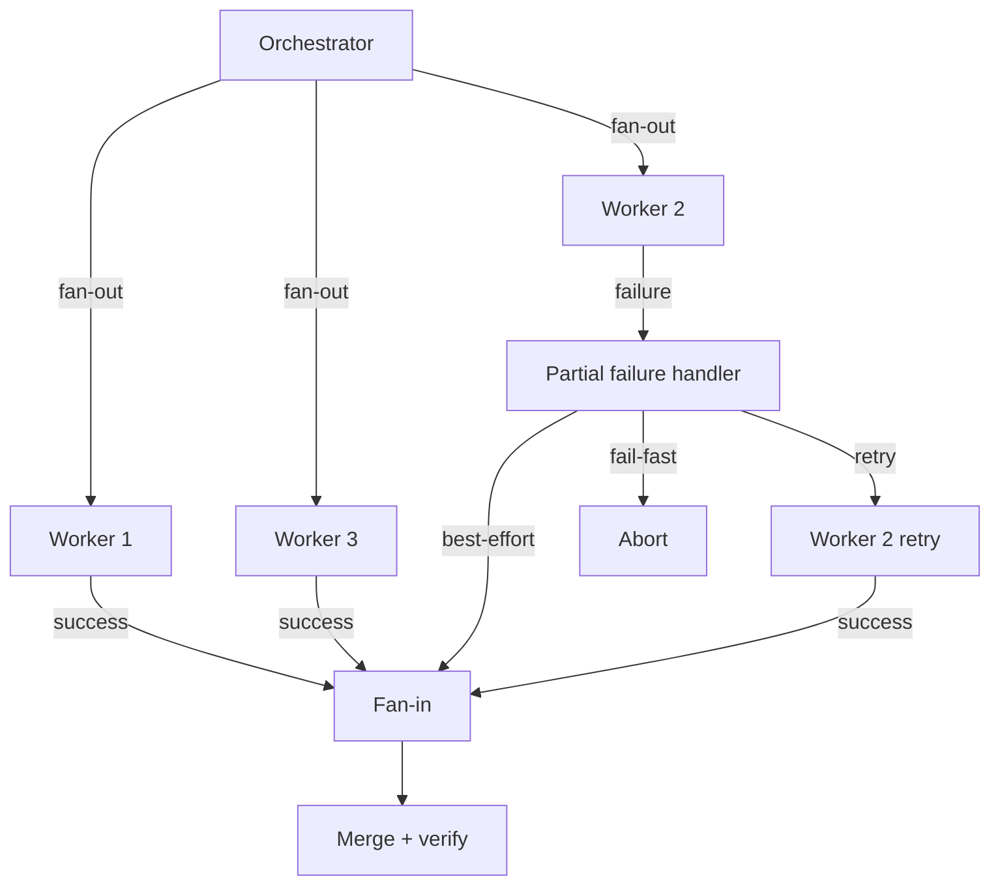

# [AEE-604] Parallelism and Synchronization

## Context

Once you have a dependency graph (AEE-603), you know which tasks are independent. Independent tasks can be parallelized. But parallelism introduces its own costs: each branch that runs concurrently is a new failure surface, and the synchronization point where branches rejoin is a new bottleneck. Understanding when parallelism helps and when it hurts is what separates effective multi-agent architecture from systems that are slow, fragile, and difficult to debug.

## Design Think

**When parallelism helps**

Tasks that are genuinely independent — no shared state, no output dependencies — and individually slow enough that the parallel overhead is worth it are the right candidates. When a worker takes 60 seconds and you have five of them with no dependencies between them, running them concurrently reduces total elapsed time from 300 seconds to roughly 60 seconds plus overhead. That trade is almost always worth making.

**When parallelism hurts**

Three conditions make parallelism counterproductive:

- *Hidden dependencies*: two workers produce outputs that conflict because they share an implicit assumption the orchestrator did not recognize as a dependency. The conflict is discovered at fan-in, after both workers have run.
- *Tasks too short*: context construction, API call setup, and result collection impose a fixed overhead per worker. For tasks that complete in under five seconds, this overhead often dominates.
- *Shared mutable state*: if two workers write to the same resource without coordination, one overwrites the other's work and the conflict is often silent.

**How parallel dispatch works**

The orchestrator dispatches multiple concurrent API calls. Each worker receives its own full context document — it has no visibility into other workers and no shared session state. Python `asyncio.gather` is the standard pattern for concurrent worker dispatch. The workers run independently; the orchestrator collects results at a fan-in step.

**Synchronization patterns**

The canonical pattern is fan-out followed by fan-in:

- *Fan-out*: the orchestrator dispatches N workers concurrently, each with its own context.
- *Fan-in*: the orchestrator waits for all N results and merges them into a single output.

What "merge" means depends on the output type. Text sections that do not overlap can be concatenated. Overlapping text requires a review agent to produce a coherent result. Code changes to the same file require diff-based merge with conflict detection. Structured data requires union with conflict detection. Scores and classifications can be aggregated with average or majority vote.

**Partial failure**

When three of five workers succeed and two fail, the orchestrator must act. Three strategies exist:

- *Fail-fast*: abort all in-flight workers on the first failure. Use when all outputs are required for downstream tasks. Downside: discards all completed work on any single failure.
- *Best-effort*: collect completed outputs, log failures, proceed with what is available. Use when downstream tasks can proceed with partial results. Downside: downstream tasks must be designed to handle incomplete input.
- *Retry with backoff*: re-dispatch failed workers up to a maximum retry count. Use when failures are likely transient — rate limits, timeouts. Downside: adds latency and cost.

**The synchronization bottleneck**

Any fan-in step that requires all N parallel outputs before proceeding becomes a ceiling on the entire system's throughput. If one worker takes 10× longer than the others, the orchestrator waits for the slowest. Identify these points before designing the system.

- Parallel workers MUST NOT share mutable state without an explicit concurrency strategy.
- Fan-in steps MUST define a merge strategy before dispatch begins.
- Orchestrators SHOULD fail-fast on partial failure when subsequent tasks depend on all outputs; SHOULD use best-effort when subsequent tasks can proceed with partial results.

## Deep Dive

**Independence test before parallelizing**

Before dispatching in parallel, run two checks:

1. Would either worker need to read something the other writes? If yes, they are not independent.
2. Does either worker's output contract constrain what the other's output contract can contain? If yes, they have a hidden dependency.

Only tasks that pass both checks are safe to parallelize. Hidden dependencies discovered mid-flight are far more expensive to fix than ones caught before dispatch — both workers may have run to completion before the conflict is detectable.

**The overhead threshold**

Parallelism only helps when individual task latency exceeds the overhead of context construction, API call setup, and result collection. For tasks that complete in under five seconds, the overhead often dominates. For tasks requiring more than 30 seconds each, parallelism almost always helps. The breakeven point depends on the specific harness; measure before assuming.

**Fan-out/fan-in mechanics**

Concretely, the pattern has three steps:

1. *Fan-out*: build N context documents, dispatch N API calls concurrently.
2. *Collect*: wait for all results, with a per-worker timeout.
3. *Fan-in*: merge results according to the predefined strategy.

A conceptual Python pattern:

```python
async def dispatch_workers(contexts: list[str]) -> list[str | BaseException]:
    tasks = [call_agent(ctx) for ctx in contexts]
    results = await asyncio.gather(*tasks, return_exceptions=True)
    return results  # exceptions appear as BaseException values in results
```

`return_exceptions=True` causes failed workers to return exception objects rather than raising, allowing the orchestrator to inspect partial failure rather than aborting on the first exception.

**Merge strategies by output type**

| Output type | Merge strategy | Risk |
|---|---|---|
| Independent text sections | Concatenate | Low — sections do not overlap |
| Overlapping text | Concatenate + review agent | Medium — review needed for coherence |
| Code changes to same file | Diff-based merge + conflict detection | High — merge conflicts possible |
| Structured data (JSON/schema) | Union with conflict detection | Medium — field collision possible |
| Scores or classifications | Aggregate (average, majority vote) | Low — no content conflict |

The merge strategy must be defined at design time. A fan-in step that improvises a merge strategy produces inconsistent outputs across runs.

**Partial failure handling**

Three strategies in detail:

- *Fail-fast*: abort all in-flight workers on the first failure; report the error to the orchestrator. Use when all outputs are required for downstream tasks. Downside: discards all completed work on any single failure, even if the completed work is high quality and the failure is transient.

- *Best-effort*: collect all completed outputs, log failures, proceed with what is available. Use when downstream tasks can proceed with partial results. Downside: downstream tasks must be explicitly designed to handle incomplete input — an assumption of completeness that is not validated will produce silent errors.

- *Retry with backoff*: re-dispatch failed workers up to a maximum retry count with increasing delay between attempts. Use when failures are likely transient — rate limits, network timeouts, ephemeral service unavailability. Downside: adds latency and cost. Set a maximum retry count before dispatch; unbounded retries are a production incident waiting to happen.

**The synchronization bottleneck**

Any fan-in step that requires all N parallel outputs before proceeding is a bottleneck. If one worker takes ten times longer than the others, the fan-in waits for the slowest worker. The overall latency of the parallel stage is determined by the slowest worker, not the average.

Two design choices mitigate this:

- *Per-worker timeouts*: set a maximum elapsed time for each worker. A worker that exceeds the timeout is treated as a failed worker and handled by the partial failure strategy.
- *Minimum threshold*: proceed if at least K of N workers succeed. Define K before dispatch. This converts fail-fast semantics into best-effort semantics with a floor — useful when some minimum quorum of outputs is sufficient for downstream tasks.

## Best Practices

1. **Run the independence test before parallelizing.** Hidden dependencies discovered mid-flight are far more expensive to fix than ones caught before dispatch. Two checks take seconds; recovering from a conflicting fan-in after both workers have run takes much longer.

2. **Set per-worker timeouts.** A worker that never returns is indistinguishable from a slow one until your orchestrator hangs waiting for it. Every parallel dispatch should have an explicit timeout; the partial failure strategy defines what happens when the timeout fires.

3. **Define the merge strategy at design time, not at fan-in.** A fan-in step that improvises a merge strategy produces inconsistent outputs across runs. The merge strategy is part of the output contract for the parallel stage — it must be specified before any worker is dispatched.

## Visual



## Related AEEs

- [AEE-600](600) — Multi-Agent and Orchestration: coordination cost framing that motivates the parallelism tradeoff
- [AEE-603](603) — Task Decomposition and Delegation: the dependency graph is the prerequisite for parallelism
- [AEE-605](605) — Orchestration Patterns: fan-out/fan-in and map-reduce are patterns that implement parallelism
- [AEE-606](606) — Multi-Agent Failure Modes: partial failure is a multi-agent-specific failure mode
- [AEE-704](../Session Management/704) — Session Management: worker sessions and state persistence context

## References

- Anthropic. "Building Effective Agents." Anthropic Research. https://www.anthropic.com/research/building-effective-agents

## Changelog

- 2026-04-15 — Initial draft
