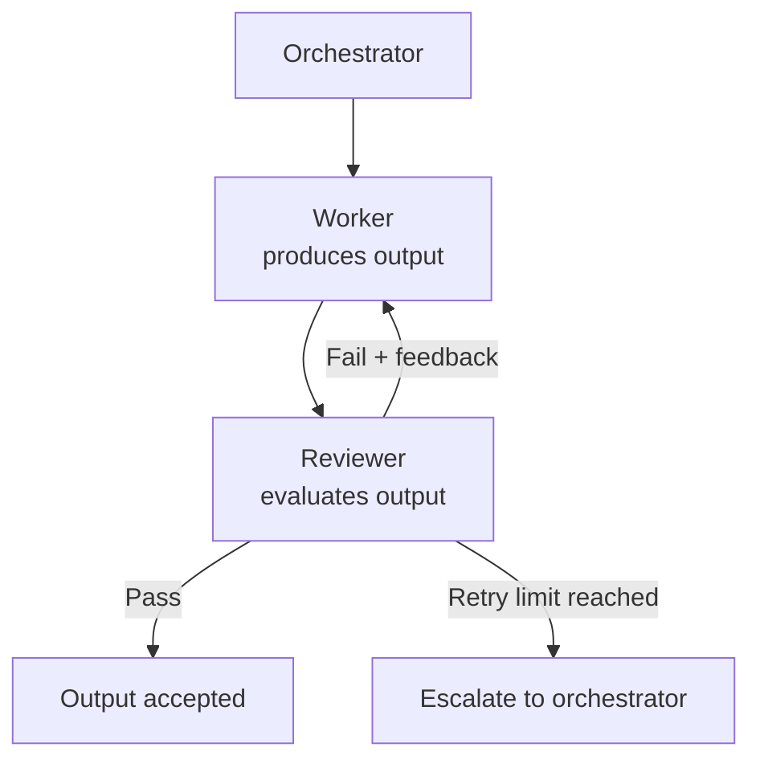

# [AEE-605] Orchestration Patterns

## Context

Every multi-agent system faces the same coordination problems: how to distribute work across agents, how to ensure quality, how to aggregate results. Engineers who work from first principles on each project reinvent the same solutions repeatedly. Orchestration patterns are the named, reusable solutions to these recurring problems — the vocabulary that lets practitioners say "this is a review loop" or "this is a pipeline" and immediately communicate a complete architectural structure.

This article covers five patterns: map-reduce, fan-out/fan-in, pipeline, review loop, and hierarchical delegation. Each pattern has a clear intent, a defined structure, a set of conditions where it applies, and characteristic trade-offs. Understanding a pattern's structure reveals its trade-offs before a single line of code is written.

## Design Think

**Why naming patterns matters**

If you cannot name the pattern you are implementing, you have not finished designing the architecture. A named pattern carries its trade-offs with it — say "review loop" and every engineer on the team immediately knows there is a worker, a reviewer, a retry limit, and a pass/fail criterion. You do not need to redescribe the architecture from scratch; the name does the work.

The five patterns covered here are not exhaustive, but they are the most common recurring structures in multi-agent systems. Real workflows combine them. A pipeline where each stage runs a review loop is a common and well-understood composition; a fan-out where each branch is itself a pipeline is another. Pattern composition is where the real design work happens.

**Pattern catalog overview**

| Pattern | Core structure | Primary use |
|---|---|---|
| Map-reduce | One worker per input item, then aggregate | Batch processing of N independent items |
| Fan-out/fan-in | N specialized workers on the same input, then merge | Multi-perspective analysis |
| Pipeline | Sequential stages, each feeding the next | Multi-stage transformations with dependencies |
| Review loop | Worker produces, reviewer evaluates, worker revises | Quality-sensitive outputs requiring iteration |
| Hierarchical delegation | Meta-orchestrator delegates to sub-orchestrators | Tasks too large for a single orchestrator |

**Pattern selection**

| If your task... | Use pattern |
|---|---|
| Has N independent input items to process | Map-reduce |
| Needs multiple specialist perspectives on the same input | Fan-out/fan-in |
| Has clear sequential stages where each depends on the previous | Pipeline |
| Requires quality iteration on a single output | Review loop |
| Is too large for one orchestrator to coordinate | Hierarchical delegation |

## Deep Dive

### Map-reduce

**Intent**

Process N independent input items with a worker per item, then aggregate all results into a single output.

**Structure**

The orchestrator dispatches one worker per input item — the map phase. Each worker processes its item independently and returns a result. The orchestrator collects all results and runs an aggregation step — the reduce phase. The aggregation may itself be a model call: a summarization agent that synthesizes N individual analyses into a single coherent report.

**When to use**

Batch processing tasks where each item is independent and the aggregate is more useful than individual results: analyze N documents, evaluate N code files, score N candidates. The key condition is true independence — each worker's output must not depend on any other worker's output.

**Trade-offs**

- Scales linearly: N input items produce N API calls in the map phase and one aggregation call in the reduce phase.
- The reduce phase becomes a new bottleneck when individual items are large — the aggregator receives N outputs and must synthesize them in a single context window.
- Works only when items are truly independent. Hidden dependencies between items are discovered at the reduce phase, after all map workers have run.

---

### Fan-out/fan-in

**Intent**

Apply multiple specialized agents to the same input, then combine their different perspectives into one output.

**Structure**

The orchestrator dispatches N specialized workers with the same (or closely related) input. Each worker produces output from its specialty — a security reviewer, a correctness reviewer, a style reviewer each analyze the same code. The fan-in step merges the N outputs into a combined result.

Fan-out/fan-in is distinguished from map-reduce by the nature of the workers: map-reduce uses identical workers on different inputs; fan-out/fan-in uses specialized workers on the same input.

**When to use**

Multi-perspective tasks where a single generalist would produce lower quality than multiple specialists. Code review is the canonical case: a single agent asked to assess security, correctness, and style will compromise on each; three specialists each focused on one dimension produce deeper analysis.

**Trade-offs**

- All workers must be dispatched before fan-in can begin — if one specialist is slow, all others wait.
- The fan-in step requires a merge/synthesis strategy defined before dispatch. N independent specialist reports do not automatically become a coherent combined report.
- More expensive than a single-agent approach. The cost is justified when specialist depth matters more than cost efficiency.

---

### Pipeline

**Intent**

Transform input through sequential stages where each stage's output is the next stage's input.

**Structure**

Agents arranged in sequence: A → B → C → D. Each agent receives the previous agent's output as its primary input. No stage can begin until the previous stage completes and produces an output that satisfies the next stage's input contract.

**When to use**

Multi-stage transformations with clear sequential dependencies: research → outline → draft → edit → review. Tasks where each stage requires the previous stage's complete output — a draft agent cannot begin without a completed outline; an edit agent cannot begin without a completed draft.

**Trade-offs**

- No parallelism. The total latency is the sum of all stage latencies, not the maximum.
- A failure at stage N blocks all subsequent stages. The system cannot recover by retrying a later stage — the upstream stage must be fixed or re-run.
- Stage outputs must be compatible with the next stage's input contract. A mismatch between stages is discovered only when the downstream stage receives unexpected input.
- Easy to debug: trace backward from the failing stage to find the source of the error.

**Common misidentification**

Do not label sequential stages as fan-out/fan-in. Fan-out implies parallel workers with the same input. If your stages have dependencies on each other's outputs, they are a pipeline, not a fan-out. Misidentifying a pipeline as a fan-out leads to incorrect context construction and ordering bugs.

---

### Review loop

**Intent**

Iterate on a produced output until it meets a quality bar, using a reviewer agent to evaluate and a worker agent to revise.

**Structure**

The worker produces an initial output. The reviewer evaluates the output against explicit quality criteria. If the reviewer returns PASS, the output is accepted. If the reviewer returns FAIL, the reviewer also returns structured feedback; the worker revises using that feedback and the loop continues. The loop terminates on PASS or when a retry limit is reached.

When the retry limit is reached, the orchestrator must have a defined escalation behavior: fail the task, accept the output with a warning, or escalate to a human reviewer.

**The implementer/reviewer distinction**

The worker and reviewer must be different agent instances. The same agent evaluating its own output introduces bias — it cannot reliably identify flaws in reasoning it produced. A separate reviewer with a focused evaluation prompt, operating without visibility into the worker's reasoning process, produces more reliable quality judgments.

This principle was established in AEE-601. It applies here without exception.

**When to use**

Quality-sensitive outputs where automated verification is insufficient: code that must meet design requirements, prose that must meet editorial standards, a plan that must satisfy specific constraints. Review loops add latency and cost; they are justified when the cost of an incorrect output exceeds the cost of iteration.

**Trade-offs**

- Variable turn count. The number of iterations is unknown in advance and depends on initial output quality and reviewer strictness.
- A retry limit is not optional. An unconstrained review loop is an infinite loop. Define a maximum iteration count and a behavior for when the limit is reached before the loop begins.
- Each turn adds latency and cost. A review loop with a limit of five iterations can cost five times as much as a single worker call.
- Requires a clear pass/fail criterion in the reviewer's prompt. A reviewer that produces vague or inconsistent evaluations will cause the worker to revise in contradictory directions.

**Relationship to other patterns**

Review loop is a quality-assurance pattern applied on top of a base topology, not a base topology itself. A review loop can wrap any single worker in a pipeline stage, any worker in a fan-out branch, or any worker in a map-reduce map phase.

---

### Hierarchical delegation

**Intent**

Coordinate a task too large for a single orchestrator by using sub-orchestrators, each managing their own worker pool for a domain of the larger task.

**Structure**

A meta-orchestrator decomposes the task into large independent domains and dispatches each domain to a sub-orchestrator. Each sub-orchestrator manages a worker pool for its domain, coordinates its workers, and returns its domain output to the meta-orchestrator. The meta-orchestrator aggregates domain outputs into the final result.

**When to use**

Tasks with large independent domains where a single orchestrator's coordination overhead would be unmanageable: build the backend AND build the frontend AND write the documentation. Each domain is large enough to require its own multi-agent workflow; the meta-orchestrator needs only to coordinate domains, not individual workers.

**Trade-offs**

- Failure surfaces at every orchestrator level. A sub-orchestrator failure loses its entire domain — all work done by that sub-orchestrator's workers is lost with it.
- Complex debugging. An error in a worker must be traced through the sub-orchestrator layer and potentially through the meta-orchestrator layer before the source is clear.
- Each orchestrator level adds coordination cost. Use hierarchical delegation only when the scope genuinely exceeds single-orchestrator capacity — not as a default structure for any moderately complex task.
- Sub-orchestrators must each produce outputs with contracts the meta-orchestrator can consume. Mismatched output contracts between orchestrator levels produce errors that are difficult to diagnose.

---

### Pattern composition

Real workflows combine patterns. The value of named patterns is that their compositions are also understandable by name.

**Common compositions**

- *Pipeline with review loops at each stage*: each stage in the pipeline is self-verifying. The draft stage runs a review loop before passing its output to the edit stage. Higher quality at each stage; higher latency.

- *Fan-out where each branch is a pipeline*: different processing paths for the same input run in parallel. A document is simultaneously processed through a technical accuracy pipeline and an editorial style pipeline. Results merge at fan-in.

- *Map-reduce where the reduce phase uses fan-out/fan-in*: N individual analyses are reduced using multiple synthesizers, each producing a different kind of summary. A meta-synthesis agent combines the synthesizers' outputs.

**Worked example: code review workflow**

A multi-agent code review system combines three patterns:

1. *Fan-out*: the orchestrator dispatches three specialist reviewers — a security reviewer, a correctness reviewer, and a style reviewer — each analyzing the same code in parallel.

2. *Review loop per specialist*: each specialist's findings go through a review loop. A meta-reviewer evaluates whether each specialist's analysis is complete and coherent; the specialist revises if not. This ensures each specialist produces high-quality output before the merge step.

3. *Pipeline*: after each specialist's review loop completes, a pipeline combines the three specialist reports into a single coherent review document: first a merge step combines raw findings, then an editorial step produces the final report.

The composition is: fan-out → (review loop for each branch) → pipeline to combine. Each pattern is legible by name; the composition describes the full architecture.

## Best Practices

1. **Name the pattern before writing code.** If you cannot name the pattern you are implementing, you have not finished designing the architecture. A named pattern carries its structure, its trade-offs, and its composition rules. Work out the architecture in named patterns before writing a single agent prompt.

2. **Set retry limits on review loops.** An unconstrained review loop is an infinite loop. Define a maximum iteration count before the loop begins, and define a behavior for when the limit is reached: fail the task, accept the output with a warning, or escalate to a human reviewer. There is no safe default — all three behaviors are appropriate in different contexts, and failing to choose one means the system will behave unpredictably at the limit.

3. **Prefer pipeline over fan-out when stages are sequential.** Fan-out implies parallel workers with the same input. If your stages have output dependencies on each other — stage B requires stage A's output — they are a pipeline, not a fan-out. Misidentifying a pipeline as a fan-out leads to incorrect parallel dispatch: workers receive incomplete context, ordering is undefined, and outputs conflict at the fan-in step.

## Visual

Review loop — the most commonly misimplemented pattern:

## Related AEEs

- [AEE-601](601) — Agent Roles and Topologies: the base topologies these patterns build on
- [AEE-603](603) — Task Decomposition and Delegation: decomposition determines which pattern fits
- [AEE-604](604) — Parallelism and Synchronization: fan-out/fan-in and map-reduce are parallel patterns
- [AEE-606](606) — Multi-Agent Failure Modes: each pattern has characteristic failure modes

## References

- Anthropic. "Building Effective Agents." Anthropic Research. https://www.anthropic.com/research/building-effective-agents

## Changelog

- 2026-04-15 — Initial draft
