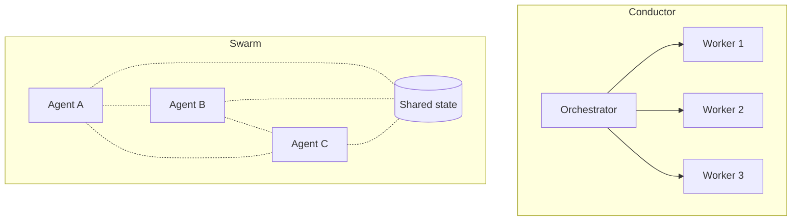

# [AEE-607] Agent Swarms

## Context

"Agent swarm" has spread across the agentic tooling market between 2024 and 2026, but the label covers very different architectures depending on the speaker. Some speakers mean any multi-agent system. Some mean OpenAI's Swarm framework (now deprecated) or its successor, the Agents SDK. Some mean a centrally coordinated worker pool dressed up with modern developer ergonomics. A few mean genuinely decentralized coordination with no single authority. A reader encountering the term in a framework's marketing material has no reliable way to tell which meaning is on offer.

The existing 600s leave a gap here. [AEE-601](601) covers three canonical topologies (supervisor/worker, pipeline, peer-to-peer), but its peer-to-peer treatment is narrower than what "swarm" means today. [AEE-605](605) covers orchestration patterns — map-reduce, fan-out, review loop, hierarchical — all of them conductor-style. No article in the corpus addresses decentralized coordination or the conductor-vs-swarm architectural split that has emerged as a 2026 framing.

This article decodes what "swarm" actually covers, establishes the conductor-vs-swarm split, and surveys the 2026 framework landscape as evidence. For the prior question of whether multi-agent is warranted at all, see [AEE-600](600). For the canonical topologies, see [AEE-601](601).

## Design Think

The 2026 framing places multi-agent architectures along a single axis: *conductor* (centralized; one orchestrator directs workers) versus *swarm* (decentralized; agents coordinate through shared state or local interaction). The split is architectural, not a continuum — a system either has a designated orchestrator or it does not. Real systems land on the axis somewhere, often hybrid, but the question of where a given system sits is concrete and answerable.

At its best, "swarm" names a specific set of system-level properties: decentralization, fault tolerance via redundancy, dynamic composition, horizontal scale, and agent autonomy. Each of these is a property of the *system*, not of any individual agent. A single agent running in isolation cannot be a swarm; a swarm exists in how the agents collectively behave.

The honest disclosure: most frameworks labeled "swarm" are conductor-with-extras, not true swarms. They have a queen, a lead, a router, an orchestrator — somewhere in the architecture diagram, one component decides what the others do. The biological analogy that the label evokes (ants, bees, colonies) is aspirational rather than realized. LLM agents have too much individual capability and too much access to global state to behave like ants. The label is usefully evocative, but readers need to verify what it denotes for any specific framework.

In practice the label covers three distinct architectures — this article's decoder develops each in Deep Dive section 2. Working with agent swarms imposes a small set of hard constraints:

- Engineers MUST distinguish conductor-style multi-agent from swarm-style before choosing a framework. The coordination cost, failure surface, and debuggability differ sharply.
- "Swarm" framing SHOULD be avoided when the underlying architecture is actually a conductor — it misrepresents the system's failure characteristics to reviewers, to newcomers, and to yourself six months later.
- Swarm architectures SHOULD be chosen only when fault tolerance via redundancy is a hard requirement, task work is naturally parallel with loose coupling, or horizontal scale is the primary lever.
- Teams adopting a "swarm" framework MUST verify which of the three flavors it actually implements before committing to it.

## Deep Dive

### 1. Conductor vs. swarm: the architectural split

A conductor architecture has a designated orchestrator that receives a task, decomposes it, dispatches work to specialized workers, and aggregates results. The orchestrator's knowledge of the system is global: it knows who the workers are, what each is doing, and what the final output must look like. A swarm architecture has no such single authority. Agents act on local state, shared artifacts, or peer messages, and overall system behavior emerges from many concurrent local decisions.

| Aspect | Conductor | Swarm |
|---|---|---|
| Control | Centralized; one orchestrator directs workers | Decentralized; no single point of authority |
| Scaling | Vertical — orchestrator gets bigger and smarter | Horizontal — add more agents |
| Failure surface | Orchestrator is single point of failure | Graceful degradation; individual agents can fail |
| Coordination cost | O(N) (orchestrator knows N workers) | O(N^2) worst case (any agent may talk to any other) |
| Debuggability | High — follow decisions from orchestrator | Low — emergent behavior, distributed traces |
| Best for | Sequential logic, auditable decision chains, tight coordination | Parallel loose-coupled work, fault tolerance, horizontal scale |

Most real systems are hybrid. Pure swarm is rare in production; pure conductor is common. The question is where on the axis a given system sits, not which box it fills. The 600s today cover the conductor end thoroughly — [AEE-601](601) on topologies, [AEE-605](605) on orchestration patterns, [AEE-606](606) on multi-agent failure modes. This article closes the gap on the swarm end.

### 2. What "swarm" actually covers in 2026 — the three flavors

"Swarm" in current usage covers three distinct architectures. A reader encountering the label in a framework's marketing needs to know which flavor is on offer, because the failure modes, debuggability characteristics, and appropriate use cases differ meaningfully between them.

**Flavor A — Centralized multi-agent with ergonomic tooling**

- *What it is:* a conductor pattern wrapped in LLM-native developer ergonomics — lifecycle hooks, persistent identity files, MCP tool integration, Docker-isolated workers, memory or learning loops. Still has a central authority; the "swarm" label signals ergonomic maturity, not architectural decentralization.
- *Key primitives:* lead or queen coordinator, worker pool, lifecycle hooks, persistent agent identity files.
- *Representative frameworks:* [desplega-ai/agent-swarm](https://github.com/desplega-ai/agent-swarm) uses a lead agent that breaks down tasks and delegates to Docker-isolated worker agents, with persistent identity files (SOUL.md, IDENTITY.md, TOOLS.md, CLAUDE.md) and OpenAI-embedding-backed memory. [Ruflo](https://github.com/ruvnet/ruflo) (formerly claude-flow) uses a queen/worker model, 100+ specialized agents, SONA self-learning, and a RuVector DB.
- *How to tell:* look for the word "queen", "lead", "router", or "orchestrator" in the architecture docs. If one component directs the others, the framework is flavor A regardless of what the marketing calls it.
- *Right when:* the goal is convenient multi-agent tooling with modern developer ergonomics, and the single-authority failure mode is acceptable.

**Flavor B — Handoff-based dynamic routing**

- *What it is:* the currently-running agent decides which agent runs next by returning a reference to another agent. No external dispatcher; coordination is embedded in agent logic itself. Only one agent runs at a time, so this is not truly concurrent or decentralized, but control flow is dynamic rather than centrally planned.
- *Key primitives:* Agent, handoff (a function that returns an Agent).
- *Representative frameworks:* [OpenAI Swarm](https://github.com/openai/swarm) (October 2024) introduced this pattern. It is now unmaintained and explicitly superseded — the repo's own README states "Swarm is now replaced by the OpenAI Agents SDK, which is a production-ready evolution of Swarm." The [OpenAI Agents SDK](https://openai.github.io/openai-agents-python/) is the production evolution and the current choice for new projects.
- *How to tell:* look for `handoff` as a primitive and the absence of an external orchestrator loop. Control flow is driven by what each agent returns.
- *Right when:* the flow is conversational or sequential with agent-driven routing, and there is no global orchestrator making dispatch decisions. Good for customer-support triage with specialist escalation, where the triage agent hands off to a domain specialist and the specialist can hand back.

**Flavor C — Genuinely decentralized / emergent coordination**

- *What it is:* no single coordinator. Agents act on local state and shared artifacts. System behavior emerges from many concurrent local decisions. Fault tolerance via redundancy comes for free; debuggability is very low.
- *Key primitives:* shared blackboard or message bus, local decision policies, peer discovery.
- *Representative frameworks:* [kyegomez/swarms](https://github.com/kyegomez/swarms) offers patterns (MixtureOfAgents, ForestSwarm) that approach this — agents produce output in parallel with an aggregator synthesizing the combined result. Genuinely decentralized production systems remain rare; most frameworks labeled "swarm" turn out on inspection to be flavor A.
- *How to tell:* no designated coordinator appears in the architecture. Agents react to a shared surface (blackboard, event bus) rather than being dispatched.
- *Right when:* fault tolerance via redundancy is a hard requirement and task decomposition produces loose-coupled parallel work. Accept the debuggability cost as part of the bargain.

### 3. Framework landscape

The 2026 landscape of frameworks that carry the "swarm" label or are routinely called swarms. Each row shows which flavor the framework actually implements — verified against its current docs, not its marketing.

| Framework | Flavor | Primitives | Notable feature |
|---|---|---|---|
| [kyegomez/swarms](https://github.com/kyegomez/swarms) | A + C | Agent, Swarm, SwarmRouter; 10+ orchestration patterns | "Enterprise-Grade Production-Ready"; vendor-neutral LLM support; HierarchicalSwarm, HeavySwarm, ForestSwarm, MixtureOfAgents |
| [Ruflo (formerly claude-flow) — ruvnet/ruflo](https://github.com/ruvnet/ruflo) | A | Queen + worker, Router, 100+ specialized agents | SONA self-learning; 313 MCP tools; RuVector vector DB; Claude Code-native |
| [desplega-ai/agent-swarm](https://github.com/desplega-ai/agent-swarm) | A | Lead + worker, persistent identity files (SOUL/IDENTITY/TOOLS/CLAUDE), 6 lifecycle hooks | Docker-isolated workers; memory-driven compounding knowledge via OpenAI embeddings |
| [OpenAI Swarm (unmaintained)](https://github.com/openai/swarm) | B | Agent + handoff | Historical; explicitly deprecated in favor of OpenAI Agents SDK |
| [OpenAI Agents SDK](https://openai.github.io/openai-agents-python/) | B | Agent + handoff + guardrail | Production evolution of OpenAI Swarm |
| [AutoGen (Microsoft)](https://microsoft.github.io/autogen/stable/) | A or B | AgentChat (conversational), Core (event-driven), GroupChat | Spans flavors by mode; four-tier architecture (Studio/AgentChat/Core/Extensions) |
| [CrewAI](https://docs.crewai.com/) | A | Agents + Crews + Flows | Role-based coordination; flows for orchestration; production-framed |
| [LangGraph](https://docs.langchain.com/oss/python/langgraph/overview) | A or C | Nodes + edges + state (StateGraph) | Graph topology is explicit; flavor depends on whether the graph has a supervisor node |

AutoGen and LangGraph span flavors because their primitives do not fix a topology — the same framework produces a conductor system or a near-swarm depending on how the developer wires the agents together. That ambiguity is itself a signal: "swarm" as applied to these frameworks is a context-dependent label, not an architectural guarantee. Every framework listed is LLM-era (2023 and later) and most are under 18 months old at publication. Specific frameworks will churn in name, maintenance, or semantics; the three-flavor decoder is more durable than any entry in the table.

### 4. When swarm is the right answer

**Choose swarm when:**

- Fault tolerance via redundancy is a hard requirement (no single point of failure acceptable).
- Work is naturally parallel with loose coupling — independent subtasks that do not depend on each other's intermediate state.
- Horizontal scale is the primary lever (throughput grows with agent count).
- Decision chains do not need audit trails through a central authority.

**Choose conductor when:**

- Decision chains must be auditable (compliance, safety-critical, post-incident review).
- Task structure is sequential or has tight synchronization needs.
- The team needs predictable debugging — emergent behavior is a cost, not a feature.
- Throughput matters less than correctness.

**Choose hybrid when:**

- The task decomposes into large independent domains. Place a conductor at the top; use swarms within domains where redundancy and parallelism earn their keep.
- This is the usual answer in practice. Pure-either-end systems are rare.

For the hierarchical delegation pattern that handles the top-level conductor in a hybrid system, see [AEE-605](605). This article covers the swarm half of hybrid systems.

## Best Practices

1. **Verify the flavor before adopting a "swarm" framework.** Read the architecture docs, not the marketing. If the architecture has a queen, lead, router, or orchestrator, the framework is a conductor in swarm clothing. That may still be the right tool, but you should know what you are buying.

2. **Reject the swarm label for conductor systems.** A supervisor-with-persistent-memory is a conductor. Calling it a swarm misrepresents its failure surface and coordination cost to reviewers, newcomers, and yourself six months later.

3. **Treat debuggability as a first-class cost of swarm architectures.** Decentralized coordination is expensive to debug. Budget for distributed tracing, per-agent audit logs, and replay tooling before declaring a system swarm-architected.

4. **Prefer hybrid over pure swarm.** Most production workloads have parts that need auditable decision chains (handled by a conductor) and parts that benefit from horizontal parallel redundancy (handled by a swarm within a domain). Do not force the whole system into one mode.

5. **Expect the framework landscape to churn.** Most of the specific frameworks named in this article will change names, maintenance status, or semantics within 18 months — Ruflo was claude-flow a year ago; OpenAI Swarm was supplanted by Agents SDK within six months of release. The architectural categories are more durable than any specific tool.

6. **Do not import biological swarm metaphors into engineering decisions.** Ants and bees have simple individual agents; LLM agents are the opposite. Evaluate swarm systems as concurrent distributed systems, not as colony organisms.

## Visual

Conductor versus swarm at a glance, plus the three-flavor decoder as a skimmable reference.

The conductor side has a single authority dispatching work. The swarm side has peers interacting through shared state with no central dispatcher.

**Three-flavor decoder:**

| Flavor | Signature | Representative |
|---|---|---|
| A — Centralized with ergonomics | Has a queen/lead/orchestrator; wraps conductor in LLM-native tooling | desplega-ai/agent-swarm, Ruflo |
| B — Handoff-based dynamic routing | Agent returns another Agent; no external dispatcher | OpenAI Agents SDK (successor to OpenAI Swarm) |
| C — Genuinely decentralized | No coordinator; agents share state or message bus | kyegomez/swarms (MixtureOfAgents, ForestSwarm); rare in production |

## Related AEEs

- [AEE-600](600) — When to Coordinate Agents — category overview; the prior question of whether multi-agent is warranted at all
- [AEE-601](601) — Agent Roles and Topologies — the three canonical topologies; this article extends peer-to-peer into the modern swarm category
- [AEE-605](605) — Orchestration Patterns — all conductor-style; this article is the decentralized complement
- [AEE-606](606) — Multi-Agent Failure Modes — general failure modes; swarm-specific modes appear in Best Practices
- [AEE-100](../Foundations%20and%20Mental%20Models/100) — What Is an Agent — baseline definition; a swarm of agents is still a system of agents

## References

**Framework landscape**

- [kyegomez/swarms](https://github.com/kyegomez/swarms) — enterprise-oriented multi-pattern framework; Agent and Swarm primitives with 10+ orchestration patterns including HierarchicalSwarm, HeavySwarm, ForestSwarm, and MixtureOfAgents. Vendor-neutral across LLM providers.
- [Ruflo (formerly claude-flow) — ruvnet/ruflo](https://github.com/ruvnet/ruflo) — queen/worker swarm with SONA self-learning, 100+ specialized agents, 313 MCP tools, and a RuVector vector database; Claude Code-native.
- [desplega-ai/agent-swarm](https://github.com/desplega-ai/agent-swarm) — lead/worker coordination with Docker-isolated workers, persistent identity files (SOUL.md, IDENTITY.md, TOOLS.md, CLAUDE.md), six lifecycle hooks, and OpenAI-embedding-backed memory.
- [OpenAI Swarm (unmaintained)](https://github.com/openai/swarm) — the original handoff-based framework from October 2024; explicitly superseded by the OpenAI Agents SDK.
- [OpenAI Agents SDK](https://openai.github.io/openai-agents-python/) — production evolution of OpenAI Swarm; primitives Agent, Handoff, and Guardrail.
- [AutoGen — Microsoft](https://microsoft.github.io/autogen/stable/) — four-tier framework (Studio, AgentChat, Core, Extensions) supporting conversational and event-driven multi-agent systems.
- [CrewAI](https://docs.crewai.com/) — role-based crew coordination with Agents, Crews, and Flows primitives; production-framed with guardrails, memory, and observability.
- [LangGraph](https://docs.langchain.com/oss/python/langgraph/overview) — graph orchestration framework with Nodes, Edges, State, and StateGraph primitives; topology is made explicit.

**Conceptual framing**

- [Conductor vs. Swarm: Multi-Agent AI Architecture Guide — Agix Technologies](https://agixtech.com/conductor-vs-swarm-multi-agent-ai-orchestration/) — industry framing of the conductor-vs-swarm distinction that this article builds on.

## Changelog

- 2026-04-19 — Initial draft
