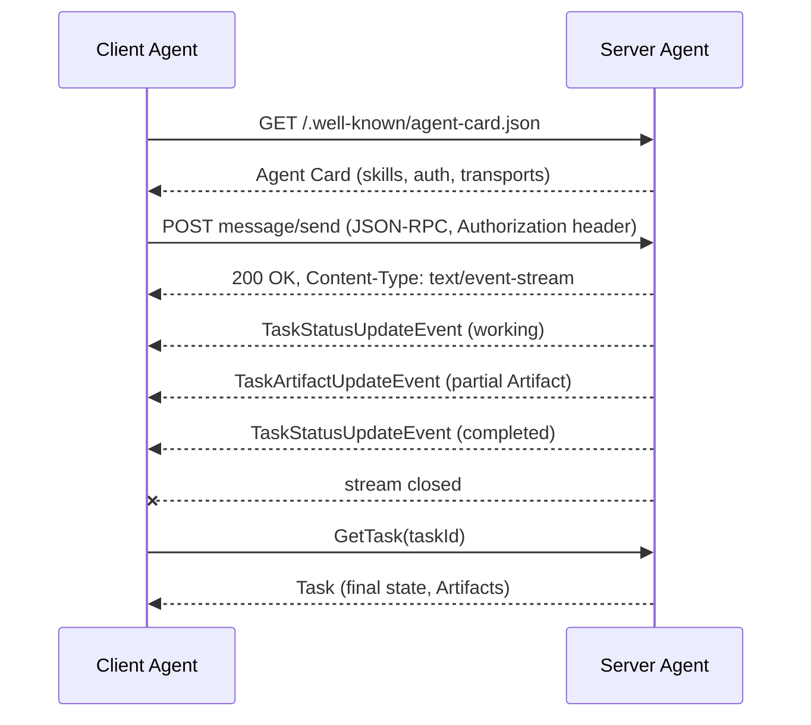

# [AEE-608] A2A: The Agent2Agent Protocol

## Context

The Agent2Agent Protocol (A2A) is an open protocol for communication and interoperability between independent AI agents. Google introduced it on April 9, 2025 to let agents built on different frameworks and by different vendors collaborate without sharing internal state, exchanging information securely and coordinating actions across enterprise platforms and applications.

On June 23, 2025, Google donated A2A to the Linux Foundation, transferring the specification, SDKs, and tooling to a vendor-neutral foundation. The founding members include AWS, Cisco, Google, Microsoft, Salesforce, SAP, and ServiceNow, and the donation explicitly aimed to keep the protocol vendor-neutral while widening contribution. The project now lives under the `a2aproject` GitHub organization with documentation hosted at `a2a-protocol.org`.

The A2A specification reached version 1.0.0 in 2026, following milestones at 0.1.0, 0.2.6, and 0.3.0. The 0.3 release (August 1, 2025) introduced gRPC support and signed Agent Cards, marking the spec's transition from launch-version churn toward a stable enterprise-grade interface. v1.0 is recent enough that SDK behaviour and partner deployments still vary. Implementers should treat the spec as the source of truth and confirm SDK feature support against their target version.

A2A sits next to the Model Context Protocol (MCP) rather than competing with it. MCP targets the agent-to-tool integration boundary; A2A targets the agent-to-agent collaboration boundary. A typical deployment uses both: an agent calls peers over A2A and reaches into its own tools and resources over MCP.

## Design Think

A2A is shaped by one architectural choice: peers stay opaque to one another. An agent that speaks A2A presents capabilities through its Agent Card and exchanges Tasks, Messages, and Artifacts over the wire. It does not expose its prompt, its memory, or its private tool inventory. The spec authors call out that wrapping a peer agent as a tool flattens its capabilities into a function signature, which loses the conversational, multi-turn, and stateful behaviour that makes the peer agent worth talking to in the first place.

The other choice is complementarity with MCP. The protocol's documentation pairs the two: A2A handles inter-agent collaboration; MCP handles the tool surface inside each agent. This separation lets a team adopt A2A without rewriting tool integrations, and lets MCP servers stay focused on their own contract.

The trade-off is interface bandwidth. Opaque peers mean the calling agent only sees what the Agent Card declares and what the Task surface returns. Engineers gain isolation and substitutability and give up the ability to micromanage a peer's reasoning. The spec compensates with Task lifecycle states, streaming updates, and structured Artifacts so that observability comes from the protocol envelope rather than from peering inside the peer.

- Engineers MUST treat A2A peers as opaque services interacting through Agent Cards, Tasks, Messages, and Artifacts, since the protocol declines to expose peer internal state.
- Teams adopting A2A SHOULD reach for MCP for tool integration inside an agent and use A2A only at the inter-agent boundary, matching the complementary roles the spec defines.
- Implementers MAY layer A2A on top of an existing agent framework without surfacing framework-specific concepts, because the wire protocol is framework-neutral by design.
- Engineers SHOULD avoid reducing a peer agent to a single tool call when the peer's value lies in multi-turn or stateful behaviour, since that pattern was identified as fundamentally limiting in the design rationale.

## Deep Dive

**Core primitives.** A2A defines five primitives. The Agent Card is the discovery document a server publishes to advertise itself. The Task is a stateful unit of work with a unique ID and a defined lifecycle. The Message is one turn of communication between client and server. The Artifact is an output the server produces. The Part is the content container used inside Messages and Artifacts, holding text, a file reference (URL or inline bytes), or structured data. Together these five compose every interaction in the protocol.

**Task lifecycle.** A Task moves through interrupted states such as `input-required` and `auth-required`, where the server is waiting on the client for more information or credentials. It resolves into one of four terminal states: `completed`, `canceled`, `rejected`, or `failed`. When a task reaches a terminal or interrupted state, the server closes any open stream and the client retrieves further state explicitly. The spec proto file defines additional intermediate states (such as `submitted` and `working`) that an in-flight Task passes through before it completes or pauses.

**Discovery.** Agents publish a JSON Agent Card at the well-known URI `/.well-known/agent-card.json`, so a client that already knows the agent's domain can fetch its capabilities directly. For agents that are not directly addressable by domain, clients can locate them through curated registries or through direct configuration handed out at deployment time. The Agent Card carries the agent's name, description, supported skills, supported transports, and the authentication schemes the server expects.

**Security and authentication.** A2A delegates identity to standard HTTP headers and declares supported authentication schemes inside the Agent Card. The schemes mirror OpenAPI's security schemes and include API key, HTTP auth, OAuth2, OpenID Connect, and mutual TLS. The protocol payloads themselves do not carry user or client identity; credentials are transmitted in standard HTTP headers, and the server enforces them at the transport layer. This places A2A's identity model alongside the rest of an enterprise's HTTP-based services rather than introducing a parallel identity layer.

## Wire Format and Message Envelope

A2A 1.0 defines a canonical Protocol Buffers data model and three concrete bindings: JSON-RPC 2.0, gRPC, and HTTP+JSON/REST. JSON-RPC 2.0 is the most widely deployed binding and is the lead choice for new integrations. gRPC suits services that already standardise on Protobuf and want bidirectional streaming. HTTP+JSON/REST suits clients that prefer plain REST tooling. The shared Protobuf model means a server can expose multiple bindings without redefining its data shapes, and a client can switch bindings without changing its conceptual model of Tasks, Messages, and Artifacts.

For long-running tasks the server streams incrementally over Server-Sent Events. The HTTP response carries `Content-Type: text/event-stream`, and each event's `data` field contains a JSON-RPC 2.0 response object, typically a `SendStreamingMessageResponse`. That response object wraps a `Task`, a `TaskStatusUpdateEvent`, or a `TaskArtifactUpdateEvent`. The stream stays open until the Task reaches a terminal or interrupted state, at which point the server closes it. SSE keeps the wire format aligned with the rest of A2A: streaming is incremental delivery of the same JSON-RPC envelope rather than a separate channel with a separate schema.

The `Part` is the content unit that travels inside Messages and Artifacts. It is a discriminated container that holds one of three variants: text, a file (inline bytes or a URL), or arbitrary structured JSON data. The structured-data variant is what lets A2A carry typed payloads (for example, a parsed invoice, a tool result, or a structured plan) alongside conversational text and file attachments. Some SDKs expose this through class names like `TextPart`, `FilePart`, and `DataPart`. Those names are SDK-side conveniences. The wire format itself uses field discriminators on a single `Part` type, so two implementations using different SDK class names still interoperate as long as they emit the same `Part` shape.

## Best Practices

1. **Use HTTPS with TLS 1.2 or higher in production.** Production A2A deployments must run over HTTPS, with credentials carried in standard HTTP headers (such as `Authorization` for bearer tokens). The spec calls out HTTPS as a requirement because the protocol delegates identity to the transport layer.
2. **Declare authentication schemes in the Agent Card explicitly.** Clients read the Agent Card to know which scheme to use (API key, HTTP auth, OAuth2, OpenID Connect, or mutual TLS). Leaving the auth declaration vague forces clients to guess and defeats the OpenAPI-style security model the spec adopts.
3. **Choose the wire binding to match your stack.** v1.0 supports JSON-RPC 2.0, gRPC, and HTTP+JSON/REST over a shared Protobuf model. JSON-RPC 2.0 is the lead binding; gRPC fits Protobuf-native services; REST fits teams already standardised on HTTP+JSON tooling.
4. **Prefer SSE streaming for long-running tasks.** When a Task takes seconds or longer, stream `Task`, `TaskStatusUpdateEvent`, and `TaskArtifactUpdateEvent` over SSE so clients see progress as it happens rather than blocking on a single response.
5. **Use push notifications for disconnected clients.** When the client cannot hold an open SSE connection (mobile, batch jobs, or stateless workers), supply a `PushNotificationConfig` with a webhook URL and authentication credentials via `CreateTaskPushNotificationConfig`. The client retrieves full Task state through `GetTask` after each notification.
6. **Pin to a specific spec version during 1.0 stabilisation.** v1.0 is recent and SDK feature parity still varies. Pin both server and client implementations to the same spec version and confirm the feature set (gRPC support, signed Agent Cards, push notifications) before relying on it.
7. **Use the official SDKs as a starting point.** Reference implementations live under the `a2aproject` GitHub organisation. The Python SDK ships as `a2a-sdk` on PyPI and the JavaScript SDK ships as `@a2a-js/sdk` on npm. Starting from these implementations reduces the surface area of protocol bugs you have to debug yourself.

## Visual



## Examples

A minimal Agent Card served at `https://agents.example.com/.well-known/agent-card.json`:

```json
{
  "name": "Invoice Reconciler",
  "description": "Reconciles supplier invoices against purchase orders.",
  "url": "https://agents.example.com",
  "version": "1.0.0",
  "transports": ["jsonrpc", "grpc"],
  "securitySchemes": {
    "bearerAuth": {
      "type": "http",
      "scheme": "bearer"
    }
  },
  "security": [{ "bearerAuth": [] }],
  "skills": [
    {
      "id": "reconcile",
      "name": "Reconcile invoice",
      "description": "Match an invoice Part against PO records and return a structured report."
    }
  ]
}
```

The card declares the well-known URI, the supported transports, the bearer-token security scheme, and one skill. A client fetches this document, picks a transport, and sends a `message/send` request whose `Message` carries an invoice as a `Part` (text, file, or structured data) toward the `reconcile` skill.

## Related AEEs

- [AEE-602](602) — Agent Communication: A2A is the inter-agent wire-protocol realization of 602's conceptual handoff model.
- [AEE-609](609) — ACP: peer protocol with different design choices on session and streaming.
- [AEE-610](610) — AG-UI: the agent-to-frontend axis, complementary to A2A's agent-to-agent axis.
- [AEE-600](600) — When to Coordinate Agents: A2A only applies once multi-agent architecture is warranted.

## References

- [What is A2A?](https://a2a-protocol.org/latest/topics/what-is-a2a/) — A2A Project, A2A Protocol Documentation (2026)
- [Key Concepts](https://a2a-protocol.org/latest/topics/key-concepts/) — A2A Project, A2A Protocol Documentation (2026)
- [Life of a Task](https://a2a-protocol.org/latest/topics/life-of-a-task/) — A2A Project, A2A Protocol Documentation (2026)
- [Agent Discovery](https://a2a-protocol.org/latest/topics/agent-discovery/) — A2A Project, A2A Protocol Documentation (2026)
- [Streaming and Asynchronous Operations](https://a2a-protocol.org/latest/topics/streaming-and-async/) — A2A Project, A2A Protocol Documentation (2026)
- [A2A and MCP](https://a2a-protocol.org/latest/topics/a2a-and-mcp/) — A2A Project, A2A Protocol Documentation (2026)
- [Enterprise-Ready Features](https://a2a-protocol.org/latest/topics/enterprise-ready/) — A2A Project, A2A Protocol Documentation (2026)
- [Agent2Agent (A2A) Protocol Specification v1.0.0](https://a2a-protocol.org/latest/specification/) — A2A Project, A2A Protocol Documentation (2026)
- [Announcing the Agent2Agent Protocol (A2A)](https://developers.googleblog.com/en/a2a-a-new-era-of-agent-interoperability/) — Surapaneni, Jha, Vakoc, Segal, Google Developers Blog (April 9, 2025)
- [Google Cloud donates A2A to Linux Foundation](https://developers.googleblog.com/en/google-cloud-donates-a2a-to-linux-foundation/) — Surapaneni, Segal, Vakoc, Google Developers Blog (June 23, 2025)
- [Linux Foundation Launches the Agent2Agent Protocol Project](https://www.linuxfoundation.org/press/linux-foundation-launches-the-agent2agent-protocol-project-to-enable-secure-intelligent-communication-between-ai-agents) — Linux Foundation, Linux Foundation Press Release (June 23, 2025)
- [Agent2Agent protocol (A2A) is getting an upgrade](https://cloud.google.com/blog/products/ai-machine-learning/agent2agent-protocol-is-getting-an-upgrade) — Surapaneni, Stephens, Google Cloud Blog (August 1, 2025)
- [Agent2Agent (A2A) Protocol Repository](https://github.com/a2aproject/A2A) — A2A Project, GitHub (2026)
- [Official Python SDK for the Agent2Agent (A2A) Protocol](https://github.com/a2aproject/a2a-python) — A2A Project, GitHub (2026)
- [Official JavaScript SDK for the Agent2Agent (A2A) Protocol](https://github.com/a2aproject/a2a-js) — A2A Project, GitHub (2026)

## Changelog

- 2026-04-28 — Initial draft
