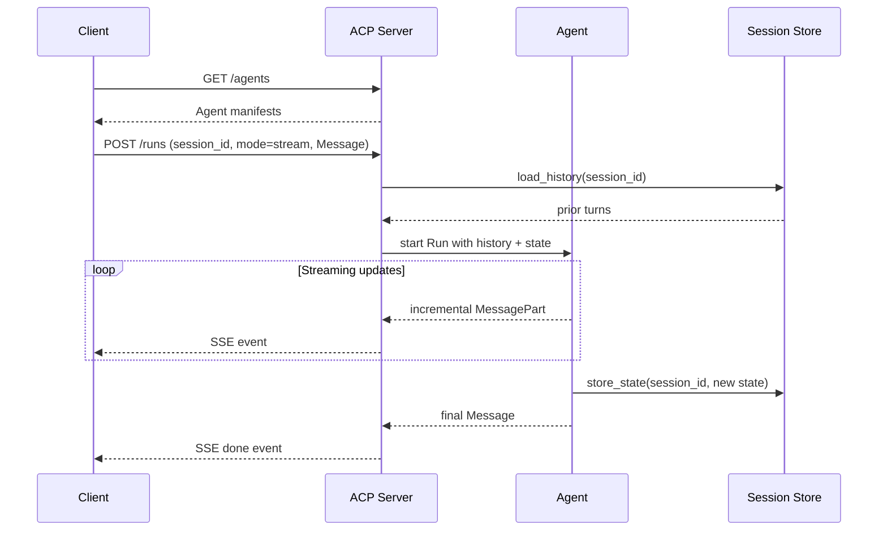

# [AEE-609] ACP: The Agent Communication Protocol

## Context

On August 29, 2025, the Linux Foundation announced that the Agent Communication Protocol (ACP) would join forces with Google's A2A protocol under LF AI & Data. The ACP team is winding down active ACP development and is contributing its technology and expertise directly into A2A, with migration paths published for existing users. Kate Blair, who led ACP at IBM, joined the A2A Technical Steering Committee alongside representatives from Google, Microsoft, AWS, Cisco, Salesforce, ServiceNow, and SAP. This article exists to teach the distinctive design choices ACP made before that absorption, because those choices are now being carried forward into A2A's roadmap rather than maintained as a separate standard.

ACP was launched by IBM Research in March 2025 and demoed at AI Dev 25, the conference hosted by Andrew Ng. Kate Blair, then director of product incubation at IBM Research, framed the ambition plainly: "Our goal is to build the HTTP of agent communication." ACP was the communication layer powering IBM's BeeAI multi-agent platform. In the same March 2025 timeframe, IBM contributed BeeAI (and ACP with it) to the Linux Foundation so that governance would sit under a neutral, open foundation rather than a single vendor.

Between launch and the August merger, ACP shipped a small, opinionated set of design decisions: REST-native transport over plain HTTP endpoints, a Message format built from ordered MessageParts with MIME types, Sessions as a first-class persistent abstraction, an Await primitive for human-in-the-loop pauses, and discovery semantics that worked both online (against a running server) and offline (via embedded manifests in distributed packages). Several of these ideas are now being absorbed into A2A through TSC discussions.

The framing for the rest of this article: ACP is a now-merged protocol whose architectural lessons remain teachable. For new builds in 2026, the practical recommendation is A2A. For teams already running ACP-deployed agents, BeeAI publishes adapters that bridge to A2A.

## Design Think

ACP's first deliberate choice was to be REST-native. The protocol exposes plain HTTP endpoints for sending, receiving, and routing agent messages, rather than wrapping everything in JSON-RPC. The consequence: any HTTP client can drive an ACP agent. `curl`, Postman, a browser, or a generic HTTP library is enough to inspect or invoke an agent end-to-end. SDKs are available for ergonomics, but they are not mandatory. This lowers the barrier for tooling, debugging, and bridging from non-agent systems that already speak HTTP fluently.

The second choice was that every Message is multi-modal by construction. A Message is an ordered sequence of MessageParts, where each part carries a MIME `content_type` and either inline `content` or a `content_url`. Text, JSON, images, audio, and binary blobs all share the same envelope. This pushes content negotiation down to a stable, well-understood mechanism (MIME) rather than encoding it as a per-protocol convention.

The third choice was Sessions as first-class state. ACP defines a Session abstraction that stitches multiple Runs together with a session identifier, and exposes `load_history()`, `load_state()`, and `store_state()` so an agent can carry conversation history and structured state across turns. The Run is the unit of execution; the Session is the unit of memory. Combined with the Await primitive, which lets an agent pause to request input from the client and resume later, ACP treats long-running, interruptible, stateful interaction as a baseline expectation rather than a layered-on feature.

These choices have direct implications for engineers and operators:

- Engineers MUST treat ACP Messages as ordered MIME-typed parts; relying on any single text field as the canonical payload silently truncates multi-modal content.
- Teams MUST NOT pick ACP for new builds in 2026; the protocol is being absorbed into A2A and its active development has wound down.
- Teams that operate ACP-deployed agents SHOULD plan a migration to A2A using the BeeAI `A2AServer` and `A2AAgent` adapters rather than investing further in ACP-specific surface area.
- Implementers MAY continue to consume ACP endpoints with plain HTTP clients during transition periods, since the REST surface remains drivable without specialized libraries.
- Implementers SHOULD use ACP Sessions explicitly when conversation state must persist across Runs, rather than re-implementing memory at the application layer.

## Deep Dive

**Core primitives.** ACP defines five primary objects and one control primitive. The Agent Manifest describes an agent's capabilities and how to invoke it. A Run is a single agent execution with a specific input, supporting synchronous or streaming output and emitting both intermediate and final results. A Message is the structured, multi-modal communication unit. A MessagePart is the individual content unit inside a Message (text, image, JSON, etc.). A Session maintains state and conversation history across multiple Runs using a session identifier. The control primitive is Await: an agent can pause a Run to request additional information from the client and resume once the client responds, which is how ACP models human-in-the-loop interaction.

**REST surface.** The on-the-wire surface is small. `GET /agents` lists discoverable agents and returns their manifests. `POST /runs` creates a Run with an input Message and a `mode` parameter. `GET /runs/{run_id}` polls status or fetches results when the client opted into asynchronous execution. The same `POST /runs` payload covers all three execution patterns by setting `"mode": "sync"`, `"mode": "async"`, or `"mode": "stream"`, so a client picks the right interaction style per call without changing endpoints.

**Message structure.** Every Message specifies a `role` identifying the sender. The valid forms are `user` (messages from a human user), `agent` (generic agent output), and `agent/{name}` (output attributed to a specific named agent). The role taxonomy mirrors chat-completion conventions while supporting multi-agent attribution within a single Session. Content always lives in MessageParts. Each part declares its MIME `content_type` (for example `text/plain`, `image/png`, `application/json`) and provides either `content` (inline) or `content_url` (external reference). Order is preserved across parts, so a Message can interleave prose and structured data deterministically.

**Discovery, online and offline.** When an ACP server is running, clients discover agents by hitting `/agents` and reading the returned manifests. Discovery also works offline: agents can embed their manifests into their distribution packages so the manifest remains readable when the agent is in a scale-to-zero state, packaged for distribution, or in a disconnected environment. The same manifest format covers both paths, which keeps the discovery story consistent whether an agent is currently serving traffic or has not yet been started.

## Session and Streaming Semantics

The session model is ACP's most distinctive contribution. The ACP SDK maintains a descriptor for each Session and stores its contents at resource servers, so an agent can access the complete history of interactions within a Session as long as the same session identifier is used consistently across Runs. Inside a Run, agents call `load_history()` to retrieve prior turns, `load_state()` to read structured state, and `store_state()` to write modified state back. The result is a protocol where conversation memory is a first-class concept owned by the runtime, with the Session as the persistence unit and the Run as the execution unit.

This contrasts with A2A's task-centric model, where each Task is the persistence boundary and longer conversations are composed by relating Tasks. Neither model is wrong. ACP optimizes for ongoing assistant-style interactions where state naturally outlives any one Run; A2A optimizes for discrete, contractually scoped work items. With the August 2025 merger, ACP's session semantics are being contributed into A2A's TSC discussions, so the practical expectation is that A2A will absorb at least some of these stateful-session ideas over time rather than treating sessions as out of scope.

Streaming and execution-mode flexibility live on the same endpoint. ACP supports synchronous calls that block until completion, asynchronous calls that return a `run_id` immediately for later polling against `GET /runs/{run_id}`, and streaming calls that emit incremental updates as the Run progresses. The protocol is described as "async-first, sync supported," and streaming is an explicit first-class capability. A client picks the mode per call by setting the `mode` field in the `POST /runs` body, without switching endpoints, payload schemas, or transport. Streaming is delivered over Server-Sent Events.

## Best Practices

1. **Use A2A for new builds in 2026.** ACP's active development has wound down following the August 29, 2025 merger announcement, and the BeeAI team is contributing ACP's technology directly into A2A. New systems SHOULD target A2A from the start to avoid building on a deprecation path. Migration paths and documentation are published by the Linux Foundation for teams already on ACP.

2. **Adopt the BeeAI migration adapters for ACP-to-A2A interop.** Agents built with the BeeAI framework can be made A2A-compliant via the `A2AServer` adapter, and external A2A agents can be integrated into BeeAI applications via `A2AAgent`. Teams running ACP today SHOULD use these adapters as the bridging layer during transition rather than maintaining parallel ACP and A2A code paths.

3. **Treat ACP and MCP as orthogonal layers.** ACP positions itself as complementary to Anthropic's MCP. The framing IBM uses is that "MCP connects agents to their tools and knowledge" while "ACP connects agents to agents." Architecture decisions SHOULD treat them as different layers in the agent stack. The same logic carries over to A2A as the successor.

4. **Build for both online and offline discovery if you ship distributable agents.** ACP supports embedding manifests in distribution packages so agents remain discoverable when they are not currently serving traffic. Teams that distribute agents (across scale-to-zero environments, packaged installers, or disconnected sites) SHOULD ship the manifest with the agent so consumers can inspect capability without needing a running server.

5. **Use Sessions explicitly when conversation state must persist across Runs.** ACP's Session abstraction with `load_history()`, `load_state()`, and `store_state()` is the supported path for cross-Run memory. Teams SHOULD use it directly rather than reimplementing memory at the application layer, because the protocol-level abstraction integrates with both client and server-side resource management.

6. **Pick the right mode per call rather than defaulting.** A `POST /runs` body can declare `mode: sync`, `async`, or `stream`. Long-running work should use `async` or `stream`; short-lived calls where the client genuinely needs to block can use `sync`. Teams SHOULD pick mode per call against the actual workload, since the same endpoint covers all three.

7. **Use the reference SDKs only where they earn their keep.** The `i-am-bee/acp` repository ships a Python SDK with server, client, and model definitions, and a TypeScript SDK with client and model definitions. Because ACP is REST-native, plain HTTP clients work end-to-end. Teams MAY use the SDKs for ergonomics, but SHOULD NOT treat them as a hard dependency, especially given the protocol's pending absorption into A2A.

## Visual



## Examples

The snippet below shows a `POST /runs` body that exercises the distinctive parts of ACP at once: a session identifier, streaming mode, and a Message that mixes a `text/plain` MessagePart with an `application/json` MessagePart.

```json
POST /runs
Content-Type: application/json

{
  "agent": "research-assistant",
  "session_id": "sess_8f3a1c2b",
  "mode": "stream",
  "input": {
    "role": "user",
    "parts": [
      {
        "content_type": "text/plain",
        "content": "Summarize the attached release notes and flag any breaking changes."
      },
      {
        "content_type": "application/json",
        "content": "{\"version\":\"2.3.0\",\"changes\":[{\"type\":\"breaking\",\"area\":\"auth\"},{\"type\":\"feature\",\"area\":\"sessions\"}]}"
      }
    ]
  }
}
```

The request creates a Run inside session `sess_8f3a1c2b`, which lets the server call `load_history()` and `load_state()` so the agent sees prior turns before it starts. The Message carries an ordered pair of MessageParts: a natural-language instruction and a structured JSON payload, each tagged with its own MIME `content_type`. Because `mode` is `stream`, the server returns Server-Sent Events as the agent emits incremental MessageParts and writes back via `store_state()` before the final event.

## Related AEEs

- [AEE-608](608) — A2A: A2A is the protocol that has absorbed ACP's contributions under LF AI & Data.
- [AEE-602](602) — Agent Communication: ACP's session model is one realization of the stateful-handoff option discussed in AEE-602.
- [AEE-610](610) — AG-UI: covers the orthogonal axis of agent-to-frontend communication.
- [AEE-600](600) — When to Coordinate Agents: the upstream framing for whether a multi-agent protocol is needed at all.

## References

- [Welcome — Agent Communication Protocol](https://agentcommunicationprotocol.dev/introduction/welcome) — ACP Project, agentcommunicationprotocol.dev (2025)
- [Message Structure](https://agentcommunicationprotocol.dev/core-concepts/message-structure) — ACP Project, agentcommunicationprotocol.dev (2025)
- [Stateful Agents (Sessions)](https://agentcommunicationprotocol.dev/core-concepts/stateful-agents) — ACP Project, agentcommunicationprotocol.dev (2025)
- [Discover & Run Agent](https://agentcommunicationprotocol.dev/how-to/discover-and-run-agent) — ACP Project, agentcommunicationprotocol.dev (2025)
- [ACP repository README](https://github.com/i-am-bee/acp) — i-am-bee, GitHub (2025)
- [ACP README (main branch)](https://github.com/i-am-bee/ACP/blob/main/README.md) — i-am-bee, GitHub (2025)
- [ACP Joins Forces with A2A Under the Linux Foundation](https://github.com/orgs/i-am-bee/discussions/5) — i-am-bee, GitHub Discussions (2025)
- [An open-source protocol for AI agents to interact](https://research.ibm.com/blog/agent-communication-protocol-ai) — Kim Martineau, IBM Research blog (2025)
- [Agent Communication Protocol (ACP) project page](https://research.ibm.com/projects/agent-communication-protocol) — IBM Research (2025)
- [Introducing multiagent BeeAI](https://research.ibm.com/blog/multiagent-bee-ai) — IBM Research blog (2025)
- [ACP Joins Forces with A2A](https://lfaidata.foundation/communityblog/2025/08/29/acp-joins-forces-with-a2a-under-the-linux-foundations-lf-ai-data/) — LF AI & Data community blog (2025)

## Changelog

- 2026-04-28 — Initial draft. Reflects ACP-into-A2A merger announced 2025-08-29.
