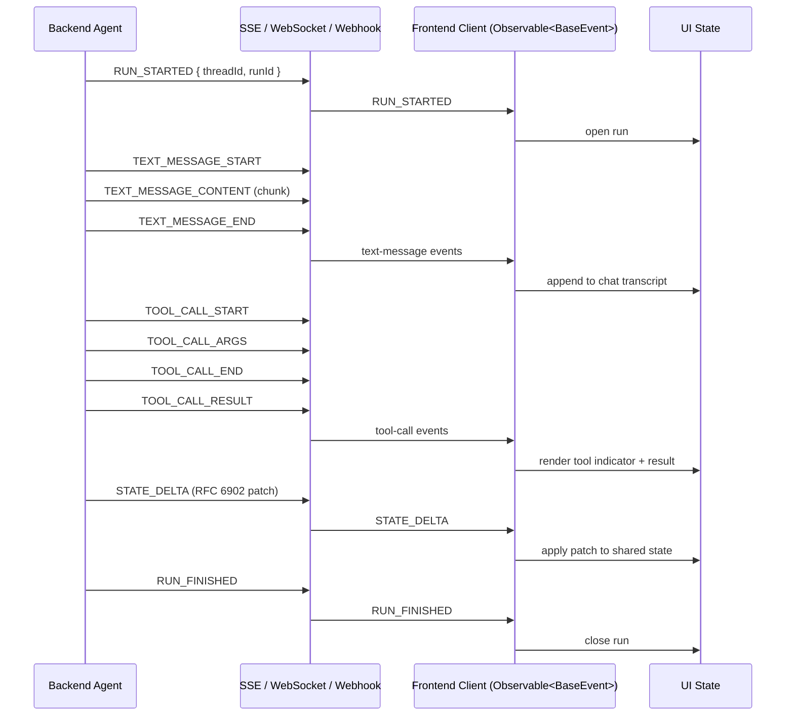

# [AEE-610] AG-UI: The Agent-User Interaction Protocol

## Context

AG-UI is the agent-to-user-interface axis, the third orthogonal protocol plane alongside A2A (agent-to-agent) and MCP (agent-to-tool). Where MCP standardizes how agents reach tools and A2A standardizes how agents reach other agents, AG-UI standardizes how an agent's running activity reaches a human-facing application — chat panels, dashboards, IDE side-panels, and the surrounding UI surface that renders what the agent is doing in real time.

The protocol was announced on May 12, 2025 by CopilotKit, who describe it as "an open, lightweight, event-based protocol that standardizes how agents connect to user-facing applications." The reference implementation is published as open source under the MIT license at `github.com/ag-ui-protocol/ag-ui`, with documentation at `docs.ag-ui.com`.

AG-UI is sometimes confused with A2UI, a separate specification originated by Google. CopilotKit has published a comparison page making the relationship explicit: A2UI is a declarative generative-UI specification that describes what to render, while AG-UI is the bi-directional runtime connection that streams events between an agent and a frontend. The two layers are complementary; AG-UI can transport A2UI payloads as part of its event surface, but the protocols themselves are distinct.

Governance-wise, AG-UI is best described as vendor-led-but-open. It is developed by the CopilotKit team in collaboration with leading agent frameworks, with no formal foundation governing the spec at the time of writing. This positions it similarly to MCP's pre-foundation phase: open license and open repo, with steering held by the originating organization and its framework partners.

## Design Think

AG-UI treats agent execution as a stream of typed events rather than a request-response exchange. A `Run` is the unit of execution; while it is in flight, the agent emits a sequence of events describing what it is doing, what it is generating, and how its state is changing. The frontend subscribes to that stream and projects events into UI state — text bubbles, tool-execution indicators, shared-state widgets, and so on.

The protocol is transport-agnostic. The spec does not mandate how events reach the client and explicitly supports Server-Sent Events (SSE), WebSockets, webhooks, and other delivery mechanisms. This deliberately decouples the event vocabulary from the wire mechanics, so the same event stream can travel over whichever transport fits the deployment.

A second deliberate choice is to build on standard HTTP. Standard HTTP traverses existing infrastructure (firewalls, proxies, CDNs) without special handling, which lowers the integration cost for teams shipping agent UIs into existing web stacks. For performance-critical paths, AG-UI also offers an optional binary serializer alongside the default text encoding.

- Engineers MUST treat the `Run` (`threadId` + `runId`) as the unit of agent execution and bracket every run with `RUN_STARTED` and a terminal `RUN_FINISHED` or `RUN_ERROR` (Claim 7, Claim 14).
- Frontends SHOULD subscribe to the event stream as `Observable<BaseEvent>` and project incoming events into UI state per event family (Claim 14).
- Backend agents SHOULD emit `STATE_DELTA` for incremental state updates and `STATE_SNAPSHOT` at synchronization boundaries (Claim 8).
- Backend agents MAY use the optional binary serializer when the default text encoding is too slow for the use case (Claim 5).
- Implementations MAY choose any supported transport — SSE, WebSockets, webhooks, or another mechanism — based on deployment constraints (Claim 4).

## Deep Dive

**Event types and families.** AG-UI defines a small set of standardized event types organized into families: lifecycle, text-message, tool-call, state, and reasoning. The reference enum currently lists around two dozen events; the canonical wire form uses SCREAMING_SNAKE_CASE values such as `RUN_STARTED`, `TEXT_MESSAGE_CONTENT`, `TOOL_CALL_ARGS`, and `STATE_DELTA` (Claim 6). The set continues to evolve, so implementations should pin to a specific spec version rather than memorizing a count.

**Run lifecycle.** Lifecycle events bracket every agent execution. `RUN_STARTED` opens a run; `RUN_FINISHED` closes it cleanly; `RUN_ERROR` closes it on failure. Inside that envelope, intermediate events stream message content, tool calls, and state changes — for example `TEXT_MESSAGE_CONTENT` and `TOOL_CALL_START` carry activity during the run (Claim 7). This bracketed shape gives the frontend deterministic boundaries to start and stop UI state machines around.

**Capability surface.** AG-UI's documented capabilities cover the full range of interactive agent UI: streaming chat, generative UI (both static and declarative), shared state, thinking steps, frontend tool calls, backend tool rendering, human-in-the-loop interrupts, sub-agents and composition, agent steering, tool output streaming, and custom events (Claim 13). The capability list is a useful menu when scoping an integration: not every UI needs all of it, and the event families map onto these capabilities directly.

**Run identity.** Each agent execution is identified by a `threadId` plus a `runId`. The `threadId` represents the conversational thread the run belongs to; the `runId` represents this specific execution within that thread (Claim 14). This vocabulary parallels A2A's `Task` identity and ACP's `Run` identity — three protocols, three names for the unit of agent execution, with AG-UI carrying the same concept on the user-facing axis.

## Frontend Event Surface

The frontend-facing surface of AG-UI is shaped by three mechanisms working together: state synchronization, tool-call streaming, and the subscription model.

State synchronization uses two events. `STATE_SNAPSHOT` carries a complete state representation at a point in time and is intended for boundary syncs — start of run, reconnection, or any other moment when the frontend needs to be in known agreement with the backend. `STATE_DELTA` carries incremental state changes expressed as a JSON Patch per RFC 6902, which lets the frontend apply small, ordered diffs to its local copy of the agent state without re-rendering the world (Claim 8). The split keeps steady-state traffic light while preserving an unambiguous resync path.

Tool calls stream as a triplet rather than as a single completion event. `TOOL_CALL_START` announces that the agent is about to invoke a tool; `TOOL_CALL_ARGS` streams the arguments as they are constructed; `TOOL_CALL_END` marks the call's completion; and `TOOL_CALL_RESULT` carries the result (Claim 9). The triplet shape is what enables a frontend to render a live "agent is calling tool X" indicator with progressive argument display, and to update that indicator the moment the result arrives.

The subscription model treats agent execution as `Observable<BaseEvent>` keyed by `threadId` and `runId`. A frontend client of type `RunAgent = () => Observable<BaseEvent>` lets React, Angular, or other reactive UI frameworks attach subscribers per run and unsubscribe when the run terminates (Claim 14). The frontend's job becomes a small, repeated pattern: receive the next event, switch on its type, and update the corresponding slice of UI state — chat transcript for `TEXT_MESSAGE_*`, tool indicator for `TOOL_CALL_*`, shared-state widget for `STATE_*`, and so on.

## Best Practices

1. **Engineers SHOULD use AG-UI when shipping a frontend that renders agent activity in real time.** Without a shared protocol every UI must reinvent adapters and edge-case handling for each agent backend; AG-UI exists to remove that custom-WebSocket-and-text-parsing tax (Claim 15, Claim 1).

2. **Teams SHOULD pick the official adapter for their agent framework rather than rolling a custom bridge.** AG-UI ships first-party adapters for LangGraph, CrewAI, Mastra, Pydantic AI, AG2, LlamaIndex, Agno, Microsoft Agent Framework, Google ADK, AWS Strands Agents, and AWS Bedrock AgentCore (Claim 10).

3. **Backend agents SHOULD use `STATE_DELTA` for incremental updates and `STATE_SNAPSHOT` for boundary syncs.** Reserving snapshots for run start, reconnect, and explicit resync points keeps steady-state traffic small while preserving a deterministic recovery path (Claim 8).

4. **Backend agents MUST stream tool calls as the `TOOL_CALL_START` / `TOOL_CALL_ARGS` / `TOOL_CALL_END` / `TOOL_CALL_RESULT` triplet rather than as a single completion event.** This is what makes live tool-execution UI possible on the frontend (Claim 9).

5. **Engineers MUST distinguish AG-UI from A2UI when discussing the protocol.** AG-UI is the runtime event-stream protocol; A2UI is Google's declarative generative-UI specification. They are complementary layers, transport-able together, and should not be conflated (Claim 12).

6. **Implementations SHOULD treat the event-type count as evolving.** Pin to a specific spec version of `EventType` rather than memorizing a fixed count, since the enum has expanded over time as families like reasoning have been added (Research Notes).

7. **Engineers SHOULD use the published reference SDKs.** TypeScript ships as `@ag-ui/core` and `@ag-ui/client` on npm; Python ships under the `ag_ui` namespace as `ag_ui.core` and `ag_ui.encoder` (Claim 11).

## Visual



## Examples

A representative slice of an AG-UI event stream for a single Run, delivered over SSE, might look like the following sequence of JSON payloads (Claim 6, Claim 7, Claim 8, Claim 14):

```json
{
  "type": "RUN_STARTED",
  "threadId": "thread_42",
  "runId": "run_2026_04_28_001"
}
```

```json
{
  "type": "TEXT_MESSAGE_CONTENT",
  "threadId": "thread_42",
  "runId": "run_2026_04_28_001",
  "messageId": "msg_1",
  "delta": "Looking up the latest invoice for you..."
}
```

```json
{
  "type": "STATE_DELTA",
  "threadId": "thread_42",
  "runId": "run_2026_04_28_001",
  "patch": [
    { "op": "replace", "path": "/currentInvoice/status", "value": "loading" }
  ]
}
```

```json
{
  "type": "RUN_FINISHED",
  "threadId": "thread_42",
  "runId": "run_2026_04_28_001"
}
```

The frontend subscriber switches on `type`, applies the JSON Patch in `STATE_DELTA` to its local copy of the agent state, and closes the run UI on `RUN_FINISHED`.

## Related AEEs

- [AEE-608](608) — A2A: agent-to-agent axis; AG-UI's `Run` parallels A2A's `Task` as the named unit of agent execution.
- [AEE-609](609) — ACP: AG-UI's `Run` also parallels ACP's `Run`; ACP and A2A cover the agent-to-agent axis, while AG-UI covers the orthogonal agent-to-user axis.
- [AEE-602](602) — Agent Communication: the umbrella article on agent communication patterns.
- [AEE-600](600) — When to Coordinate Agents: the upstream framing for choosing among coordination protocols.

## References

- [AG-UI Overview](https://docs.ag-ui.com/) — AG-UI Project (2026)
- [Introduction](https://docs.ag-ui.com/introduction) — AG-UI Project (2026)
- [Core Concepts: Architecture](https://docs.ag-ui.com/concepts/architecture) — AG-UI Project (2026)
- [JS SDK: Events](https://docs.ag-ui.com/sdk/js/core/events) — AG-UI Project (2026)
- [Quickstart: Build a Server](https://docs.ag-ui.com/quickstart/build) — AG-UI Project (2026)
- [Quickstart: Clients](https://docs.ag-ui.com/quickstart/clients) — AG-UI Project (2026)
- [AG-UI reference implementation](https://github.com/ag-ui-protocol/ag-ui) — ag-ui-protocol (2026)
- [AG-UI Protocol landing page](https://www.copilotkit.ai/ag-ui) — CopilotKit (2026)
- [AG-UI and A2UI: Understanding the Differences](https://www.copilotkit.ai/ag-ui-and-a2ui) — CopilotKit (2025)
- [Introducing AG-UI: The Protocol Where Agents Meet Users](https://www.copilotkit.ai/blog/introducing-ag-ui-the-protocol-where-agents-meet-users) — Nathan Tarbert, CopilotKit (2025-05-12)
- [Master the 17 AG-UI Event Types](https://www.copilotkit.ai/blog/master-the-17-ag-ui-event-types-for-building-agents-the-right-way) — CopilotKit Blog (2026)

## Changelog

- 2026-04-28 — Initial draft
