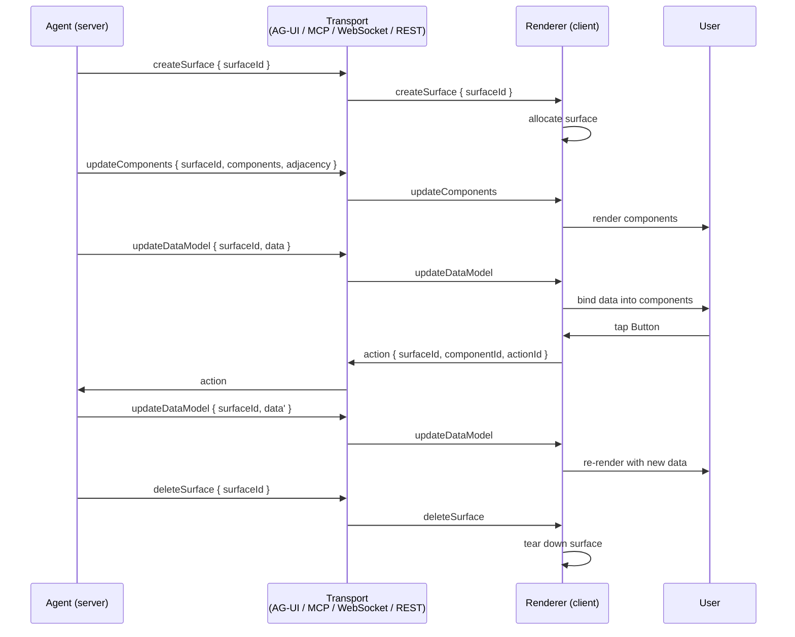

# [AEE-611] A2UI: Declarative Generative UI Protocol for Agents

## Context

A2UI sits at the agent-to-UI payload layer of the agentic protocol stack. It describes what an agent wants the user to see and interact with, encoded as a JSON message contract between an agent (server) and a renderer (client). That places it next to, and downstream of, several protocols already covered in this category: AG-UI (AEE-610) is a runtime event-stream transport that carries arbitrary agent-to-UI traffic; A2A (AEE-608) is the agent-to-agent wire protocol; ACP (AEE-609) is a now-merged inter-agent protocol with design lessons worth preserving. A2UI is the layer that says, given any of those transports, here is the UI to render.

Google launched A2UI as an open-source project on 2025-12-15, framing it as an early-stage format and a set of reference implementations the community can collaborate on (Claim 1). The repository is published under the Apache 2.0 license at `github.com/google/A2UI`, and its scope covers both the wire format and a starter set of renderers (Claim 2). A separate community project, `a2a-community/a2a-ui`, exists for managing A2A agents; that one is unrelated. Citations to A2UI as a protocol resolve to the `google` org.

The project is in Public Preview. v0.8 is labeled the current stable spec, v0.9 was published as the new normative version on 2026-04-17, and a `v0_10` directory already exists in the specification tree (Claim 16). v0.9 was also a rename pass: several v0.8 message types were renamed for clarity and easier LLM emission (Claim 12). This article uses the v0.9 vocabulary throughout and flags the v0.8 names where they still matter.

The rest of the article covers what A2UI is, the design choices behind it, the message types and reference renderers, the surface and component model, and how the protocol relates to AG-UI from AEE-610 — which is where most engineers will first encounter A2UI in practice.

## Design Think

A2UI is a declarative data format, and the protocol's documentation states that explicitly: "A2UI is a declarative data format, not executable code" (Claim 3). The agent emits structured descriptions of components and data; the client maps those descriptions onto whichever native widgets it implements. There is no JavaScript, no remote function reference, no DOM patch, and no executable payload that the client must trust. That property, combined with the catalog model described later, is what gives A2UI a workable security stance for agent-driven UIs.

The protocol also separates UI structure from UI implementation. The agent ships a description of the component tree plus an associated data model, and the client owns how those map to native widgets (Claim 4). One agent can drive a Flutter app, a Lit web component, an Angular page, and a React UI without changing what it emits, because each renderer is responsible for translating component descriptions into platform-native widgets.

A2UI is transport-agnostic. The v0.9 specification states that the protocol "defines the JSON message structure and the semantic contract between the server (Agent) and the client (Renderer), but it does not mandate a specific transport layer" (Claim 5). The v0.9 announcement makes the same point in concrete terms — "A2UI over MCP, Websockets, REST, AG UI, A2A, or whatever you want" — and adds that "any agent that already speaks AG-UI can drive A2UI v0.9 on day zero. No custom integration is required" (Claim 6). This is the cleanest framing of A2UI's relationship to AEE-610: AG-UI is one of the transports A2UI rides on, and the two protocols are designed to compose.

- Engineers MUST treat A2UI messages as untrusted declarative data and constrain components to a client-controlled catalog (Claim 3).
- Frontends SHOULD implement renderers that map A2UI component descriptions to platform-native widgets rather than executing agent-supplied code (Claim 4).
- Backend agents MAY emit A2UI over any transport — MCP, WebSockets, REST, AG-UI, or A2A — because the protocol does not bind to a delivery channel (Claim 5, Claim 6).
- Integrators SHOULD pin to v0.9 message names for new work and document v0.8 names only where compatibility with older renderers is required (Claim 12).

## Deep Dive

**Server-to-client messages.** A2UI v0.9 defines four streaming messages from the agent to the renderer (Claim 10). `createSurface` signals the client to create a new surface and begin rendering it. `updateComponents` provides a list of UI components to be added to or updated within a specific surface. `updateDataModel` sends or updates the data that populates those components. `deleteSurface` instructs the client to remove a surface and all its associated components and data from the UI. Together, these four messages cover the full lifecycle: creation, content, data binding, and teardown.

**Client-to-server messages.** The client side of the protocol is narrow. Only two message types flow back to the agent (Claim 11): `action`, sent when the user interacts with a component that has an `action` defined (a `Button` press, for example), and `error`, used to report a client-side fault. There is no DOM-event firehose and no implicit telemetry channel. If the agent wants to know about an interaction, the catalog must define an `action` on the relevant component, and the client emits an `action` message in response.

**v0.8 to v0.9 rename history.** v0.9 was an explicit rename pass over v0.8's vocabulary (Claim 12). `beginRendering` was replaced by `createSurface`. `surfaceUpdate` became `updateComponents`. `dataModelUpdate` became `updateDataModel`. The evolution guide also flattens the message shape with a discriminator field — `component: "Text"` rather than a dynamic key — because, as the guide puts it, "this 'flat' structure with a discriminator field (`component: \"Text\"`) is much easier for LLMs to generate consistently than a dynamic key." The verbs in the v0.9 names line up better with what the messages do, and the flat shape lines up better with how language models emit JSON.

**Reference renderers.** A2UI ships official renderers for Lit/web-core, Flutter (the GenUI SDK), Angular, and React, with the React renderer landing alongside the v0.9 release: "We've also landed the official React renderer and version-bumped all A2UI supported renderers (Flutter, Lit, Angular, and React)" (Claim 13). Flutter's GenUI SDK uses A2UI as its streaming UI protocol, so a Flutter app can connect to an A2UI server and render agent-generated interfaces natively (Claim 14). The Flutter `genui` package is in alpha at the time of writing.

**Adoption.** Adoption already spans Google-internal products — Opal, Gemini Enterprise, Flutter GenUI, ADK Web — and external integrators including CopilotKit/AG-UI, AG2's `A2UIAgent`, Vercel's json-render, and Oracle's Agent Spec (Claim 15). The CopilotKit/AG-UI integration is the most relevant to AEE-610 readers: it confirms in production that AG-UI agents can drive A2UI surfaces.

## Surface and Component Model

A surface is the canvas A2UI renders into, and its lifecycle is gated. The v0.9 specification states that "a surface must be created before any `updateComponents` or `updateDataModel` messages can be sent to it" (Claim 7). `createSurface` is therefore not just a hint; it is a precondition. Subsequent `updateComponents` and `updateDataModel` messages reference a surface ID, and the client is entitled to drop messages that target a surface it does not have. `deleteSurface` is the matching teardown — it removes the surface together with all its associated components and data.

Components are sent as a flat list whose parent-child relationships are reconstructed from ID references in an adjacency list (Claim 8). That flat-list-with-adjacency design is doing two jobs at once. First, it lets an LLM stream components incrementally, because each component is self-contained and addressable by ID, and the adjacency list can be amended as new components arrive. Second, paired with the v0.9 flat-discriminator shape (Claim 12), it keeps `component:` as a fixed string field rather than a dynamic key — easier for a model to emit consistently across a long generation. The structure is a serialization choice with model ergonomics in mind.

The set of widgets an agent may request is bounded by a Catalog supplied by the client, with `basic_catalog.json` as the reference baseline (Claim 9). The catalog defines which components exist, what properties they accept, and which actions they can emit. The agent picks from the catalog; it cannot introduce new component types over the wire. This is where the security stance from Design Think turns into an operational rule: the agent declares intent in declarative form, and the client controls the rendering surface by controlling the catalog. A renderer that ships a minimal catalog gives a small attack surface; a renderer that ships a permissive catalog accepts a larger one. The catalog is the policy boundary.

## Agent-Side Integration

The agent side of A2UI is the part that emits messages. The `google/A2UI` repository ships official tooling for this in three layers, with the recommended pattern documented in the Agent SDK Guide.

**Tool-calling via `SendA2uiToClientToolset`.** The recommended integration uses LLM function calling. The SDK exposes a toolset whose tool — `send_a2ui_json_to_client` — the LLM invokes to push UI updates (Claim 17). The agent program does not write A2UI JSON directly; the LLM reasons about which UI to render, calls the tool, and the SDK translates the call into a valid A2UI message before sending. This is documented in Section 9 of `agent_sdks/agent_sdk_guide.md`, and the Python ADK implementation lives in `a2ui.adk.send_a2ui_to_client_toolset`.

**Streaming-parser pattern with text delimiters.** A complementary pattern handles cases where tool-calling is unavailable or the agent emits text completions instead of structured calls. The LLM wraps A2UI JSON in delimiters such as `<a2ui-json>` inside its normal text stream, and the SDK's `A2uiStreamParser` consumes the stream chunk by chunk, yielding A2UI Parts as complete messages arrive (Claim 18). Communication is a stream of JSON objects parsed incrementally, and the conformance suite enforces parity across language implementations on chunk buffering and edge cases like cut tokens (Claim 24).

**Direct JSON for languages without a published SDK.** Agent SDK source ships in five language slots — Python, Kotlin, Java, and C++ — under a language-agnostic conformance suite (Claim 20). The Python SDK is published on PyPI as `a2ui-agent-sdk` and depends on `a2a-sdk`, `google-adk`, `google-genai`, and `jsonschema` (Claim 19). There is no TypeScript or JavaScript agent SDK in v0.9; agents in those languages emit A2UI JSON directly. The spec ships formal JSON Schema (draft 2020-12) under `specification/v0_9/json/` for messages, capabilities, data model, and the basic catalog, so any agent can statically validate output before transmission (Claim 21).

**Catalog handshake at session start.** Catalog selection is a runtime negotiation. The client sends `a2uiClientCapabilities.supportedCatalogIds` (a list of catalog URIs) plus optional `inlineCatalogs` over the transport's metadata or initialization payload — A2A metadata, Agent Cards, MCP initialization, or AG-UI events — and the agent constrains its component choices to those catalogs (Claim 22). The handshake replaces the simpler "both sides agree on a catalog at compile time" model that earlier write-ups sometimes imply.

**Reference agents.** Eight runnable Python agents under `samples/agent/adk/` demonstrate the patterns end to end: `restaurant_finder`, `orchestrator`, `personalized_learning`, `rizzcharts`, `gemini_enterprise`, `custom-components-example`, `mcp-apps-in-a2ui-sample`, and `mcp_app_proxy` (Claim 23). All ship as Google ADK projects; the easiest entry point for a new integrator is to read `restaurant_finder` alongside the Agent SDK Guide.

## Best Practices

1. **Pin to v0.9 (not v0.8) for new integrations.** v0.9 renamed several v0.8 message types and adopted a flat-discriminator shape that is easier for LLMs to emit (Claim 12). The project is also actively iterating, with v0.10 already in the specification tree (Claim 16), so newer is closer to the direction of travel. Reserve v0.8 names for compatibility with older renderers.

2. **Use the official renderer for your platform.** A2UI ships official renderers for Lit/web-core, Flutter, Angular, and React (Claim 13). Flutter's GenUI SDK in particular is integrated with A2UI as its streaming UI protocol (Claim 14). Note that the Flutter `genui` package is in alpha and may change; account for that when picking it as a starting path.

3. **Treat A2UI as a payload, not a transport.** A2UI defines the JSON message structure between agent and renderer and does not mandate a delivery channel (Claim 5). Pick a transport — MCP, WebSockets, REST, AG-UI, or A2A — based on your runtime, and let A2UI ride on top (Claim 6).

4. **Pair A2UI with AG-UI when shipping a real-time agent UI.** The v0.9 announcement states that "any agent that already speaks AG-UI can drive A2UI v0.9 on day zero. No custom integration is required" (Claim 6). If your stack already covers AG-UI from AEE-610, A2UI plugs into the same event stream as the payload format and inherits AG-UI's transport plumbing.

5. **Lock down the catalog.** The protocol's security stance assumes the agent emits declarative data and is restricted to components from the client's pre-approved catalog (Claim 3, Claim 9). Ship the smallest catalog that covers your use case, review additions to it as security-relevant changes, and treat `basic_catalog.json` as a starting point to harden, not a default to ship as-is. Catalog selection happens at runtime via `a2uiClientCapabilities.supportedCatalogIds` (Claim 22), so the list a server accepts is a deployment-time configuration that belongs in the same review track as other security policies.

6. **Expect message-type churn.** v0.9 renamed v0.8 messages, and v0.10 already exists in the specification tree (Claim 12, Claim 16). Build adapters that keep message names in one place so a future rename pass becomes a one-file change. Subscribe to the spec repository if your integration depends on stable wire shapes.

7. **Cite the right repository.** A2UI lives at `github.com/google/A2UI`. The community project at `a2a-community/a2a-ui` is unrelated and addresses A2A agent management. References, READMEs, and onboarding docs MUST disambiguate to avoid sending integrators to the wrong project.

## Visual



## Examples

A typical surface lifecycle: the agent creates a surface, sends two components with an adjacency list, binds data to them, and receives an `action` when the user interacts. Field names below follow the v0.9 message reference (Claim 7, Claim 8, Claim 9, Claim 10, Claim 11). Concrete property names inside individual components depend on the catalog the client publishes.

```json
// 1. createSurface — the agent opens a surface to render into
{
  "type": "createSurface",
  "surfaceId": "order-confirm-1"
}
```

```json
// 2. updateComponents — flat list of components plus an adjacency list
//    that reconstructs the tree by ID reference
{
  "type": "updateComponents",
  "surfaceId": "order-confirm-1",
  "components": [
    { "id": "root",     "component": "Column" },
    { "id": "headline", "component": "Text",   "props": { "text": "{{ title }}" } },
    { "id": "confirm",  "component": "Button", "props": { "label": "Confirm" }, "action": "confirm-order" }
  ],
  "adjacency": {
    "root": ["headline", "confirm"]
  }
}
```

```json
// 3. updateDataModel — populate the bindings the components reference
{
  "type": "updateDataModel",
  "surfaceId": "order-confirm-1",
  "data": {
    "title": "Confirm your order"
  }
}
```

```json
// 4. action — client-to-server, fired when the user presses Confirm
{
  "type": "action",
  "surfaceId": "order-confirm-1",
  "componentId": "confirm",
  "actionId": "confirm-order"
}
```

After receiving the `action`, the agent typically sends another `updateDataModel` (or a fresh `updateComponents` for a new view), and eventually a `deleteSurface` when the flow ends. The `Column`, `Text`, and `Button` types in this example are entries from the catalog the client publishes; an agent that asks for a component not in the catalog is out of contract.

## Related AEEs

- [AEE-610](610) — AG-UI: AG-UI is the transport-layer event stream; A2UI is one of the payload formats AG-UI can carry. Google's v0.9 announcement frames AG-UI agents as drop-in A2UI drivers.
- [AEE-608](608) — A2A: A2A is the agent-to-agent wire protocol; A2UI describes the UI an A2A agent renders to a user.
- [AEE-609](609) — ACP: design lessons from a now-merged inter-agent protocol.
- [AEE-602](602) — Agent Communication: the umbrella article on agent communication patterns.
- [AEE-600](600) — When to Coordinate Agents: upstream framing.

## References

- [Introducing A2UI: an Open Project for Agent-driven Interfaces](https://developers.googleblog.com/introducing-a2ui-an-open-project-for-agent-driven-interfaces/) — Google A2UI Team, Google Developers Blog (2025)
- [A2UI v0.9: Generative UI for Agents](https://developers.googleblog.com/a2ui-v0-9-generative-ui/) — Google A2UI Team, Google Developers Blog (2026)
- [A2UI repository (README)](https://github.com/google/A2UI) — Google, GitHub (2026)
- [A2UI Documentation Home](https://a2ui.org/) — A2UI Project, a2ui.org (2026)
- [A2UI (Agent to UI) Protocol v0.9](https://a2ui.org/specification/v0.9-a2ui/) — A2UI Project, a2ui.org (2026)
- [Evolution Guide v0.8 to v0.9](https://a2ui.org/specification/v0.9-evolution-guide/) — A2UI Project, a2ui.org (2026)
- [Message Reference](https://a2ui.org/reference/messages/) — A2UI Project, a2ui.org (2026)
- [Quickstart](https://a2ui.org/quickstart/) — A2UI Project, a2ui.org (2026)
- [A2UI in the World (Adopters)](https://a2ui.org/ecosystem/a2ui-in-the-world/) — A2UI Project, a2ui.org (2026)
- [What is A2UI?](https://a2ui.org/introduction/what-is-a2ui/) — A2UI Project, a2ui.org (2026)
- [Get started with GenUI SDK for Flutter](https://docs.flutter.dev/ai/genui/get-started) — Flutter Team, docs.flutter.dev (2026)
- [A2UI Agent SDKs (root)](https://github.com/google/A2UI/tree/main/agent_sdks) — Google, GitHub (2026)
- [A2UI Agent SDK Guide](https://github.com/google/A2UI/blob/main/agent_sdks/agent_sdk_guide.md) — Google, GitHub (2026)
- [A2UI Python Agent Development Guide](https://github.com/google/A2UI/blob/main/agent_sdks/python/agent_development.md) — Google, GitHub (2026)
- [A2UI v0.9 JSON Schema Files](https://github.com/google/A2UI/tree/main/specification/v0_9/json) — Google, GitHub (2026)
- [A2UI Reference Agents (ADK)](https://github.com/google/A2UI/tree/main/samples/agent/adk) — Google, GitHub (2026)

## Changelog

- 2026-04-28 — Initial draft. Reflects A2UI v0.9 (released 2026-04-17).
- 2026-04-28 — Added "Agent-Side Integration" section covering SDK + tool calling, streaming parser, JSON Schema, catalog handshake, and reference agents; updated Best Practice 5 with the runtime-handshake fact.
