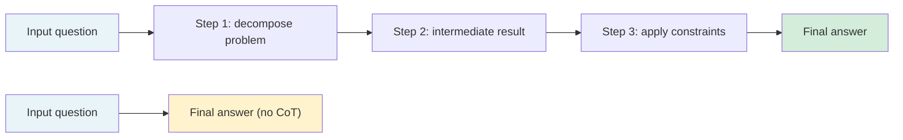

# [AEE-302] Chain-of-Thought Prompting

## Context

Chain-of-thought (CoT) prompting instructs the model to produce intermediate reasoning steps before giving a final answer. It consistently improves performance on tasks that require multi-step reasoning — arithmetic, logical deduction, multi-constraint planning — but it is not a universal improvement. Applied to tasks that do not require reasoning chains, it adds latency and token cost without quality benefit. Engineers who apply CoT indiscriminately optimize for the appearance of reasoning rather than actual task quality.

## Design Think

The core claim: chain-of-thought prompting improves model performance on reasoning tasks by extending the pattern space available during generation — but it is not a universal improvement. Applying CoT to tasks that do not require multi-step reasoning adds latency and cost without quality benefit.

**Why CoT works:**

LLMs generate output token by token. When the model produces a reasoning chain before the answer, those intermediate tokens become additional context that influences the final answer token. More importantly, reasoning-shaped token sequences activate training patterns associated with worked examples of correct reasoning — more of which become statistically reachable when the model has generated reasoning text. AEE-110 covers this mechanism in depth; the practical consequence is that producing a reasoning chain before the answer is a form of extended context that surfaces more relevant training signal.

**Zero-shot CoT:**

Kojima et al. (2022) demonstrated that appending "Let's think step by step" to a prompt causes instruction-tuned models to generate reasoning chains and substantially improves accuracy on reasoning tasks without providing any worked examples. On MultiArith, zero-shot CoT improved accuracy from 17.7% to 78.7%; on GSM8K, from 10.4% to 40.7%. This works because instruction-tuned models have learned to associate step-by-step reasoning language with systematic problem-solving. Common zero-shot triggers: "Let's think step by step", "Think carefully before answering", "Work through this systematically".

**Few-shot CoT:**

Wei et al. (2022) introduced few-shot CoT: providing worked examples of reasoning chains in the prompt. Each example shows the full reasoning process, not just the answer. Few-shot CoT typically outperforms zero-shot CoT on complex reasoning tasks because the examples constrain the style and depth of reasoning the model produces. Wei et al. demonstrated that few-shot CoT achieves state of the art on GSM8K, surpassing fine-tuned GPT-3 with a verifier. The quality of examples matters more than their count: one well-structured reasoning chain is more effective than three poorly-structured ones.

**When CoT helps:**

- Multi-step arithmetic and algebra
- Logical deduction with multiple premises
- Multi-constraint planning (scheduling, resource allocation)
- Code debugging (tracing execution step by step)
- Tasks where the correct answer requires combining information from multiple parts of the context

**When CoT does not help (or hurts):**

- Single-step factual lookup: "What is the capital of France?" requires retrieval, not reasoning. CoT adds tokens without improving accuracy.
- Single-step classification with a short context: the model does not benefit from reasoning steps when the decision is straightforward.
- Tasks where model scale already saturates the problem: on tasks the model handles correctly without CoT, adding CoT may produce verbose reasoning that occasionally leads the model astray.
- Small models: Wei et al. found that CoT only improves performance at sufficient model scale. For very small models (well below the scale of current API-served models), CoT may degrade performance rather than improve it.

- CoT MUST NOT be applied universally across all tasks in a system. Engineers SHOULD evaluate each task type with and without CoT before deploying.
- Zero-shot CoT ("Let's think step by step") SHOULD be the default starting point for reasoning tasks. Few-shot CoT SHOULD be used when zero-shot CoT produces inconsistent reasoning quality.
- Systems using CoT MUST account for increased token consumption and latency in their cost and performance models.

## Deep Dive

### The Scale Dependency

Wei et al. (2022) showed that CoT benefits emerge reliably above a certain model scale. Below that threshold, adding reasoning chain instructions does not improve — and sometimes degrades — performance. The intuition: generating a plausible-looking reasoning chain requires the model to already be capable of reasoning about the problem. A small model asked to produce step-by-step reasoning may generate reasoning-shaped text that is locally plausible but globally incorrect, leading to a wrong answer backed by a confident-sounding rationale.

For current frontier models accessed via API (GPT-4o, Claude, Gemini Pro), the scale threshold is not a practical concern. For smaller fine-tuned models or quantized local models, benchmark with and without CoT before assuming it helps.

### Few-Shot CoT: Example Quality

In few-shot CoT, the examples show not just input-output pairs but the full reasoning chain: how the problem is decomposed, what intermediate results are calculated, how constraints are applied step by step. The model learns to replicate this reasoning style.

Example quality guidelines:
- Cover the full difficulty range expected in production — not just easy examples
- Show the reasoning explicitly at each step, not just the final calculation
- Keep examples internally consistent in notation and style
- Include at least one example that handles an edge case or constraint that appears in production

### Worked Example

**Task:** Classify whether a customer support request is urgent (needs response within 1 hour) or standard (24-hour response).

**Without CoT:**

```
System: Classify customer support requests as URGENT or STANDARD.
User: My account has been charged twice for the same order.
```

The model may correctly classify this as URGENT, but inconsistently — some duplicated charges get STANDARD when the model pattern-matches on "account" rather than reasoning about urgency.

**With zero-shot CoT:**

```
System: Classify customer support requests as URGENT or STANDARD.
Think through your reasoning before giving the classification.
User: My account has been charged twice for the same order.
```

Model output:
```
Thinking: This customer has been double-charged, which means money has already
been taken from their account. Financial errors affecting current account balances
need immediate attention to prevent further harm. Classification: URGENT.
```

The reasoning step forces the model to evaluate the financial impact rather than pattern-matching on surface features, producing more consistent classifications across edge cases.

## Visual



With CoT (top path): intermediate tokens extend the pattern space, surfacing more relevant training signal. Without CoT (bottom path): single-step generation; correct for simple tasks, degrades on complex ones.

## Best Practices

1. **Start with zero-shot CoT for reasoning tasks and measure accuracy before adding few-shot examples.** Zero-shot CoT ("Let's think step by step") is cheaper to maintain than a few-shot example set and often sufficient for well-scoped reasoning tasks. Add few-shot examples only when zero-shot CoT produces inconsistent reasoning quality.

2. **Run A/B benchmarks on a task sample before deploying CoT.** Measure accuracy, latency, and token cost both with and without CoT on a representative sample of production inputs. For tasks that do not require reasoning, the A/B result will show no accuracy improvement — in which case remove CoT from the prompt.

3. **Budget for CoT's token cost.** A reasoning chain adds 100–500 tokens per request depending on task complexity. For high-volume tasks, this multiplies inference cost. Calculate the per-request token delta and decide whether the accuracy improvement justifies it.

## Related AEEs

- [AEE-301](301) — Prompt Structure Fundamentals (prompt anatomy and component layout)
- [AEE-110](../Foundations and Mental Models/110) — LLM Limitations and Failure Modes (reasoning limitations and CoT as mitigation)
- [AEE-303](303) — Few-Shot Prompting
- [AEE-305](305) — Self-Consistency and Ensembling

## References

- [Chain-of-Thought Prompting Elicits Reasoning in Large Language Models (Wei et al., arXiv 2201.11903)](https://arxiv.org/abs/2201.11903)
- [Large Language Models are Zero-Shot Reasoners (Kojima et al., arXiv 2205.11916)](https://arxiv.org/abs/2205.11916)

## Changelog

- 2026-04-14 -- Initial draft
