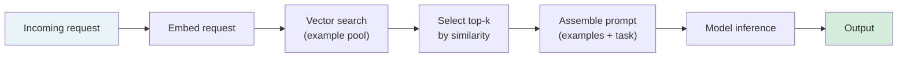

# [AEE-303] Few-Shot Prompting

## Context

Few-shot prompting provides the model with input-output examples before the actual task input. The model uses these examples to infer the task pattern and apply it to the new input — a process called in-context learning. Brown et al. (2020) established this capability at scale: providing a small number of examples substantially improved performance across diverse tasks without any weight updates to the model.

The technique appears simple — paste in examples — but example quality, diversity, and ordering all affect output quality significantly. Engineers who treat few-shot prompting as "give it some examples" without deliberate selection produce prompts that work on development inputs and fail on production ones.

## Design Think

The core claim: few-shot prompting is an in-context learning mechanism, not a shortcut for avoiding instruction writing. Example quality, diversity, and selection method all affect output quality more than example count.

**What in-context learning is:**

In-context learning is not fine-tuning. The model's weights do not change. What changes is which patterns in the model's training distribution are most strongly activated. Providing examples of a specific task format causes the model to generate outputs that match that format — not because it learned from those examples, but because those examples resemble training data associated with that format. This means the model can generalize the pattern, but only within its existing capabilities: in-context learning cannot teach the model facts it does not know or capabilities it does not have.

**What matters in examples:**

Min et al. (2022) found a counterintuitive result: for many classification tasks, the correctness of example labels mattered less than the format consistency of the examples. A set of examples where inputs and outputs are consistently formatted — even with randomly assigned labels — often produced similar performance to correctly-labeled examples. This suggests that in-context learning primarily activates the task format rather than learning from specific input-output mappings. The practical implication: format consistency is load-bearing; content quality matters most when the task requires understanding specific semantic distinctions.

**Example quality:**

Well-formed examples have: a clear, complete input representative of production inputs; a correct, precisely formatted output; no ambiguity about why the output was produced given the input. Noisy examples — where the relationship between input and output is not clear — degrade performance by activating conflicting format patterns.

**Example diversity:**

Examples must cover the input distribution the model will encounter in production. A set of three similar examples teaches the model one pattern; three diverse examples that cover different edge cases teach it the pattern's boundaries. For classification tasks: include examples near the decision boundary, not just clear-cut cases. For generation tasks: include examples of different input lengths and complexity levels.

**Example count:**

Diminishing returns typically appear above 8–10 examples for most tasks. Three to five well-chosen, diverse examples often outperform twenty poorly-chosen ones. Adding more examples beyond the point of diminishing returns consumes context budget without improving quality.

**Order sensitivity:**

Models are sensitive to the order in which examples appear. Later examples have stronger influence on the output — the model's attention gives more weight to recent context. A set of examples where the most relevant example happens to appear last will outperform an equivalent set where it appears first. Strategies: randomize order across runs to average out position effects; place the most representative example last; test order variants before settling on a fixed order.

**Static vs. dynamic selection:**

Static example sets work when the input distribution in production is narrow and well-understood. Dynamic selection — retrieving the top-k most semantically similar examples from a larger pool at inference time — is more robust when the input distribution varies. Dynamic selection requires a vector store and adds retrieval latency but produces better example-task match for variable inputs.

**RFC 2119:**

- Few-shot example sets MUST be tested for order sensitivity before deployment. Reorder the examples and measure whether output quality changes; if it does, either fix the ordering or randomize it.
- Dynamic example selection SHOULD be used when the input distribution varies significantly across production requests and a larger example pool is available.
- Example sets MUST cover edge cases in the expected input distribution, not only typical cases.

## Deep Dive

### The Static vs. Dynamic Selection Decision

Static selection is appropriate when:
- The task has a narrow, stable input distribution (e.g., classifying support tickets from a known set of categories)
- You have fewer than 50 candidate examples
- Retrieval latency cannot be added to the request path

Dynamic selection is appropriate when:
- Inputs vary significantly across users or contexts
- You have a large pool of high-quality examples (50+)
- The retrieval latency budget (typically 50–150ms for vector search) is acceptable

For dynamic selection, the retrieval model matters: a general-purpose embedding model may not produce good semantic similarity for domain-specific tasks. Consider domain-adapted embeddings when general similarity scores are poor.

### Worked Example

**Task:** Classify customer support emails into one of three categories: BILLING, TECHNICAL, GENERAL.

**Weak static example set (similar examples, poor coverage):**

```
Input: I was charged twice.
Output: BILLING

Input: My invoice shows the wrong amount.
Output: BILLING

Input: I want to cancel my subscription.
Output: BILLING
```

Problem: all three examples are billing-related. The model has seen no TECHNICAL or GENERAL examples. Novel inputs that are ambiguously billing-adjacent will be mis-classified as BILLING.

**Strong static example set (diverse, boundary-covering):**

```
Input: I was charged twice this month.
Output: BILLING

Input: The app crashes every time I open a project.
Output: TECHNICAL

Input: I'd like to update my mailing address.
Output: GENERAL

Input: My payment failed but my account shows a charge.
Output: BILLING

Input: The API returns a 500 error when I call /export.
Output: TECHNICAL
```

The set now covers all three categories and includes a boundary case (payment-failed-but-charged, which requires distinguishing a billing error from a payment failure).

## Visual



Dynamic few-shot selection pipeline: the incoming request is embedded, the top-k most similar examples are retrieved from the pool, and the prompt is assembled with those examples before model inference.

## Best Practices

1. **Build your example pool before selecting examples for deployment.** Collect 20–50 labeled examples covering the full expected input distribution. Then select the best 3–7 from that pool for the static set. Do not write examples specifically for the prompt — this produces examples calibrated to your mental model of the task, not the actual production distribution.

2. **Test order sensitivity before locking in a fixed example ordering.** Run the same prompt with examples in three random orderings and measure output quality variance. If quality is stable across orderings, the order is not load-bearing. If it varies significantly, fix the order with the highest-quality configuration and document why.

3. **Prefer diverse examples over similar ones.** When adding a new example, ask: what part of the input distribution does this cover that the existing examples do not? If the answer is "nothing new," the example adds context budget cost without improving coverage.

## Related AEEs

- [AEE-301](301) — Prompt Structure Fundamentals (examples as a structural component)
- [AEE-302](302) — Chain-of-Thought Prompting (few-shot CoT)
- [AEE-202](../Model and Context Layer/202) — Context Window Architecture (context budget for example sets)

## References

- [Language Models are Few-Shot Learners (Brown et al., arXiv 2005.14165)](https://arxiv.org/abs/2005.14165)
- [Rethinking the Role of Demonstrations: What Makes In-Context Learning Work? (Min et al., arXiv 2202.12837)](https://arxiv.org/abs/2202.12837)

## Changelog

- 2026-04-14 -- Initial draft
