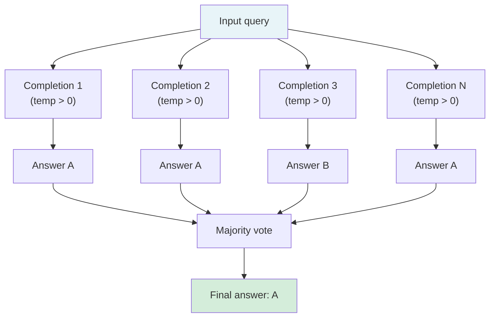

# [AEE-305] Self-Consistency and Ensembling

## Context

A single model completion carries inherent variance. For most tasks this variance is acceptable — the answer is correct most of the time and the cost of an occasional error is low. For high-stakes decisions where a single wrong answer is costly, the variance is not acceptable. Self-consistency and ensembling are techniques that trade additional inference cost for reduced output variance: generate multiple completions, aggregate the results, return the aggregate rather than any individual completion.

These techniques are not free. Generating N completions costs N times the inference budget. The decision to use them is an explicit engineering trade-off: is the reliability improvement worth the cost multiple?

## Design Think

The core claim: self-consistency and ensembling trade inference cost for reliability — they are appropriate for high-stakes decisions where a single model completion carries unacceptable variance, and inappropriate for latency-sensitive or cost-sensitive workloads.

**Self-consistency:**

Wang et al. (2022) introduced self-consistency for chain-of-thought prompting: sample multiple completions at non-zero temperature, run each through a CoT reasoning chain, take the majority vote on the final answer. The intuition: if multiple independent reasoning paths converge on the same answer, that answer is more likely to be correct than one produced by a single path. Wang et al. demonstrated accuracy improvements of +17.9% on GSM8K, +11.0% on SVAMP, and +12.2% on AQuA over standard CoT.

Self-consistency requires non-zero temperature so that the N completions are actually different reasoning paths. At temperature 0, all completions are identical and majority voting produces no benefit.

**Majority voting mechanics:**

For categorical tasks (classification, yes/no decisions, multiple-choice): count the occurrences of each answer and select the most frequent. Tie-breaking: select the answer that appeared most often across the reasoning chains, or if tied, return the answer from the completion with the most detailed reasoning.

For generative tasks (summaries, answers to open questions): exact-match voting is not meaningful. Options: use a scoring prompt to rank completions ("Which of these responses best answers the question?"), cluster semantically similar completions and vote on clusters, or select the completion most similar to all others.

**Best-of-N:**

Best-of-N generates N completions and selects the best using a scoring function rather than majority voting. The scoring function can be: a reward model, a self-evaluation prompt ("Rate this response on correctness and completeness from 1–10"), a heuristic (longest complete answer, first answer that parses as valid JSON), or a combination. Best-of-N applies to open-ended generation tasks where majority voting is not meaningful, but it costs N inferences plus a scoring pass.

**Ensembling across prompts:**

Instead of running the same prompt N times, run N different phrasings of the prompt and aggregate. This reduces sensitivity to prompt wording — a different failure mode from stochastic sampling variance. Useful when the concern is that a specific prompt phrasing activates a biased response pattern.

**Cost model:**

Self-consistency with N completions costs N times the inference budget for the completions. For a task that costs $0.01 per completion, self-consistency at N=5 costs $0.05 per request. Before deploying: calculate the task volume, the per-completion cost, and the per-task cost at the chosen N. Decide whether the reliability improvement justifies the cost multiple for this task's quality bar.

Accuracy gains from self-consistency show diminishing returns as N increases. Most of the benefit is captured at moderate N values; further increases produce smaller marginal gains. Choose the smallest N that meets the task's reliability requirement on a validation sample.

- Self-consistency MUST NOT be applied to latency-critical paths without explicit latency budget analysis. Each additional completion adds latency proportional to the per-completion response time (though parallel dispatch mitigates this — see Best Practices).
- Engineers MUST calculate the cost multiple (N × per-completion cost) before deploying ensembling in production.
- Self-consistency SHOULD only be used with non-zero temperature. At temperature 0, all completions are identical and voting produces no benefit.

## Deep Dive

### When Self-Consistency Helps Most

Self-consistency helps most when:
1. The task requires multi-step reasoning (arithmetic, logic) and any single reasoning chain might fail at one step
2. The answer space is discrete and finite (classification, yes/no, multiple choice)
3. The model's accuracy on single completions is above random — if single-completion accuracy is near chance, self-consistency cannot reliably recover correct answers

Self-consistency helps least when:
1. Single completions already achieve near-ceiling accuracy (marginal reliability gain)
2. The task requires long-form generation where aggregation is expensive or ill-defined
3. Latency is the primary constraint

### Worked Example

**Task:** Classify whether a contract clause creates liability risk for the buyer (YES/NO). High-stakes binary decision.

**Single completion (standard CoT):**
```
Clause: "The vendor shall not be liable for any indirect, consequential, 
or punitive damages arising from service interruptions."

Reasoning: This clause limits the vendor's liability. The vendor is 
protected from consequential damages. Classification: NO (the vendor 
is not exposed to liability).
```

This is incorrect: a clause that limits *vendor* liability means the *buyer* assumes that risk. The reasoning error — conflating "vendor has no liability" with "no liability risk" — leads to the wrong classification.

**Self-consistency (N=5, temperature 0.7):**
- Completion 1: YES — vendor limitation = buyer absorbs the loss
- Completion 2: YES — no recourse for service failure consequences
- Completion 3: NO — vendor liability is capped (same error as baseline)
- Completion 4: YES — consequential damages exclusion shifts burden to buyer
- Completion 5: YES — standard exclusion clause, buyer has no remedy

Majority vote: YES (4/5). The correct answer wins despite one completion making the same reasoning error as the single-completion baseline.

## Visual



Each completion produces an independent answer via a separate reasoning chain. Majority voting over N answers produces a more reliable result than any single completion.

## Best Practices

1. **Define the quality bar before choosing N.** Start with N=3 and measure pass rate on a validation sample. Increase N only if the pass rate is below the required threshold. Do not default to large N without measuring whether it is necessary.

2. **Use self-consistency for binary or categorical decisions, best-of-N for generative outputs.** Majority voting on categorical outputs is straightforward to implement. For open-ended generation, a scoring function requires more infrastructure — assess whether the reliability gain justifies the engineering cost.

3. **Run completions in parallel to minimize latency impact.** N completions at non-zero temperature can be dispatched simultaneously to the API and results aggregated. Wall-clock latency becomes approximately 1 completion's latency plus aggregation overhead, not N × latency. This makes self-consistency practical in real-time systems that would otherwise be blocked by serial inference.

## Related AEEs

- [AEE-302](302) — Chain-of-Thought Prompting (CoT as the underlying technique)
- [AEE-206](../Model and Context Layer/206) — Model Selection in Production (cost modeling)
- [AEE-306](306) — Prompt Robustness Testing (ensembling across prompts as a robustness technique)

## References

- [Self-Consistency Improves Chain of Thought Reasoning in Language Models (Wang et al., arXiv 2203.11171)](https://arxiv.org/abs/2203.11171)

## Changelog

- 2026-04-14 -- Initial draft
