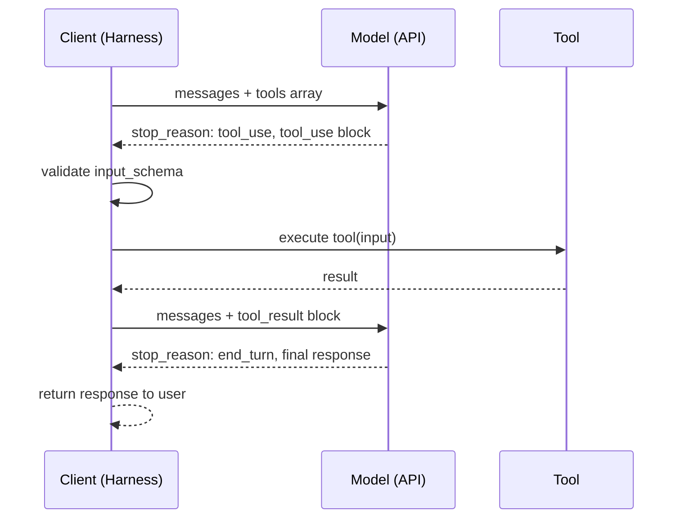

# [AEE-401] Function Calling

## Context

Function calling is the protocol by which a model requests that an external capability be executed on its behalf. The model does not run code, call APIs, or query databases — it emits a structured request describing what should be called and with what arguments. The harness (the application code surrounding the model) executes the tool and returns the result. The model then continues generation with the result available in its context.

Engineers who understand this separation — model as requester, harness as executor — build more reliable tool-using agents than engineers who treat function calling as a black box. The protocol is straightforward; the failure modes emerge from misunderstanding which party is responsible for what.

## Design Think

The core claim: function calling is a protocol, not a feature. The model does not execute tools — it emits structured requests; the harness executes them and returns results. Engineers who understand this separation build more reliable tool-using agents than engineers who treat function calling as magic.

**The protocol in four steps:**

1. **Tool definition** — the client sends a `tools` array in the API request. Each entry defines a tool the model may call: a name, a description, and an input schema (JSON Schema).
2. **Model response with tool call** — the model decides to call a tool and returns a response with `stop_reason: "tool_use"` and a `tool_use` content block containing the tool name and resolved input arguments.
3. **Harness execution** — the harness detects `stop_reason: "tool_use"`, extracts the tool name and input from the content block, executes the corresponding function, and captures the result.
4. **Result injection** — the harness appends the original assistant response to the messages array, then adds a new `user` message containing a `tool_result` content block with the tool_use_id and the execution result. The model is then called again with this extended context.

**What the model does vs. what the harness does:**

| Responsibility | Party |
|---|---|
| Decide whether to call a tool | Model |
| Choose which tool to call | Model |
| Determine input arguments | Model |
| Execute the tool | Harness |
| Validate parameters before execution | Harness |
| Format the result | Harness |
| Inject result into conversation | Harness |

The model has no direct access to the execution environment. It cannot know whether the harness validated its parameters or whether the tool succeeded before seeing the result. This is why harness-side validation is a MUST, not a SHOULD.

**Parallel tool calls:**

A model may emit multiple `tool_use` blocks in a single response when it determines that several tools can be called independently. The harness may execute these in parallel. Each produces a separate `tool_result` block, all returned in the same user-turn message.

**RFC 2119:**

- The harness MUST validate tool call parameters against the tool's input_schema before execution. Passing unvalidated model output to external systems is a security and reliability failure.
- Tool results MUST be returned to the model as structured `tool_result` messages in the user turn. Injecting results as plain text in the user turn bypasses the protocol and produces unreliable behavior.
- When `stop_reason` is `"tool_use"`, the harness MUST NOT generate a final response to the user. The model is mid-turn, waiting for tool results.
- Tool names and tool_use_id values MUST be preserved exactly when constructing tool_result messages. Mismatched IDs cause the model to lose track of which result corresponds to which call.

## Deep Dive

### Tool Definition Format

The Anthropic API tool definition format:

```json
{
  "name": "search_web",
  "description": "Search the web for current information on a topic. Use this tool when the user asks about recent events, facts that may have changed, or information outside your training data. Do NOT use for general knowledge questions the model can answer directly.",
  "input_schema": {
    "type": "object",
    "properties": {
      "query": {
        "type": "string",
        "description": "The search query. Be specific — use key terms rather than full sentences. Maximum 200 characters."
      },
      "num_results": {
        "type": "integer",
        "description": "Number of results to return. Defaults to 5 if not specified. Maximum 10."
      }
    },
    "required": ["query"]
  }
}
```

Key elements:
- `name`: machine-readable identifier used in tool_use blocks. Must match the pattern `^[a-zA-Z0-9_-]{1,64}$`.
- `description`: the natural language description the model reads to decide whether to invoke this tool. See AEE-402 for schema design guidance.
- `input_schema`: a JSON Schema object defining the tool's parameters. The `type` at the root must be `"object"`.

The `tools` array is passed alongside `messages` and `model` in the API request.

### Tool Call Response

When the model decides to call `search_web`, its response looks like:

```json
{
  "id": "msg_01XFDUDYJgAACTU3VRZXEDsQ",
  "type": "message",
  "role": "assistant",
  "content": [
    {
      "type": "text",
      "text": "Let me search for the latest information on that."
    },
    {
      "type": "tool_use",
      "id": "toolu_01T1x1fJ34qAmk2tzvAqyFsR",
      "name": "search_web",
      "input": {
        "query": "TypeScript 5.4 release notes",
        "num_results": 5
      }
    }
  ],
  "stop_reason": "tool_use",
  "usage": { "input_tokens": 245, "output_tokens": 68 }
}
```

The harness detects `stop_reason: "tool_use"`, extracts the `tool_use` block, and calls the corresponding function.

### Result Injection

After executing the tool, the harness constructs the next API call. The original assistant message is appended to `messages`, followed by a new user message containing the result:

```json
{
  "messages": [
    { "role": "user", "content": "What's new in TypeScript 5.4?" },
    {
      "role": "assistant",
      "content": [
        { "type": "text", "text": "Let me search for the latest information on that." },
        {
          "type": "tool_use",
          "id": "toolu_01T1x1fJ34qAmk2tzvAqyFsR",
          "name": "search_web",
          "input": { "query": "TypeScript 5.4 release notes", "num_results": 5 }
        }
      ]
    },
    {
      "role": "user",
      "content": [
        {
          "type": "tool_result",
          "tool_use_id": "toolu_01T1x1fJ34qAmk2tzvAqyFsR",
          "content": "TypeScript 5.4 introduces the NoInfer utility type, preserves narrowing in closures, and adds support for require() calls in --moduleResolution bundler mode."
        }
      ]
    }
  ]
}
```

The model then generates a final response with `stop_reason: "end_turn"`.

### Stop Reasons

| `stop_reason` | Meaning | Harness action |
|---|---|---|
| `"end_turn"` | Model finished generating | Return response to user |
| `"tool_use"` | Model is requesting a tool call | Execute tool, inject result, call model again |
| `"max_tokens"` | Hit token limit mid-generation | Handle truncation |
| `"stop_sequence"` | Hit a configured stop sequence | Return response to user |

### Parallel Tool Calls

If the model emits two `tool_use` blocks in one response, both results must be returned in the same user-turn message:

```json
{
  "role": "user",
  "content": [
    {
      "type": "tool_result",
      "tool_use_id": "toolu_01ABC",
      "content": "Result from first tool"
    },
    {
      "type": "tool_result",
      "tool_use_id": "toolu_01DEF",
      "content": "Result from second tool"
    }
  ]
}
```

The harness may execute these in parallel (e.g., with `asyncio.gather`). Each `tool_result` must match its `tool_use_id` exactly.

### Error Results

If tool execution fails, return a `tool_result` with `is_error: true`:

```json
{
  "type": "tool_result",
  "tool_use_id": "toolu_01T1x1fJ34qAmk2tzvAqyFsR",
  "is_error": true,
  "content": "Search failed: rate limit exceeded. Retry after 30 seconds."
}
```

The model can then decide whether to retry, use a different approach, or report the failure to the user.

## Visual



## Best Practices

1. **Append the full assistant message before adding tool results.** The tool_result message must be preceded by the assistant message that contained the tool_use block. Dropping the assistant message from the context breaks the conversation structure and produces unpredictable model behavior.

2. **Handle `stop_reason: "tool_use"` in a loop, not a branch.** A model may call multiple tools sequentially across multiple turns. The correct pattern is a while loop that continues calling the model until `stop_reason` is `"end_turn"`, not an if-else that handles exactly one tool call.

3. **Return errors as tool results, not exceptions.** If tool execution fails, return a `tool_result` with `is_error: true` and a description of the failure. Raising an exception that skips result injection leaves the model mid-turn with no way to continue. Do not return an empty `content` field or a fabricated success message — the model cannot distinguish silence from success and may hallucinate a result.

## Related AEEs

- [AEE-400](400) — Tool Use & Execution (category overview)
- [AEE-402](402) — Tool Schema Design (how to write tool definitions the model invokes correctly)
- [AEE-405](405) — Tool Selection (how models choose among multiple tools)

## References

- [Tool Use Overview (Anthropic)](https://docs.anthropic.com/en/docs/tool-use)
- [Build with Claude: Tool Use (Anthropic)](https://docs.anthropic.com/en/docs/build-with-claude/tool-use)

## Changelog

- 2026-04-14 -- Initial draft
