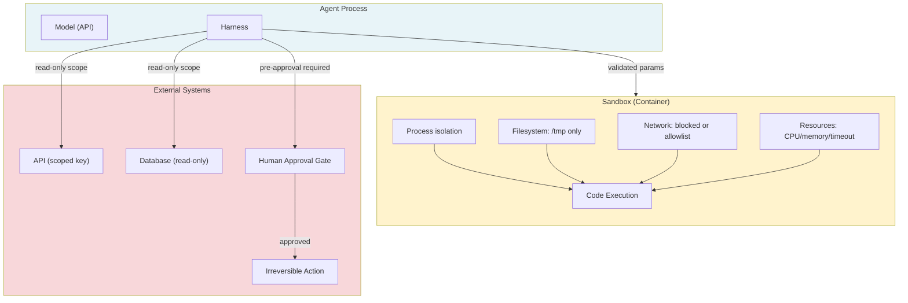

# [AEE-406] Sandboxing and Execution Safety

## Context

Every tool that executes with side effects — writes data, calls external APIs, runs code, interacts with a UI — must be treated as a blast radius problem. The blast radius of a tool is the maximum damage the agent can do if it behaves incorrectly: if it chooses the wrong action, misinterprets a parameter, follows a prompt injection, or encounters a bug in the agent loop.

Sandboxing is not a single technique. It is a collection of isolation primitives applied in layers. The goal is to make incorrect behavior bounded and observable, not impossible. An agent that can only do bounded damage can be deployed, monitored, and corrected. An agent with unbounded blast radius cannot be deployed safely regardless of how carefully the prompts are written.

## Design Think

The core claim: every tool that executes with side effects must be treated as a blast radius problem. The question is not whether to sandbox, but what the minimum permission set is and how to enforce it.

**Blast radius defined:**

Blast radius is the maximum damage an agent can cause if it behaves incorrectly. It is a function of:
1. What tools are available
2. What permissions those tools carry
3. Whether irreversible actions require human confirmation

An agent with read-only database access, restricted to a single table, with no network access has a small blast radius even if it misbehaves. An agent with database write access, full network access, and the ability to send emails has a large blast radius — a single incorrect tool call could delete records, exfiltrate data, or trigger external communications.

**The principle of least privilege applied to tools:**

Every tool should carry the minimum permissions needed to perform its function:
- A read-only search tool should not have write access to the index it searches
- A calendar tool that needs to read events should not have permission to delete them
- A code execution sandbox that needs to run Python should not have outbound internet access unless the task requires it
- An API tool that reads user profiles should use a read-only API key, not an admin key

**Isolation layers:**

Effective sandboxing applies isolation at multiple layers. Each layer is independent; a failure in one is caught by others:

1. **Process isolation**: the tool runs in a separate process or container from the host application. The host process's memory, credentials, and environment variables are not accessible.
2. **Filesystem isolation**: the tool's filesystem access is restricted to designated paths. It cannot read the host filesystem, access configuration files, or read credentials.
3. **Network isolation**: outbound network access is blocked by default. Tools that need network access are granted access to a specific allowlist, not unrestricted internet.
4. **Resource limits**: CPU time, memory, and execution timeout are bounded. Runaway loops or memory-intensive operations cannot exhaust host resources.

**Human-in-the-loop gates:**

Not all blast radius can be reduced by technical isolation. Some actions are inherently high-risk because they are irreversible or have significant external impact:
- Data deletion
- Financial transactions
- External communications (emails, posts, form submissions)
- Production configuration changes

For these actions, the appropriate control is not isolation — it is a human approval gate. The agent pauses before executing, presents what it is about to do, and waits for explicit confirmation.

**RFC 2119:**

- Agents with write permissions to external systems MUST log every tool call with full parameters before execution.
- Irreversible actions (data deletion, financial transactions, external communications) MUST require explicit human approval unless the scope has been explicitly pre-authorized.
- Tools MUST follow the principle of least privilege: each tool carries only the permissions needed for its function.
- Sandboxes for code execution and browser use MUST enforce process isolation, filesystem isolation, and resource limits. A sandbox missing any of these properties is not a sandbox.

## Deep Dive

### Isolation Layer Reference

| Layer | What it isolates | How to enforce |
|---|---|---|
| Process | Memory, credentials, env vars | Docker/container, separate OS process |
| Filesystem | Host files, config, secrets | Read-only root mount, tmpfs for writes |
| Network | Outbound connections, exfiltration | Network namespace, egress allowlist |
| Resource | CPU, memory, execution time | cgroup limits (`--memory`, `--cpu-quota`), timeout |

Applying all four layers to a code execution sandbox:

```bash
docker run \
  --rm \
  --network=none \
  --memory=256m \
  --cpus=0.5 \
  --read-only \
  --tmpfs /tmp:size=64m \
  --security-opt=no-new-privileges \
  python:3.11-slim \
  python -c "YOUR_CODE_HERE"
```

### API Tool Permissions

For tools that call external APIs:
- Use read-only API keys for tools that only need to read data
- Use separate API keys per tool — rotating or revoking one key does not affect others
- Use staging/sandbox environments for development; never use production API keys in development configurations
- For OAuth-scoped APIs (Google, Microsoft), request only the specific scopes the tool needs — `calendar.readonly` for a calendar read tool, not `calendar` (full read/write)

### Audit Logging

Every tool call should produce a log entry. Minimum required fields:

```json
{
  "timestamp": "2026-04-14T12:34:56.789Z",
  "tool_name": "delete_document",
  "parameters": { "document_id": "doc_abc123" },
  "model_turn_id": "msg_01XFD",
  "result": "success",
  "user_id": "user_456",
  "session_id": "session_789"
}
```

Write audit log entries BEFORE execution for irreversible actions — not after. If the action fails partway through, there is still a record that it was attempted with those parameters.

### Human-in-the-Loop Implementation

For actions requiring human approval, a tool-based implementation:

```python
tools = [
    {
        "name": "request_delete_approval",
        "description": "Request human approval before deleting a document. ALWAYS use this tool before delete_document. Never call delete_document without prior approval from this tool.",
        "input_schema": {
            "type": "object",
            "properties": {
                "document_id": {
                    "type": "string",
                    "description": "ID of the document to be deleted."
                },
                "reason": {
                    "type": "string",
                    "description": "Why this document should be deleted."
                }
            },
            "required": ["document_id", "reason"]
        }
    },
    {
        "name": "delete_document",
        "description": "Permanently delete a document. ONLY call after receiving an approval_id from request_delete_approval. Do NOT call without prior approval.",
        "input_schema": {
            "type": "object",
            "properties": {
                "document_id": {
                    "type": "string",
                    "description": "ID of the document to delete."
                },
                "approval_id": {
                    "type": "string",
                    "description": "Approval ID returned by request_delete_approval. Required."
                }
            },
            "required": ["document_id", "approval_id"]
        }
    }
]
```

The `approval_id` parameter enforces the gate at the schema level — the model cannot call `delete_document` without providing an ID it can only obtain from the approval flow.

## Visual



## Best Practices

1. **Define blast radius before writing prompts.** Before writing any agent prompts, list every tool, what it can do, and what would happen if it misbehaved. This surface area analysis drives sandbox configuration and human-in-the-loop gate decisions. Tools with large blast radius require stricter isolation.

2. **Treat permission escalation as a breaking change.** Adding write permissions to a tool that previously only read, or extending network access for a sandbox, changes the agent's blast radius. Apply the same review process as a production code change.

3. **Log before execute for irreversible actions.** For any tool call that cannot be undone, write the audit log entry before dispatching the action. Pre-execution logging ensures the attempt is recorded even if the action fails halfway.

## Related AEEs

- [AEE-403](403) — Code Execution (sandbox setup for code execution tools)
- [AEE-404](404) — Browser and Computer Use (VM isolation for computer use agents)
- [AEE-401](401) — Function Calling (the tool call protocol that sandboxing wraps)
- [AEE-204](../Model and Context Layer/204) — System Prompt Engineering (prompt injection risk at the prompt level, distinct from execution-level isolation)

## References

- [OWASP Top 10 for LLM Applications](https://owasp.org/www-project-top-10-for-large-language-model-applications/)
- [Computer Use Safety (Anthropic)](https://docs.anthropic.com/en/docs/build-with-claude/computer-use)
- [E2B Documentation](https://e2b.dev/docs)

## Changelog

- 2026-04-14 -- Initial draft
