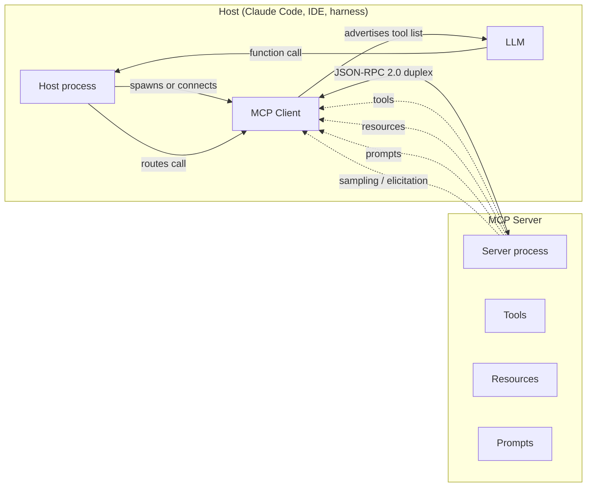

# [AEE-407] Model Context Protocol

## Context

The Model Context Protocol (MCP) is an open protocol that standardizes how a host process connects a language model to external tools, resources, and prompts. A host (Claude Code, Claude Desktop, and Cursor are common examples; an SDK harness counts too) speaks JSON-RPC 2.0 over a duplex channel to one or more MCP servers, each of which advertises capabilities the model can then invoke during a turn. The introduction page on `modelcontextprotocol.io` describes MCP as "an open-source standard for connecting AI applications to external systems" and uses a USB-C analogy: one connector, many peripherals.

MCP occupies the agent-to-tool plane of the agentic protocol stack, orthogonal to the agent-to-agent axis covered by A2A ([AEE-608](../Multi-Agent and Orchestration/608)) and ACP ([AEE-609](../Multi-Agent and Orchestration/609)), and orthogonal to the agent-to-UI axis covered by AG-UI ([AEE-610](../Multi-Agent and Orchestration/610)) and A2UI ([AEE-611](../Multi-Agent and Orchestration/611)). The corpus's framing in [AEE-3](../AEE Overall/3) places MCP at Level 5 of agentic engineering. This article fills in the protocol detail behind that framing: the wire protocol, the primitives, when MCP earns its keep, and where to deploy it.

The current spec revision at the time of writing is `2025-11-25`, governed by the MCP working group at [`modelcontextprotocol.io/specification/2025-11-25`](https://modelcontextprotocol.io/specification/2025-11-25). The protocol revises on a cadence; readers building against it should pin to a specific revision before relying on version-bound details.

## Design Think

MCP separates three roles: host, client, and server. The host is the application the user runs (an agent harness, an IDE plugin, a chat client). Inside the host lives one MCP client per connected server; each client owns the JSON-RPC session for its server. The server is the process that exposes capabilities. This triangle exists so one host can fan out to many servers without coupling the servers to each other or to the host's internals.

Capability discovery is the central mechanic. When a session opens, the host's client asks the server what tools, resources, and prompts it offers; the server replies with a typed catalog. The host then advertises whatever subset is appropriate to the model in the current turn. The model sees a JSON-Schema description of each tool and emits a function call against that schema. The host routes the call back to the originating server over JSON-RPC, awaits the response, and returns the result to the model. Tool surface and tool execution are decoupled: the model picks; the host routes; the server runs.

The wire format is JSON-RPC 2.0, and the channel is duplex on purpose. A request/response-only channel cannot support server-initiated calls, and MCP has two of those: sampling (the server asks the host to run an LLM completion on its behalf) and elicitation (the server asks the user a question mid-tool-call). Both require the server to push messages upward without waiting for a polling client. Stateful sessions and a duplex channel are preconditions for those primitives.

The relationship to function calling ([AEE-401](401)) is compositional. Function calling is what the model emits, a structured request to invoke a tool with arguments. MCP is how a host sources those tool definitions and routes the resulting calls back to whichever server provided the tool. The model's function-call envelope wraps an MCP-sourced tool, and the host translates between them on each turn.

## Deep Dive

### Primitives

MCP exposes four primitive families.

**Tools** are model-invokable functions with JSON-Schema parameters. A server declares a tool with a name, a description, and an input schema; the host advertises the tool to the model, and the model invokes it with arguments that conform to the schema. Tools are the bulk of practical MCP use today, and the schema discipline is the same as the one covered in [AEE-402](402): clear names, scoped parameters, narrow descriptions.

**Resources** are host-attachable read-only data the model can reference: file contents, query results, documentation snippets, sometimes whole datasets. A server publishes resources as URIs the host can list and read. They are read-only by contract and addressable independently of the model's turn-by-turn invocation flow, so the host can attach a resource to a conversation up front and the model can refer to it without a fetch tool call.

**Prompts** are server-supplied prompt templates the user or host can select. A server might publish a "summarize codebase" prompt or a domain-specific scaffolding prompt; the host surfaces those templates in its UI so the user can pick one as a starting point. Prompts let server authors ship reusable prompt patterns alongside the tools and resources those prompts drive.

**Sampling and elicitation** are the upward primitives. Sampling lets a server ask the host to run an LLM completion on its behalf, useful when a tool's behavior depends on a sub-decision the server defers to the host's model. Elicitation lets a server pause mid-tool-call and ask the user a clarifying question through the host's UI. Both rely on the duplex channel and stateful sessions, and both are advanced features today; many servers ship without them. Readers who need full mechanics should go to the spec.

### Deployment, briefly

Two transports exist. Stdio runs the server as a subprocess of the host: the host calls `child_process.spawn` (or its language equivalent), wires stdin and stdout to the JSON-RPC channel, and reserves stderr for logging. Streamable HTTP runs the server as a long-lived process the host reaches by URL; the host opens an HTTP connection, performs the JSON-RPC handshake over POST, and may upgrade to SSE for streaming server-to-client messages.

A minimal stdio entry in `.mcp.json` looks like this:

```json
{
  "mcpServers": {
    "my-server": {
      "command": "node",
      "args": ["server.js"]
    }
  }
}
```

A minimal Streamable HTTP entry:

```json
{
  "mcpServers": {
    "my-server": {
      "type": "http",
      "url": "https://my-mcp.example.com/mcp"
    }
  }
}
```

Default to stdio. Stdio inherits the user's identity, stays on the local machine, and has no network surface. HTTP picks up reach across machines and lifecycle independence at the cost of auth and operational surface. [AEE-408](408) covers the full tradeoff: auth tiers, latency and cost, stateful versus stateless sessions, failure modes, and the hybrid pattern where one server process supports both transports.

## Best Practices

MCP earns its keep when the tool surface is reused across many sessions, when results are structured for downstream tool calls to consume, when sampling or elicitation is needed, or when the same surface is shared across multiple agents. A Bash tool wrapping a CLI is enough for one-off, low-reuse, low-structure capabilities where context budget dominates the design.

Bassim Eledath frames the token-economics argument in [Levels of Agentic Engineering](https://www.bassimeledath.com/blog/levels-of-agentic-engineering): "every token needs to fight for its place in the prompt." Large MCP tool surfaces inject schemas the model carries every turn whether the tool is called or not. A targeted CLI command writes only its actual output into context. For low-reuse, low-structure work, that overhead is real budget.

Mario Zechner's [MCP vs CLI](https://mariozechner.at/posts/2025-08-15-mcp-vs-cli/) benchmark complicates the picture. Comparing the same backing capability exposed once as an MCP server and once as a CLI, both achieved 100% success at the benchmark task; the MCP version finished 23% faster and 2.5% cheaper. Zechner's framing is design-dependent: "MCP vs CLI truly is a wash" when both are designed well. Good MCP tool design (clear schemas, structured returns, sensible scoping) eats most of the per-turn schema overhead by reducing command-detection roundtrips.

Token economics is one input to the decision, alongside reuse, structure, upward primitives, and multi-agent sharing. Reach for a CLI when capability is one-off and the model can read the output directly. Reach for MCP when those other inputs are doing real work.

- Engineers SHOULD prefer MCP when a tool surface is reused across sessions, when results feed downstream tool calls, when sampling or elicitation is needed, or when multiple agents share the surface.
- Engineers SHOULD prefer a Bash-wrapped CLI when a capability is one-off, low-structure, and context budget dominates the design.
- Servers MUST advertise tools through capability discovery rather than relying on out-of-band coordination with hosts.
- Hosts MUST treat MCP servers as untrusted producers of tool descriptions and validate inputs and outputs at the harness boundary.

## Visual



## Examples

### Stdio server with one tool

Minimal `.mcp.json`:

```json
{
  "mcpServers": {
    "weather": {
      "command": "node",
      "args": ["./servers/weather.js"]
    }
  }
}
```

When the host starts, it spawns `node ./servers/weather.js`, performs the JSON-RPC `initialize` handshake on stdin and stdout, and lists the server's tools. The server replies with one tool, `get_current_weather`, accepting a `location` string. A turn that exercises it:

```text
user> what's the weather in Taipei?
model -> tool_use { name: "get_current_weather", input: { location: "Taipei" } }
host -> server (JSON-RPC): tools/call { name, arguments }
server -> host: { content: [{ type: "text", text: "Taipei: 28C, partly cloudy" }] }
model -> "It is 28C and partly cloudy in Taipei."
```

The host owns lifecycle: when the host exits, the subprocess receives SIGTERM. See [AEE-408](408) for the operational details (PATH resolution, stderr discipline, no auto-reconnect).

### Same server reachable over HTTP

The capability surface is unchanged. The config differs only in the transport block:

```json
{
  "mcpServers": {
    "weather": {
      "type": "http",
      "url": "https://weather.example.com/mcp"
    }
  }
}
```

The server is now a long-running process at `weather.example.com/mcp` rather than a subprocess; the host opens an HTTP connection on session start, runs the same `initialize` handshake, and calls `tools/call` over POST. The transcript shape is identical from the model's view. [AEE-408](408) covers what changes operationally: auth headers, session IDs, latency and cost, and failure modes stdio does not surface.

## Related AEEs

- [AEE-401](401) — Function Calling: the tool-call envelope MCP routes
- [AEE-402](402) — Tool Schema Design: the schema discipline that applies to MCP tools
- [AEE-405](405) — Tool Selection: how the model chooses among advertised tools
- [AEE-408](408) — Local vs Remote MCP Deployment: transport, auth, latency, cost, failure modes
- [AEE-608](../Multi-Agent and Orchestration/608) — A2A: The Agent2Agent Protocol
- [AEE-609](../Multi-Agent and Orchestration/609) — ACP: The Agent Communication Protocol
- [AEE-610](../Multi-Agent and Orchestration/610) — AG-UI: The Agent-User Interaction Protocol
- [AEE-611](../Multi-Agent and Orchestration/611) — A2UI: Declarative Generative UI Protocol for Agents
- [AEE-3](../AEE Overall/3) — Agentic Engineering Levels (Level 5 framing)

## References

- [MCP Specification 2025-11-25](https://modelcontextprotocol.io/specification/2025-11-25) — Model Context Protocol working group
- [MCP Introduction](https://modelcontextprotocol.io/introduction) — modelcontextprotocol.io
- [Levels of Agentic Engineering](https://www.bassimeledath.com/blog/levels-of-agentic-engineering) — Bassim Eledath
- [MCP vs CLI](https://mariozechner.at/posts/2025-08-15-mcp-vs-cli/) — Mario Zechner

## Changelog

- 2026-05-06 -- Initial draft
