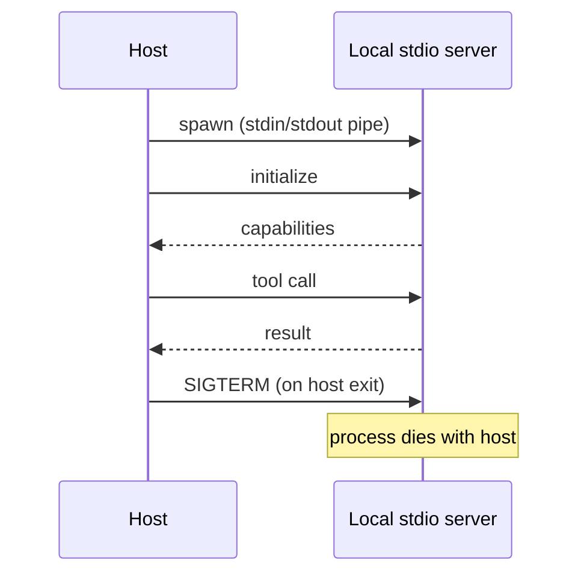
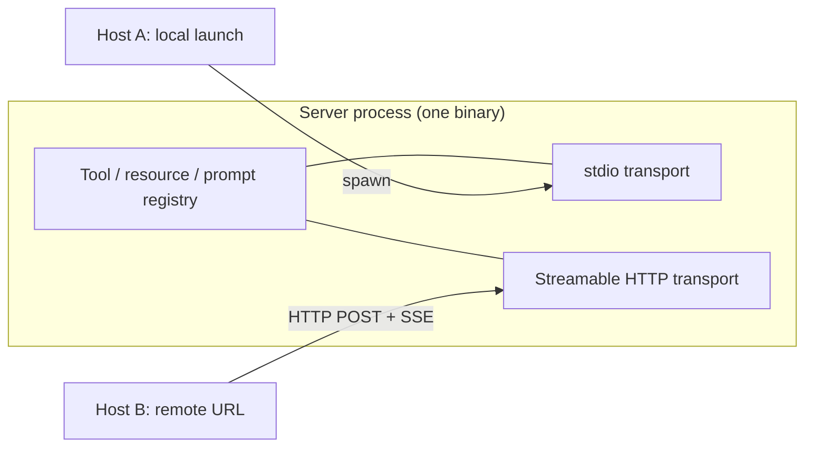

# [AEE-408] Local vs Remote MCP Deployment

## Context

[AEE-407](407) introduces the Model Context Protocol and its primitives; this article picks up after that decision and covers where the server runs and how to choose.

The spec defines two standard transports: stdio (the host launches the server as a subprocess) and Streamable HTTP (the server runs as an independent process the host reaches by URL). Both surface the same tools, resources, prompts, and upward primitives covered in 407. The choice between them is operational: lifecycle, reach, auth surface, latency, cost, and failure modes all change, while the capability surface the model sees does not. This article covers both transports, the five auth tiers that apply once the protocol leaves the local machine, the latency and cost characteristics that drive deployment decisions, and a hybrid pattern that lets one server process serve both transports.

The article cites the [2025-11-25 spec revision](https://modelcontextprotocol.io/specification/2025-11-25) throughout. Where a version-bound detail differs from the older 2025-06-18 revision, the difference is called out for legacy-server compatibility.

## Design Think

The lifecycle distinction is the load-bearing idea. Stdio binds the server's life to the host process: the host spawns the server, owns its stdin and stdout as the JSON-RPC channel, and sends `SIGTERM` on exit. HTTP makes the two independent: the server runs ahead of time, the host opens an HTTP connection on session start, and the server keeps running when the host exits. Auth, latency, multi-host sharing, and state persistence all fall out of that one structural difference.

A decision shortcut covers most cases. Ask in order:

1. Does the server need local resources you cannot replicate remotely (local filesystem, locally-installed CLIs, the user's git repos, the user's IDE state)? If yes, run it locally over stdio.
2. Does state need to persist across host sessions, or be reachable from multiple devices, or be shared by multiple agents? If yes, run it remotely over Streamable HTTP.
3. Otherwise, run it locally until question 1 or question 2 changes.

Going remote is a one-way operational ratchet: once auth, hosting, and uptime become live concerns, walking that back means reverting a deployment. Going local is reversible by editing `.mcp.json` and starting the server differently. Local is the cheap default for personal MCP work; remote earns its keep when the conditions in question 1 or 2 hold.

## Deep Dive

### stdio transport

When the host starts, it reads `.mcp.json` from project (and global) config locations, finds the entry's `command` field, and calls `child_process.spawn` (or its language equivalent) to launch the server as a child process. The host wires the child's `stdin` and `stdout` as the JSON-RPC message channel and reserves `stderr` for logging. The host then sends the `initialize` handshake to negotiate protocol version and exchange capabilities, and the server registers its tools, resources, and prompts.

Lifecycle is bound to the host. When the host exits, the child receives `SIGTERM`. One host session, one server process: opening Claude Code in two terminals at the same project spawns two server processes that share no state.

Three failure modes are stdio-specific:

- **Stdout corruption.** Anything that is not a JSON-RPC frame on stdout breaks the host's parser. Always log to `stderr`; never `console.log` from a stdio MCP server. The 2025-11-25 spec also notes that clients **MAY** capture, forward, or ignore stderr and **SHOULD NOT** assume stderr output indicates an error condition.
- **No auto-reconnect on host side.** Claude Code (used here as a host example) does not auto-reconnect stdio servers when the child crashes; the user re-attaches manually via the `/mcp` command. Other hosts vary. The spec leaves reconnection up to the host implementation.
- **cwd and PATH resolution.** Relative paths in `args` resolve from the host's working directory, which may differ from a shell-launched session. `command: "node"` requires `node` to be on the host's `PATH`, which may also differ from the user's interactive shell. Absolute paths or wrapper scripts dodge this class of bug.

Two minimal config recipes:

```json
{
  "mcpServers": {
    "my-server": {
      "command": "node",
      "args": ["server.js"]
    }
  }
}
```

```json
{
  "mcpServers": {
    "my-server": {
      "command": "uvx",
      "args": ["my-package"],
      "env": {
        "API_KEY": "sk-...",
        "LOG_LEVEL": "debug"
      }
    }
  }
}
```

### Streamable HTTP transport

When the host starts, it reads `.mcp.json`, sees `type: "http"` plus a `url`, and skips process spawn; the server must already be running. The host opens an HTTP connection, sends `initialize` as an HTTP POST, and receives the server's capabilities. Subsequent client-to-server messages are POSTs; the server responds with `Content-Type: application/json` for a single response or `Content-Type: text/event-stream` to upgrade to an SSE stream carrying multiple server messages. The client may also issue an HTTP GET to open a separate SSE channel for unrelated server-initiated messages; the server may decline with HTTP 405.

Lifecycle is independent. The server outlives the host, and one server can serve many host sessions concurrently if it handles session multiplexing.

Sessions come in two flavors. **Stateless** servers create a fresh server instance per HTTP request, handle it, and tear down; appropriate when tools do not accumulate per-session state, backing state lives in an external store, and no server-initiated notifications are needed. **Stateful** servers return an `MCP-Session-Id` header on the `InitializeResult` that clients must echo on every subsequent request. The server may terminate a session at any time by responding to that ID with HTTP 404 (clients then re-initialize); clients may explicitly end a session via HTTP DELETE with the session-ID header. Stateful sessions are required for streaming tool results, sampling, elicitation, server-side per-session caches, and `Last-Event-ID` resume after a network drop.

Header casing changed across revisions. The 2025-06-18 transports page used `Mcp-Session-Id` (mixed case); 2025-11-25 uses `MCP-Session-Id` (uppercase MCP). Clients interoperating with legacy servers may need to accept either casing on the wire.

The 2025-11-25 revision also adds a long-lived-SSE pattern absent from 2025-06-18. After the server starts an SSE stream, it **SHOULD** immediately send an event with an empty `data` field and an event ID to prime the client for reconnection, and **MAY** then close the connection without terminating the SSE stream itself. Before closing, it **SHOULD** send a `retry` field; the client **MUST** respect it and reconnect after the specified delay, presenting `Last-Event-ID`. The pattern lets servers behind idle-connection killers (load balancers, serverless platforms) drop the TCP connection without forcing the client off the stream.

The `MCP-Protocol-Version` header is required on every HTTP request after initialization (for example, `MCP-Protocol-Version: 2025-11-25`). Servers receiving a request without the header **SHOULD** assume `2025-03-26` for backwards compatibility; an invalid or unsupported value triggers HTTP 400 Bad Request. `.mcp.json` accepts `type: "sse"` for the legacy 2024-11-05 HTTP+SSE transport and `type: "http"` for current Streamable HTTP servers; new servers use `"http"`.

### Auth tiers

Local stdio has implicit auth: the host runs as you, the server runs as you, no one else is on the pipe. Streamable HTTP exposes the protocol over a network beyond your machine, so the threat model widens: anyone with the URL can call tools (with side effects, including writes and hits to paid APIs), read resources, and receive server-initiated notifications.

Five tiers, ordered by friction and threat-model fit:

1. **Bearer token in `headers`.** Static long-lived secret in `.mcp.json` and the server's auth check; SDK-supported. Compromise on either side is total compromise until rotation; suitable for personal use behind a tunnel or trusted network.
2. **Capability tokens.** Short-lived, scoped tokens issued at session start. More plumbing; smaller blast radius on compromise.
3. **Platform OAuth.** Cloudflare Access, Tailscale, Auth0 offload identity to a provider. Right tier for team use; overkill for solo.
4. **mTLS.** Strong guarantees, painful client-side UX. Reserve for compliance contexts.
5. **IP allowlist.** Viable only when the client connects from a known static IP, rare for residential or mobile networks.

The 2025-11-25 spec bakes in a DNS-rebinding defense at the transport level. HTTP MCP servers **MUST** validate the `Origin` header on incoming connections; if `Origin` is present and invalid, the server **MUST** respond with HTTP 403 Forbidden. Local-only HTTP servers **SHOULD** bind to `127.0.0.1` rather than `0.0.0.0` and **SHOULD** implement proper authentication. Without these protections, an attacker can drive a local MCP server from a remote website via DNS rebinding. The broader threat model (Confused Deputy, Token Passthrough, Session Hijacking, Local MCP Server Compromise) lives in the spec's [security best practices](https://modelcontextprotocol.io/specification/2025-11-25/basic/security_best_practices) page, which also states that MCP servers **MUST NOT** use sessions for authentication. Sandboxing concerns tie in with [AEE-406](406).

### Latency, cost, reliability

Latency follows the transport. Stdio runs JSON-RPC over OS pipes in microseconds; the LLM's own response time dominates. Streamable HTTP pays a network round trip on every request: a Cloudflare Workers edge from a US client to a US edge typically lands in tens of milliseconds, a workstation behind a `cloudflared` tunnel sits in the 50-150ms range with periodic reconnects, and a bare VPS in a different region runs 100-300ms. The chattiness rule of thumb: 30ms per call across 50 calls in a session is 1.5 seconds of pure transport overhead, which matters for chatty servers and disappears into the noise for tools called once or twice per session.

Cost (verified 2026-05-06; pricing drifts, so verify before relying on specific numbers):

- **Cloudflare Workers Paid:** $5/month flat, includes 10 million requests and 30 million CPU-ms per month; overage is $0.30 per million additional requests and $0.02 per million additional CPU-ms. Wait time on `fetch()` does not count against CPU time, and there is no hard limit on duration for HTTP-triggered Workers as long as the client stays connected.
- **Durable Objects on Workers Paid:** 1 million requests and 400,000 GB-seconds included per month; overage is $0.15 per million requests and $12.50 per million GB-seconds. WebSocket Hibernation eliminates duration billing while a connection is idle; an `accept()` call without using the Hibernation API charges duration for the entire connection.
- **AWS Lambda:** hard 15-minute wall-clock cap per invocation, memory configurable from 128 MB to 10,240 MB, default regional concurrency 1,000. Cold start for Node.js Lambda is typically in the hundreds of milliseconds, with newer runtime variants reducing tail latency; verify against current benchmarks for your runtime and region.
- **Self-hosted on a workstation or single-board computer:** electricity only.

Reliability behavior splits the same way. Stdio servers do not auto-reconnect in Claude Code (host-specific behavior; other hosts vary); a crash means re-attaching manually. HTTP and SSE clients in Claude Code retry with exponential backoff up to five attempts, starting at one second and doubling. Long-held SSE on AWS Lambda hits the 15-minute wall-clock cap; the same long-held SSE on Cloudflare Workers does not bill duration under Durable Objects WebSocket Hibernation, and Workers do not cap wall-clock for HTTP-triggered requests. The 2025-11-25 close-and-poll pattern described above is the spec-blessed way for servers to drop the TCP connection without losing the stream when a platform's idle-connection killer kicks in.

## Best Practices

The hybrid pattern is the most useful architectural move here. Many MCP server implementations support both transports in one process: a single registry of tools, resources, and handlers, with stdio mounted when launched as `node server.js` and Streamable HTTP mounted as `node server.js --http 8787`. The MCP SDK ships transports for both, and mounting them is additive. Local-versus-remote then becomes a deployment switch, with the same code, tests, and tools covering both.

Defaults that tend to age well:

- Default to stdio overall. Graduate to HTTP when question 1 or 2 in the decision shortcut is doing real work.
- Default to stateless HTTP when going remote. Graduate to stateful when a feature requires it (streaming results, sampling, elicitation, per-session caches, `Last-Event-ID` resume).
- Default to bearer-token auth for solo remote use behind a tunnel. Graduate to platform OAuth when more than one person needs access, and to mTLS only when compliance demands it.
- Servers MUST validate `Origin` and SHOULD bind local-only HTTP listeners to `127.0.0.1`.
- Stdio servers MUST log only to stderr and MUST NOT write non-protocol bytes to stdout.

## Visual

The first diagram shows host-bound stdio lifecycle: the server is born when the host spawns it and dies when the host exits.



The second diagram shows the same handlers wired through both transports in the hybrid pattern.



## Examples

### Basic stdio

```json
{
  "mcpServers": {
    "my-server": {
      "command": "node",
      "args": ["server.js"]
    }
  }
}
```

### Stdio with environment

```json
{
  "mcpServers": {
    "my-server": {
      "command": "uvx",
      "args": ["my-package"],
      "env": {
        "API_KEY": "sk-...",
        "LOG_LEVEL": "debug"
      }
    }
  }
}
```

### HTTP no-auth (only safe behind a tunnel or VPN)

```json
{
  "mcpServers": {
    "my-server": {
      "type": "http",
      "url": "https://abc.trycloudflare.com/mcp"
    }
  }
}
```

Acceptable only when the URL is reachable from a trusted network (a `cloudflared` tunnel scoped to one user, a Tailscale subnet, a local-only listener). On the open internet without auth, anyone with the URL can call tools and read resources.

### HTTP with bearer token

```json
{
  "mcpServers": {
    "my-server": {
      "type": "http",
      "url": "https://my-mcp.example.com/mcp",
      "headers": {
        "Authorization": "Bearer ${MCP_TOKEN}"
      }
    }
  }
}
```

The `${MCP_TOKEN}` substitution is host-dependent; Claude Code substitutes shell env vars, other hosts may require a literal token. Keep `.mcp.json` out of git, or back it with a secret manager.

### Legacy SSE (`type: "sse"`)

```json
{
  "mcpServers": {
    "old-server": {
      "type": "sse",
      "url": "https://legacy.example.com/sse"
    }
  }
}
```

Use `"sse"` only for servers built against protocol version `2024-11-05`. Modern servers use `"http"`.

### Example — Claude Code-specific: dynamic auth headers via script

```json
{
  "mcpServers": {
    "internal-api": {
      "type": "http",
      "url": "https://mcp.internal.example.com",
      "headersHelper": "/opt/bin/get-mcp-auth-headers.sh"
    }
  }
}
```

`headersHelper` is a Claude Code-specific config field. Claude Code invokes the script before each connection and treats stdout as a JSON object of headers to attach. Useful for short-lived enterprise-issued tokens; other hosts implement dynamic auth differently, if at all.

### Example — Claude Code-specific: OAuth (server enforces RFC 9728 / RFC 8414)

```json
{
  "mcpServers": {
    "slack": {
      "type": "http",
      "url": "https://mcp.slack.com/mcp",
      "oauth": {
        "scopes": "channels:read chat:write"
      }
    }
  }
}
```

The `oauth` block is Claude Code-specific. Claude Code performs the OAuth flow on first connect, caches credentials, and refreshes as needed; the object also accepts `clientId`, `callbackPort`, and `authServerMetadataUrl` for non-default flows. Appropriate when the server publishes RFC 9728 protected-resource metadata and RFC 8414 authorization-server metadata.

## Related AEEs

- [AEE-407](407) — Model Context Protocol (required prerequisite)
- [AEE-405](405) — Tool Selection
- [AEE-406](406) — Sandboxing and Execution Safety (auth and DNS-rebinding warnings tie in)

## References

- [MCP Specification 2025-11-25](https://modelcontextprotocol.io/specification/2025-11-25) — Model Context Protocol working group
- [Transports (2025-11-25)](https://modelcontextprotocol.io/specification/2025-11-25/basic/transports) — stdio and Streamable HTTP, session management, close-and-poll, protocol version header
- [Security Best Practices (2025-11-25)](https://modelcontextprotocol.io/specification/2025-11-25/basic/security_best_practices) — Confused Deputy, Token Passthrough, SSRF, Session Hijacking, Local MCP Server Compromise, Scope Minimization
- [Claude Code MCP documentation](https://code.claude.com/docs/en/mcp) — host-specific config shapes (used as host examples)
- [Cloudflare Workers limits](https://developers.cloudflare.com/workers/platform/limits/)
- [Cloudflare Workers pricing](https://developers.cloudflare.com/workers/platform/pricing/)
- [Cloudflare Durable Objects pricing](https://developers.cloudflare.com/durable-objects/platform/pricing/)
- [AWS Lambda quotas](https://docs.aws.amazon.com/lambda/latest/dg/gettingstarted-limits.html)

Pricing and version-bound details drift over time; verify current figures before relying on specific numbers.

## Changelog

- 2026-05-06 -- Initial draft
