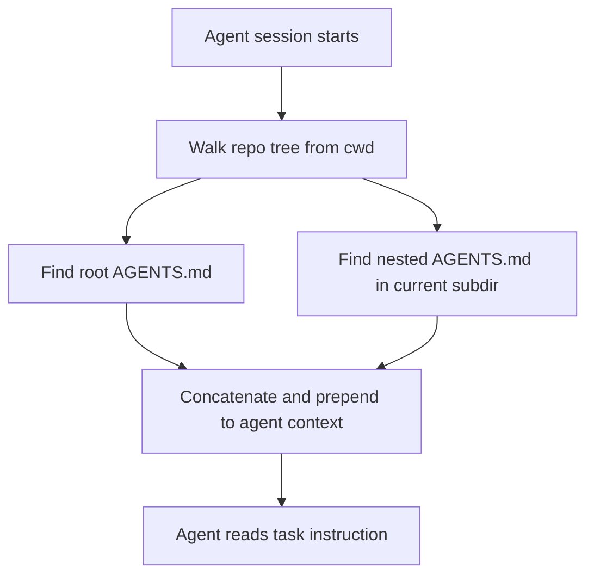

# AEE-808 AGENTS.md Article Implementation Plan

> **For agentic workers:** REQUIRED SUB-SKILL: Use superpowers:subagent-driven-development (recommended) or superpowers:executing-plans to implement this plan task-by-task. Steps use checkbox (`- [ ]`) syntax for tracking.

**Goal:** Publish AEE-808 "AGENTS.md and Authoring Best Practices" as a bilingual documentation article (EN + zh-TW) under Agentic Development Workflows (800s), with all references verified against authoritative sources and the VitePress build green.

**Architecture:** Five sequential tasks. Task 1 runs the research and records verified references in a temporary notes file (committed, then deleted at the end, following the AEE-807 pattern from commit `06dacb4`). Task 2 drafts the EN article. Task 3 drafts the zh-TW mirror. Task 4 updates the 800.md category index in both languages. Task 5 runs the VitePress build, deletes the research notes file, and commits. Each task ends with a focused commit.

**Tech Stack:** VitePress 1.3.x, pnpm, plain Markdown under `docs/en/` and `docs/zh-tw/`. No executable code produced. Verification is the VitePress build (`pnpm docs:build`), not a unit test suite.

---

## File Structure

| File | Responsibility | Created by |
|---|---|---|
| `docs/superpowers/research-notes/aee-808-sources.md` | One-line entry per planned reference: URL, what claim it supports, verification status (verified/unverifiable/replaced). Deleted at end of Task 5. | Task 1 |
| `docs/en/Agentic Development Workflows/808.md` | The EN article. One file per AEE convention. | Task 2 |
| `docs/zh-tw/Agentic Development Workflows/808.md` | The zh-TW mirror. Parallel structure to EN. | Task 3 |
| `docs/en/Agentic Development Workflows/800.md` | Category index — add AEE-808 entry following the pattern already used for 801–807. | Task 4 |
| `docs/zh-tw/Agentic Development Workflows/800.md` | zh-TW category index — same update. | Task 4 |
| `docs/en/list.md` / `docs/zh-tw/list.md` | Auto-generated sidebar list. Regenerated by the existing build pipeline. NOT hand-edited. | (not touched) |

---

## Research Ground Rules (apply to every task)

- Every reference in the final article MUST be a real URL that returns 2xx at verification time. Use WebFetch (or equivalent) to confirm.
- If a planned source is not reachable or the page has moved, do one of: (a) replace with another authoritative source that supports the same claim, (b) drop the claim from the article, or (c) rewrite the claim as observation rather than fact. Never cite a URL you did not fetch.
- Tweets, LinkedIn posts, Substack posts are NOT primary sources. Use them only as illustration alongside a verified primary source.
- Project convention in `CLAUDE.md`: content MUST be researched against authoritative sources; AI internal knowledge alone is insufficient; vendor-neutral tone.
- Post-RFC-2119-cleanup convention: DO NOT use a `**RFC 2119:**` bold label anywhere in the article. MUST/SHOULD/MAY bullets flow directly from the preceding paragraph.
- No emoji anywhere (global user rule).

---

## Task 1: Research and reference verification

**Files:**
- Create: `docs/superpowers/research-notes/aee-808-sources.md`

**Goal:** Before writing any prose, verify each planned reference URL and record which claims each source supports. This file is the single source of truth for what can be asserted in the article.

- [ ] **Step 1: Create the research notes directory and seed the file**

Run:
```bash
mkdir -p docs/superpowers/research-notes
```

Then create `docs/superpowers/research-notes/aee-808-sources.md` with this starter content:

```markdown
# AEE-808 Reference Verification Notes

One row per planned reference. Update status after each WebFetch.

| # | URL | Claim it supports | Verification status | Notes |
|---|---|---|---|---|
| 1 | https://agents.md/ | Canonical AGENTS.md convention site | pending | - |
| 2 | https://platform.openai.com/docs/codex (or Codex docs URL at verification time) | OpenAI Codex formalizes AGENTS.md as input | pending | - |
| 3 | https://code.claude.com/docs/en/memory | Claude Code CLAUDE.md and @import semantics | pending | - |
| 4 | https://docs.cursor.com/ (rules / AGENTS.md section at verification time) | Cursor supports AGENTS.md alongside .cursor/rules | pending | - |
| 5 | https://jules.google/ (or Jules docs URL at verification time) | Jules reads AGENTS.md | pending | - |
| 6 | Factory docs URL at verification time | Factory reads AGENTS.md | pending | - |
| 7 | RooCode docs URL at verification time | RooCode reads AGENTS.md | pending | - |
| 8 | Zed docs URL at verification time | Zed agent mode reads AGENTS.md | pending | - |
| 9 | Aider docs URL at verification time | Aider reads AGENTS.md | pending | - |
| 10 | https://github.com/awslabs/aidlc-workflows | Representative comprehensive steering rules set | pending | - |
| 11 | Representative short AGENTS.md in a well-known OSS repo (pick at verification time) | Minimalist AGENTS.md illustration | pending | - |

## Verified quotations / claims to cite

(Populate as you verify each row. Pull direct quotes only when you need them — most citations will be URL + descriptive link text.)

## Dropped or rewritten claims

(Populate if a planned claim cannot be verified and is dropped from the article.)
```

- [ ] **Step 2: Verify row 1 — agents.md**

Use WebFetch (or the equivalent fetch tool available) against `https://agents.md/`.
Expected: 2xx response, page clearly presents AGENTS.md as a convention for coding-agent instruction files, lists adopters.

Update row 1 in the notes:
- If verified: `verification status = verified`, paste a 1-sentence description into Notes.
- If not reachable or empty: `verification status = unverifiable`, and add a note. Do NOT cite this URL in the article.

- [ ] **Step 3: Verify row 2 — OpenAI Codex AGENTS.md**

Find the current canonical OpenAI Codex docs URL for AGENTS.md support. Start with `https://platform.openai.com/docs/codex` and follow the nav to the AGENTS.md or instructions-file section. Alternative: OpenAI's public `codex` GitHub repository README if the platform docs do not expose this directly.

Update row 2 with the verified URL and status.

If neither platform docs nor a repo README confirms AGENTS.md specifically, drop OpenAI Codex from the adopter list and record the decision in "Dropped or rewritten claims".

- [ ] **Step 4: Verify row 3 — Claude Code memory docs**

Use WebFetch on `https://code.claude.com/docs/en/memory`.
Expected: 2xx, page documents CLAUDE.md scope hierarchy and `@import` syntax.

If the URL has moved, locate the replacement under `https://code.claude.com/docs/` (memory or context topic). Update row 3.

- [ ] **Step 5: Verify row 4 — Cursor docs**

Use WebFetch on `https://docs.cursor.com/` and navigate to the rules section. Target the current AGENTS.md mention if present.
Expected: 2xx, confirmation that Cursor reads AGENTS.md or explicit statement that it does not (in which case the article calls this out, not a miscitation).

Update row 4 with the verified URL and the observed stance.

- [ ] **Step 6: Verify rows 5–9 — Jules, Factory, RooCode, Zed, Aider**

For each tool, locate the current public docs URL. For each row:
- If the tool's public docs explicitly confirm AGENTS.md support: row = verified, write a one-line confirmation.
- If public docs do not confirm: row = unverifiable, and remove that tool from the adopter list in the article.

Do NOT assert adoption from secondary sources (blog posts, tweets). Primary docs only.

- [ ] **Step 7: Verify row 10 — AWS AI-DLC rules**

Use WebFetch on `https://github.com/awslabs/aidlc-workflows`.
Expected: 2xx, repo exists with rules markdown organized under phase-specific subdirectories.

Update row 10.

- [ ] **Step 8: Verify row 11 — representative short AGENTS.md**

Search GitHub for well-known repositories that publish a short AGENTS.md at the repo root. Good candidates to check first (verify each):
- Anthropic's own public repos (e.g., `anthropics/claude-code` if a public AGENTS.md exists)
- Vercel's AI SDK (`vercel/ai`)
- OpenAI's `openai/codex` repo
- Any other repo surfaced during verification of rows 1–6

Pick the shortest AGENTS.md among verified candidates (under 80 lines). Record its raw URL.

If no acceptable short example is found after three checks, drop the "representative short AGENTS.md" reference from the article and note in "Dropped or rewritten claims".

- [ ] **Step 9: Final pass — record the adopter list**

In the research notes, add a `## Final adopter list` section listing only the tools for which rows 2 and 5–9 verified. This is the authoritative adopter list the article will use.

- [ ] **Step 10: Commit research notes**

```bash
git add docs/superpowers/research-notes/aee-808-sources.md
git commit -m "$(cat <<'EOF'
research: AEE-808 AGENTS.md reference verification notes

Co-Authored-By: Claude Opus 4.7 (1M context) <noreply@anthropic.com>
EOF
)"
```

---

## Task 2: Author the EN article

**Files:**
- Create: `docs/en/Agentic Development Workflows/808.md`

**Goal:** Draft the complete EN article matching the spec's section outline, citing only references verified in Task 1. Use AEE-803 and AEE-807 as prose-cadence references.

- [ ] **Step 1: Open the two style-reference articles**

Read `docs/en/Agentic Development Workflows/803.md` (spec owner of general steering-rules material; this article defers to it).
Read `docs/en/Agentic Development Workflows/807.md` (most recent sibling; tone and section depth to match).

- [ ] **Step 2: Create `docs/en/Agentic Development Workflows/808.md` with frontmatter and heading**

File content begins exactly:

```markdown
---
id: 808
title: AGENTS.md and Authoring Best Practices
state: draft
---

# [AEE-808] AGENTS.md and Authoring Best Practices

## Context
```

Leave the Context body empty for now; Step 3 fills it.

- [ ] **Step 3: Write the Context section**

Target length: 180–220 words. Required content:

- Frame the fragmentation problem: multi-tool teams ended up with CLAUDE.md (Anthropic), `.cursorrules` / `.cursor/rules/` (Cursor), `.windsurfrules` (Windsurf), GEMINI.md (Google), COPILOT.md (GitHub), and more.
- Name the duplication cost: the same convention restated across 3–5 files, drifting out of sync over time.
- Introduce AGENTS.md as the proposed convergence convention: one file at the repo root that any agent tool can read.
- Explicitly clarify AGENTS.md is NOT: not a formal RFC, not a mandated schema, not enforced by a standards body. It is a convergence convention: tools agree on the filename and location, nothing more.
- Close with a one-sentence pointer: "This article focuses on AGENTS.md specifically. For the general concept of steering rules and per-tool comparisons, see AEE-803."

End the section with a blank line before `## Design Think`.

- [ ] **Step 4: Write the Design Think section**

Target length: 260–320 words. Structure:

1. First paragraph (~80 words): AGENTS.md sits on two axes — a *discovery convention* (contract between repo and any agent about where to find operating instructions) and an *authoring contract* (what the repo promises about itself in a form agents can act on without human interpretation).
2. Second paragraph (~70 words): Introduce the short-vs-comprehensive tension as a central design decision, not a footnote. Note that the file must serve both a human reviewer (who needs brevity to stay current) and an agent in a context-constrained session (which benefits from explicit rules when conventions are not otherwise discoverable).
3. Third paragraph (~40 words): lead-in to the rules list: "Working with AGENTS.md imposes a small set of hard constraints:"
4. Bullet list immediately after (NO `**RFC 2119:**` label — bullets flow directly from the lead-in paragraph):
   - AGENTS.md MUST live at the repository root. Subdirectory AGENTS.md files MAY supplement but not replace the root file.
   - Machine-verifiable instructions (exact build/test commands, required env vars, hard boundaries) MUST be separated from style preferences within the file structure — typically as distinct sections.
   - Projects with existing CLAUDE.md / GEMINI.md / `.cursorrules` SHOULD migrate to AGENTS.md with an interop shim (symlink or `@import`) rather than maintaining parallel files that drift.
   - A root AGENTS.md SHOULD be under 100 lines. Content beyond that SHOULD live in nested AGENTS.md files loaded on demand.
   - Sections that no longer reflect the codebase MUST be removed, not left to rot. A stale rule is not neutral — it actively misleads agents.

- [ ] **Step 5: Write Deep Dive subsection 1 — The AGENTS.md convention and adoption**

Heading: `### 1. The AGENTS.md convention and adoption`

Content:
- Paragraph 1 (~100 words): What the file is — plain markdown, no mandated schema, lives at repo root, optionally nested in subdirectories. Format freedom: free-form prose and lists; some tools support YAML frontmatter, most do not. The convention's power is its lightweight agreement: everyone agrees on the filename and location and nothing more.
- Paragraph 2 — the adopter list (~120 words): Enumerate ONLY the tools verified in Task 1's `## Final adopter list`. For each verified tool, one sentence describing support.
- Paragraph 3 (~40 words): Note that Anthropic Claude Code does not read AGENTS.md natively as of publication; integration uses the interop patterns in subsection 2.

Cite the agents.md URL (row 1) the first time AGENTS.md is mentioned as a convention, using markdown link syntax `[AGENTS.md convention](https://agents.md/)`. Cite each adopter with a link from its one-sentence entry to the verified docs URL from Task 1.

- [ ] **Step 6: Write Deep Dive subsection 2 — Interop with CLAUDE.md and tool-specific files**

Heading: `### 2. Interop with CLAUDE.md and tool-specific files`

Content: Two interop patterns, with a short trade-off table.

Required prose, in order:

1. Lead-in (~40 words): Teams with mixed toolchains need AGENTS.md to feed into tool-specific files without duplication. Two patterns handle this.
2. Pattern A — Symlink (~60 words): `CLAUDE.md -> AGENTS.md` (and similarly for other tool-specific filenames). Zero duplication, always in sync. Requires filesystem symlink support — a concern on Windows repos without developer-mode enabled; some tools may not follow symlinks.
3. Pattern B — Import (~70 words): Claude Code supports `@path/to/file` imports inside CLAUDE.md. A minimal `CLAUDE.md` containing just `@AGENTS.md` delegates to the canonical file. Portable across filesystems. Allows Claude Code-specific additions to layer on top of the shared AGENTS.md. Two files in the repo root; depends on each tool's import semantics (other tools may not support an equivalent import).
4. Trade-off table:

```markdown
| Pattern | Best when | Watch out for |
|---|---|---|
| Symlink (`CLAUDE.md -> AGENTS.md`) | Content is 100% shared; team is on macOS/Linux | Windows checkouts; tools that do not follow symlinks |
| `@import` (`CLAUDE.md` contains `@AGENTS.md`) | Need Claude Code-specific additions on top of shared content | Per-tool import support varies; only Claude Code is confirmed |
```

5. Closing paragraph (~50 words): What AGENTS.md does NOT replace. Claude Code's user-level `~/.claude/CLAUDE.md` (personal preferences across all projects) and local `CLAUDE.local.md` (gitignored, per-project personal) are orthogonal to AGENTS.md and stay as-is. AGENTS.md replaces only the project-level CLAUDE.md. For the full Claude Code scope hierarchy, see AEE-803.

Cite the Claude Code memory docs URL (row 3) when describing `@import` semantics.

- [ ] **Step 7: Write Deep Dive subsection 3 — The short-vs-comprehensive spectrum**

Heading: `### 3. The short-vs-comprehensive spectrum`

Content, in this order:

1. Lead-in paragraph (~50 words): Practitioners disagree on how much belongs in an AGENTS.md. The debate is real and the positions have merit on both sides. Present the two poles as a spectrum, not a binary.

2. Subheading `**Short pole — "minimal AGENTS.md":**` followed by a bulleted specification:
   - Typical size: 20–80 lines.
   - Contains: build/test commands, non-obvious local setup, 3–5 hard "never" constraints.
   - Deliberately omits: style preferences (let the agent read existing code), widely-known conventions, anything verifiable by tooling (linters, formatters, type checkers).
   - Optimizes for: context cost, low staleness risk, fast human review.
   - Fails when: agent repeatedly violates conventions not visible from code alone, or codebase is too large for "read existing code" to be reliable within a single context window.

3. Subheading `**Comprehensive pole — "exhaustive AGENTS.md":**` followed by a bulleted specification:
   - Typical size: 200–1000+ lines, often split across nested AGENTS.md files.
   - Contains: full conventions, architectural decisions, tribal knowledge, review etiquette, security constraints, domain terminology.
   - Optimizes for: consistency across many agents and contributors, capturing institutional memory, reducing recurring mistakes.
   - Fails when: files rot faster than they are maintained, context budget is squeezed, agents skim and miss key items as signal-to-noise drops.

4. Subheading `**Decision criteria:**` followed by this table:

```markdown
| Factor | Favors short | Favors comprehensive |
|---|---|---|
| Team size | Small (1–3) | Large (10+) |
| Codebase age | New, conventions still fluid | Mature, conventions hardened |
| Recurring agent mistake frequency | Low | High |
| Human review bandwidth on agent output | High (tight feedback loop) | Low (need pre-emptive rules) |
| Tooling coverage (linters, formatters, types) | High | Low |
| Context budget pressure | High (long-running agents, multi-file tasks) | Low |
```

5. Subheading `**Hybrid pattern (the usual answer):**` followed by one paragraph (~80 words): A short root AGENTS.md (under 100 lines) carrying project-wide essentials, plus subdirectory AGENTS.md files loaded lazily when the agent works in that directory. Top-level virtues of the short pole; depth where depth actually matters. Nested AGENTS.md also aligns with how Claude Code treats CLAUDE.md files in subdirectories (lazy loading — mechanics in AEE-803).

6. Closing neutrality paragraph (~50 words): The article does not declare one pole correct. Teams pick based on the criteria above. The Best Practices section below contains rules that apply to both styles.

- [ ] **Step 8: Write Deep Dive subsection 4 — Section anatomy**

Heading: `### 4. Section anatomy`

Content:

1. Lead-in paragraph (~40 words): Regardless of short-vs-comprehensive philosophy, most AGENTS.md files draw from the same catalog of sections. Knowing which sections earn their place is how the two poles stay disciplined.

2. Bulleted catalog (each one sentence explaining the section and its "earns-its-place" test):
   - **Build / run commands** — exact commands, not descriptions. "Run `pnpm dev` to start the dev server" earns its place; "the project uses a build system" does not.
   - **Test commands** — exact test invocation, any coverage thresholds, any test-writing conventions specific to this repo.
   - **Project structure** — only non-obvious parts. Agents can walk the tree; the section should explain non-intuitive layouts, not re-document `src/` vs `tests/`.
   - **Coding conventions** — only the ones not enforced by tooling. If a linter catches it, omit it.
   - **Security and permission boundaries** — never-rules (e.g., "never commit to main directly," "never modify files under `infra/prod/`").
   - **PR / commit etiquette** — commit message format, PR description requirements, review expectations.
   - **Known pitfalls** — the traps that cost past contributors (human or agent) real time.

3. Closing paragraph (~60 words): The "earns its place" test — does omitting this section cause a recurring agent (or human) mistake? If not, it does not belong in the file. This test applies regardless of short-vs-comprehensive pole; a comprehensive AGENTS.md is still bounded by this test, just with a lower threshold for inclusion.

- [ ] **Step 9: Write the Best Practices section**

Heading: `## Best Practices`

Six numbered items, each in the exact format below (a bolded one-sentence rule, followed by a 1–2 sentence justification):

```markdown
1. **Keep machine-verifiable instructions separate from style preferences.** Commands, env vars, and hard boundaries go in one section; style and convention guidance goes in another. A skimming agent can grab what it needs without parsing prose.

2. **Write commands as copy-pasteable shell lines, not prose.** `pnpm test` beats "run the test suite." The agent does not need to interpret; it executes.

3. **Prefer nested AGENTS.md files over one mega-file.** A root AGENTS.md under 100 lines plus subdirectory files scales better than a 500-line root file, for both agents (context budget) and humans (review fatigue).

4. **Make the file dual-use for human onboarding.** An AGENTS.md a new team member can read in ten minutes and act on is usually one an agent can apply correctly. If a human needs to ask about a convention that should be in the file, the file is incomplete.

5. **Audit on every major architectural change.** Rule files that reference removed paths, deprecated tools, or old conventions actively mislead agents. The file change is part of the same work, not a follow-up task.

6. **Migrate from tool-specific files using an interop shim, not duplication.** Symlink or `@import` — do not maintain parallel CLAUDE.md / GEMINI.md / `.cursorrules` files. Parallel files drift; a single AGENTS.md with interop shims does not.
```

- [ ] **Step 10: Write the Visual section**

Heading: `## Visual`

Content:

1. Lead-in paragraph (~30 words): "Discovery flow and the short-vs-comprehensive decision at a glance."

2. Mermaid diagram:

````markdown

````

3. Repeat the decision table from Deep Dive subsection 3 (the short-vs-comprehensive decision criteria) exactly. This gives the reader an at-a-glance reference without scrolling back.

- [ ] **Step 11: Write Related AEEs, References, and Changelog**

Heading `## Related AEEs` with list (in this exact order):

```markdown
- [AEE-800](800) -- Agentic Development Workflows -- category overview
- [AEE-803](803) -- Steering Rules and Agent Instructions -- general treatment of steering rules and cross-tool comparison; this article is its narrower sibling
- [AEE-204](../Model%20and%20Context%20Layer/204) -- System Prompt Engineering -- distinguishes AGENTS.md (persistent repo state) from system prompts (per-session configuration)
- [AEE-703](../Harness%20Engineering/703) -- Context Assembly -- how the harness loads and prepends AGENTS.md into the agent's context
- [AEE-805](805) -- Workflow Codification -- AGENTS.md as a primary codification artifact
```

Heading `## References` with a markdown list. Populate ONLY from verified rows in `docs/superpowers/research-notes/aee-808-sources.md`. Format each entry as:

```markdown
- [<Descriptive title>](<verified URL>) -- <one-line description of what this supports>
```

Heading `## Changelog` with a single entry:

```markdown
- 2026-04-18 -- Initial draft
```

- [ ] **Step 12: Commit the EN article**

```bash
git add "docs/en/Agentic Development Workflows/808.md"
git commit -m "$(cat <<'EOF'
content: AEE-808 AGENTS.md and Authoring Best Practices (EN)

Co-Authored-By: Claude Opus 4.7 (1M context) <noreply@anthropic.com>
EOF
)"
```

---

## Task 3: Author the zh-TW mirror

**Files:**
- Create: `docs/zh-tw/Agentic Development Workflows/808.md`

**Goal:** Produce a zh-TW article with identical structure to the EN article. Tables and mermaid diagrams are identical. Prose is translated (not machine-translated without review).

- [ ] **Step 1: Open the EN article and the zh-TW style reference**

Read `docs/en/Agentic Development Workflows/808.md` (just written).
Read `docs/zh-tw/Agentic Development Workflows/803.md` for terminology cues used elsewhere in the corpus.
Read `docs/zh-tw/Agentic Development Workflows/807.md` for tone and cadence.

- [ ] **Step 2: Terminology decisions — record before translating**

Confirm these fixed terms for the zh-TW article:
- "AGENTS.md", "CLAUDE.md", "GEMINI.md", ".cursorrules" → stay in English (filenames).
- "short pole" / "comprehensive pole" → `精簡派` / `完備派`.
- "spectrum" → `光譜`.
- "interop shim" → `互通層`.
- "harness" → `執行框架` (matches usage elsewhere in corpus; confirm against 703.md zh-TW).
- "steering rules" → `引導規則` (matches AEE-803 zh-TW).
- "convergence convention" → `匯聚慣例`.

If any of the above terms conflicts with established usage in AEE-803 zh-TW or AEE-807 zh-TW, the established corpus usage wins. Note the adjustment and move on.

- [ ] **Step 3: Create `docs/zh-tw/Agentic Development Workflows/808.md` with frontmatter**

File content begins exactly:

```markdown
---
id: 808
title: AGENTS.md 與撰寫最佳實踐
state: draft
---

# [AEE-808] AGENTS.md 與撰寫最佳實踐

## Context
```

- [ ] **Step 4: Translate Context**

Match the EN Context section paragraph-for-paragraph. Target the same 180–220 word-count range (adjusting for Chinese character density).

- [ ] **Step 5: Translate Design Think**

Match the EN Design Think section paragraph-for-paragraph. MUST/SHOULD/MAY bullets preserve the English keywords (MUST, SHOULD, MAY) inline — this matches the post-cleanup convention used elsewhere in the corpus. Example bullet form:

```markdown
- AGENTS.md MUST 放置於倉庫根目錄。子目錄的 AGENTS.md MAY 補充但不能取代根目錄檔案。
```

(The `**RFC 2119:**` label is NOT used — bullets flow directly from the preceding paragraph, consistent with AEE-803 zh-TW post-cleanup.)

- [ ] **Step 6: Translate Deep Dive subsection 1 — AGENTS.md 慣例與採用**

Section heading: `### 1. AGENTS.md 慣例與採用`

Match EN Deep Dive subsection 1 paragraph-for-paragraph. Preserve the adopter list from Task 1's `## Final adopter list` (exact same tools, translated one-line descriptions).

- [ ] **Step 7: Translate Deep Dive subsection 2 — 與 CLAUDE.md 及工具特定檔案的互通**

Section heading: `### 2. 與 CLAUDE.md 及工具特定檔案的互通`

Keep the trade-off table identical to EN (translate only table cells, keep filenames and `@import` untranslated).

- [ ] **Step 8: Translate Deep Dive subsection 3 — 精簡派與完備派的光譜**

Section heading: `### 3. 精簡派與完備派的光譜`

Subheadings inside the section:
- `**精簡派（Short pole）— 極簡 AGENTS.md：**`
- `**完備派（Comprehensive pole）— 完整 AGENTS.md：**`
- `**判斷依據：**`
- `**混合模式（常見解答）：**`

The decision criteria table: translate the "Factor" column and the cell labels. Keep numerical ranges and "linters, formatters, types" untranslated (these are industry terms).

- [ ] **Step 9: Translate Deep Dive subsection 4 — 章節結構**

Section heading: `### 4. 章節結構`

Match EN Deep Dive subsection 4. Bulleted catalog entries translate the section name and its earns-its-place test. Preserve inline command samples (e.g., `pnpm dev`) untranslated.

- [ ] **Step 10: Translate Best Practices**

Heading: `## Best Practices`

Six numbered items matching the EN version. Preserve the bolded opening sentence structure. Preserve command samples untranslated.

- [ ] **Step 11: Translate Visual**

Heading: `## Visual`

The mermaid diagram is IDENTICAL to the EN version (node labels in English — this matches the convention used elsewhere in the corpus for diagrams).

The repeated decision criteria table is translated the same way as in Deep Dive subsection 3.

- [ ] **Step 12: Write Related AEEs, References, and Changelog for zh-TW**

Related AEEs section — use zh-TW titles that match the already-published zh-TW articles' titles:

```markdown
- [AEE-800](800) -- 代理開發工作流程 -- 類別總覽
- [AEE-803](803) -- 引導規則與代理指示 -- 引導規則的整體性處理與跨工具比較；本文是其更聚焦的姊妹篇
- [AEE-204](../Model%20and%20Context%20Layer/204) -- 系統提示工程 -- 區隔 AGENTS.md（持久化的倉庫狀態）與系統提示（單次會話組態）
- [AEE-703](../Harness%20Engineering/703) -- 上下文組裝 -- 執行框架如何載入並將 AGENTS.md 前置於代理上下文
- [AEE-805](805) -- 工作流程法典化 -- AGENTS.md 作為主要法典化產物
```

Verify each zh-TW title against the target article's actual `title:` frontmatter before committing. If any title differs, use the actual frontmatter title.

References section — same verified URLs as EN; link text translated.

Changelog — single entry `- 2026-04-18 -- 初始草稿`.

- [ ] **Step 13: Commit the zh-TW article**

```bash
git add "docs/zh-tw/Agentic Development Workflows/808.md"
git commit -m "$(cat <<'EOF'
content: AEE-808 AGENTS.md 與撰寫最佳實踐 (zh-TW)

Co-Authored-By: Claude Opus 4.7 (1M context) <noreply@anthropic.com>
EOF
)"
```

---

## Task 4: Update category index files

**Files:**
- Modify: `docs/en/Agentic Development Workflows/800.md`
- Modify: `docs/zh-tw/Agentic Development Workflows/800.md`

**Goal:** Add AEE-808 to the category overview article's article list, following the pattern already used for 801–807.

- [ ] **Step 1: Inspect the current EN 800.md article list**

Read `docs/en/Agentic Development Workflows/800.md`. Find the list that enumerates AEE-801 through AEE-807 (exact section name and format may vary; look for the section that names and links each article in the category).

- [ ] **Step 2: Add AEE-808 entry to EN 800.md**

Add the new line directly after the AEE-807 entry, matching the exact format of the surrounding entries. Example pattern (verify actual format by looking at AEE-807's line):

```markdown
- [AEE-808](808) -- AGENTS.md and Authoring Best Practices -- AGENTS.md as a cross-tool convention, interop with CLAUDE.md, and the short-vs-comprehensive authoring debate
```

If the surrounding entries use a different link format or description structure, match that structure. Do NOT unilaterally change the formatting pattern.

- [ ] **Step 3: Inspect the current zh-TW 800.md article list**

Read `docs/zh-tw/Agentic Development Workflows/800.md`. Find the parallel section.

- [ ] **Step 4: Add AEE-808 entry to zh-TW 800.md**

Add the new line directly after the AEE-807 entry, matching the exact format of the surrounding entries. Example pattern:

```markdown
- [AEE-808](808) -- AGENTS.md 與撰寫最佳實踐 -- AGENTS.md 作為跨工具慣例、與 CLAUDE.md 的互通、以及精簡派與完備派的撰寫取捨
```

- [ ] **Step 5: Commit both updates in one commit**

```bash
git add "docs/en/Agentic Development Workflows/800.md" "docs/zh-tw/Agentic Development Workflows/800.md"
git commit -m "$(cat <<'EOF'
docs: add AEE-808 to category index (EN + zh-TW)

Co-Authored-By: Claude Opus 4.7 (1M context) <noreply@anthropic.com>
EOF
)"
```

---

## Task 5: Build, clean up, final commit

**Files:**
- Delete: `docs/superpowers/research-notes/aee-808-sources.md`
- Potentially modify: any file the build surfaces a problem in.

**Goal:** Confirm the VitePress build renders the new article correctly, remove the temporary research notes, and push the final state.

- [ ] **Step 1: Run the VitePress build**

Run: `pnpm docs:build`
Expected: exit 0. No errors about unresolved links, malformed frontmatter, or unparseable mermaid. A non-fatal chunk-size warning is acceptable (present on main).

If the build fails: read the error, fix the specific file with the Edit tool, rerun. Do not proceed to Step 2 until the build is green.

- [ ] **Step 2: Spot-check the rendered article**

Open `docs/.vitepress/dist/808.html` (or the corresponding path under the EN locale — locate by greping for "808") in a browser or with a text inspection. Confirm:
- Frontmatter title renders as the article's H1 title.
- The mermaid diagram block is present and structurally valid (parser did not reject it).
- All markdown links in "Related AEEs" and "References" resolve (no 404-style anchors in the rendered HTML).

If any link in the rendered article resolves to a missing target, fix it in the source (likely the `(../Model%20and%20Context%20Layer/204)` or `(../Harness%20Engineering/703)` paths need adjustment) and rerun the build.

- [ ] **Step 3: Delete the research notes file**

Run:
```bash
rm "docs/superpowers/research-notes/aee-808-sources.md"
```

Check whether the `docs/superpowers/research-notes/` directory is now empty:
```bash
ls docs/superpowers/research-notes/ 2>/dev/null | wc -l
```

If the output is `0`, remove the empty directory:
```bash
rmdir docs/superpowers/research-notes/
```

- [ ] **Step 4: Verify no other files were accidentally modified**

Run: `git status --short`
Expected:
- `D docs/superpowers/research-notes/aee-808-sources.md` (staged or unstaged — will be staged by Step 5).
- `M docs/en/list.md` (pre-existing auto-gen change — NOT part of this work).
- `M docs/zh-tw/list.md` (pre-existing auto-gen change — NOT part of this work).
- `??` entries for any other planning docs still present under `docs/superpowers/`.

If any other tracked file shows unexpected modifications, investigate before committing.

- [ ] **Step 5: Commit the research-notes deletion**

```bash
git add -u docs/superpowers/research-notes/
git status --short | grep "list\.md" && echo "WARN: list.md appears staged — unstage before commit"
git commit -m "$(cat <<'EOF'
chore(808): delete temporary research notes

Co-Authored-By: Claude Opus 4.7 (1M context) <noreply@anthropic.com>
EOF
)"
```

If the WARN message appeared, run `git restore --staged docs/en/list.md docs/zh-tw/list.md` before `git commit`. The list.md files are pre-existing working-tree noise and must not land in the AEE-808 commits.

- [ ] **Step 6: Final verification**

Run: `git log --oneline -6`
Expected (top to bottom):
- `chore(808): delete temporary research notes`
- `docs: add AEE-808 to category index (EN + zh-TW)`
- `content: AEE-808 AGENTS.md 與撰寫最佳實踐 (zh-TW)`
- `content: AEE-808 AGENTS.md and Authoring Best Practices (EN)`
- `research: AEE-808 AGENTS.md reference verification notes`
- Previous commit (unrelated to this work)

Run: `pnpm docs:build` one final time to confirm the post-deletion state still builds cleanly.
Expected: exit 0.

If you want to push, the user's convention is to push only when asked — stop here and report status.

---

## Rollback plan

If any task produces unacceptable output, revert with:
```bash
git reset --hard HEAD~<N>
```
where `<N>` is the number of commits produced by this plan so far. The plan produces up to 5 commits (research notes, EN article, zh-TW article, category index, cleanup) — so `HEAD~5` reverts all of them in one step.
