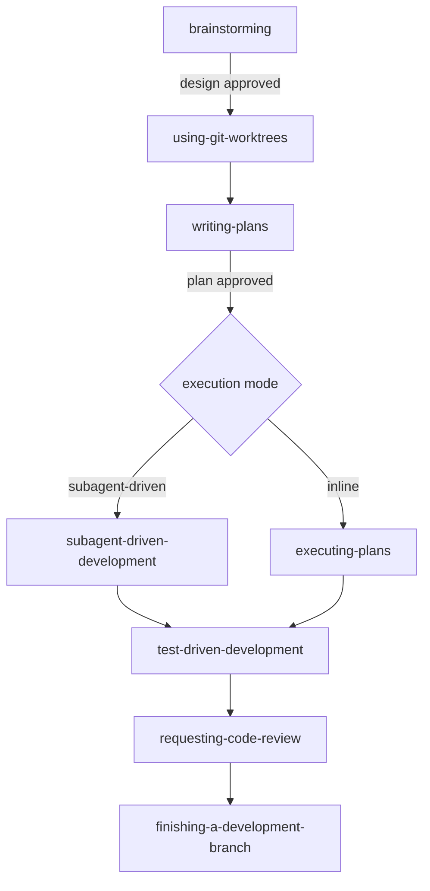

# AEE-507 Superpowers Case Study Implementation Plan

> **For agentic workers:** REQUIRED SUB-SKILL: Use superpowers:subagent-driven-development (recommended) or superpowers:executing-plans to implement this plan task-by-task. Steps use checkbox (`- [ ]`) syntax for tracking.

**Goal:** Publish AEE-507 "Superpowers: A Skills-System Case Study" as a bilingual article (EN + zh-TW) under Agent Skills (500s), illustrating AEE-500 through AEE-506's abstract concepts with Superpowers as a concrete mature example.

**Architecture:** Six sequential tasks. Task 1 verifies external references (Superpowers repo + Anthropic guidance). Task 2 drafts the EN article. Task 3 runs `polish-documents` on the EN draft. Task 4 drafts the zh-TW mirror, then runs `polish-documents` on it. Task 5 updates the 500.md category index. Task 6 builds, deletes research notes, commits cleanup. Polish is a mandatory gate between draft and commit for each language version.

**Tech Stack:** VitePress 1.3.x, pnpm, plain Markdown under `docs/en/` and `docs/zh-tw/`. No executable code produced. Verification is `pnpm docs:build`. Polishing via `polish-documents` skill per project style rules.

---

## File Structure

| File | Responsibility | Created by |
|---|---|---|
| `docs/superpowers/research-notes/aee-507-sources.md` | One row per planned reference: URL, what claim it supports, verification status. Deleted at end of Task 6. | Task 1 |
| `docs/en/Agent Skills/507.md` | EN article. | Task 2 (drafted), Task 3 (polished) |
| `docs/zh-tw/Agent Skills/507.md` | zh-TW mirror. | Task 4 (drafted + polished) |
| `docs/en/Agent Skills/500.md` | Category overview — add AEE-507 to the article enumeration. | Task 5 |
| `docs/zh-tw/Agent Skills/500.md` | zh-TW category overview — same update. | Task 5 |
| `docs/en/list.md` / `docs/zh-tw/list.md` | Auto-generated; NOT hand-edited. | (not touched) |

---

## Research Ground Rules (apply to every task)

- Every reference in the final article MUST be a real URL reachable at verification time.
- If a planned source is not reachable, either replace it with another authoritative source, drop the claim, or rewrite as disclosed inference. Never cite a URL you did not fetch.
- Vendor-neutral tone per `CLAUDE.md`, except where Superpowers is explicitly the study object. The article is a disclosed case study; the disclosure is in Context and is not hidden.
- Post-RFC-2119-cleanup convention: NO `**RFC 2119:**` bold label. MUST/SHOULD/MAY bullets flow directly from the preceding paragraph.
- No emoji anywhere.
- No em-dash chains used as filler connectors (per CLAUDE.md writing-style rule). The polish step in Tasks 3 and 4 enforces this after the draft.

---

## Task 1: Research and reference verification

**Files:**
- Create: `docs/superpowers/research-notes/aee-507-sources.md`

**Goal:** Verify every planned reference URL is live. Record what each source supports. The file is the single source of truth for what the article can cite.

- [ ] **Step 1: Create research-notes directory and seed the file**

Run:
```bash
mkdir -p docs/superpowers/research-notes
```

Then create `docs/superpowers/research-notes/aee-507-sources.md` with this starter content:

```markdown
# AEE-507 Reference Verification Notes

| # | URL | Claim it supports | Status | Notes |
|---|---|---|---|---|
| 1 | https://github.com/obra/superpowers | Canonical Superpowers repository; project home | pending | - |
| 2 | https://github.com/obra/superpowers/blob/main/README.md | Framework overview, 7-stage workflow, skill categories | pending | - |
| 3 | https://github.com/obra/superpowers/blob/main/CLAUDE.md | Contributor guide; 94% PR rejection rate; skill-as-code philosophy | pending | - |
| 4 | https://github.com/obra/superpowers/blob/main/skills/using-superpowers/SKILL.md | Entry-point skill; Red Flags table; 1% rule; SUBAGENT-STOP | pending | - |
| 5 | https://github.com/obra/superpowers/blob/main/skills/writing-skills/SKILL.md | Meta-skill; TDD mapping; skill structure | pending | - |
| 6 | https://github.com/obra/superpowers/blob/main/skills/brainstorming/SKILL.md | HARD-GATE pattern; design-first workflow | pending | - |
| 7 | https://blog.fsck.com/2025/10/09/superpowers/ | Author's blog post introducing Superpowers | pending | Author: Jesse Vincent |
| 8 | Anthropic skill-authoring guidance (current canonical URL) | Contrast reference; Superpowers' CLAUDE.md notes it deliberately differs | pending | URL to locate at verification time |

## Verified claims to cite

(Populate as you verify each row.)

## Dropped or rewritten claims

(Populate if a claim cannot be verified.)
```

- [ ] **Step 2: Verify rows 1 and 2 — Superpowers repo and README**

Use WebFetch on `https://github.com/obra/superpowers` and `https://raw.githubusercontent.com/obra/superpowers/main/README.md`.

Record from the README: the 7-stage workflow order (brainstorming → using-git-worktrees → writing-plans → subagent-driven-development/executing-plans → test-driven-development → requesting-code-review → finishing-a-development-branch); skill categories (Testing, Debugging, Collaboration, Meta); the multi-platform install instructions.

Update rows 1 and 2 with status=verified and brief evidence notes.

- [ ] **Step 3: Verify row 3 — CLAUDE.md contributor guide**

Use WebFetch on `https://raw.githubusercontent.com/obra/superpowers/main/CLAUDE.md`.

Record: the exact wording of the "94% PR rejection rate" framing; the "skills are not prose — they are code" claim; the stance on domain-specific skills, third-party dependencies, and compliance changes; the "your human partner" phrasing note.

Update row 3. If any claim cannot be verified from the canonical source, drop it from the article.

- [ ] **Step 4: Verify rows 4, 5, 6 — key SKILL.md files**

Use WebFetch on the three SKILL.md raw URLs (using-superpowers, writing-skills, brainstorming).

From `using-superpowers`: the `EXTREMELY-IMPORTANT` / 1% rule wording, the Red Flags table structure, the SUBAGENT-STOP tag purpose, the skill-priority ordering (process skills first, implementation skills second), the skill-types distinction (Rigid vs. Flexible).

From `writing-skills`: the TDD mapping table (test case = pressure scenario with subagent; etc.), the "write baseline scenario BEFORE writing the skill" rule, the SKILL.md structure (frontmatter: name + description, max 1024 chars), the directory pattern.

From `brainstorming`: the HARD-GATE tag usage and wording, the checklist-to-TodoWrite pattern, the process-flow digraph.

Update rows 4, 5, 6 with status=verified. Drop any specific claims whose wording cannot be verified.

- [ ] **Step 5: Verify row 7 — author's blog post**

Use WebFetch on `https://blog.fsck.com/2025/10/09/superpowers/`.

Confirm the post exists and is by Jesse Vincent. Extract any authorial framing that adds value to the article (the intent behind the framework, design decisions called out by the author).

If the URL has moved or is unreachable, search for the canonical URL. If still unreachable, drop this row — the article can stand on the in-repo sources.

- [ ] **Step 6: Verify row 8 — Anthropic skill-authoring guidance**

Locate the current canonical URL for Anthropic's skill-authoring guidance. Candidates: `https://docs.claude.com/en/docs/agents/skills` or similar. Use WebFetch to confirm it is live and does discuss skill authoring.

The article's Deep Dive subsection 2 cites Anthropic's guidance as a contrast point ("Superpowers' CLAUDE.md notes it deliberately differs"). A verified URL is required to make that claim. If the URL cannot be verified, the claim rewrites to: "Superpowers' own contributor guide explicitly notes the framework adopts different conventions than standard skill-authoring practice" (with a citation to Superpowers' CLAUDE.md from row 3).

Update row 8. Record which phrasing the article will use based on verification outcome.

- [ ] **Step 7: Finalize notes and commit**

Add a `## Final reference list` section to the notes file, showing the exact markdown reference entries that will appear in the article, in a skimmable order:

```markdown
## Final reference list

- [Superpowers — obra/superpowers](https://github.com/obra/superpowers) -- canonical repo.
- [Superpowers README](https://github.com/obra/superpowers/blob/main/README.md) -- framework overview and install.
- (etc. — one line per verified source)
```

Then commit:

```bash
git add docs/superpowers/research-notes/aee-507-sources.md
git commit -m "$(cat <<'EOF'
research: AEE-507 Superpowers case study reference verification notes

Co-Authored-By: Claude Opus 4.7 (1M context) <noreply@anthropic.com>
EOF
)"
```

---

## Task 2: Author the EN article (draft)

**Files:**
- Create: `docs/en/Agent Skills/507.md`

**Goal:** Draft the EN article per the spec, citing only references verified in Task 1. Do not polish yet — polish happens in Task 3 after the full draft is in place.

- [ ] **Step 1: Open the style references**

Read `docs/en/Agent Skills/501.md` (skill anatomy reference the article will build on).
Read `docs/en/Agent Skills/504.md` (skill composition reference).
Read `docs/en/Agentic Development Workflows/807.md` (framework-survey prose cadence).
Read `docs/en/Agentic Development Workflows/808.md` (most recent framework-focused article, same author voice).

- [ ] **Step 2: Create `docs/en/Agent Skills/507.md` with frontmatter**

File content begins exactly:

```markdown
---
id: 507
title: "Superpowers: A Skills-System Case Study"
state: draft
---

# [AEE-507] Superpowers: A Skills-System Case Study

## Context
```

- [ ] **Step 3: Write the Context section**

Target length: 180–220 words. Content requirements:

- Open: the 500s (AEE-500 through AEE-506) describe the skills ecosystem abstractly. A single concrete case study of a mature skill system teaches what abstract coverage cannot.
- Why Superpowers: open-source, multi-platform, actively maintained, publicly documented, operationally used by the article's author. The choice is defensible.
- Disclosure (explicit, not hidden): this article is written by someone with direct operational experience using Superpowers. Every skill referenced in the article has been invoked in the session that produced the article. This is the premise of the case study.
- Pointer: [AEE-807](../Agentic%20Development%20Workflows/807) surveys Superpowers at framework level; this article goes narrower and deeper, using Superpowers to make the 500s concepts concrete.

End the section with a blank line before `## Design Think`.

- [ ] **Step 4: Write the Design Think section**

Target length: 260–320 words.

1. First paragraph (~90 words): three properties that make Superpowers a useful study object for the 500s. Small skill library with sharp composition rules (14 skills, each focused, explicitly chaining via `REQUIRED SUB-SKILL`). Behavior-shaping as engineering (skills tuned against pressure tests). Meta-skill closure (`writing-skills` is itself a skill; `tests/` holds scenario evals).
2. Second paragraph (~70 words): how to read the case study. One valid realization, not "the" correct design. The 500s describe a space of designs; Superpowers occupies one point in that space. Teams building their own skill libraries should take the patterns that address problems they actually have.
3. Lead-in paragraph (~30 words) followed by MUST/SHOULD/MAY bullets (flowing directly, no label):
   - Readers MUST treat Superpowers as one illustrative example, not as a reference implementation to copy mechanically.
   - Teams building skill systems SHOULD take from this case study the patterns that address problems they actually have, not the patterns that look novel.
   - Engineers MUST NOT assume every behavior-shaping pattern shown here is necessary for every skill library. Superpowers deliberately adopts them because its skills are rigid and process-critical.
   - Readers interested in a neutral survey of skill-distributing systems SHOULD read AEE-502 for the ecosystem view and AEE-807 for framework-level comparisons.

- [ ] **Step 5: Write Deep Dive subsection 1 — Framework overview**

Heading: `### 1. Framework overview`

Target: ~200 words. Content:

- 14 skills grouped into four categories: Testing (test-driven-development), Debugging (systematic-debugging, verification-before-completion), Collaboration (brainstorming, writing-plans, executing-plans, subagent-driven-development, dispatching-parallel-agents, requesting-code-review, receiving-code-review, using-git-worktrees, finishing-a-development-branch), Meta (writing-skills, using-superpowers).
- Multi-platform distribution: Claude Code plugin, Cursor plugin, Codex, OpenCode, Copilot CLI, Gemini CLI. Each target has its own init directory (`.claude-plugin/`, `.codex/`, `.cursor-plugin/`, `.opencode/`), plus `gemini-extension.json` and `GEMINI.md`.
- Interop mechanism: `AGENTS.md -> CLAUDE.md` symlink at the repo root. Live realization of [AEE-808](../Agentic%20Development%20Workflows/808)'s symlink interop pattern.
- Session hooks: `hooks/session-start` auto-loads `using-superpowers` at every new session. That is why the skill appears to fire without explicit invocation from the user.

Cite the Superpowers repo (row 1) and README (row 2) inline.

- [ ] **Step 6: Write Deep Dive subsection 2 — Skill anatomy**

Heading: `### 2. Skill anatomy`

Target: ~250 words. Concrete realization of [AEE-501](501).

Required content:

- SKILL.md with YAML frontmatter. Two required fields: `name` (letters, numbers, hyphens) and `description`. Max 1024 characters total.
- `description` describes WHEN to use the skill, not WHAT it does. Phrased as "Use when ..." to focus on the triggering conditions the harness matches against user intent.
- Optional supporting files: heavy references (100+ lines), reusable templates, sub-prompts for specialized review agents. Kept separate from SKILL.md to keep the main document scannable.
- Skill types: Rigid (TDD, debugging — follow exactly) vs. Flexible (patterns — adapt principles). Each skill states its own type.
- Directory pattern: `skills/<skill-name>/SKILL.md` plus optional companion files. Flat namespace.
- Concrete example: show the `using-superpowers` SKILL.md frontmatter:

  ```yaml
  ---
  name: using-superpowers
  description: Use when starting any conversation - establishes how to find and use skills, requiring Skill tool invocation before ANY response including clarifying questions
  ---
  ```

- Contrast with Anthropic's default skill-authoring guidance: Superpowers' CLAUDE.md explicitly notes the framework differs. The behavior-shaping patterns in the next subsection are the reason. Cite row 8 here if verified, or rewrite per Task 1 Step 6 fallback if not.

Cite row 4 (using-superpowers SKILL.md) and row 5 (writing-skills SKILL.md).

- [ ] **Step 7: Write Deep Dive subsection 3 — Behavior-shaping patterns**

Heading: `### 3. Behavior-shaping patterns`

Target: ~350 words. This is the distinctive contribution of the case study.

Required content, in this order:

- Opening paragraph (~50 words): the problem these patterns address. Agents under time pressure rationalize around skills. Rationalizations like "This feels productive" lead to undisciplined action. "I know what that means" leads to knowing-the-concept without invoking-the-skill. Superpowers' patterns exist to defend against these failure modes.
- Pattern 1 — `EXTREMELY-IMPORTANT` tags plus the "1% rule": "if you think there is even a 1% chance a skill might apply to what you are doing, you ABSOLUTELY MUST invoke the skill." Forces skill checking before any response, including clarifying questions.
- Pattern 2 — Red Flags tables. Each row names a rationalizing thought and its counter. Example: "This is just a simple question" → "Questions are tasks. Check for skills." The table is exhaustive, not representative — it enumerates the known failure modes observed in pressure tests.
- Pattern 3 — `HARD-GATE` tags marking approval checkpoints. Cite brainstorming's hard-gate wording verbatim if verified: "Do NOT invoke any implementation skill, write any code, scaffold any project, or take any implementation action until you have presented a design and the user has approved it."
- Pattern 4 — `SUBAGENT-STOP` tags that suppress skill activation when dispatched as a subagent. Example in `using-superpowers`: "If you were dispatched as a subagent to execute a specific task, skip this skill." Subagents receive context-appropriate instructions rather than the top-level entry-point behavior.
- Pattern 5 — Graphviz `digraph` process flow diagrams embedded in SKILL.md. The flow is the canonical decision tree; readers and agents follow the same graph.
- Pattern 6 — Deliberate phrasing. "Your human partner" rather than "the user." Superpowers' contributor CLAUDE.md explicitly calls this out as non-interchangeable.
- Closing paragraph (~40 words): these patterns are novel relative to plain-markdown skill docs. They exist because Superpowers treats skills as behavioral code that requires engineering discipline, not as optional advice the agent may choose to follow.

Cite rows 4 (using-superpowers) and 3 (CLAUDE.md) for the specific wording.

- [ ] **Step 8: Write Deep Dive subsection 4 — Workflow composition**

Heading: `### 4. Workflow composition`

Target: ~200 words. Concrete realization of [AEE-504](504).

Required content:

- Seven-stage pipeline: brainstorming → using-git-worktrees → writing-plans → subagent-driven-development / executing-plans → test-driven-development → requesting-code-review → finishing-a-development-branch.
- Each stage hard-gates before the next. Brainstorming does not transition to writing-plans until the design is approved. writing-plans does not transition to execution until the plan is written and reviewed.
- Skills reference each other by name through explicit `REQUIRED SUB-SKILL` headers. The pipeline is encoded in the skills themselves, not in an external orchestrator.
- Terminal states: each skill's process flow has an explicit terminal node pointing to the next skill. brainstorming's terminal is "Invoke writing-plans skill"; writing-plans' terminal is "Offer execution choice." The chain is visible in the documentation.
- Alternative paths: `executing-plans` for inline execution, `subagent-driven-development` for fresh-subagent-per-task. Both are hard-gated on a complete plan.

- [ ] **Step 9: Write Deep Dive subsection 5 — Meta-skill and test harness**

Heading: `### 5. Meta-skill and test harness`

Target: ~250 words. Concrete realization of [AEE-505](505).

Required content:

- `writing-skills` treats skill creation as TDD applied to documentation. The mapping: test case = pressure scenario with subagent; production code = skill document; RED = agent violates the rule without the skill; GREEN = agent complies with the skill present; refactor = close rationalization loopholes while maintaining compliance.
- Process: (1) run baseline pressure scenario BEFORE writing the skill to document what the agent does wrong; (2) write the skill addressing those specific violations; (3) re-run the scenario to verify compliance; (4) find new rationalizations, plug them, re-verify.
- The `tests/` directory. Subdirectories: brainstorm-server, claude-code, explicit-skill-requests, opencode, skill-triggering, subagent-driven-dev. Scenario evals across platforms, not unit tests.
- Skills as versioned code. Cite Superpowers' CLAUDE.md: "Skills are not prose — they are code that shapes agent behavior." PRs that modify skill content without eval evidence are rejected.
- Single specialized subagent: `agents/code-reviewer.md`. Everything else is a generic subagent loading the relevant skill. The specialized-subagent-per-task pattern is rejected; skills compose through general-purpose subagents loading relevant skills.

Cite rows 3 (CLAUDE.md) and 5 (writing-skills SKILL.md).

- [ ] **Step 10: Write Deep Dive subsection 6 — Opinionated philosophy**

Heading: `### 6. Opinionated philosophy`

Target: ~200 words. Concrete realization of [AEE-506](506).

Required content:

- TDD-first without exceptions. `test-driven-development` is a rigid skill; adaptation is not permitted.
- Skills override default system prompt behavior; user instructions (CLAUDE.md, GEMINI.md, AGENTS.md, direct requests) override skills. The precedence is explicit in `using-superpowers`.
- "Evidence over claims." The `verification-before-completion` skill requires running verification commands and confirming output before making success claims. It is paired with systematic-debugging, not optional.
- Contributor discipline. Cite the CLAUDE.md opening: "This repo has a 94% PR rejection rate." The guide explicitly addresses AI agents attempting drive-by PRs. Domain-specific skills are rejected from core; zero-dependency is a rule; "compliance" reformatting without eval evidence is rejected.
- The library stays deliberately small (14 skills) and general-purpose. Domain-specific work belongs in separate plugins.
- Contrast for readers: a skill library that grows unchecked without eval discipline or compositional constraints accumulates maintenance debt much faster than this one.

- [ ] **Step 11: Write the Best Practices section**

Heading: `## Best Practices`

Six numbered items in this format (bolded rule + 1–2 sentence justification):

```markdown
1. **Write skill descriptions that describe WHEN to use, not WHAT the skill does.** The description field is how the harness matches user intent to the skill. "Use when ..." phrasing focuses the description on triggering conditions rather than capability-catalog prose.

2. **Pressure-test skills against rationalization, not just happy-path usage.** A skill that works when the agent wants to invoke it and fails when the agent is under time pressure is a skill that will not fire when it matters most. Write the failure cases first, then the skill.

3. **Compose by reference, not by copy.** Skills that embed chunks of other skills rot in parallel. Skills that reference other skills through explicit `REQUIRED SUB-SKILL` pointers let each skill evolve independently.

4. **Treat the skill library as code requiring evals.** Any change to skill content risks behavior drift. A library without a scenario test suite cannot detect drift; it will eventually collect skills that work for the author but fail for everyone else.

5. **Keep the library small and general.** Domain-specific skills belong in separate plugins or in project-level CLAUDE.md. A core library that grows unchecked becomes a tax on every new skill authored.

6. **Hard-gate irreversible transitions.** The moment a skill's next step is a file mutation, a branch merge, or a user-visible message, insert an explicit approval gate. Hard gates are not friction; they are the mechanism that makes autonomous operation trustworthy.
```

- [ ] **Step 12: Write the Visual section**

Heading: `## Visual`

Content, in order:

1. Lead-in (~30 words): the seven-stage pipeline with hard-gates, plus a reference table of the behavior-shaping patterns.
2. Mermaid diagram:

````markdown

````

3. Behavior-shaping patterns reference table:

```markdown
| Pattern | What it solves | Example location |
|---|---|---|
| `EXTREMELY-IMPORTANT` + 1% rule | Skill skipped under time pressure | `skills/using-superpowers/SKILL.md` |
| Red Flags table | Rationalization around skill invocation | `skills/using-superpowers/SKILL.md` |
| `HARD-GATE` tag | Implementation started before design approved | `skills/brainstorming/SKILL.md` |
| `SUBAGENT-STOP` | Subagents replaying top-level entry-point behavior | `skills/using-superpowers/SKILL.md` |
| `digraph` process flow | Ambiguous decision branching | multiple skills |
| "Your human partner" phrasing | Interchangeability with "the user" softens agency | contributor `CLAUDE.md` |
```

- [ ] **Step 13: Write Related AEEs, References, and Changelog**

Heading `## Related AEEs` with list in this exact order:

```markdown
- [AEE-500](500) — Skills vs. Tools — the foundational distinction this case study assumes
- [AEE-501](501) — What Is an Agent Skill — skill anatomy; Deep Dive section 2 makes it concrete
- [AEE-502](502) — The Agent Skill Ecosystem — framework overview illustrates the ecosystem
- [AEE-503](503) — Skill Design — behavior-shaping patterns in Deep Dive section 3 extend this
- [AEE-504](504) — Skill Composition — workflow composition in Deep Dive section 4 extends this
- [AEE-505](505) — Skill Management — meta-skill and test harness in Deep Dive section 5 extend this
- [AEE-506](506) — Skill Governance — contributor discipline in Deep Dive section 6 extends this
- [AEE-807](../Agentic%20Development%20Workflows/807) — Spec-Driven Development Frameworks in Practice — Superpowers' framework-level survey entry; this article is the narrower-and-deeper sibling
- [AEE-808](../Agentic%20Development%20Workflows/808) — AGENTS.md and Authoring Best Practices — Superpowers' `AGENTS.md -> CLAUDE.md` symlink is a live example of AEE-808's symlink interop pattern
```

Heading `## References` with a markdown list. Populate ONLY from verified rows in `docs/superpowers/research-notes/aee-507-sources.md`. Drop any row not verified; if a subsection's load-bearing claim drops, the claim itself must have been rewritten per Task 1 Step 6 fallback.

```markdown
- [Superpowers — obra/superpowers](https://github.com/obra/superpowers) — canonical repository for the plugin.
- [Superpowers README](https://github.com/obra/superpowers/blob/main/README.md) — framework overview, skill categories, 7-stage workflow, install instructions.
- [Superpowers contributor guide — CLAUDE.md](https://github.com/obra/superpowers/blob/main/CLAUDE.md) — opinionated contribution stance; "skills are not prose" philosophy.
- [using-superpowers skill](https://github.com/obra/superpowers/blob/main/skills/using-superpowers/SKILL.md) — entry-point skill; 1% rule, Red Flags, SUBAGENT-STOP.
- [writing-skills skill](https://github.com/obra/superpowers/blob/main/skills/writing-skills/SKILL.md) — meta-skill; TDD mapping for skill creation.
- [brainstorming skill](https://github.com/obra/superpowers/blob/main/skills/brainstorming/SKILL.md) — HARD-GATE pattern in action.
- [Superpowers for Claude Code — Jesse Vincent](https://blog.fsck.com/2025/10/09/superpowers/) — author's introduction to the framework.
- (optional) [Anthropic skill-authoring guidance](<verified URL>) — contrast reference.
```

Drop any optional entry that did not verify in Task 1.

Heading `## Changelog` with a single entry:

```markdown
- 2026-04-19 — Initial draft
```

- [ ] **Step 14: DO NOT commit yet**

The draft is complete but unpolished. Do not `git add` or `git commit` in this task. The next task runs `polish-documents` on the file and produces the final committed state.

---

## Task 3: Polish the EN article

**Files:**
- Modify: `docs/en/Agent Skills/507.md` (via polish-documents skill)

**Goal:** Apply `polish-documents` to tighten sentences, remove prohibited style patterns (em-dash chains, contrastive negation, precision puffery, unanchored claims, capability stacks), and apply Google Developer Style principles. Mandatory gate between draft and commit.

- [ ] **Step 1: Invoke the polish-documents skill**

Invoke `polish-documents` on `docs/en/Agent Skills/507.md`. The skill reads the file, applies its polishing rules, and writes the result back.

Required outcome: the file no longer contains em-dash chains used as filler connectors, contrastive negation ("not X, but Y" with unrelated concepts), precision puffery, unanchored vague adjectives, or capability-stack "can X, can Y, can Z" phrasings. Voice and structural content are preserved.

If `polish-documents` is not available as a skill in the harness, STOP and escalate. The polish step is a mandatory spec requirement; skipping it is not acceptable. Ask the human partner to make `polish-documents` available or to accept the draft as-is with explicit acknowledgment that the CLAUDE.md style rules are not enforced on this article.

- [ ] **Step 2: Sanity-check the polished output**

Read the polished `docs/en/Agent Skills/507.md` and confirm:
- Frontmatter and section structure are preserved (Context, Design Think, Deep Dive 1–6, Best Practices, Visual, Related AEEs, References, Changelog).
- Links to other AEEs (`../Agentic%20Development%20Workflows/807`, etc.) are not broken.
- The mermaid code fence is intact.
- Tables are intact.
- Word count has not collapsed below half of the target ranges — if it has, the polish over-aggressed and needs review.

If any of these fail, restore from git (`git checkout -- "docs/en/Agent Skills/507.md"`) and re-run polish with guardrails, OR manually fix the specific regressions while preserving the polish gains.

- [ ] **Step 3: Commit the polished EN article**

```bash
git add "docs/en/Agent Skills/507.md"
git commit -m "$(cat <<'EOF'
content: AEE-507 Superpowers case study (EN, polished)

Co-Authored-By: Claude Opus 4.7 (1M context) <noreply@anthropic.com>
EOF
)"
```

---

## Task 4: Author the zh-TW mirror and polish

**Files:**
- Create: `docs/zh-tw/Agent Skills/507.md`

**Goal:** Draft the zh-TW article paralleling the EN article, then polish with `polish-documents`, then commit.

- [ ] **Step 1: Open EN article and zh-TW style references**

Read the polished `docs/en/Agent Skills/507.md`.
Read `docs/zh-tw/Agent Skills/501.md` for established 500s zh-TW terminology.
Read `docs/zh-tw/Agentic Development Workflows/807.md` and `docs/zh-tw/Agentic Development Workflows/808.md` for tone and cadence.

- [ ] **Step 2: Terminology decisions**

Confirm these fixed terms (corpus established usage wins if any conflicts):

- "Superpowers" — stays in English.
- "Skill" / "skill system" → `技能` / `技能系統`.
- "Behavior-shaping patterns" → `行為塑形模式`.
- "Hard-gate" → `硬性閘門`.
- "Rationalization" → `合理化`.
- "Pressure test" → `壓力測試`.
- "Red Flags table" → `紅旗表`.
- "Human partner" (Superpowers-specific phrasing) → `人類夥伴`; preserve the deliberate non-interchangeability with `使用者`.
- MUST / SHOULD / MAY preserved as English keywords inline.
- Frontmatter tags (`EXTREMELY-IMPORTANT`, `HARD-GATE`, `SUBAGENT-STOP`), filenames, command syntax, skill names all stay in English.
- Section headings: `背景脈絡`, `設計思考`, `深度解析`, `最佳實踐`, `視覺`, `相關 AEE`, `參考資料`, `更新記錄`.

If any term conflicts with established 501–506 zh-TW usage, corpus usage wins.

- [ ] **Step 3: Create `docs/zh-tw/Agent Skills/507.md` with frontmatter**

File content begins exactly:

```markdown
---
id: 507
title: "Superpowers：技能系統案例研究"
state: draft
---

# [AEE-507] Superpowers：技能系統案例研究

## 背景脈絡
```

- [ ] **Step 4: Translate the full article**

Match the polished EN article paragraph-for-paragraph, section-for-section. Tables, mermaid diagrams, and URL references stay identical to EN (node labels in English, table cell prose translated where meaningful, framework/skill names stay English).

Preserve:
- The six Deep Dive subsections and their headings (translated).
- The MUST/SHOULD/MAY bullets with English keywords inline.
- The bolded-rule pattern in Best Practices (6 items).
- The behavior-shaping patterns reference table — translate column headers and cell descriptions; keep example locations in English.
- The mermaid diagram — identical to EN.
- Related AEEs — use the zh-TW titles that match each target article's actual `title:` frontmatter. Verify each title before committing.
- References — same verified URLs as EN; link text translated where meaningful.

- [ ] **Step 5: Invoke polish-documents on the zh-TW file**

Invoke `polish-documents` on `docs/zh-tw/Agent Skills/507.md`. The skill handles Traditional Chinese and mixed-language Markdown files.

Same failure handling as Task 3 Step 1: if the skill is unavailable, STOP and escalate.

- [ ] **Step 6: Sanity-check the polished zh-TW output**

Same checks as Task 3 Step 2, adjusted for the zh-TW file. Confirm mermaid block, tables, links, and frontmatter are preserved. If word count collapsed below half the target, review and fix.

- [ ] **Step 7: Commit the polished zh-TW article**

```bash
git add "docs/zh-tw/Agent Skills/507.md"
git commit -m "$(cat <<'EOF'
content: AEE-507 Superpowers 技能系統案例研究 (zh-TW, polished)

Co-Authored-By: Claude Opus 4.7 (1M context) <noreply@anthropic.com>
EOF
)"
```

---

## Task 5: Update 500.md category index (EN + zh-TW)

**Files:**
- Modify: `docs/en/Agent Skills/500.md`
- Modify: `docs/zh-tw/Agent Skills/500.md`

**Goal:** Add AEE-507 to the category overview, following the pattern used for 501–506.

- [ ] **Step 1: Inspect EN 500.md structure**

Read `docs/en/Agent Skills/500.md`. Find the section that enumerates AEE-501 through AEE-506. Note the exact format (table rows, bullet list, or similar).

Also check whether the Context prose references a range like "AEE-501 through AEE-506" that would need updating.

- [ ] **Step 2: Add AEE-507 to EN 500.md**

Add an entry for AEE-507 immediately after the AEE-506 entry. Match the exact formatting of surrounding entries.

If the existing file uses a table:

```markdown
| AEE-507 | Superpowers: A Skills-System Case Study | Case study illustrating AEE-500 through AEE-506 concepts in the Superpowers skill system: skill anatomy, behavior-shaping patterns, workflow composition, meta-skill test harness, opinionated philosophy |
```

If it uses a list:

```markdown
- [AEE-507](507) — Superpowers: A Skills-System Case Study — concrete case study realizing 500–506 concepts in one mature skill system
```

If any prose enumerates the range ("AEE-501 through AEE-506"), update it to "AEE-501 through AEE-507".

- [ ] **Step 3: Inspect and update zh-TW 500.md**

Read `docs/zh-tw/Agent Skills/500.md`. Find the parallel section.

Add the zh-TW entry after the AEE-506 entry:

Table variant:

```markdown
| AEE-507 | Superpowers：技能系統案例研究 | 在 Superpowers 技能系統中具體呈現 AEE-500 至 AEE-506 概念的案例研究：技能結構、行為塑形模式、工作流程組合、後設技能測試工具、開放的哲學立場 |
```

List variant:

```markdown
- [AEE-507](507) — Superpowers：技能系統案例研究 — 在單一成熟技能系統中具體呈現 500–506 概念的案例研究
```

If any prose enumerates the range ("AEE-501 至 AEE-506"), update it to "AEE-501 至 AEE-507".

- [ ] **Step 4: Commit both updates**

```bash
git add "docs/en/Agent Skills/500.md" "docs/zh-tw/Agent Skills/500.md"
git commit -m "$(cat <<'EOF'
docs(500): add AEE-507 to category index (EN + zh-TW)

Co-Authored-By: Claude Opus 4.7 (1M context) <noreply@anthropic.com>
EOF
)"
```

---

## Task 6: Build, clean up, final commit

**Files:**
- Delete: `docs/superpowers/research-notes/aee-507-sources.md`
- Potentially modify: any file the build surfaces a problem in.

**Goal:** Confirm the VitePress build renders the new article, clean up the research notes, commit.

- [ ] **Step 1: Run the VitePress build**

Run: `pnpm docs:build`
Expected: exit 0. No errors about unresolved links, malformed frontmatter, or unparseable mermaid. A non-fatal chunk-size warning is acceptable.

If the build fails, read the error, fix the specific file with Edit, rerun until green.

- [ ] **Step 2: Spot-check rendered article**

Confirm both render:
```bash
ls docs/.vitepress/dist/507.html docs/.vitepress/dist/zh-tw/507.html
```
Expected: both listed.

Grep each rendered file for `AEE-507`:
```bash
grep -o 'AEE-507[^<]*' docs/.vitepress/dist/507.html | head -3
grep -o 'AEE-507[^<]*' docs/.vitepress/dist/zh-tw/507.html | head -3
```
Expected: at least one match per file.

Grep the EN rendered file to confirm the mermaid block rendered:
```bash
grep -c "mermaid" docs/.vitepress/dist/507.html
```
Expected: at least 1.

Grep the EN rendered file to confirm cross-category links rewrote correctly:
```bash
grep -o 'href="[^"]*807[^"]*"' docs/.vitepress/dist/507.html | head -3
```
Expected: at least one href of the form `/agentic-engineering-essentials/807`.

- [ ] **Step 3: Delete research notes file**

Run:
```bash
rm docs/superpowers/research-notes/aee-507-sources.md
```

Check whether `docs/superpowers/research-notes/` is now empty:
```bash
ls docs/superpowers/research-notes/ 2>/dev/null | wc -l
```
If output is `0`, remove the empty directory:
```bash
rmdir docs/superpowers/research-notes/
```

- [ ] **Step 4: Verify no other files were accidentally modified**

Run: `git status --short`

Expected:
- `D docs/superpowers/research-notes/aee-507-sources.md` (or already gone)
- `M docs/en/list.md` (pre-existing auto-gen change — NOT part of this work)
- `M docs/zh-tw/list.md` (pre-existing auto-gen change — NOT part of this work)
- `??` entries for any other planning docs still present under `docs/superpowers/`

If any other tracked file shows unexpected modifications, investigate before committing.

- [ ] **Step 5: Commit the research-notes deletion**

```bash
git add -u docs/superpowers/research-notes/
git status --short | grep "list\.md" && echo "WARN: list.md appears modified (expected); unstage if it is staged"
git diff --cached --name-only | grep -E "list\.md" && git restore --staged docs/en/list.md docs/zh-tw/list.md || true
git commit -m "$(cat <<'EOF'
chore(507): delete temporary research notes

Co-Authored-By: Claude Opus 4.7 (1M context) <noreply@anthropic.com>
EOF
)"
```

- [ ] **Step 6: Final verification**

Run: `git log --oneline -7`

Expected top commits (top = newest):
- `chore(507): delete temporary research notes`
- `docs(500): add AEE-507 to category index (EN + zh-TW)`
- `content: AEE-507 Superpowers 技能系統案例研究 (zh-TW, polished)`
- `content: AEE-507 Superpowers case study (EN, polished)`
- `research: AEE-507 Superpowers case study reference verification notes`
- (previous commit unrelated to this work)

Run: `pnpm docs:build` one final time to confirm post-deletion state builds cleanly.

Stop here and report. Pushing is the user's call per project convention.

---

## Rollback plan

If any task produces unacceptable output, revert with:
```bash
git reset --hard HEAD~<N>
```
where `<N>` is the number of commits produced by this plan so far. The plan produces up to 5 commits (research notes, EN polished, zh-TW polished, category index, cleanup); `HEAD~5` reverts all of them.

## Key differences from prior article-publishing plans

- **Polish step is mandatory** (Tasks 3 and 4). Earlier plans (AEE-808, AEE-607) did not invoke `polish-documents` because that skill was not yet part of the workflow. This plan adds it as a non-skippable gate between draft and commit for each language version.
- **Six tasks instead of five** because polish is split out from drafting for EN (Tasks 2 and 3 are separate), while zh-TW keeps drafting + polish within one task (Task 4) since it comes later and the pattern is established.
- **Escalation path for polish-documents unavailability** is explicit in Task 3 Step 1 and Task 4 Step 5. The skill is a hard dependency; missing it blocks the workflow and requires human decision rather than silent skip.
