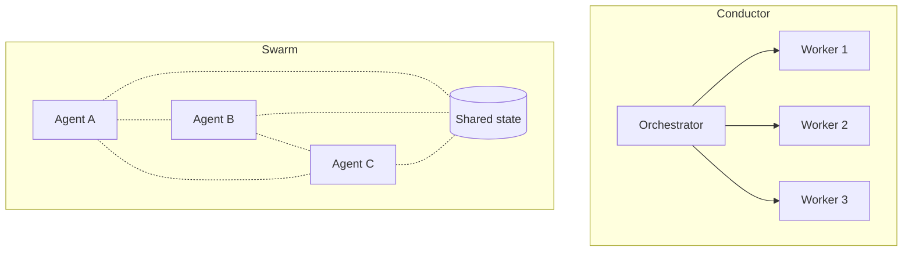

# AEE-607 Agent Swarms Article Implementation Plan

> **For agentic workers:** REQUIRED SUB-SKILL: Use superpowers:subagent-driven-development (recommended) or superpowers:executing-plans to implement this plan task-by-task. Steps use checkbox (`- [ ]`) syntax for tracking.

**Goal:** Publish AEE-607 "Agent Swarms" as a bilingual article (EN + zh-TW) under Multi-Agent and Orchestration (600s), with the three-flavor decoder (centralized-with-ergonomics, handoff-based, genuinely-decentralized), a 2026 framework landscape table, and all references verified against authoritative sources.

**Architecture:** Five sequential tasks. Task 1 fetches and verifies each framework's current docs/repo state and records verified sources in a temporary notes file (committed then deleted at the end, following the AEE-807/AEE-808 pattern). Task 2 drafts the EN article. Task 3 drafts the zh-TW mirror. Task 4 updates the 600.md category index in both locales. Task 5 builds, verifies rendering, deletes the research notes, commits cleanup. Each task ends with a focused commit.

**Tech Stack:** VitePress 1.3.x, pnpm, plain Markdown under `docs/en/` and `docs/zh-tw/`. No executable code produced. Verification is `pnpm docs:build`, not a unit test suite.

---

## File Structure

| File | Responsibility | Created by |
|---|---|---|
| `docs/superpowers/research-notes/aee-607-sources.md` | One row per planned reference: URL, what claim it supports, verification status (verified/unverifiable/replaced), the flavor mapping A/B/C for each framework. Deleted at end of Task 5. | Task 1 |
| `docs/en/Multi-Agent and Orchestration/607.md` | EN article. | Task 2 |
| `docs/zh-tw/Multi-Agent and Orchestration/607.md` | zh-TW mirror. Parallel structure to EN. | Task 3 |
| `docs/en/Multi-Agent and Orchestration/600.md` | Category index — add AEE-607 entry following the 601–606 pattern. | Task 4 |
| `docs/zh-tw/Multi-Agent and Orchestration/600.md` | zh-TW category index — same update. | Task 4 |
| `docs/en/list.md` / `docs/zh-tw/list.md` | Auto-generated; NOT hand-edited. | (not touched) |

---

## Research Ground Rules (apply to every task)

- Every reference in the final article MUST be a real URL that returns 2xx at verification time. Use WebFetch to confirm.
- If a planned source is not reachable or has moved, either (a) replace with another authoritative source, (b) drop the claim, or (c) rewrite the claim as observation rather than fact. Never cite a URL you did not fetch.
- Tweets, LinkedIn posts, Substack posts are NOT primary sources.
- Vendor-neutral tone per `CLAUDE.md`. Specific tools appear only as labeled examples.
- Post-RFC-2119-cleanup convention: NO `**RFC 2119:**` bold label. MUST/SHOULD/MAY bullets flow directly from the preceding paragraph.
- No emoji anywhere.

---

## Task 1: Research and reference verification

**Files:**
- Create: `docs/superpowers/research-notes/aee-607-sources.md`

**Goal:** Verify each framework's current state (maintenance, docs URLs, claimed patterns) and confirm the flavor mapping used in the article. This file is the single source of truth for what the article can assert.

- [ ] **Step 1: Create research-notes directory and seed the file**

Run:
```bash
mkdir -p docs/superpowers/research-notes
```

Then create `docs/superpowers/research-notes/aee-607-sources.md` with this starter content:

```markdown
# AEE-607 Reference Verification Notes

One row per planned reference. Update status after each WebFetch.

| # | URL | Claim it supports | Flavor | Verification status | Notes |
|---|---|---|---|---|---|
| 1 | https://github.com/kyegomez/swarms | Enterprise-oriented multi-pattern swarm framework | A + C | pending | - |
| 2 | https://github.com/ruvnet/ruflo | Queen/worker swarm, SONA self-learning, Claude Code-native | A | pending | formerly claude-flow |
| 3 | https://github.com/desplega-ai/agent-swarm | Lead/worker, Docker isolation, persistent identity, memory | A | pending | - |
| 4 | https://github.com/openai/swarm | Historical reference; lightweight handoff framework (unmaintained) | B | pending | - |
| 5 | OpenAI Agents SDK docs URL at verification time | Production evolution of OpenAI Swarm | B | pending | - |
| 6 | AutoGen docs URL at verification time | Conversable agents, group chat, spans flavors | A or B | pending | - |
| 7 | CrewAI docs URL at verification time | Role-based crew, task delegation | A | pending | - |
| 8 | LangGraph docs URL at verification time | Graph-node multi-agent, topology explicit | A or C | pending | - |
| 9 | A "conductor vs swarm" analysis piece (pick at verification time) | Establishes the 2026 conductor-vs-swarm framing | — | pending | - |
| 10 | Anthropic multi-agent research system blog or similar (if reachable) | Production evidence of multi-agent in practice | — | pending | optional |

## Verified claims to cite

(Populate as you verify each row. For each verified row, note the specific wording or feature claim the article will lean on.)

## Dropped or rewritten claims

(Populate if a planned claim cannot be verified and drops from the article.)

## Final framework table rows

(Populate in Step 10 with the exact rows that will appear in the article's framework landscape table.)
```

- [ ] **Step 2: Verify row 1 — kyegomez/swarms**

Use WebFetch on `https://github.com/kyegomez/swarms`.
Extract: stated framework positioning ("enterprise-grade" etc.); primitives (Agent, Swarm); the list of supported orchestration patterns (Sequential, Concurrent, Hierarchical, Graph, Group Chat, MixtureOfAgents, ForestSwarm, HeavySwarm, etc.); vendor-neutrality claim; production-readiness claim.

Update row 1 with verification status, observed primitives, observed pattern list. Decide flavor mapping: A (has hierarchical/sequential/concurrent — conductor-style) and C (MixtureOfAgents, ForestSwarm — aspire to decentralized). Mark as `A + C`.

- [ ] **Step 3: Verify row 2 — Ruflo (formerly claude-flow)**

Use WebFetch on `https://github.com/ruvnet/ruflo`.
Extract: queen/worker model; SONA self-learning; the 60+ agents and 170+ MCP tools claim; RuVector DB; Claude Code-native integration; architectural diagram if documented.

If the repo has moved or is private, try `https://github.com/ruvnet/claude-flow` as the historical name. Update row 2 with the actual reachable URL.

Record the flavor as A (queen is a coordinator — centralized-with-ergonomics, even if the word "swarm" is used in the marketing).

- [ ] **Step 4: Verify row 3 — desplega-ai/agent-swarm**

Use WebFetch on `https://github.com/desplega-ai/agent-swarm`.
Extract: lead/worker coordination; Docker isolation for workers; persistent identity files (SOUL.md, IDENTITY.md, TOOLS.md, CLAUDE.md); six lifecycle hooks; memory system with embeddings; integration adapters (Slack, GitHub, GitLab, AgentMail, Sentry); TypeScript stack.

Record flavor A. Note the "learning swarm" framing in the README for the article to cite.

- [ ] **Step 5: Verify row 4 — OpenAI Swarm (historical)**

Use WebFetch on `https://github.com/openai/swarm`.
Confirm the repo exists, is marked experimental/unmaintained, and explicitly points readers to OpenAI Agents SDK. Extract the two primitives (Agent, handoff) and the brief positioning statement.

If the README explicitly deprecates in favor of Agents SDK, record that wording verbatim — the article cites it as evidence of deprecation.

Record flavor B.

- [ ] **Step 6: Verify row 5 — OpenAI Agents SDK**

Search OpenAI's current docs for the Agents SDK landing page. Start with `https://platform.openai.com/docs/agents` or `https://openai.github.io/openai-agents-python/`. Pick the canonical URL that is live at verification time.

Extract: positioning as production evolution of Swarm; primitives (Agent, handoff or equivalent); any stated differences from Swarm.

Record flavor B. Update row 5 with the verified URL.

- [ ] **Step 7: Verify rows 6–8 — AutoGen, CrewAI, LangGraph**

For each:
- Locate current canonical docs URL (start with `https://microsoft.github.io/autogen/`, `https://docs.crewai.com/`, `https://langchain-ai.github.io/langgraph/` or their current equivalents).
- Verify the docs site is live.
- Extract one-sentence positioning and the primary primitive.

For each, pick a flavor (A / B / C / span) based on what the docs actually describe. AutoGen historically spans A and B depending on mode; CrewAI is typically A; LangGraph can be A or C depending on graph topology. Record the flavor with a one-line justification.

If a docs URL is unreachable and no replacement exists, drop that framework from the landscape table and record the decision in "Dropped or rewritten claims".

- [ ] **Step 8: Verify row 9 — conductor-vs-swarm analysis piece**

The article's Design Think and Deep Dive lean on the 2026 "conductor vs. swarm" framing. Find a current, reputable source that articulates this distinction. Candidates to try in order:

1. Independent analyst blog posts (Agix Technologies, MEXC News, analyticsvidhya, similar) that explicitly contrast "conductor" vs "swarm" architectures.
2. A vendor docs page that frames multi-agent along this axis.
3. An academic or practitioner conference talk writeup.

Verify the source is live. If the first candidate has moved or is paywalled, try the next. Record the URL and a one-sentence summary of the framing it establishes.

If no acceptable source is reachable, the article presents the conductor-vs-swarm framing as the author's observation without external citation, and this step's row drops to "Dropped or rewritten claims" with a note. The article is still viable — the framing stands on its own analytical merit.

- [ ] **Step 9: Verify row 10 — Anthropic multi-agent research system (optional)**

Try `https://www.anthropic.com/research/built-multi-agent-research-system` or the current canonical URL for Anthropic's multi-agent research blog post. If reachable, record as evidence of production multi-agent practice. If not reachable, mark as unverifiable and drop from references — this row is optional.

- [ ] **Step 10: Compile the final framework-table rows**

In the research notes, add a `## Final framework table rows` section. For each row that verified (2–8), write the exact markdown row that will appear in the article's Deep Dive subsection 3 table, in this format:

```markdown
| <framework name + link> | <flavor> | <primitives, comma-separated> | <notable feature> |
```

For frameworks where docs were unreachable, include a line in "Dropped or rewritten claims" explaining the omission. The article's Deep Dive subsection 3 only includes rows from this section.

- [ ] **Step 11: Commit research notes**

```bash
git add docs/superpowers/research-notes/aee-607-sources.md
git commit -m "$(cat <<'EOF'
research: AEE-607 Agent Swarms reference verification notes

Co-Authored-By: Claude Opus 4.7 (1M context) <noreply@anthropic.com>
EOF
)"
```

---

## Task 2: Author the EN article

**Files:**
- Create: `docs/en/Multi-Agent and Orchestration/607.md`

**Goal:** Draft the EN article per the spec, citing only references verified in Task 1. Use AEE-601, AEE-605, AEE-606, and AEE-807 as cadence references.

- [ ] **Step 1: Open style references**

Read `docs/en/Multi-Agent and Orchestration/601.md` (for 600s tone and peer-to-peer coverage this article extends).
Read `docs/en/Multi-Agent and Orchestration/605.md` (for conductor-style orchestration prose this article references).
Read `docs/en/Multi-Agent and Orchestration/606.md` (for failure-mode phrasing).
Read `docs/en/Agentic Development Workflows/807.md` (for framework-survey prose style in Deep Dive subsection 3).

- [ ] **Step 2: Create `docs/en/Multi-Agent and Orchestration/607.md` with frontmatter**

File content begins exactly:

```markdown
---
id: 607
title: Agent Swarms
state: draft
---

# [AEE-607] Agent Swarms

## Context
```

- [ ] **Step 3: Write the Context section**

Target length: 180–220 words. Content:

- Open with the phenomenon: "agent swarm" has spread across the agentic tooling market in 2024–2026 but covers very different architectures depending on the speaker.
- Name the gap in the existing 600s: AEE-601's peer-to-peer topology is narrower than what swarm means today; AEE-605's orchestration patterns are all conductor-style. No article in the corpus addresses decentralized coordination or the conductor-vs-swarm architectural split.
- State the article's job: decode what "swarm" actually covers, establish the architectural split, survey the 2026 framework landscape as evidence.
- Close with pointers: for when to coordinate agents at all, see AEE-600. For the canonical topologies, see AEE-601. This article is specifically about the "swarm" label and what sits under it.

End with a blank line before `## Design Think`.

- [ ] **Step 4: Write the Design Think section**

Target length: 260–320 words. Structure:

1. First paragraph (~80 words): the 2026 framing — conductor architectures (centralized coordinator directs workers) vs. swarm architectures (decentralized agents coordinate through shared state or local interaction). State this is an architectural split, not a continuum; real systems land on the axis somewhere.
2. Second paragraph (~70 words): what "swarm" names at its best — decentralization, fault tolerance via redundancy, dynamic composition, horizontal scale, agent autonomy. Each characteristic is a system-level property, not a property of any individual agent.
3. Third paragraph (~90 words): honest disclosure. Most frameworks labeled "swarm" are conductor-with-extras, not true swarms. The biological analogy (ants, bees) is aspirational — real LLM agents have too much individual capability and too much global state to behave like ants. The label is usefully evocative, but readers need to verify what it actually denotes for any given framework. Introduce the three-flavor decoder that Deep Dive will develop.
4. Lead-in paragraph (~30 words) + MUST/SHOULD/MAY bullets (flowing directly, no label):
   - Engineers MUST distinguish conductor-style multi-agent from swarm-style before choosing a framework. The coordination cost, failure surface, and debuggability differ sharply.
   - "Swarm" framing SHOULD be avoided when the underlying architecture is actually a conductor — it confuses reviewers and misrepresents the system's failure characteristics.
   - Swarm architectures SHOULD be chosen only when fault tolerance via redundancy is a requirement, task work is naturally parallel with loose coupling, or horizontal scale is the primary lever.
   - Teams adopting a "swarm" framework MUST verify which of the three flavors it actually implements before committing to it.

- [ ] **Step 5: Write Deep Dive subsection 1 — Conductor vs. swarm: the architectural split**

Heading: `### 1. Conductor vs. swarm: the architectural split`

Content:

1. Paragraph 1 (~80 words): explain the two architectures at a glance. Conductor has a centralized orchestrator; swarm does not. Scaling lever differs (vertical vs. horizontal). Failure surface differs (single point of failure vs. graceful degradation). Debuggability differs (follow the orchestrator vs. distributed traces).

2. Comparison table (use exactly this):

```markdown
| Aspect | Conductor | Swarm |
|---|---|---|
| Control | Centralized; one orchestrator directs workers | Decentralized; no single point of authority |
| Scaling | Vertical — orchestrator gets bigger and smarter | Horizontal — add more agents |
| Failure surface | Orchestrator is single point of failure | Graceful degradation; individual agents can fail |
| Coordination cost | O(N) (orchestrator knows N workers) | O(N^2) worst case (any agent may talk to any other) |
| Debuggability | High — follow decisions from orchestrator | Low — emergent behavior, distributed traces |
| Best for | Sequential logic, auditable decision chains, tight coordination | Parallel loose-coupled work, fault tolerance, horizontal scale |
```

3. Closing paragraph (~60 words): most real systems are hybrid. Pure swarm is rare in production; pure conductor is common. The question is where on the axis a given system sits, not which box it fills. Citing AEE-601's topologies and AEE-605's orchestration patterns, note that the corpus today documents the conductor end well and the swarm end not at all — this article closes the gap.

- [ ] **Step 6: Write Deep Dive subsection 2 — What "swarm" actually covers in 2026 — the three flavors**

Heading: `### 2. What "swarm" actually covers in 2026 — the three flavors`

Lead-in paragraph (~60 words): introduce the decoder. "Swarm" in current usage covers three distinct architectures. A reader encountering the label in a framework's marketing needs to know which flavor is on offer — the failure modes, debuggability, and appropriate use cases differ.

Then three subsections, each structured identically:

**Flavor A — Centralized multi-agent with ergonomic tooling**

- **What it is:** a conductor pattern wrapped in LLM-native developer ergonomics (lifecycle hooks, persistent identity files, MCP tool integration, Docker-isolated workers, memory or learning loops). Still has a central authority; the "swarm" label signals ergonomic maturity, not architectural decentralization.
- **Key primitives:** lead or queen coordinator, worker pool, lifecycle hooks, persistent agent identity files.
- **Representative frameworks:** desplega-ai/agent-swarm (lead/worker, Docker isolation, SOUL.md identity, memory indexing); Ruflo / claude-flow (queen/worker, SONA self-learning, 60+ specialized agents, RuVector DB). Cite the verified URLs from Task 1 inline.
- **How to tell:** look for the word "queen", "lead", "orchestrator", or "coordinator" in the architecture docs. If one agent directs the others, it is flavor A regardless of the framework's name.
- **Right when:** the goal is convenient multi-agent tooling with modern developer ergonomics, and the central-authority failure mode is acceptable.

**Flavor B — Handoff-based dynamic routing**

- **What it is:** the currently-running agent decides which agent runs next by returning a reference to another agent. No external dispatcher; coordination is embedded in agent logic itself. Only one agent runs at a time, so not truly concurrent or decentralized — but control flow is dynamic.
- **Key primitives:** Agent, handoff (a function that returns an Agent).
- **Representative frameworks:** OpenAI Swarm (October 2024, now unmaintained and superseded); OpenAI Agents SDK (production evolution, March 2025). Cite both with verified URLs from Task 1. Call out the deprecation explicitly so readers choosing between them know to use Agents SDK.
- **How to tell:** look for `handoff` as a primitive and the absence of an external orchestrator loop. Control flow is driven by what each agent returns.
- **Right when:** the flow is conversational or sequential with agent-driven routing, and there is no global orchestrator making dispatch decisions. Good for customer-support-style triage with specialist escalation.

**Flavor C — Genuinely decentralized / emergent coordination**

- **What it is:** no single coordinator. Agents act on local state and shared artifacts. System behavior emerges from many concurrent local decisions. Fault tolerance via redundancy comes for free; debuggability is very low.
- **Key primitives:** shared blackboard or message bus, local decision policies, peer discovery.
- **Representative frameworks:** kyegomez/swarms offers patterns (MixtureOfAgents, ForestSwarm) that approach this; research multi-agent systems sometimes implement it. Genuinely decentralized production systems remain rare. Cite kyegomez/swarms with verified URL from Task 1.
- **How to tell:** no designated coordinator appears in the architecture. Agents react to a shared surface (blackboard, event bus) rather than being dispatched.
- **Right when:** fault tolerance via redundancy is a hard requirement and task decomposition is loose-coupled parallel work. Accept the debuggability cost as part of the bargain.

- [ ] **Step 7: Write Deep Dive subsection 3 — Framework landscape**

Heading: `### 3. Framework landscape`

Lead-in paragraph (~60 words): the 2026 landscape of frameworks that carry the "swarm" label or are routinely called swarms. Each row below shows which flavor the framework actually implements — verified against its current docs, not its marketing.

Then insert the table compiled in Task 1 Step 10 (`## Final framework table rows` section of the research notes). The table columns are:

```markdown
| Framework | Flavor | Primitives | Notable feature |
|---|---|---|---|
```

Follow with one paragraph (~120 words) noting:
- Why AutoGen and LangGraph span flavors (mode-dependent or graph-dependent), and why that ambiguity is itself a signal that "swarm" is a context-dependent label.
- That every framework listed is LLM-era (2023 and later) and most are under 18 months old at publication; the list will change, the decoder will not.
- That the AEE article is agnostic to which specific framework a team chooses — the article's job is to help readers evaluate what each framework actually is.

- [ ] **Step 8: Write Deep Dive subsection 4 — When swarm is the right answer**

Heading: `### 4. When swarm is the right answer`

A plain decision framework in three short bulleted lists:

**Choose swarm when:**
- Fault tolerance via redundancy is a hard requirement (no single point of failure acceptable).
- Work is naturally parallel with loose coupling (independent subtasks that do not depend on each other's intermediate state).
- Horizontal scale is the primary lever (throughput grows with agent count).
- Decision chains do not need audit trails through a central authority.

**Choose conductor when:**
- Decision chains must be auditable (compliance, safety-critical, post-incident review).
- Task structure is sequential or has tight synchronization needs.
- The team needs predictable debugging — emergent behavior is a cost, not a feature.
- Throughput matters less than correctness.

**Choose hybrid when:**
- The task decomposes into large independent domains. Place a conductor at the top; use swarms within domains where redundancy and parallelism earn their keep.
- This is the usual answer in practice. Pure-either-end systems are rare.

Close with one paragraph (~40 words) pointing to AEE-605 for the hierarchical delegation pattern that handles the hybrid top-level; AEE-607 (this article) covers the swarm half of hybrid systems.

- [ ] **Step 9: Write the Best Practices section**

Heading: `## Best Practices`

Six numbered items, each formatted as a bolded one-sentence rule + 1–2 sentence justification:

```markdown
1. **Verify the flavor before adopting a "swarm" framework.** Read the architecture docs, not the marketing. If it has a queen, lead, or orchestrator, it is a conductor in swarm clothing; that may still be the right tool, but you should know what you are buying.

2. **Reject the swarm label for conductor systems.** A supervisor-with-persistent-memory is a conductor. Calling it a swarm misrepresents its failure surface and coordination cost to reviewers, newcomers, and yourself six months later.

3. **Treat debuggability as a first-class cost of swarm architectures.** Decentralized coordination is expensive to debug. Budget for distributed tracing, per-agent audit logs, and replay tooling before declaring a system swarm-architected.

4. **Prefer hybrid over pure swarm.** Most production workloads have parts that need auditable decision chains (handled by a conductor) and parts that benefit from horizontal parallel redundancy (handled by a swarm within a domain). Do not force the whole system into one mode.

5. **Expect the framework landscape to churn.** Most of the specific frameworks named in this article will change names, maintenance status, or semantics within 18 months. The architectural categories are more durable than any specific tool.

6. **Do not import biological swarm metaphors into engineering decisions.** Ants and bees have simple individual agents; LLM agents are the opposite. Evaluate swarm systems as concurrent distributed systems, not as colony organisms.
```

- [ ] **Step 10: Write the Visual section**

Heading: `## Visual`

Content:

1. Lead-in paragraph (~30 words): conductor vs. swarm at a glance, plus the three-flavor decoder as a skimmable reference.

2. Mermaid diagram showing both structures side-by-side:

````markdown

````

3. Repeat the three-flavor decoder as a small table:

```markdown
| Flavor | Signature | Representative |
|---|---|---|
| A — Centralized with ergonomics | Has a queen/lead/orchestrator; wraps conductor in LLM-native tooling | desplega-ai/agent-swarm, Ruflo |
| B — Handoff-based dynamic routing | Agent returns another Agent; no external dispatcher | OpenAI Agents SDK (successor to OpenAI Swarm) |
| C — Genuinely decentralized | No coordinator; agents share state or message bus | kyegomez/swarms (MixtureOfAgents, ForestSwarm); rare in production |
```

- [ ] **Step 11: Write Related AEEs, References, and Changelog**

Heading `## Related AEEs` with list (exact order):

```markdown
- [AEE-600](600) — When to Coordinate Agents — category overview; the prior question of whether multi-agent is warranted at all
- [AEE-601](601) — Agent Roles and Topologies — the three canonical topologies; this article extends peer-to-peer into the modern swarm category
- [AEE-605](605) — Orchestration Patterns — all conductor-style; this article is the decentralized complement
- [AEE-606](606) — Multi-Agent Failure Modes — general failure modes; swarm-specific modes appear in Best Practices
- [AEE-100](../Foundations%20and%20Mental%20Models/100) — What Is an Agent — baseline; a swarm of agents is still a system of agents
```

Heading `## References` with a markdown list. Populate ONLY from verified rows in `docs/superpowers/research-notes/aee-607-sources.md`. Group as in AEE-808 (by theme). Example structure:

```markdown
**Framework landscape**

- [kyegomez/swarms](<verified URL>) — enterprise-oriented multi-pattern framework; multiple orchestration topologies including MixtureOfAgents and ForestSwarm.
- [Ruflo (formerly claude-flow) — ruvnet/ruflo](<verified URL>) — queen/worker swarm with SONA self-learning; Claude Code-native.
- [desplega-ai/agent-swarm](<verified URL>) — lead/worker with Docker isolation, persistent identity files, and memory-driven compounding knowledge.
- [OpenAI Swarm (unmaintained, historical)](<verified URL>) — lightweight handoff framework; superseded by OpenAI Agents SDK.
- [OpenAI Agents SDK](<verified URL>) — production evolution of OpenAI Swarm.
- [AutoGen](<verified URL>) — conversable multi-agent framework spanning flavors.
- [CrewAI](<verified URL>) — role-based crew coordination.
- [LangGraph](<verified URL>) — graph-based multi-agent topology.

**Conceptual framing**

- [<title> — <author or publisher>](<verified URL>) — establishes the conductor-vs-swarm framing the article leans on. (If Step 8 of Task 1 could not verify any such source, this bullet drops.)

**Adjacent evidence (if verified)**

- [Anthropic multi-agent research system](<verified URL>) — production multi-agent in practice. (If not reachable, this bullet drops.)
```

If a reference category has no verified entries, drop the whole subheading rather than leaving an empty heading.

Heading `## Changelog` with a single entry:

```markdown
- 2026-04-19 — Initial draft
```

- [ ] **Step 12: Commit the EN article**

```bash
git add "docs/en/Multi-Agent and Orchestration/607.md"
git commit -m "$(cat <<'EOF'
content: AEE-607 Agent Swarms (EN)

Co-Authored-By: Claude Opus 4.7 (1M context) <noreply@anthropic.com>
EOF
)"
```

---

## Task 3: Author the zh-TW mirror

**Files:**
- Create: `docs/zh-tw/Multi-Agent and Orchestration/607.md`

**Goal:** Produce a zh-TW article with identical structure to EN. Tables, mermaid diagram, flavor-map identical. Prose translated.

- [ ] **Step 1: Open EN article and zh-TW style references**

Read `docs/en/Multi-Agent and Orchestration/607.md` (just written).
Read `docs/zh-tw/Multi-Agent and Orchestration/601.md` for established 600s zh-TW terminology (topology, orchestrator, supervisor, worker).
Read `docs/zh-tw/Multi-Agent and Orchestration/605.md` for orchestration-patterns zh-TW terms.
Read `docs/zh-tw/Multi-Agent and Orchestration/606.md` for failure-mode terms.

- [ ] **Step 2: Terminology decisions — record before translating**

Confirm these fixed terms for the zh-TW article (corpus established usage wins if it conflicts with any below):

- "Agent Swarm" / "swarm" → `代理群集` (article title) / `群集` (inline, after first use)
- "Conductor" (architectural) → `指揮者` (first use with `conductor` in parentheses)
- "Orchestrator" → `編排器` (match existing 600s zh-TW)
- "Worker" → `工作者`
- "Handoff" → keep in English; introduce `（交接）` parenthetical on first use
- "Queen" / "lead" (coordinator role) → keep in English with zh-TW gloss on first use
- "Flavor" (A/B/C categories) → `類型` (`A 類 / B 類 / C 類`)
- "MUST / SHOULD / MAY" → preserve English keywords inline in bullets (matches post-cleanup convention)
- Framework names, filenames, primitives — stay in English
- Section headings: `背景脈絡` (Context), `設計思考` (Design Think), `深度解析` (Deep Dive), `最佳實踐` (Best Practices), `視覺` (Visual), `相關 AEE` (Related AEEs), `參考資料` (References), `更新記錄` (Changelog) — matches AEE-807 / AEE-808 zh-TW pattern.

If any term conflicts with established corpus usage (check 601, 605, 606 zh-TW first), corpus usage wins — note the adjustment and move on.

- [ ] **Step 3: Create `docs/zh-tw/Multi-Agent and Orchestration/607.md` with frontmatter**

File content begins exactly:

```markdown
---
id: 607
title: 代理群集
state: draft
---

# [AEE-607] 代理群集

## 背景脈絡
```

- [ ] **Step 4: Translate Context**

Match EN Context paragraph-for-paragraph. Target same 180–220 word-count range (adjusted for Chinese character density). Preserve the three internal links (AEE-600, AEE-601, AEE-605) with zh-TW link text.

- [ ] **Step 5: Translate Design Think**

Match EN Design Think paragraph-for-paragraph. MUST/SHOULD/MAY bullets preserve English keywords inline. Example bullet form:

```markdown
- 工程師 MUST 在選擇框架前區分指揮者（conductor）風格與群集（swarm）風格的多代理架構——協調成本、失效面、可除錯性有顯著差異。
```

- [ ] **Step 6: Translate Deep Dive subsections 1–4**

- Subsection 1 heading: `### 1. 指揮者 vs 群集：架構的分水嶺`. Translate prose; keep the comparison table structure identical; translate "Aspect / Conductor / Swarm" column headers to `面向 / 指揮者 / 群集` and translate cell contents.
- Subsection 2 heading: `### 2. 2026 年「群集」實際涵蓋的範圍 — 三種類型`. Three sub-headings:
  - `**A 類 — 集中式多代理（搭配人體工學工具）：**`
  - `**B 類 — 基於交接（handoff）的動態路由：**`
  - `**C 類 — 真正去中心化／浮現式協調：**`
  Under each, translate the "What it is / Key primitives / Representative frameworks / How to tell / Right when" structure into `內容 / 核心原語 / 代表性框架 / 如何判別 / 適用情境`.
- Subsection 3 heading: `### 3. 框架全景`. Translate the lead-in and closing paragraph; the framework table translates only the "Flavor" value column and the "Notable feature" descriptions — framework names, primitives, and verified URLs stay in English.
- Subsection 4 heading: `### 4. 群集何時是正確答案`. Translate the three bulleted decision-framework lists. Sub-headings: `**選擇群集的情境：**`, `**選擇指揮者的情境：**`, `**選擇混合式的情境：**`.

- [ ] **Step 7: Translate Best Practices**

Heading: `## 最佳實踐`

Six numbered items matching EN. Preserve the bolded opening sentence + 1–2 sentence justification pattern.

- [ ] **Step 8: Translate Visual**

Heading: `## 視覺`

The mermaid diagram is IDENTICAL to EN (node labels stay in English — matches corpus convention for diagrams).

The three-flavor decoder table: translate the "Signature" column descriptions and adjust the "Flavor" column labels to `A 類 / B 類 / C 類`. Framework names in the "Representative" column stay in English.

- [ ] **Step 9: Write Related AEEs, References, and Changelog for zh-TW**

Related AEEs — use zh-TW titles matching the target articles' actual `title:` frontmatter:

```markdown
- [AEE-600](600) — 何時協調代理 — 類別總覽；多代理是否必要的前置問題
- [AEE-601](601) — 代理角色與拓撲 — 三種基礎拓撲；本文將 peer-to-peer 延伸至現代群集範疇
- [AEE-605](605) — 編排模式 — 皆為指揮者風格；本文是去中心化的補集
- [AEE-606](606) — 多代理失效模式 — 一般失效模式；群集特有的失效模式於最佳實踐章節列出
- [AEE-100](../Foundations%20and%20Mental%20Models/100) — 什麼是代理 — 基礎定義；群集仍是代理的系統
```

Verify each zh-TW title against the target article's actual frontmatter title before committing. If any title differs, use the actual frontmatter title.

References section — same verified URLs as EN; link text translated. Preserve the thematic grouping.

Changelog — single entry `- 2026-04-19 — 初始草稿`.

- [ ] **Step 10: Commit the zh-TW article**

```bash
git add "docs/zh-tw/Multi-Agent and Orchestration/607.md"
git commit -m "$(cat <<'EOF'
content: AEE-607 代理群集 (zh-TW)

Co-Authored-By: Claude Opus 4.7 (1M context) <noreply@anthropic.com>
EOF
)"
```

---

## Task 4: Update 600.md category index (EN + zh-TW)

**Files:**
- Modify: `docs/en/Multi-Agent and Orchestration/600.md`
- Modify: `docs/zh-tw/Multi-Agent and Orchestration/600.md`

**Goal:** Add AEE-607 to the 600s category article list, following the pattern already used for 601–606.

- [ ] **Step 1: Inspect EN 600.md article list structure**

Read `docs/en/Multi-Agent and Orchestration/600.md`. Find the list or table enumerating AEE-601 through AEE-606. Note the exact format used (table rows, link-plus-em-dash list, or other).

- [ ] **Step 2: Add AEE-607 entry to EN 600.md**

Add the new entry immediately after the AEE-606 entry, matching the exact format of surrounding entries. Do NOT change the formatting convention — match it.

If the existing 600.md uses a table:

```markdown
| AEE-607 | Agent Swarms | Conductor-vs-swarm architectural split; three-flavor decoder for the "swarm" label in 2026; framework landscape survey |
```

If it uses a bulleted list (like AEE-800's Related AEEs pattern):

```markdown
- [AEE-607](607) — Agent Swarms — decoding the "swarm" umbrella term: conductor-vs-swarm split, three flavors, 2026 framework landscape
```

Also update any introductory prose that enumerates "AEE-601 through AEE-606" to "AEE-601 through AEE-607" if such a phrase appears. If it does not appear, leave surrounding prose untouched.

- [ ] **Step 3: Inspect zh-TW 600.md article list structure**

Read `docs/zh-tw/Multi-Agent and Orchestration/600.md`. Find the parallel list.

- [ ] **Step 4: Add AEE-607 entry to zh-TW 600.md**

Add directly after the AEE-606 entry. Match the exact format.

Table variant:

```markdown
| AEE-607 | 代理群集 | 指揮者與群集的架構分水嶺；2026 年「群集」標籤的三類型解碼；框架全景調查 |
```

List variant:

```markdown
- [AEE-607](607) — 代理群集 — 解碼「群集」這把大傘詞：指揮者與群集的分水嶺、三種類型、2026 框架全景
```

Also update any introductory prose enumerating "AEE-601 至 AEE-606" to "AEE-601 至 AEE-607" if present. Otherwise leave surrounding prose untouched.

- [ ] **Step 5: Commit both updates**

```bash
git add "docs/en/Multi-Agent and Orchestration/600.md" "docs/zh-tw/Multi-Agent and Orchestration/600.md"
git commit -m "$(cat <<'EOF'
docs: add AEE-607 to category index (EN + zh-TW)

Co-Authored-By: Claude Opus 4.7 (1M context) <noreply@anthropic.com>
EOF
)"
```

---

## Task 5: Build, clean up, final commit

**Files:**
- Delete: `docs/superpowers/research-notes/aee-607-sources.md`
- Potentially modify: any file the build surfaces a problem in.

**Goal:** Confirm the VitePress build renders the new article, clean up the research notes, commit.

- [ ] **Step 1: Run the VitePress build**

Run: `pnpm docs:build`
Expected: exit 0. No errors about unresolved links, malformed frontmatter, or unparseable mermaid. A non-fatal chunk-size warning is acceptable.

If the build fails, read the error, fix the specific file with Edit, rerun until green.

- [ ] **Step 2: Spot-check rendered article**

Confirm `docs/.vitepress/dist/607.html` and `docs/.vitepress/dist/zh-tw/607.html` both exist after the build. Run:

```bash
ls docs/.vitepress/dist/607.html docs/.vitepress/dist/zh-tw/607.html
```

Expected: both paths listed, no "No such file" errors.

Grep each rendered file for `AEE-607`:

```bash
grep -o 'AEE-607[^<]*' docs/.vitepress/dist/607.html | head -3
grep -o 'AEE-607[^<]*' docs/.vitepress/dist/zh-tw/607.html | head -3
```

Expected: at least one match per file with the article title.

Grep the EN rendered file to confirm the mermaid block rendered:

```bash
grep -c "mermaid" docs/.vitepress/dist/607.html
```

Expected: at least 1 match (mermaid div + script references).

Grep the EN rendered file to confirm the cross-category link to AEE-100 rewrites correctly:

```bash
grep -o 'href="[^"]*100[^"]*"' docs/.vitepress/dist/607.html | head -3
```

Expected: at least one href of the form `/agentic-engineering-essentials/100`.

- [ ] **Step 3: Delete research notes file**

Run:
```bash
rm docs/superpowers/research-notes/aee-607-sources.md
```

Check whether `docs/superpowers/research-notes/` is now empty:

```bash
ls docs/superpowers/research-notes/ 2>/dev/null | wc -l
```

If the output is `0`, remove the empty directory:

```bash
rmdir docs/superpowers/research-notes/
```

- [ ] **Step 4: Verify no other files were accidentally modified**

Run: `git status --short`

Expected:
- `D docs/superpowers/research-notes/aee-607-sources.md` (or already gone if rmdir succeeded)
- `M docs/en/list.md` (pre-existing auto-gen change — NOT part of this work)
- `M docs/zh-tw/list.md` (pre-existing auto-gen change — NOT part of this work)
- `??` entries for any other planning docs still present under `docs/superpowers/`

If any other tracked file shows unexpected modifications, investigate before committing.

- [ ] **Step 5: Commit the research-notes deletion**

```bash
git add -u docs/superpowers/research-notes/
git status --short | grep -E "list\.md|superpowers/plans|superpowers/specs" | grep -v "^??" && echo "WARN: unexpected files staged" || echo "OK: only research-notes deletion staged"
git commit -m "$(cat <<'EOF'
chore(607): delete temporary research notes

Co-Authored-By: Claude Opus 4.7 (1M context) <noreply@anthropic.com>
EOF
)"
```

If the WARN message appeared, run `git restore --staged <offending-files>` before `git commit`.

- [ ] **Step 6: Final verification**

Run: `git log --oneline -6`

Expected top commits (top = newest):
- `chore(607): delete temporary research notes`
- `docs: add AEE-607 to category index (EN + zh-TW)`
- `content: AEE-607 代理群集 (zh-TW)`
- `content: AEE-607 Agent Swarms (EN)`
- `research: AEE-607 Agent Swarms reference verification notes`
- (previous commit unrelated to this work)

Run: `pnpm docs:build` one final time to confirm post-deletion state builds cleanly.
Expected: exit 0.

Stop here and report. Pushing is the user's call per project convention.

---

## Rollback plan

If any task produces unacceptable output, revert with:
```bash
git reset --hard HEAD~<N>
```
where `<N>` is the number of commits produced by this plan so far. The plan produces up to 5 commits; `HEAD~5` reverts all of them in one step.
